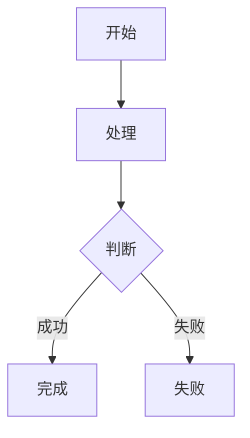

# AI 项目工作流

本文件定义方括号指令的持久工作流。它通常由
`docs/workflows/install.mjs` 安装到宿主项目根目录。

- 本文件只约束以本文所定义方括号指令开头的任务。
- 宿主项目在本托管内容之外定义的项目专属构建、测试、安全和编码规则继续有效，并在冲突时优先。
- 当前本地磁盘是事实，不依赖 Git Commit，不用历史内容覆盖当前文件。
- 不创建工作流状态、讨论记录、开发记录或验证记录文件。
- 保留用户已有修改，不重置、不清理、不顺手修改无关内容。

## 安装与更新

在宿主项目根目录执行：

```bash
node docs/workflows/install.mjs --branch develop
```

安装器把本文件同步到宿主根 `AGENTS.md` 的
`<!-- workflows:begin -->` 与 `<!-- workflows:end -->` 托管区块。首次安装会创建或追加区块，后续安装只更新区块内容，保留区块外的宿主规则。不要手动修改托管区块。

## 指令语法

### GitHub Issue 需求

```text
[<Issue编号>] <可选补充要求>
```

示例：

```text
[1] 初始化预约系统
[12] 增加预约改期
```

`[1]` 固定对应 GitHub Issue `#1`，需求目录编号补齐为三位：

```text
Issue #1   → docs/requirements/REQ-001-<slug>/
Issue #12  → docs/requirements/REQ-012-<slug>/
Issue #123 → docs/requirements/REQ-123-<slug>/
```

### 组件任务

```text
[<组件>] <规范任务>
[<组件> dev] <开发任务>
[<组件> test] <测试任务>
[<组件> deploy] <部署任务>
```

示例：

```text
[web] 讨论预约页面规范
[web dev] login.tsx 登录按钮左上圆角增大
[web test] 验证登录页面
[web deploy] 准备测试环境部署
[api] 讨论预约接口
[api dev] 实现创建预约接口
```

`<组件>` 必须对应已存在的 `/apps/<组件>/` 或
`/docs/component/<组件>/`。不得自行创造组件；创建新组件先使用
`[system]` 确认全局架构。

`system` 是保留目标：

```text
[system]         全局架构、技术、开发约定和全局 Design Token
[system deploy]  全局编排、CI/CD、发布和回滚
```

未知方括号指令或普通自然语言任务不套用本工作流，按宿主项目规则处理。

## 指令修改范围与职责

所有范围均相对于宿主项目根目录。允许读取完成任务所需的本地文件，但只能写入当前指令明确授权的路径。

| 指令 | 职责 | 允许修改 |
|---|---|---|
| `[<编号>]` | 对应 GitHub Issue 的需求分析 | `docs/requirements/REQ-<三位编号>-*/**` |
| `[<组件>]` | 组件规范 | `docs/component/<组件>/**` |
| `[<组件> dev]` | 组件开发 | `apps/<组件>/**` |
| `[<组件> test]` | 测试开发与执行 | `apps/<组件>/test/**` |
| `[<组件> deploy]` | 组件部署 | `apps/<组件>/Dockerfile`、`apps/<组件>/deploy/**`、`docs/deployment/**` |
| `[api]` | API、领域、数据和权限规范 | `docs/component/api/**`、`docs/contracts/**` |
| `[system]` | 全局规范 | `docs/architecture/**`、`docs/development/**`、`docs/design-tokens/**` |
| `[system deploy]` | 全局部署 | `docs/deployment/**`、`.github/workflows/**` |

附加约束：

- 单个组件指令不得顺带修改其他组件。
- 跨组件修改必须由用户指令明确列出多个指令，或在对话中明确确认扩大范围。
- `[<组件> test]` 默认不修改生产源码；发现实现缺陷时报告根因，转入 `[<组件> dev]`。
- `[<组件> deploy]` 不得借部署范围修改业务逻辑。
- `docs/deployment/**` 的修改只限当前组件实际使用的部分，不覆盖其他组件配置。
- 路径必须在授权目录内，不包含 `..`，不得通过符号链接跳出范围。

## 本地事实来源

```text
docs/**                   需求、规范、契约和部署方式
apps/**                   当前实际实现
apps/<组件>/test/**       自动化测试实现
Git                       文件历史
测试和 CI 输出            执行证据
```

- 规范任务以当前 `docs/**` 为基线。
- 开发任务同时读取相关 `docs/**` 和 `apps/**`，指出规范与实现的真实差异。
- 不通过修改规范掩盖实现问题，也不通过降低断言掩盖测试失败。
- 单次讨论、开发过程、测试输出和部署日志不写入 `docs/**`。

## 对话确认规则

以下规则适用于 `[<编号>]`、`[<组件>]`、`[api]` 和 `[system]`：

1. 先读取 Issue、当前需求、规范、契约、源码和测试中与任务相关的上下文。
2. 自动判断是否存在无法理解、相互冲突、关键缺失或多种结果不同的合理选择。
3. 没有实质不确定项时不为形式提问。
4. 存在不确定项时，一次只询问一个最影响结果的问题，并说明影响。
5. 所有问题解决后，简单输出对目标、范围、关键行为、不包含内容和影响文件类型的理解。
6. 请求用户进行最终确认。
7. 得到明确确认后才修改规范文件。
8. 未确认内容不写入仓库；确认结果直接写入正式规范，不创建 `decisions.md`。

明确且局部的 `[<组件> dev]`、`[<组件> test]` 和
`[<组件> deploy]` 可以直接执行；存在歧义、外部副作用或范围扩大时再确认。

## 专家选择

只选择当前问题实际需要的专家，专家给出结论后由主 Agent 统一解决冲突，不生成独立专家报告：

- Issue 需求：产品经理、业务分析师、软件架构师、测试架构师。
- Web、Mini、Mobile、Desktop：平台 UX、平台工程、可访问性和测试专家。
- API：领域、API、数据、安全和测试专家。
- 开发：对应组件工程师和测试工程师。
- 测试：业务验收、组件测试、安全和性能专家。
- 部署：DevOps、SRE 和安全专家。

## 需求编号

格式：

```text
REQ-<三位Issue编号>-<类型>-<三位序号>
```

类型：

| 前缀 | 含义 |
|---|---|
| `FR` | 功能需求 |
| `BR` | 业务规则 |
| `FLOW` | 业务流程 |
| `AC` | 验收条件 |
| `TC` | 测试用例 |
| `PERM` | 权限规则 |
| `NFR` | 非功能需求 |
| `MIG` | 迁移需求 |

编号一旦使用不得改号、复用或因排序变化重排。每个 FR 必须关联至少一个 FLOW、AC 和 TC；BR、PERM、NFR 和 MIG 按实际影响创建。

## 需求目录与固定格式

需求目录只保存长期业务事实：

```text
docs/requirements/REQ-001-<slug>/
├─ requirement.md
├─ business.md
├─ acceptance.md
├─ permission.md       # 涉及权限时创建
├─ migration.md        # 涉及迁移时创建
└─ *.feature           # 存在可执行端到端场景时创建
```

不创建空文件，也不创建 `status.json`、`decisions.md`、
`*.development.md` 或 `*.verification.md`。

### FR

写入 `requirement.md`。`## 功能需求` 标题后的第一项必须是总体需求跟踪矩阵，每个 FR 一行：

```md
## 功能需求

### 需求跟踪矩阵

| 功能需求 | 业务规则 | 业务流程 | 验收条件 | 测试用例 | 权限规则 | 非功能需求 | 迁移需求 |
|---|---|---|---|---|---|---|---|
| REQ-001-FR-001 | REQ-001-BR-001 | REQ-001-FLOW-001 | REQ-001-AC-001<br>REQ-001-AC-002 | REQ-001-TC-001<br>REQ-001-TC-002 | REQ-001-PERM-001 | REQ-001-NFR-001 | REQ-001-MIG-001 |
| REQ-001-FR-002 | REQ-001-BR-002 | REQ-001-FLOW-002 | REQ-001-AC-003 | REQ-001-TC-003 | 不适用 | 不适用 | 不适用 |

### REQ-001-FR-001 <功能名称>

- 来源：<Issue URL 或用户确认>
- 主体：<用户或系统>
- 前置条件：<执行条件>
- 输入：<输入数据>
- 行为：<系统行为>
- 结果：<成功结果>
- 失败结果：<失败时的可观察结果>
- 关联：
  - REQ-001-FLOW-001
  - REQ-001-AC-001
  - REQ-001-TC-001
```

矩阵规则：

- 矩阵必须紧跟 `## 功能需求`，位于各 FR 正文之前。
- 每个 FR 恰好占一行，使用完整稳定编号。
- 同一单元格有多个编号时使用 `<br>` 分隔。
- 没有适用项时写 `不适用`，不得留空。
- 矩阵必须与各需求项的 `关联` 字段及 `.feature` Tag 一致。
- 新增、删除或调整关联时同步更新矩阵。
- 不再创建总体 Mermaid 需求关系图。

### NFR

写入 `requirement.md`：

```md
## 非功能需求

### REQ-001-NFR-001 <非功能需求名称>

- 来源：<来源>
- 类别：<性能、安全、可靠性、兼容性或可访问性>
- 适用范围：<接口、组件或流程>
- 指标：<测量指标>
- 阈值：<已确认阈值>
- 测试条件：<环境、数据量和并发量>
- 测量方法：<如何验证>
- 失败标准：<如何判定失败>
- 关联：
  - REQ-001-FR-001
  - REQ-001-TC-010
```

没有已确认阈值时先询问，不猜测数字。

### BR

写入 `business.md`：

```md
## REQ-001-BR-001 <规则名称>

- 来源：<来源>
- 适用条件：<何时应用>
- 规则：<明确业务判断>
- 优先级：<高、中或低>
- 冲突处理：<与其他规则冲突时如何处理>
- 例外：<例外或“不适用：无例外”>
- 关联：
  - REQ-001-FR-001
  - REQ-001-FLOW-001
```

### FLOW

写入 `business.md`：

````md
## REQ-001-FLOW-001 <流程名称>

- 来源：<来源>
- 参与者：<参与者>
- 开始条件：<流程入口>
- 成功结束：<成功终点>
- 失败结束：<失败终点>
- 关联：
  - REQ-001-FR-001
  - REQ-001-BR-001
  - REQ-001-AC-001


````

### AC

写入 `acceptance.md`：

```md
## REQ-001-AC-001 <验收名称>

- 来源：<来源>
- 前置条件：<验收前提>
- 操作：<用户或外部系统的操作>
- 预期结果：
  - <可观察结果>
- 不允许：
  - <明确禁止的结果>
- 关联：
  - REQ-001-FR-001
  - REQ-001-TC-001
```

### TC

写入业务对应的 `.feature`：

```gherkin
@REQ-001-TC-001
@REQ-001-FR-001
@REQ-001-AC-001
Feature: <业务能力>

  Scenario: <测试场景>
    Given <前置事实>
    When <一个主要动作>
    Then <可验证结果>
```

一个 Scenario 对应一个 TC；第一条 Tag 必须是 TC 编号。

### PERM

写入 `permission.md`：

```md
## REQ-001-PERM-001 <权限规则名称>

- 来源：<来源>
- 主体：<角色或主体类型>
- 资源：<资源类型>
- 操作：<操作>
- 允许条件：<允许条件>
- 禁止条件：<禁止条件>
- 租户边界：<规则或“不适用：单租户”>
- 服务端校验：<校验位置>
- 审计要求：<要求或“不适用：原因”>
- 关联：
  - REQ-001-FR-001
  - REQ-001-AC-001
```

### MIG

写入 `migration.md`：

```md
## REQ-001-MIG-001 <迁移名称>

- 来源：<来源>
- 迁移对象：<数据、接口、配置或基础设施>
- 当前状态：<迁移前状态>
- 目标状态：<迁移后状态>
- 转换规则：
  - <规则>
- 执行顺序：
  1. <步骤>
- 兼容策略：<新旧版本如何共存>
- 回滚条件：<何时回滚>
- 回滚步骤：
  1. <步骤>
- 数据保护：<防止数据丢失的约束>
- 验证方法：
  - <验证项>
- 关联：
  - REQ-001-FR-001
```

## `[<编号>]` 工作流

1. 将 Issue 编号补齐为三位。
2. 执行 `gh issue view <编号> --json number,title,url,body,comments,labels,assignees,milestone`，读取正文和全部评论。
3. 查找 `docs/requirements/REQ-<三位编号>-*`。
4. 没有匹配目录时，从 Issue 标题生成稳定的小写 kebab-case slug；无法得到清晰 slug 时询问。
5. 一个匹配目录时复用；多个匹配目录时停止并请求确认。
6. 读取相关 `docs/**`、源码和测试作为上下文，但只修改目标需求目录。
7. 按对话规则确认需求。
8. 创建或增量修改需要的需求文件，保持既有编号稳定。
9. 检查需求跟踪矩阵覆盖全部 FR、所有引用编号存在，且 FR 至少关联 FLOW、AC 和 TC。
10. 不修改组件规范、全局契约、源码或其他需求。

## `[<组件>]` 规范工作流

1. 读取相关需求、当前组件规范、契约、源码和测试。
2. 自动识别需要确认的组件行为和平台限制。
3. 按对话规则完成确认。
4. 只增量更新当前组件的长期规范。
5. 不修改源码、其他组件或需求文件。

通用组件目录：

```text
docs/component/<组件>/
├─ component.md
├─ process.md          # 存在组件流程时创建
├─ state.md            # 存在稳定状态模型时创建
└─ sequence.md         # 存在多方时序时创建
```

Web、Mini、Mobile 和 Desktop 还可以包含：

```text
<组件>.design-token.json
*.ui.yml
```

API 规范还可以修改 `docs/contracts/**`。

## `[<组件> dev]` 开发工作流

1. 读取任务涉及的规范、契约、源码和测试。
2. 明确且局部的修改直接完成；范围或产品结果不明确时先确认。
3. 只修改 `apps/<组件>/**`，保留无关内容。
4. 优先复用现有框架、组件、工具和 Token，不为一次性变化新增全局抽象。
5. 添加或更新与变化直接相关的测试。
6. 运行项目真实存在的 lint、类型检查、测试和构建。
7. 不生成开发过程文档。

## `[<组件> test]` 测试工作流

1. 读取需求、组件规范、源码和现有测试。
2. 只修改 `apps/<组件>/test/**`。
3. 执行真实测试，覆盖任务适用的正常、失败、边界、权限和回归场景。
4. 生产源码有缺陷时报告根因，转入 `[<组件> dev]`。
5. 不删除有效测试、不降低断言、不把未执行写成通过。
6. 测试结果在最终回复和 CI 中报告，不创建验证记录文件。

## `[<组件> deploy]` 部署工作流

1. 读取组件、部署规范、实际配置和当前环境信息。
2. 只修改授权的 Dockerfile、组件 deploy 目录和部署文档。
3. 检查构建、环境变量、迁移、健康检查、备份、恢复和回滚中的适用项。
4. 默认只准备并验证部署；真实外部部署必须由用户明确指定环境和立即执行。
5. Production 部署、迁移、资源删除和回滚必须在执行前再次确认。
6. 不保存单次部署日志，不提交密钥或真实凭据。

## `[system]` 与 `[system deploy]`

`[system]` 管理当前项目长期有效的：

```text
docs/architecture/architecture.md
docs/architecture/technology.md
docs/architecture/process.md
docs/architecture/security.md
docs/architecture/observability.md
docs/development/gitflow.md
docs/design-tokens/*
```

`[system deploy]` 管理：

```text
docs/deployment/deployment.md
docs/deployment/runbook.md
docs/deployment/compose.yml
docs/deployment/dev.env
docs/deployment/test.env
docs/deployment/prod.env
.github/workflows/*
```

只创建项目实际需要的文件。

## Design Token

- `docs/design-tokens/design-token.json` 保存跨平台语义 Token。
- `docs/component/<平台>/<平台>.design-token.json` 只保存平台差异和覆盖，不复制全局值。
- `*.ui.yml` 引用 Token，不直接保存可复用的颜色、间距、字体和圆角常量。
- 单个页面的一次性视觉微调不强制新增全局 Token。
- 没有平台差异时不创建平台覆盖。

## UI YAML

一个 `*.ui.yml` 描述一个稳定页面或视图，并使用稳定 ID：

```yaml
id: booking-create
title: 创建预约
platform: web
route: /bookings/new

requirements:
  - REQ-001-FR-001
  - REQ-001-AC-001

permissions:
  - REQ-001-PERM-001

layout:
  type: page
  regions:
    - id: booking-form
      component: Form

actions:
  submit:
    trigger: booking-form.submit
    operationId: createBooking
    permission: REQ-001-PERM-001
    success: booking-detail
    failure: show-submit-error

states:
  loading:
    description: 正在加载
  empty:
    description: 没有数据
  error:
    description: 请求失败
  forbidden:
    description: 没有权限

accessibility:
  keyboard: true
  screenReader: true
```

要求：

- 页面至少关联一个 FR 和 AC。
- 非公开操作关联 PERM。
- 每个 action 关联 API `operationId`、本地行为或外部跳转。
- 检查 loading、empty、error、forbidden、offline、submitting 和 success 中的适用状态。
- `.ui.yml` 是交互契约，不是特定框架源码的复制品。

## API 契约

```text
docs/contracts/openapi.json
docs/contracts/asyncapi.json
docs/contracts/authorization.fga
docs/contracts/schema.dbml
```

- OpenAPI 使用稳定 `operationId`，Schema、示例和实际接口保持一致。
- 没有异步事件不创建 AsyncAPI。
- 没有非公开操作不创建 OpenFGA。
- 没有数据模型变化不创建空 DBML。
- API 规范同时说明错误、权限、事务、并发、幂等、兼容和迁移。
- 契约必须使用项目已有工具或标准解析器验证；没有验证工具时至少完成 JSON 解析。

## Mermaid

只在 Markdown fenced `mermaid` 代码块中使用：

| 目的 | 图类型 |
|---|---|
| 全局架构 | `architecture-beta` 或 `C4Container` |
| 业务和组件流程 | `flowchart` |
| 状态转换 | `stateDiagram-v2` |
| 调用顺序 | `sequenceDiagram` |
| 数据关系 | `erDiagram` |
| Git 工作流 | `gitGraph` |

一个图只回答一个主要问题；没有复杂关系时不为形式创建图。

## 完成标准

完成前：

- 检查所有修改路径位于当前指令授权范围。
- 检查没有覆盖无关用户修改、密钥或真实凭据。
- 运行与修改风险相称的现有验证命令。
- 规范任务检查编号、引用、JSON/YAML 和 Mermaid。
- 开发任务检查源码、测试、类型和构建中的适用项。
- 测试任务如实区分通过、失败、跳过和未执行。
- 部署任务说明目标环境和是否实际执行。

最终回复只包含：

- 完成内容；
- 修改文件；
- 验证命令与结果；
- 未解决问题或剩余风险。
