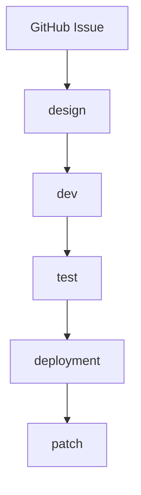

# AI Project Workflows

以一个 GitHub Issue 为一个需求开发目录，通过 `design → dev → test → deployment → patch` 把初步想法推进为设计、源码、验证、部署方案和全局项目事实。

## 安装

```bash
git submodule add -b main https://github.com/swainle/workflows.git docs/workflows
node docs/workflows/install.mjs
pnpm -s work:check
```

使用 `develop` 分支时：

```bash
git submodule add -b develop https://github.com/swainle/workflows.git docs/workflows
node docs/workflows/install.mjs --branch develop
```

安装器写入 `work:*` scripts，创建缺失的全局示例文件，不覆盖已有项目文档。详细安装说明见 [`install.md`](install.md)。

## 开始需求

先创建 GitHub Issue，然后在宿主项目根目录执行：

```bash
pnpm -s work:req --issue 36
pnpm -s work:design
```

首次选择 Issue 时输入英文短名称，例如 `order-export`，工作流创建：

```text
docs/requirements/REQ-0036-order-export/
```

当前需求保存在 Git metadata，不污染提交。每个阶段生成的 Prompt 位于该需求的阶段时间戳目录。

## 固定阶段



| 阶段 | 作用 |
|---|---|
| `design` | 对话补齐需求，多专家统一完成流程、平台、架构、权限、API、数据和 Tokens 设计 |
| `dev` | 对话选择 Backend 和目标平台，直接修改源码并记录开发结果与确认事项 |
| `test` | 根据 Design 和 Dev 形成验收、契约、权限、迁移与回归验证 |
| `deployment` | 形成发布、迁移、监控、恢复和回滚方案 |
| `patch` | 把当前需求中长期有效的事实同步到全局产物，并生成 `completion.md` |

## 阶段命令

```bash
pnpm -s work:status
pnpm -s work:design --list
pnpm -s work:dev --require "实现 Backend 和 Web"
pnpm -s work:test --list
pnpm -s work:next test
pnpm -s work:deployment
pnpm -s work:patch
pnpm -s work:next
```

`--require` 是本次 Prompt 的附加要求，优先于阶段默认配置，但不能突破安全、路径和输出边界。`--list` 显示阶段默认配置、执行角色、只读全局输入和稳定阶段产物。

## Prompt 与结果

执行阶段命令后会生成：

```text
<stage>/<timestamp>/
├── prompt.md
├── prompt.01.git.patch
└── prompt.01.git.patch.md
```

把 `prompt.md` 交给 AI。同一 Prompt 再次尝试时使用 `.02`、`.03`，不得覆盖旧结果；重新执行阶段时创建新的时间戳目录并从 `.01` 开始。所有历史 Prompt、Patch 和分析永久保留。

Design、Test、Deployment 和 Patch AI 不直接修改目标产物，只在当前执行目录生成 Git Patch。`work:next` 检查路径、执行 `git apply --check`、展示结果并在人工确认后应用。

Dev 是唯一可以直接修改业务源码的阶段。Dev AI：

- 通过对话确认 Backend、Web、Mini Program、Desktop、Mobile 或组合；
- 直接修改源码、迁移、测试和必要的非敏感配置；
- 保留开始前已有的用户修改；
- 运行项目真实存在的检查、测试和构建命令；
- 通过阶段 Patch 更新 `dev/development.md` 和 `dev/questions.md`，源码 Diff 不放入阶段 Patch。

## Design 稳定产物

所有完整设计都位于当前需求的 `design/` 根层：

```text
design/
├── requirement.md
├── process.md
├── architecture.md
├── authorization.fga
├── openapi.json
├── asyncapi.json
├── schema.dbml
├── design.token.json
├── design.web.token.json
├── design.mini-program.token.json
├── design.desktop.token.json
├── design.mobile.token.json
├── web.md
├── web.ui.yaml
├── mini-program.md
├── mini-program.ui.yaml
├── desktop.md
├── desktop.ui.yaml
├── mobile.md
├── mobile.ui.yaml
└── verification.md
```

只创建需求实际需要的契约和已选择平台文件。平台 UI YAML 引用公共 `design.token.json` 和自身 `design.<platform>.token.json`；平台文件只存差异，不复制公共 Token。

Design 读取当前 Issue 明确引用的关联需求 `design/` 根层稳定产物作为参考，不读取关联需求时间戳目录，也不扫描未引用需求。

## 增量修改

已完成阶段可以重新执行：

```bash
pnpm -s work:design --require "增加邮件通知，仅支持 Web"
pnpm -s work:dev --require "实现已确认的 Web 邮件通知"
```

重新执行某阶段会使它及之后阶段失效，旧稳定产物和历史执行记录保留。Design 只更新受影响的设计；Dev 复用当前需求及关联需求中仍适用的已确认问题，避免重复询问。

## 关联 Issue

当前 GitHub Issue 正文或评论可以明确引用其他 Issue，例如 `Depends on #12`。工作流只注入关联需求被允许的根层稳定产物：

- Design 阶段读取关联需求的 Design 稳定产物；
- Dev 阶段读取关联需求的 Design、`dev/development.md` 和 `dev/questions.md`；
- 不读取关联需求 Prompt、Patch、分析或其他时间戳记录；
- 当前对话、当前 Issue、当前设计和当前源码始终优先。

## 产物分类

| 分类 | 路径 | 说明 |
|---|---|---|
| 全局产物 | `docs/architecture/**`、`docs/contracts/**`、`docs/development/**`、`packages/design-tokens/tokens/**` 和项目级配置 | 全项目长期有效，只由 `patch` 阶段同步 |
| 阶段产物 | `<requirement>/<stage>/*.*` | 当前需求稳定结论，供后续阶段和明确关联的其他需求读取 |
| 阶段提示词 | `<stage>/<timestamp>/prompt.md` | 某次执行交给 AI 的完整提示词 |
| 阶段补丁 | `<stage>/<timestamp>/prompt.NN.git.patch` | AI 提出的稳定阶段产物或最终全局修改 |
| 阶段补丁分析 | `<stage>/<timestamp>/prompt.NN.git.patch.md` | 引用、影响文件、角色和验证记录 |

`completion.md` 是 Patch 阶段产物，位于当前需求根目录，可以直接作为 Pull Request 描述；不是全局产物。

## 全局产物

安装器默认创建：

```text
docs/architecture/
docs/contracts/
docs/development/
packages/design-tokens/tokens/
├── token.json
├── web.token.json
├── mini-program.token.json
├── desktop.token.json
└── mobile.token.json
```

Design Token 在需求完成前是 Design 阶段增量，最终 Patch 阶段才合并到全局公共和平台文件。Patch 还允许按已确认的长期变化更新 `package.json`、`pnpm-workspace.yaml` 和 `turbo.json`。
