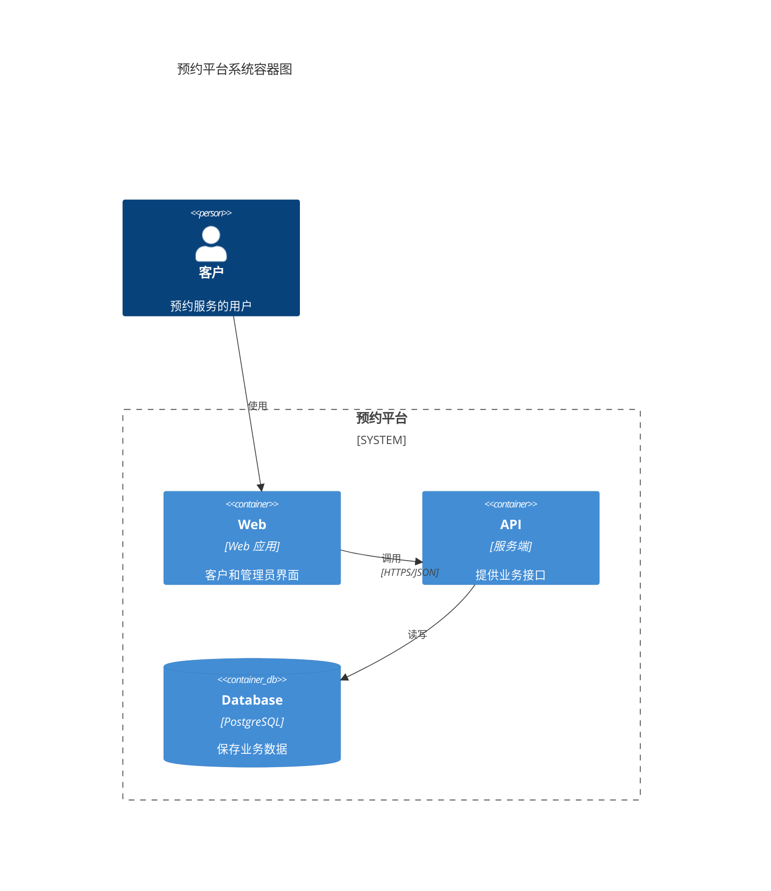

# 系统容器图

```mermaid
C4Container
title 预约平台系统容器图

Person(customer, "客户", "预约服务的用户")

System_Boundary(system, "预约平台") {
  Container(web, "Web", "Web 应用", "客户和管理员界面")
  Container(api, "API", "服务端", "提供业务接口")
  ContainerDb(db, "Database", "PostgreSQL", "保存业务数据")
}

Rel(customer, web, "使用")
Rel(web, api, "调用", "HTTPS/JSON")
Rel(api, db, "读写")
```
