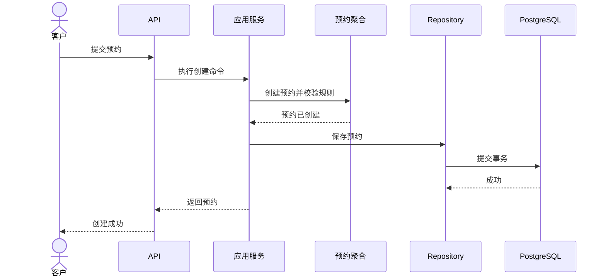

# 后端主要流程

## BSEQ-001 创建预约

- 业务流程：预约创建
- 接口：创建预约
- 领域事件：预约已创建

```mermaid
sequenceDiagram
  actor Customer as 客户
  participant API as API
  participant Application as 应用服务
  participant Domain as 预约聚合
  participant Repository as Repository
  participant Database as PostgreSQL

  Customer->>API: 提交预约
  API->>Application: 执行创建命令
  Application->>Domain: 创建预约并校验规则
  Domain-->>Application: 预约已创建
  Application->>Repository: 保存预约
  Repository->>Database: 提交事务
  Database-->>Repository: 成功
  Application-->>API: 返回预约
  API-->>Customer: 创建成功
```
