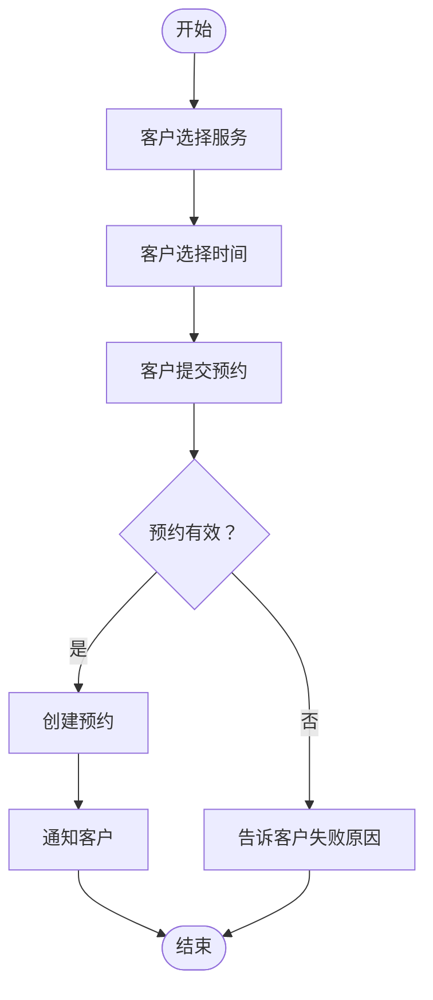

# 全局预约流程

```mermaid
flowchart TD
  start([开始]) --> selectService[客户选择服务]
  selectService --> selectTime[客户选择时间]
  selectTime --> submit[客户提交预约]
  submit --> valid{预约有效？}
  valid -- 是 --> create[创建预约]
  create --> notify[通知客户]
  notify --> finish([结束])
  valid -- 否 --> reject[告诉客户失败原因]
  reject --> finish
```
