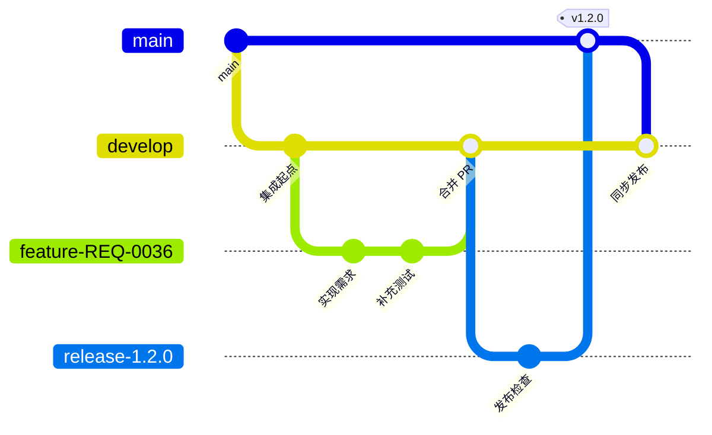

# Git 开发流程

## 分支

| 分支 | 作用 |
|---|---|
| `main` | 已发布或随时可以发布的代码 |
| `develop` | 日常集成分支 |
| `feature/REQ-<编号>-<名称>` | 需求开发 |
| `fix/REQ-<编号>-<名称>` | 缺陷修复 |
| `release/<版本>` | 发布准备 |
| `hotfix/<名称>` | 线上紧急修复 |

## 演进



## 开发

1. 从最新 `develop` 创建包含需求编号的功能或修复分支。
2. 每个 Commit 只处理一个明确变化，并使用 `feat`、`fix`、`test`、`docs` 等清晰前缀。
3. Push 临时分支并创建目标为 `develop` 的 Pull Request。
4. Pull Request 描述使用需求根目录的 `completion.md`。
5. 语法检查、类型检查、测试和构建通过后，按仓库约定的合并策略合并。
6. 合并后删除临时分支；不直接向 `develop` 或 `main` 提交需求代码。

## 关联

Pull Request 使用以下格式关联需求：

```md
Closes #36
```

## 发布

1. 从 `develop` 创建 `release/<版本>`。
2. 只处理发布检查和必要修复。
3. 合并到 `main` 并创建版本标签。
4. 将 `main` 同步回 `develop`。

## Hotfix

1. 从 `main` 创建 `hotfix/*`。
2. 修复并完成必要验证。
3. 合并到 `main` 并创建补丁版本标签。
4. 将修复同步回 `develop`。
