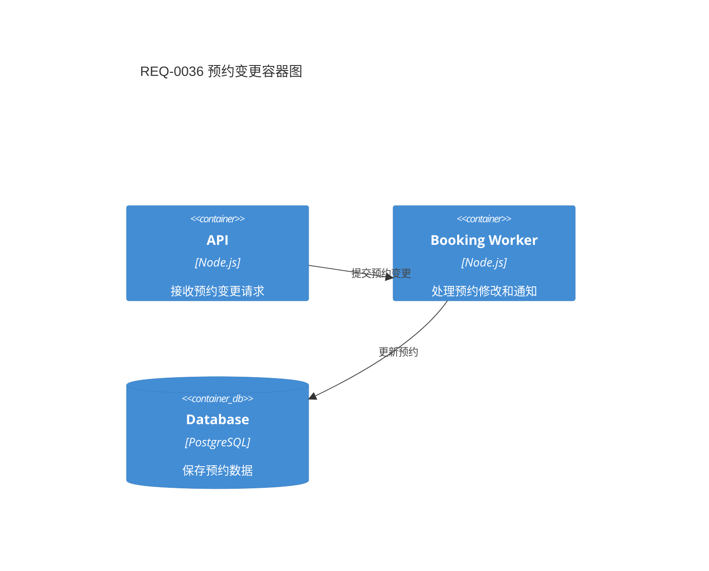

# 预约变更涉及的容器

```mermaid
C4Container
title REQ-0036 预约变更容器图

Container(api, "API", "Node.js", "接收预约变更请求")
Container(booking_worker, "Booking Worker", "Node.js", "处理预约修改和通知")
ContainerDb(db, "Database", "PostgreSQL", "保存预约数据")

Rel(api, booking_worker, "提交预约变更")
Rel(booking_worker, db, "更新预约")
```
