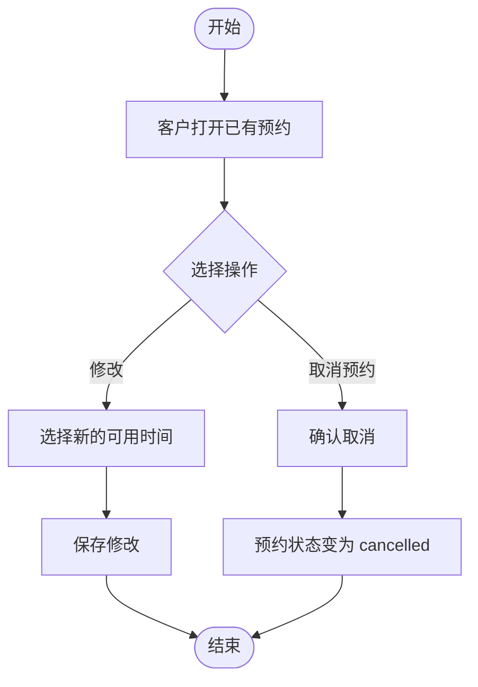

# REQ-0036 预约修改与取消

```mermaid
flowchart TD
  start([开始]) --> open[客户打开已有预约]
  open --> action{选择操作}
  action -- 修改 --> select[选择新的可用时间]
  select --> save[保存修改]
  save --> finish([结束])
  action -- 取消预约 --> confirm[确认取消]
  confirm --> cancelled[预约状态变为 cancelled]
  cancelled --> finish
```
