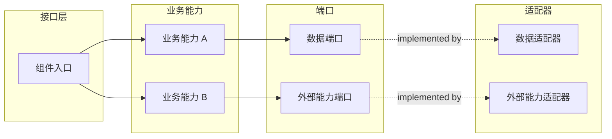
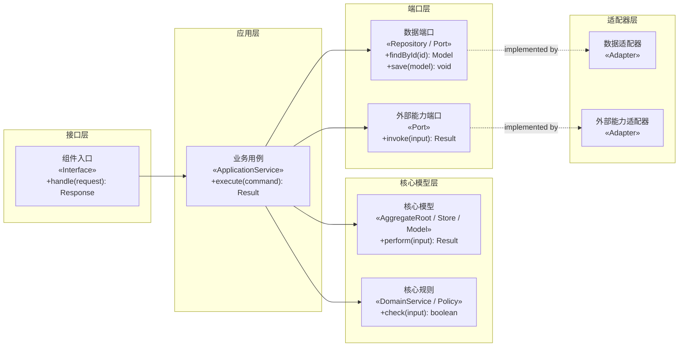

# `[<组件>]` 组件规范

## 职责

通过对话确认当前组件的长期行为、边界、领域模型、流程、状态、时序、界面、平台约束及其提供的契约。

不负责需求分析、全局技术选型、其他组件契约、源码实现、测试实现或部署。

## 操作权限

| 路径模式 | 创建 | 读取 | 修改 | 删除 |
|---|---|---|---|---|
| `**` | 禁止 | 禁止 | 禁止 | 禁止 |
| `docs/requirements/**` | 禁止 | 允许 | 禁止 | 禁止 |
| `docs/system/**` | 禁止 | 允许 | 禁止 | 禁止 |
| `<组件设计目录>/**` | 允许 | 允许 | 允许 | 允许 |

## 越界处理

需要新增或拆分组件、修改全局规范时切换 `[system]`；需要源码时切换 `[<组件> dev]`。

## 专家

按实际需要选择领域、API、数据、安全、平台 UX、平台工程、可访问性和测试专家，不生成独立专家报告。

## 完整组件设计模式

`frontend` 和 `backend` 只增强当前组件设计阶段，不改变组件名称、阶段路由或文件权限。
两种模式都先读取需求和系统规范，逐项判断关注点由当前组件负责、引用系统规范、交给后续
阶段实现或不适用；不适用时说明原因，不创建空文件。

### Frontend 模式

当任务使用 `[<组件>] frontend <任务>` 时，分别完成以下单一关注点设计：

1. `information-architecture.md`：内容层级、导航关系、用户角色和入口。
2. `routing-permissions.md`：引用系统安全基线，设计当前前端的路由、参数、页面权限、
   操作权限和无权访问处理。
3. `layout.md`：Page Shell、页面区域、响应式、滚动和溢出。
4. `design-system.md`：组件库、视觉语义、复用规则及 Design Token 使用。
5. `data-fetching.md`：请求、缓存、失效、取消、去重、重试、乐观更新和错误映射。
6. `state-management.md`：本地、表单、路由、服务端缓存、跨页面和身份权限状态。
7. `forms.md`：字段、校验、提交、防重复提交、服务端错误和焦点管理。
8. `page-states.md`：loading、empty、error、forbidden、not-found、offline、
   submitting、success、stale 和 partial-data。
9. `feedback.md`：字段错误、Toast、Alert、Modal、Progress、Skeleton 和确认反馈。
10. `accessibility.md`：语义、键盘、焦点、Label、错误关联、对比度和动效减弱。
11. `performance.md`：首屏、关键交互、Bundle、渲染、请求、图片、字体和性能预算。
12. `errors.md`：错误分类、恢复策略和 Error Boundary。
13. `observability.md`：引用系统可观测性基线，设计当前前端实际产生的错误事件、
    日志、性能信号和 Trace 关联。
14. `testing.md`：逻辑、组件、页面、契约、权限、可访问性和端到端测试策略。
15. `configuration.md`：公开配置、构建时配置、默认值和启动校验。
16. `runtime.md`：构建产物、运行方式、健康要求和托管约束。

前端权限只控制界面表现，后端是最终安全边界。每个请求引用提供方在 C2 登记的稳定
OpenAPI `operationId`，消费方不复制提供方契约。能由 URL、表单或服务端缓存表达的状态
不重复放入全局 Store。页面交互契约放入 `ui/*.ui.yml`，设计变量放入
`<组件>.design-token.json`。

### Backend 模式

当任务使用 `[<组件>] backend <任务>` 时默认采用 DDD。开始确认或修改前必须完整读取
`docs/workflows/templates/backend-design.template.md`，把其中的“使用规则”“文件关系与设计顺序”
“执行流程”和各文件固定结构作为 Backend 模式的强制提示词。本文件继续作为文件权限、创建条件、
通用 C3/C4 格式、契约规则和跨阶段边界的权威来源。

Backend 按“C3 → DDD（每个限界上下文包含状态图与关键时序图）→ 接口和边界 → 机器可读模型 → C4 →
配置、密钥、可观测性、测试与运行 → 部署交付 → component.md 汇总”的依赖顺序设计。
每个适用文件使用模板规定的标题名称和顺序；`ddd.md` 中每个限界上下文完整保留固定章节，
其他不适用的可选文件或章节直接省略，不创建空文件，
也不填写“无”“不适用”或其他占位正文。

Backend 先识别上下文边界、业务能力、统一语言、不变量和事务边界，再确定聚合根、应用用例、Port 和
Adapter。领域层不得依赖框架、ORM、HTTP、JWT、授权引擎或消息队列；跨聚合只引用稳定 ID，
跨组件使用契约、幂等命令、事件或补偿流程。简单 CRUD、纯查询和数据转换不机械创建
Command、Handler、Factory、DomainService 或 DomainEvent。

### 通用目录规则

- 保留框架要求的路由、页面或 Consumer 目录作为接口层，业务代码按业务能力组织。
- `shared/` 只保存被多个模块使用且没有业务含义的技术能力，不保存业务模型。
- 不创建含义模糊的全局 `lib/`、`services/`、`utils/` 或 `schemas/`。
- `component.md` 递归列出全部受版本控制的目录和文件，不使用省略号、通配符或“同上”。
- 每个文件、Port、Adapter、事件和目录都必须存在当前需求中的真实调用方或用途。
- 实际部署文件仍由 `[deploy] <组件>` 维护；`runtime.md` 和 `deployment.md`
  只声明提供给部署阶段的组件运行与交付要求。

### 跨阶段权威边界

- `docs/system/security.md` 和 `docs/system/observability.md` 是跨组件原则、统一约定、
  共用平台及系统级目标的唯一来源；组件文件只引用，不复制其正文。
- 组件文件只维护当前组件如何落实全局基线、实际产生的信号、需要的密钥以及明确例外。
- `authentication.md` 不重新定义全局身份体系，`authorization.md` 不重新定义全局
  授权原则，`secrets.md` 不重新定义密钥平台或保存密钥值。
- 组件 `observability.md` 不重新定义全局字段、命名、保留策略、告警级别或系统级 SLO。
- Collector、Exporter、Dashboard、告警规则、密钥注入、证书挂载和环境值由
  `[deploy]` 维护，组件设计只声明交付要求。

### 模式完成检查

- Frontend 和 Backend 模式逐项检查各自列出的全部设计关注点。
- 每个适用关注点只有一个权威文件，契约和执行配置不在 Markdown 中重复。
- `component.md` 的设计架构索引列出设计目录内每个实际文件及其唯一作用。
- C3、C4、各关注点文件和契约使用相同稳定名称及依赖方向。
- 安全与可观测性文件引用系统基线，只包含当前组件的落实、信号、需求或例外。
- 没有按 URL、数据库表或技术类型错误划分业务模块。
- 没有为未来需求创建空文件、空目录或无调用方的抽象。

## 文件作用

### 通用文件

| 文件 | 作用 | 创建条件 | 可修改内容 |
|---|---|---|---|
| `component.md` | 组件入口文档 | 始终 | 概述、设计架构文件索引和完整受版本控制文件结构 |
| `c3.md` | 组件内部结构和依赖关系图 | 始终 | 当前组件的 C3 Mermaid 图 |
| `c4.md` | 关键代码单元和依赖关系 | 存在需要长期维护的代码结构 | 当前组件的主要代码结构 |

### Frontend 文件

| 文件 | 作用 | 创建条件 | 可修改内容 |
|---|---|---|---|
| `information-architecture.md` | 信息架构 | 存在页面或内容层级 | 内容层级、导航关系、角色和入口 |
| `routing-permissions.md` | 路由与页面权限 | 存在路由 | 路由参数、访问规则、页面和操作权限 |
| `layout.md` | 页面布局 | 存在界面 | Page Shell、区域、响应式、滚动和溢出 |
| `design-system.md` | 设计系统规则 | 存在界面 | 组件库、视觉语义、复用和 Token 使用 |
| `<组件>.design-token.json` | 语义 Design Token | 需要组件级 Token | 颜色、间距、字体、圆角和动效变量 |
| `data-fetching.md` | 数据请求 | 存在远程数据 | 请求、缓存、取消、重试和乐观更新 |
| `state-management.md` | 状态管理 | 存在客户端状态 | 本地、表单、路由、服务端缓存和跨页面状态 |
| `forms.md` | 表单设计 | 存在表单 | 字段、校验、提交、错误和焦点管理 |
| `page-states.md` | 完整页面状态 | 存在页面 | Loading、Empty、Error、Forbidden、Offline 等状态 |
| `feedback.md` | 用户反馈 | 存在用户操作 | Toast、Alert、Modal、Progress 和确认反馈 |
| `accessibility.md` | 可访问性 | 存在界面 | 语义、键盘、焦点、Label、对比度和动效 |
| `performance.md` | 前端性能 | 存在性能要求 | 首屏、交互、Bundle、渲染、请求和性能预算 |
| `errors.md` | 前端错误处理 | 存在失败场景 | 错误分类、恢复和 Error Boundary |
| `observability.md` | 前端可观测性 | 存在运行要求 | 错误监控、日志、指标、Trace、脱敏和告警 |
| `testing.md` | 前端测试策略 | 始终 | 逻辑、组件、页面、契约、权限、A11y 和 E2E |
| `configuration.md` | 前端配置 | 存在配置 | 公开配置、构建时配置和校验 |
| `runtime.md` | 前端运行要求 | 存在构建或托管要求 | 构建产物、运行方式和健康要求 |
| `ui/*.ui.yml` | 页面交互契约 | 存在稳定页面 | 单个页面的结构、动作、状态和可访问性 |

### Backend 文件

| 文件 | 作用 | 创建条件 | 可修改内容 |
|---|---|---|---|
| `interface.md` | 后端接口原则 | 存在入口 | HTTP、事件、任务、版本、幂等和兼容策略 |
| `authentication.md` | 身份认证 | 存在身份要求 | 身份、凭据、Session、Token、轮换和撤销 |
| `authorization.md` | 权限控制 | 存在非公开操作 | 角色、关系、所有权、数据范围和执行点 |
| `ddd.md` | 领域设计 | Backend 模式 | 每个限界上下文独立维护边界、统一语言、领域结构图、状态图、关键时序图和领域事件 |
| `data-access.md` | 数据访问 | 存在持久化或查询 | Repository、查询、事务、并发、迁移和保留 |
| `validation.md` | 输入校验 | 存在外部输入 | 信任边界、格式校验、标准化和领域校验职责 |
| `errors.md` | 后端错误处理 | 存在失败场景 | 错误分类、错误码、协议映射、重试和脱敏 |
| `configuration.md` | 后端配置 | 存在配置 | 配置来源、默认值和启动校验 |
| `secrets.md` | 密钥要求 | 存在敏感配置 | 密钥来源、敏感级别、轮换和泄漏防护 |
| `observability.md` | 后端可观测性 | 存在运行要求 | 日志、审计、指标、追踪、健康检查和告警 |
| `testing.md` | 后端测试策略 | 始终 | 单元、集成、契约、安全、并发和 E2E |
| `runtime.md` | 运行要求 | 存在运行进程 | 进程、依赖、启动关闭、健康检查和资源 |
| `deployment.md` | 部署交付要求 | 存在部署要求 | 镜像、迁移、初始化及向 `[deploy]` 的交付 |
| `openapi.json` | 同步 HTTP API 契约 | 当前组件提供同步接口 | 路径、操作、Schema、错误和示例 |
| `asyncapi.json` | 异步事件契约 | 当前组件提供事件 | Channel、Message、生产者和消费者 |
| `schema.dbml` | 持久化数据结构和关系 | 当前组件拥有持久化数据模型 | 表、字段、索引和关系 |
| `authorization.fga` | 授权关系模型 | 当前组件存在非公开操作 | 类型、关系和权限 |

只创建项目实际需要的文件。一个事实只由一个文件维护，其他文件通过稳定名称引用，不复制字段、关系或规则。契约由提供它的组件维护，消费方只能引用。

## `component.md` 文件格式

````md
# <组件>

## 概述

<用一至三段说明组件是什么、负责什么、不负责什么以及主要使用者。>

## 设计架构

| 文件 | 作用 |
|---|---|
| `component.md` | 组件概述、设计文件索引和完整文件结构 |
| `c3.md` | <当前组件的实际作用> |
| `<实际设计文件>` | <该文件维护的唯一设计关注点> |

## 目录结构

```text
<组件应用目录>/
├─ src/
│  ├─ <目录>/
│  │  ├─ <子目录>/
│  │  │  └─ <文件>       <职责>
│  │  └─ <文件>           <职责>
│  └─ <文件>               <职责>
├─ test/
│  └─ <文件>               <职责>
└─ <配置文件>               <职责>
```
````

- “设计架构”表格逐个列出当前组件设计目录内实际存在的全部文件及其唯一作用；
  文件新增、删除或重命名时同步更新，不列出尚未创建的可选文件。
- “设计架构”只作为索引，不复制各文件的规则、Schema、流程或设计正文。
- `component.md` 除概述、设计架构索引和完整应用文件结构外，不保存其他设计内容。
- 目录结构递归列出组件目录内所有应受版本控制的目录和文件，并在文件后简述职责。
- 不列出依赖目录、构建产物、缓存、日志、临时文件、密钥或其他运行时生成内容。
- 目录中的职责与 C3 模块保持一致；具体代码单元及依赖放入 `c4.md`。

### 测试目录设计规则

- `component.md` 的完整文件树必须包含当前组件计划维护的全部测试目录、测试文件、
  fixture、测试支持代码和测试配置，不使用 `*`、省略号或“同上”代替。
- 测试目录按实际需要使用 `unit/`、`integration/`、`contract/` 和 `e2e/`；
  不存在对应测试层级时不创建空目录。
- 单元测试按业务模块组织，覆盖领域规则、应用用例、状态逻辑和纯函数，不按源码文件数量机械创建测试。
- 集成测试按 HTTP、UI、数据库、消息、授权或其他真实边界组织，验证 Port 与 Adapter、
  Schema、事务和错误转换。
- 契约测试验证 OpenAPI、AsyncAPI 或消费方兼容性；端到端测试只覆盖当前组件实际负责且
  无法由更低层测试充分验证的关键路径。
- fixture、factory、mock 和测试支持代码放在首次需要它们的最小公共目录；
  只有两个以上测试文件复用时才提取为共享文件。
- 测试文件名描述被测业务能力或稳定行为，并在目录树职责说明中引用适用的需求、
  AC、PERM 或 TC 编号；详细场景仍由需求 `.feature` 和专用规范维护。
- 测试运行器配置、初始化文件和 package script 必须出现在完整文件树中并说明职责；
  `[<组件> test]` 不能修改的根级配置由 `[<组件> dev]` 按设计实现。
- `testing.md` 必须包含“测试命令”章节，按适用测试层级记录命令、前置条件和执行范围，
  并包含单个文件、单个用例等局部执行方式。
- JavaScript 和 TypeScript 组件没有既有测试工具链时默认使用 `pnpm` 和 Vitest；
  已有有效工具链时沿用现状。分层命令以 `package.json` scripts 为唯一来源，
  `testing.md` 只建立可执行命令索引。
- 不在 `component.md` 中复制测试步骤、断言、测试数据或执行结果。

## C3 和 C4 文件格式

`c3.md` 使用 `flowchart LR` 描述当前组件内部的长期结构，主分层从左到右，
每个分层内部从上到下：

````md
# C3 组件图

```mermaid
flowchart LR
    subgraph callers["上游调用方"]
        direction TB
        caller["上游调用方"]
    end

    subgraph component["<组件>"]
        direction LR

        subgraph entry_layer["接入层"]
            direction TB
            entry["组件入口<br/>技术<br/>接收并分发请求、事件或用户操作"]
        end

        subgraph capability_layer["核心能力层"]
            direction TB
            capability_a["核心能力 A<br/>技术<br/>承担一类稳定职责"]
            capability_b["核心能力 B<br/>技术<br/>承担另一类稳定职责"]
            capability_c["核心能力 C<br/>技术<br/>承担第三类稳定职责"]
        end

        subgraph adapter_layer["适配层"]
            direction TB
            storage_adapter["数据适配器<br/>技术<br/>访问持久化数据"]
            policy_adapter["策略适配器<br/>技术<br/>访问外部策略服务"]
            message_adapter["消息适配器<br/>技术<br/>发布异步任务或事件"]
        end

        entry_layer -->|"entry → capability_a / capability_b / capability_c<br/>分发"| capability_layer
        capability_layer -->|"capability_a → storage_adapter<br/>capability_b → policy_adapter<br/>capability_c → message_adapter"| adapter_layer
    end

    subgraph infrastructure["基础设施与下游"]
        direction TB
        database[("数据库<br/>持久化数据")]
        policy_engine["授权引擎<br/>外部授权服务"]
        queue[("队列或缓存<br/>异步任务与缓存")]
        consumer["下游消费者<br/>消费异步任务"]
        queue -->|"交付任务<br/>消息协议"| consumer
    end

    callers -->|"caller → entry<br/>调用 · 协议"| entry_layer
    adapter_layer -->|"storage_adapter → database<br/>读写 · 数据库协议"| infrastructure
    adapter_layer -->|"policy_adapter → policy_engine<br/>调用 · 协议"| infrastructure
    adapter_layer -->|"message_adapter → queue<br/>生产任务 · 消息协议"| infrastructure
```


````

`c4.md` 使用一个代码总览和按业务能力划分的详细章节。所有图统一使用 `flowchart LR`，主分层从左到右排列，每个分层内部从上到下排列：

````md
# C4 代码图

## 总览



## <业务能力>


````

- `c3.md` 只包含一级标题和一个 `flowchart LR` Mermaid 代码块，不包含概述、正文、列表、表格或图外说明。
- C3 图只展示当前组件内部的主要模块、职责、依赖方向和必要的外部组件，不展开类和函数。
- 上游调用方、当前组件和基础设施从左到右排列；当前组件使用一个主 `subgraph` 和
  `direction LR`，内部按实际结构使用接入、核心能力和适配等嵌套 `subgraph`。
- 每个内部分层使用 `direction TB`，使同层模块从上到下排列；分层名称和数量按前端、后端、
  任务处理器或其他组件的真实结构确定，不存在的层级直接省略。
- 基础设施使用当前组件之外的兄弟 `subgraph`；数据库、缓存、消息代理、授权引擎和下游消费者
  按实际依赖放入其中，不放入当前组件边界。
- 为避免 Mermaid 忽略子图方向，跨层关系连接分层 `subgraph`，并在标签中明确写出
  “源模块 → 目标模块”、用途和协议；同层关系直接连接实际模块节点。
- 异步链路按“生产者 → 队列或消息代理 → 消费者”从左到右排列。
- `c4.md` 包含一级标题、一个“总览”章节和按实际业务能力创建的详细章节。
- 总览使用一个 `flowchart LR`，只展示模块、业务能力及主要依赖，不展示字段或函数。
- 每个详细章节只描述一个业务能力并使用一个 `flowchart LR`；图仍过大时继续按内聚的子能力拆分章节。
- C4 各图的主分层按依赖方向从左到右排列；每个分层使用 `subgraph` 和 `direction TB`，使同层代码单元从上到下排列。
- 分层名称和数量按组件实际结构确定，不为套用模板创建空层；前端可以使用页面、功能、状态和适配器，后端可以使用接口、应用、领域、端口和适配器，任务处理器可以使用消费者、任务、规则和外部适配器。
- C4 节点按实际情况标注 `ApplicationService`、`AggregateRoot`、`Entity`、`ValueObject`、`DomainService`、`Repository`、`DomainEvent`、`Page`、`Component`、`Hook`、`Store`、`Handler` 或 `Adapter`，不存在的角色不创建。
- 详细章节只展示理解设计所需的关键公开函数、参数和返回类型，不展示私有函数、简单访问器、全部字段或重复的 CRUD 签名。
- HTTP 请求、响应、错误和 Schema 由 `openapi.json` 维护；异步消息结构由 `asyncapi.json` 维护；C4 只引用稳定的操作名和类型名。
- 同一代码单元在总览和各详细章节中使用相同名称；公共依赖只在相关章节出现，不为展示完整性复制无关节点和连线。
- C3、C4、`component.md` 和契约中的名称及依赖方向保持一致。
- 跨组件业务流程和调用顺序只放入系统 `process.md`；组件设计目录不创建 `process.md`。
- 状态图和关键时序图放入 `ddd.md` 对应的限界上下文章节，不创建独立的 `state.md` 或
  `sequence.md`；关键时序引用系统流程的稳定名称，不复制系统业务流程。

## Backend 文件格式

Backend 专用 Markdown、机器可读模型及其固定结构统一由
`docs/workflows/templates/backend-design.template.md` 维护，本文件不复制模板正文。

- `ddd.md` 按限界上下文分章，只展示概念角色和关键公开业务行为，不复制 C4 的实现包、
  Adapter、技术依赖或完整代码签名。
- 一个组件默认对应一个限界上下文；只有组件内确实存在多个独立语言和模型边界时才分别列出，
  边界表明应拆分组件时切换 `[system]` 调整组件划分。
- 每个限界上下文必须完整包含边界、统一语言、领域结构图、状态图、关键时序图和领域事件列表；
  各上下文独立维护自己的术语、模型、生命周期、协作和事件。
- 领域结构图使用 `flowchart LR` 模拟类图；应用层、领域层、领域端口与事件从左到右，
  每层使用 `subgraph` 和 `direction TB` 使应用服务、领域服务、聚合根、实体、值对象、
  仓储和领域事件等类型从上到下排列，不使用 `classDiagram`。
- `ddd.md` 展示概念角色和关键公开业务行为；`c4.md` 使用相同稳定名称展示实现代码单元、
  包、Port、Adapter 和依赖，不重复 DDD 的业务语义。
- 数据库字段和约束、HTTP Schema、异步消息结构分别由 `schema.dbml`、`openapi.json` 和 `asyncapi.json` 维护，不写入 `ddd.md`。
- Backend 中简单 CRUD 或纯查询仍在 `ddd.md` 说明统一语言、业务边界和不采用复杂战术建模的原因，
  不虚构聚合、实体、值对象、领域服务或领域事件；Frontend 不创建 `ddd.md`，除非用户明确要求共享领域模型。

## 契约规则

- OpenAPI 使用稳定 `operationId`，Schema、示例和实际接口保持一致。
- 没有异步事件不创建 AsyncAPI。
- 没有非公开操作不创建 OpenFGA。
- 没有数据模型变化不创建 DBML。
- 对外提供的 Swagger UI、OpenAPI 和 AsyncAPI 必须通过 HTTP(S) API 暴露，并以
  完整 URL 登记在 `docs/system/c2.md` 对应组件的开发接口信息中；登记缺失或不一致时切换
  `[system]` 更新。
- `openapi.json` 和 `asyncapi.json` 是提供方维护的契约源文件；其他组件通过 C2
  登记的 URL 读取，不直接依赖提供方的仓库文件路径。
- 契约说明适用的错误、权限、事务、并发、幂等、兼容和迁移。
- JSON 使用标准解析器验证；其他契约使用项目已有工具验证。

## UI YAML 格式

```yaml
id: booking-create
title: 创建预约
platform: web
route: /bookings/new

requirements:
  - REQ-001-FR-001
  - REQ-001-AC-001

permissions:
  - REQ-001-PERM-001

layout:
  type: page
  regions:
    - id: booking-form
      component: Form

actions:
  submit:
    trigger: booking-form.submit
    operationId: createBooking
    permission: REQ-001-PERM-001
    success: booking-detail
    failure: show-submit-error

states:
  loading:
    description: 正在加载
  empty:
    description: 没有数据
  error:
    description: 请求失败
  forbidden:
    description: 没有权限

accessibility:
  keyboard: true
  screenReader: true
```

- 页面至少关联一个 FR 和 AC。
- 非公开操作关联 PERM。
- 每个 action 关联 API `operationId`、本地行为或外部跳转。
- 检查 loading、empty、error、forbidden、offline、submitting 和 success 中的适用状态。
- `.ui.yml` 是交互契约，不复制特定框架源码。
- `.ui.yml` 引用当前组件 Token，不保存可复用的颜色、间距、字体和圆角常量。

## 执行步骤

1. 从 `docs/system/c2.md` 组件清单的当前组件表格行解析应用目录和设计目录，并读取其开发环境端口、访问地址和接口文档。
2. 读取相关需求、系统规范、当前组件规范和契约，不读取源码、测试或部署文件。
3. 识别任务是否以 `frontend` 或 `backend` 开头；Backend 模式额外完整读取并执行
   `docs/workflows/templates/backend-design.template.md`，Frontend 模式执行本文件对应规则。
4. 自动识别需要确认的组件边界、行为、契约和平台限制。
5. 按根 `AGENTS.md` 的对话确认规则完成确认。
6. 只增量更新当前组件的长期规范及其提供的契约。

## 完成检查

- 实际修改全部位于组件清单声明的当前组件设计目录。
- 没有修改源码、其他组件、需求、系统规范或部署文件。
- `component.md` 只包含概述、设计架构文件索引和完整的受版本控制文件结构；
  索引覆盖设计目录内全部实际文件且作用唯一。
- `component.md` 的完整文件结构包含实际需要的测试层级、测试文件、fixture、支持代码和配置；没有通配符、空测试目录或重复的测试方案正文。
- `c3.md` 只有一级标题和一个 `flowchart LR` Mermaid 图，没有其他说明；图中只包含当前组件的
  主要内部模块和必要外部依赖，主分层从左到右、分层内部从上到下。
- 需要长期维护代码结构时，`c4.md` 使用一个代码总览和按业务能力划分的详细 `flowchart LR`；总览不展示函数，详细章节只展示关键公开函数，所有图均为主分层从左到右、分层内部从上到下。
- Backend 模式下，`ddd.md` 的每个限界上下文完整记录边界、统一语言、领域结构、状态图、关键时序图
  以及领域事件，不创建独立的 `state.md` 或 `sequence.md`，不复制系统流程、C4、DBML 或契约内容。
- Backend 模式下，适用文件遵循 `docs/workflows/templates/backend-design.template.md`
  的依赖顺序和固定章节，机器可读模型分别来自接口、授权和数据访问设计。
- 使用 `frontend` 或 `backend` 模式时，额外通过“模式完成检查”。
- 安全和可观测性设计没有复制系统基线或写入部署配置与环境值。
- 引用的需求编号、权限编号、`operationId` 和 Token 均存在。
- JSON、YAML、DBML、FGA 和 Mermaid 使用项目已有工具或标准解析器验证。
