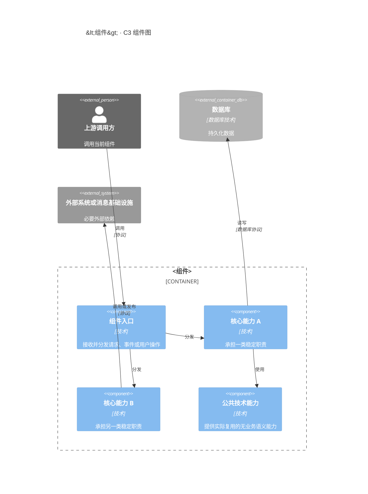
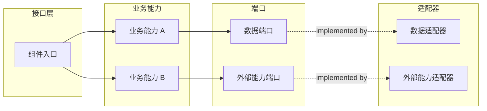
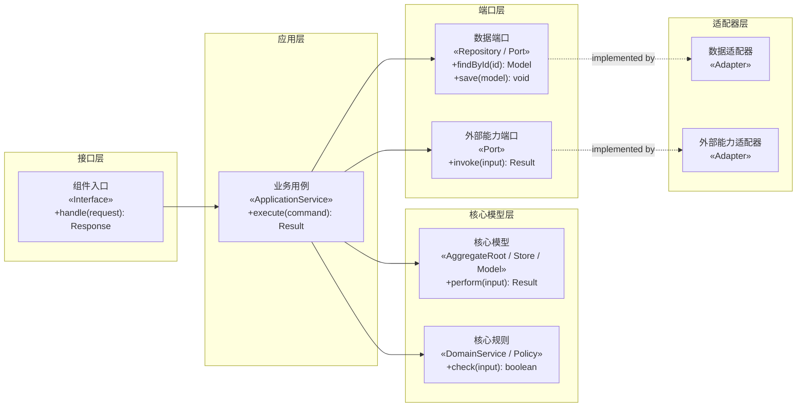

# `[<组件>]` 组件规范

## AI-COMPONENT-001

- **Who**：处理 `[<组件>]` 指令的组件设计 Agent。
- **When**：成功识别 `[<组件>]` 并需要确定本阶段目标与不包含范围时。
- **Where**：当前组件设计目录与允许读取的前置规范。
- **What**：提供“职责”功能；具体规则、格式和约束如下。
- **Why**：确保组件设计按真实边界完整落地且不复制上游事实。

通过对话确认当前组件的长期行为、边界、领域模型、流程、状态、时序、界面、平台约束及其提供的契约。

不负责需求分析、全局技术选型、其他组件契约、源码实现、测试实现或部署。

## AI-COMPONENT-002

- **Who**：处理 `[<组件>]` 指令的组件设计 Agent。
- **When**：进入组件设计阶段后，在任何项目文件操作前。
- **Where**：当前组件设计目录与允许读取的前置规范。
- **What**：提供“操作权限”功能；具体规则、格式和约束如下。
- **Why**：确保组件设计按真实边界完整落地且不复制上游事实。

| 路径模式 | 创建 | 读取 | 修改 | 删除 |
|---|---|---|---|---|
| `**` | 禁止 | 禁止 | 禁止 | 禁止 |
| `docs/requirements/**` | 禁止 | 允许 | 禁止 | 禁止 |
| `docs/system/**` | 禁止 | 允许 | 禁止 | 禁止 |
| `<组件设计目录>/**` | 允许 | 允许 | 允许 | 允许 |

## AI-COMPONENT-003

- **Who**：处理 `[<组件>]` 指令的组件设计 Agent。
- **When**：任务所需文件、事实、决策或操作超出组件设计阶段职责或权限时。
- **Where**：当前组件设计目录与允许读取的前置规范。
- **What**：提供“越界处理”功能；具体规则、格式和约束如下。
- **Why**：确保组件设计按真实边界完整落地且不复制上游事实。

需要新增或拆分组件、修改全局规范时切换 `[system]`；需要源码时切换 `[<组件> dev]`。

## AI-COMPONENT-004

- **Who**：处理 `[<组件>]` 指令的组件设计 Agent。
- **When**：任务范围明确后，在形成方案或结束任务前检查适用的专业风险时。
- **Where**：当前组件设计目录与允许读取的前置规范。
- **What**：提供“评审视角”功能；具体规则、格式和约束如下。
- **Why**：确保组件设计按真实边界完整落地且不复制上游事实。

按当前组件类型与范围逐项检查适用视角：

- 业务与领域：边界、术语、不变量、状态和业务行为是否一致。
- 接口与数据：公开入口、契约、持久化、事务、并发和兼容性是否完整。
- 安全与隐私：认证、授权、输入、敏感数据和审计要求是否落实系统基线。
- 交互与可访问性：仅 Frontend 适用；任务流、状态反馈、键盘、焦点和语义是否可用。
- 工程与运行：代码结构、依赖方向、配置、故障恢复和可观测性是否可实现。
- 可测试性：关键行为、边界和失败模式是否有稳定测试层级、编号与 `Src`。

不适用的视角可跳过；发现必须落实到对应组件设计文件或在最终回复中列为阻塞，不生成独立评审报告。

## AI-COMPONENT-005

- **Who**：处理 `[<组件>]` 指令的组件设计 Agent。
- **When**：组件指令显式包含 `frontend` 或 `backend` 模式词时。
- **Where**：当前组件设计目录与允许读取的前置规范。
- **What**：提供“完整组件设计模式”功能；具体规则、格式和约束如下。
- **Why**：确保组件设计按真实边界完整落地且不复制上游事实。

`frontend` 和 `backend` 只增强当前组件设计阶段，不改变组件名称、阶段路由或文件权限。
两种模式都先读取需求和系统规范，逐项判断关注点由当前组件负责、引用系统规范、交给后续
阶段实现或不适用；不适用时说明原因，不创建空文件。

### Frontend 模式

当任务使用 `[<组件>] frontend <任务>` 时，分别完成以下单一关注点设计：

1. `information-architecture.md`：内容层级、导航关系、用户角色和入口。
2. `routing-permissions.md`：引用系统安全基线，设计当前前端的路由、参数、页面权限、
   操作权限和无权访问处理。
3. `layout.md`：Page Shell、页面区域、响应式、滚动和溢出。
4. `design-system.md`：组件库、视觉语义、复用规则及 Design Token 使用。
5. `data-fetching.md`：请求、缓存、失效、取消、去重、重试、乐观更新和错误映射。
6. `state-management.md`：本地、表单、路由、服务端缓存、跨页面和身份权限状态。
7. `forms.md`：字段、校验、提交、防重复提交、服务端错误和焦点管理。
8. `page-states.md`：loading、empty、error、forbidden、not-found、offline、
   submitting、success、stale 和 partial-data。
9. `feedback.md`：字段错误、Toast、Alert、Modal、Progress、Skeleton 和确认反馈。
10. `accessibility.md`：语义、键盘、焦点、Label、错误关联、对比度和动效减弱。
11. `performance.md`：首屏、关键交互、Bundle、渲染、请求、图片、字体和性能预算。
12. `errors.md`：错误分类、恢复策略和 Error Boundary。
13. `observability.md`：引用系统可观测性基线，设计当前前端实际产生的错误事件、
    日志、性能信号和 Trace 关联。
14. `testing.md`：逻辑、组件、页面、契约、权限、可访问性和端到端测试策略。
15. `configuration.md`：公开配置、构建时配置、默认值和启动校验。
16. `runtime.md`：构建产物、运行方式、健康要求和托管约束。

前端权限只控制界面表现，后端是最终安全边界。每个请求引用提供方在 C2 登记的稳定
OpenAPI `operationId`，消费方不复制提供方契约。能由 URL、表单或服务端缓存表达的状态
不重复放入全局 Store。页面交互契约放入 `ui/*.ui.yml`，设计变量放入
`<组件>.design-token.json`。

### Backend 模式

当任务使用 `[<组件>] backend <任务>` 时，按可验证复杂度条件选择轻量 Backend 或完整 DDD。开始确认或修改前必须完整读取
`docs/workflows/templates/backend-design.template.md`，把其中的“使用规则”“文件关系与设计顺序”
“执行流程”和各文件固定结构作为 Backend 模式的强制提示词。本文件继续作为文件权限、创建条件、
通用 C3/C4 格式、契约规则和跨阶段边界的权威来源。

模板中的图、表、目录、上下文、技术、运行单元和依赖仅用于说明格式，不是默认设计。除模板明确声明的
固定标题与顺序外，执行时必须依据当前组件的真实需求替换、增删和重组全部示例内容，不得照抄示例名称，
也不得因为模板出现某项技术或能力就创建无真实用途的模块、文件或依赖。
Backend 模板中的每个具体范例必须就近包含适配声明，明确要求根据当前组件实际情况调整；缺少该声明的范例
不得作为可执行模板使用，必须先补充声明或仅将其视为说明材料。

Backend 按“C3 → 复杂度判断 → 完整 DDD 时的 DDD（每个限界上下文包含状态图与关键时序图）→ 接口和边界 → 机器可读模型 → C4 →
配置、密钥、可观测性、测试与运行 → 部署交付 → component.md 汇总”的依赖顺序设计。
每个适用文件使用模板规定的标题名称和顺序；仅完整 DDD 模式创建 `ddd.md`，且其中每个限界上下文完整保留固定章节，
其他不适用的可选文件或章节直接省略，不创建空文件，
也不填写“无”“不适用”或其他占位正文。

Backend 先识别上下文边界、业务能力、统一语言、不变量和事务边界，再确定聚合根、应用用例、Port 和
Adapter。领域层不得依赖框架、ORM、HTTP、JWT、授权引擎或消息队列；跨聚合只引用稳定 ID，
跨组件使用契约、幂等命令、事件或补偿流程。简单 CRUD、纯查询和数据转换不机械创建
Command、Handler、Factory、DomainService 或 DomainEvent。

一个逻辑 Backend 组件可以按实际需要提供 HTTP/API、Outbox Relay 和消息 Worker 等多个独立运行入口；
进程不是工作流组件的划分单位，不得仅因入口、启动命令或扩缩容方式不同而拆成多个组件。这些运行单元
共享当前组件的业务边界和设计目录，可以来自同一构建产物，但必须在 `runtime.md` 分别声明入口、启动命令、
依赖、健康检查、关闭方式和故障恢复；不需要的运行单元不得预先创建。

多个限界上下文只在确有不同统一语言和模型边界时建立。每个上下文拥有自己的应用用例和领域模型；
跨上下文通过稳定的应用接口或 Port 协作，不导入对方的领域对象。需要强一致的步骤由应用层和明确的
事务边界编排，不隐藏在领域事件链中。只有外部授权策略本身存在归属、生命周期和业务规则时才建立完整
授权上下文；单纯调用授权引擎的权限检查保持为应用能力或 Port。

### 通用目录规则

- 保留框架要求的路由、页面或 Consumer 目录作为接口层，业务代码按业务能力组织。
- `shared/` 只保存被多个模块使用且没有业务含义的技术能力，不保存业务模型。
- 不创建含义模糊的全局 `lib/`、`services/`、`utils/` 或 `schemas/`。
- `component.md` 递归列出全部受版本控制的目录和文件，不使用省略号、通配符或“同上”。
- 每个文件、Port、Adapter、事件和目录都必须存在当前需求中的真实调用方或用途。
- 语言、框架、ORM、数据库和消息库的目录及命名规则只在组件实际采用对应技术时启用；框架规定的固定文件名优先保留。
- `<subject>.<role>.ts` 可用于表达 TypeScript 文件职责；技术 Adapter 统一使用能准确反映实现的
  `<subject>.<technology>.<role>.ts`，不把 ORM 实现标成数据库驱动，也不为简单返回值或单一内部实现拆出空抽象。
- 实际部署文件仍由 `[deploy] <组件>` 维护；`runtime.md` 和 `deployment.md`
  只声明提供给部署阶段的组件运行与交付要求。

### 跨阶段权威边界

- `docs/system/security.md` 和 `docs/system/observability.md` 是跨组件原则、统一约定、
  共用平台及系统级目标的唯一来源；组件文件只引用，不复制其正文。
- 组件文件只维护当前组件如何落实全局基线、实际产生的信号、需要的密钥以及明确例外。
- `authentication.md` 不重新定义全局身份体系，`authorization.md` 不重新定义全局
  授权原则，`secrets.md` 不重新定义密钥平台或保存密钥值。
- 组件 `observability.md` 不重新定义全局字段、命名、保留策略、告警级别或系统级 SLO。
- Collector、Exporter、Dashboard、告警规则、密钥注入、证书挂载和环境值由
  `[deploy]` 维护，组件设计只声明交付要求。

### 模式完成检查

- Frontend 和 Backend 模式逐项检查各自列出的全部设计关注点。
- 每个适用关注点只有一个权威文件，契约和执行配置不在 Markdown 中重复。
- `component.md` 的设计架构索引列出设计目录内每个实际文件及其唯一作用。
- C3、C4、各关注点文件和契约使用相同稳定名称及依赖方向。
- 安全与可观测性文件引用系统基线，只包含当前组件的落实、信号、需求或例外。
- 没有按 URL、数据库表或技术类型错误划分业务模块。
- 没有为未来需求创建空文件、空目录或无调用方的抽象。

## AI-COMPONENT-006

- **Who**：处理 `[<组件>]` 指令的组件设计 Agent。
- **When**：需要选择、创建、修改、删除或定位组件设计阶段产物时。
- **Where**：当前组件设计目录与允许读取的前置规范。
- **What**：提供“文件作用”功能；具体规则、格式和约束如下。
- **Why**：确保组件设计按真实边界完整落地且不复制上游事实。

### 通用文件

| 文件 | 作用 | 创建条件 | 可修改内容 |
|---|---|---|---|
| `component.md` | 组件入口文档 | 始终 | 概述、设计架构文件索引和完整受版本控制文件结构 |
| `c3.md` | 组件内部结构和依赖关系图 | 始终 | 当前组件的 C3 Mermaid 图 |
| `c4.md` | 关键代码单元和依赖关系 | 存在需要长期维护的代码结构 | 当前组件的主要代码结构 |

### Frontend 文件

| 文件 | 作用 | 创建条件 | 可修改内容 |
|---|---|---|---|
| `information-architecture.md` | 信息架构 | 存在页面或内容层级 | 内容层级、导航关系、角色和入口 |
| `routing-permissions.md` | 路由与页面权限 | 存在路由 | 路由参数、访问规则、页面和操作权限 |
| `layout.md` | 页面布局 | 存在界面 | Page Shell、区域、响应式、滚动和溢出 |
| `design-system.md` | 设计系统规则 | 存在界面 | 组件库、视觉语义、复用和 Token 使用 |
| `<组件>.design-token.json` | 语义 Design Token | 需要组件级 Token | 颜色、间距、字体、圆角和动效变量 |
| `data-fetching.md` | 数据请求 | 存在远程数据 | 请求、缓存、取消、重试和乐观更新 |
| `state-management.md` | 状态管理 | 存在客户端状态 | 本地、表单、路由、服务端缓存和跨页面状态 |
| `forms.md` | 表单设计 | 存在表单 | 字段、校验、提交、错误和焦点管理 |
| `page-states.md` | 完整页面状态 | 存在页面 | Loading、Empty、Error、Forbidden、Offline 等状态 |
| `feedback.md` | 用户反馈 | 存在用户操作 | Toast、Alert、Modal、Progress 和确认反馈 |
| `accessibility.md` | 可访问性 | 存在界面 | 语义、键盘、焦点、Label、对比度和动效 |
| `performance.md` | 前端性能 | 存在性能要求 | 首屏、交互、Bundle、渲染、请求和性能预算 |
| `errors.md` | 前端错误处理 | 存在失败场景 | 错误分类、恢复和 Error Boundary |
| `observability.md` | 前端可观测性 | 存在运行要求 | 错误监控、日志、指标、Trace、脱敏和告警 |
| `testing.md` | 前端测试策略 | 始终 | 逻辑、组件、页面、契约、权限、A11y 和 E2E |
| `configuration.md` | 前端配置 | 存在配置 | 公开配置、构建时配置和校验 |
| `runtime.md` | 前端运行要求 | 存在构建或托管要求 | 构建产物、运行方式和健康要求 |
| `ui/*.ui.yml` | 页面交互契约 | 存在稳定页面 | 单个页面的结构、动作、状态和可访问性 |

### Backend 文件

| 文件 | 作用 | 创建条件 | 可修改内容 |
|---|---|---|---|
| `interface.md` | 后端接口原则 | 存在入口 | HTTP、事件、任务、版本、幂等和兼容策略 |
| `authentication.md` | 身份认证 | 存在身份要求 | 身份、凭据、Session、Token、轮换和撤销 |
| `authorization.md` | 权限控制 | 存在非公开操作 | 角色、关系、所有权、数据范围和执行点 |
| `ddd.md` | 领域设计 | 完整 DDD 模式 | 每个限界上下文独立维护边界、统一语言、领域结构图、状态图、关键时序图和领域事件 |
| `data-access.md` | 数据访问 | 存在持久化或查询 | Repository、查询、事务、并发、迁移和保留 |
| `validation.md` | 输入校验 | 存在外部输入 | 信任边界、格式校验、标准化和领域校验职责 |
| `errors.md` | 后端错误处理 | 存在失败场景 | 错误分类、错误码、协议映射、重试和脱敏 |
| `configuration.md` | 后端配置 | 存在配置 | 配置来源、默认值和启动校验 |
| `secrets.md` | 密钥要求 | 存在敏感配置 | 密钥来源、敏感级别、轮换和泄漏防护 |
| `observability.md` | 后端可观测性 | 存在运行要求 | 日志、审计、指标、追踪、健康检查和告警 |
| `testing.md` | 后端测试策略 | 始终 | 单元、集成、契约、安全、并发和 E2E |
| `runtime.md` | 运行要求 | 存在运行进程 | 进程、依赖、启动关闭、健康检查和资源 |
| `deployment.md` | 部署交付要求 | 存在部署要求 | 镜像、迁移、初始化及向 `[deploy]` 的交付 |
| `openapi.json` | 同步 HTTP API 契约 | 当前组件提供同步接口 | 路径、操作、Schema、错误和示例 |
| `asyncapi.json` | 异步事件契约 | 当前组件提供事件 | Channel、Message、生产者和消费者 |
| `schema.dbml` | 持久化数据结构和关系 | 当前组件拥有持久化数据模型 | 表、字段、索引和关系 |
| `authorization.fga` | 授权关系模型 | 当前组件存在非公开操作 | 类型、关系和权限 |

只创建项目实际需要的文件。一个事实只由一个文件维护，其他文件通过稳定名称引用，不复制字段、关系或规则。契约由提供它的组件维护，消费方只能引用。

## AI-COMPONENT-007

- **Who**：处理 `[<组件>]` 指令的组件设计 Agent。
- **When**：组件设计需要维护概述、设计索引或完整受版本控制文件树时。
- **Where**：当前组件设计目录与允许读取的前置规范。
- **What**：提供“`component.md` 文件格式”功能；具体规则、格式和约束如下。
- **Why**：确保组件设计按真实边界完整落地且不复制上游事实。

````md
# <组件>

## 概述

<用一至三段说明组件是什么、负责什么、不负责什么以及主要使用者。>

## 设计架构

| 文件 | 作用 |
|---|---|
| `component.md` | 组件概述、设计文件索引和完整文件结构 |
| `c3.md` | <当前组件的实际作用> |
| `<实际设计文件>` | <该文件维护的唯一设计关注点> |

## 目录结构

```text
<组件应用目录>/
├─ src/
│  ├─ <目录>/
│  │  ├─ <子目录>/
│  │  │  └─ <文件>       <职责>
│  │  └─ <文件>           <职责>
│  └─ <文件>               <职责>
├─ test/
│  └─ <文件>               <职责>
└─ <配置文件>               <职责>
```
````

- “设计架构”表格逐个列出当前组件设计目录内实际存在的全部文件及其唯一作用；
  文件新增、删除或重命名时同步更新，不列出尚未创建的可选文件。
- “设计架构”只作为索引，不复制各文件的规则、Schema、流程或设计正文。
- `component.md` 除概述、设计架构索引和完整应用文件结构外，不保存其他设计内容。
- 目录结构递归列出组件目录内所有应受版本控制的目录和文件，并在文件后简述职责。
- 不列出依赖目录、构建产物、缓存、日志、临时文件、密钥或其他运行时生成内容。
- 目录中的职责与 C3 模块保持一致；具体代码单元及依赖放入 `c4.md`。
- 更新后执行 `node docs/workflows/validate.mjs --component-doc <组件设计目录>/component.md --app-dir <组件应用目录>`，
  校验实际受版本控制文件没有被目录结构遗漏；只有要求设计与当前文件完全一致时才增加 `--strict`。

### 测试目录设计规则

- `component.md` 的完整文件树必须包含当前组件计划维护的全部测试目录、测试文件、
  fixture、测试支持代码和测试配置，不使用 `*`、省略号或“同上”代替。
- 测试目录按实际需要使用 `fixtures/`、`support/`、`unit/`、`integration/`、`contract/`、
  `concurrency/` 和 `e2e/`；
  不存在对应测试层级时不创建空目录。
- 单元测试按业务模块组织，覆盖领域规则、应用用例、状态逻辑和纯函数，不按源码文件数量机械创建测试。
- 单元测试中的基础设施、数据访问和 Adapter 只覆盖纯逻辑；真实数据库、HTTP、消息、
  认证、授权和外部服务边界放入集成测试。
- 集成测试包含“接口测试”，路径为 `test/integration/api/`，通过真实 HTTP、异步消息
  或 RPC 入口，以 OpenAPI、AsyncAPI 或 RPC IDL 为依据验证请求、响应、状态码、错误码、
  消息、认证、授权、幂等和兼容性，不复制契约 Schema。
- 其他集成测试验证 Repository、Adapter、事务、认证、授权和错误转换等真实边界。
- 并发测试覆盖幂等、事务隔离、资源竞争、唯一约束和重复事件等实际风险。
- fixture、factory、mock 和测试支持代码放在首次需要它们的最小公共目录；
  只有两个以上测试文件复用时才提取为共享文件。
- `testing.md` 中的 `Src` 是组件应用目录下测试文件的精确相对路径，不得写目录、通配符、
  占位符或尚未确定的候选路径；`component.md` 的完整文件树必须逐个包含所有 `Src`。
- 测试文件名沿用项目当前语言、测试框架和已有后缀约定；没有现有约定时使用小写英文
  `kebab-case` 主题名和该工具链的原生测试后缀，不创建语言映射表。
- 文件名描述一个稳定对象或内聚业务能力，不包含用例编号、三位序号或目录已经表达的测试层级，
  也不使用无具体主题的 `service`、`handler`、`controller`、`test`、`misc` 或 `common`。
  例如使用 `appointment.test.ts`、`cancel-booking.test.ts`，不使用
  `booking-service.test.ts` 或 `BOOKING-APP-CANCEL-001.test.ts`。
- 同一稳定对象或能力的多个用例可以共享一个 `Src`；公开入口、fixture 生命周期或外部依赖不同
  时拆分文件，不按生产源码文件数量机械创建测试文件。
- 测试文件移动或重命名时，同步更新完整文件树和引用该文件的全部 `Src`，不得留下两套路经。
- 测试运行器配置、初始化文件和实际测试命令入口必须出现在完整文件树中并说明职责；
  `[<组件> test]` 不能修改的根级配置由 `[<组件> dev]` 按设计实现。
- `testing.md` 必须包含“测试命令”章节，按适用测试层级记录命令、前置条件和执行范围，
  并包含单个文件、单个用例等局部执行方式。
- `testing.md` 开头用一句话说明当前组件实际使用的语言、运行时、构建或包管理工具及测试框架，
  不创建语言映射表或测试用例总表。
- `testing.md` 以“单元测试、集成测试、契约测试、并发测试、端到端测试”作为二级标题，
  每个测试用例直接使用只含用例编号的三级标题；不再按测试层级、测试文件或测试对象增加标题。
- 用例编号格式为“`<限界上下文>-<测试层级>-<对象或能力>-<三位序号>`”，在组件内唯一且
  保持稳定，删除后不复用；限界上下文和对象或能力使用大写英文 `KEBAB-CASE`，序号在相同
  “限界上下文 + 测试层级 + 对象或能力”前缀内从 `001` 递增。测试层级缩写及第三段含义如下：

  | 类型 | 缩写 | 对象或能力 |
  |---|---|---|
  | Domain 单元测试 | `DOM` | 聚合、实体、值对象或领域规则 |
  | Application 单元测试 | `APP` | Command、Query 或应用用例 |
  | Infrastructure 纯逻辑测试 | `INF` | 纯逻辑技术能力 |
  | 接口集成测试 | `API` | 接口操作或公开能力 |
  | 其他集成测试 | `INT` | Repository、Adapter 或协作边界 |
  | 契约测试 | `CON` | 契约对象 |
  | 并发测试 | `CONC` | 并发行为或竞争资源 |
  | 端到端测试 | `E2E` | 组件内完整业务链路 |
- 对象或能力不重复限界上下文，也不使用 `SERVICE`、`HANDLER`、`CONTROLLER` 等实现类型填充。
  Application 测试使用 `CREATE`、`CANCEL`、`GET-DETAIL` 等应用用例，例如使用
  `BOOKING-APP-CANCEL-001`，不使用 `BOOKING-APP-BOOKING-SERVICE-001`。
- 每个用例先在连续的 Markdown 引用行中写必需的 `Design` 和 `Src`，再按需写可选的 `BP`、`BR`、`FR`、`AC`，
  然后依次写必需的
  `Desc`、`Given`、`When`、`Then`；字段名统一使用英文和全角冒号，四个字段连续书写且
  彼此之间不留空行。
- `Desc` 是不含编号的简短中文描述；测试代码中的用例描述使用“`<用例编号> <Desc>`”。
- `Design` 使用“`<文件>#<章节>#<子章节>`”引用实际设计位置；`Src` 使用组件应用目录下的
  测试文件精确相对路径，同一文件包含多个用例时在每个用例中重复记录；`BP` 引用系统 `process.md`
  中实际存在的跨组件业务流程，`BR`、`FR`、`AC` 分别引用对应类型的实际需求项。
  多个编号使用顿号分隔，不适用的可选引用行直接省略。
- 只引用当前测试直接验证的 BP、BR、FR 或 AC，不因上游关系自动展开全部关联；组件测试不引用 TC，
  Requirement TC 只由全局 `[test]` 实现。
- `Given` 只描述执行前状态、输入和依赖，`When` 只描述一个公开行为、应用用例或协议入口，
  `Then` 只描述可观察的返回值、状态变化、稳定错误、事件或必要副作用；多个结果使用列表。
- 一个用例只描述一个主要行为；不同公开操作、成功与失败分支或具有独立业务意义的边界场景
  分成不同用例，不在一个 GWT 中使用“或”“依次”合并多个行为。
- BP 只在当前测试直接验证该跨组件流程中由当前组件承担的片段时引用；组件 E2E 不得声称验证
  整个跨组件 BP。Domain、Repository、Adapter 和纯逻辑测试没有直接验证 BP 片段时省略 BP。
  消息发布行为由集成测试验证，Schema 兼容性由契约测试
  验证，不在两个层级重复相同断言。
- 组件 `testing.md` 中的 E2E 只验证当前组件边界内的完整公开入口；需要启动或断言多个组件、
  直接实现 Requirement TC 或验收跨组件 BP 的场景归全局 `[test]`，不在组件测试中重复规划。
- 测试工具链和命令沿用组件现状；JavaScript 和 TypeScript 组件没有既有测试工具链时默认
  使用 `pnpm` 和 Vitest。`testing.md` 只索引项目真实存在的命令。
- 测试报告和覆盖率报告按需由用户手动导出，不作为默认生成或提交的项目文件。
- 不在 `component.md` 中复制测试步骤、断言、测试数据或执行结果。

## AI-COMPONENT-008

- **Who**：处理 `[<组件>]` 指令的组件设计 Agent。
- **When**：组件需要表达内部模块关系，或存在需要长期维护的关键代码结构时。
- **Where**：当前组件设计目录与允许读取的前置规范。
- **What**：提供“C3 和 C4 文件格式”功能；具体规则、格式和约束如下。
- **Why**：确保组件设计按真实边界完整落地且不复制上游事实。

`c3.md` 使用 `C4Component` 描述当前组件内部的长期模块、职责、依赖和必要外部关系：

````md
# C3 组件图


````

`c4.md` 使用一个代码总览和按业务能力划分的详细章节。所有图统一使用 `flowchart LR`，主分层从左到右排列，每个分层内部从上到下排列：

````md
# C4 代码图

## 总览



## <业务能力>


````

- `c3.md` 只包含一级标题和一个 `C4Component` Mermaid 代码块，不包含概述、正文、列表、表格或图外说明。
- C3 图只展示当前组件内部的主要模块、职责、依赖方向和必要的外部组件，不展开类和函数。
- 当前组件使用一个 `Container_Boundary`，内部模块使用 `Component`；上游调用方和数据库、缓存、
  消息代理、授权引擎及下游消费者使用适合的外部 C4 元素，位于当前组件边界之外。
- 每个关系使用 `Rel` 明确用途和必要协议；不存在的模块或外部依赖直接省略。
- Backend C3 按限界上下文、入口、独立运行单元和实际公共技术能力展示稳定模块，不用 C3 元素模拟
  接入层、应用层、领域层和适配层。上下文内部的分层及应用服务与领域模型的对应关系放入 `ddd.md` 和 `c4.md`。
- 异步链路明确展示生产者、Outbox Relay、消息基础设施和 Worker/下游消费者之间的关系。
- `c4.md` 包含一级标题、一个“总览”章节和按实际业务能力创建的详细章节。
- 总览使用一个 `flowchart LR`，只展示模块、业务能力及主要依赖，不展示字段或函数。
- 每个详细章节只描述一个业务能力并使用一个 `flowchart LR`；图仍过大时继续按内聚的子能力拆分章节。
- C4 各图的主分层按依赖方向从左到右排列；每个分层使用 `subgraph` 和 `direction TB`，使同层代码单元从上到下排列。
- 分层名称和数量按组件实际结构确定，不为套用模板创建空层；前端可以使用页面、功能、状态和适配器，后端可以使用接口、应用、领域、端口和适配器，任务处理器可以使用消费者、任务、规则和外部适配器。
- C4 节点按实际情况标注 `ApplicationService`、`AggregateRoot`、`Entity`、`ValueObject`、`DomainService`、`Repository`、`DomainEvent`、`Page`、`Component`、`Hook`、`Store`、`Handler` 或 `Adapter`，不存在的角色不创建。
- 详细章节只展示理解设计所需的关键公开函数、参数和返回类型，不展示私有函数、简单访问器、全部字段或重复的 CRUD 签名。
- HTTP 请求、响应、错误和 Schema 由 `openapi.json` 维护；异步消息结构由 `asyncapi.json` 维护；C4 只引用稳定的操作名和类型名。
- 同一代码单元在总览和各详细章节中使用相同名称；公共依赖只在相关章节出现，不为展示完整性复制无关节点和连线。
- C3、C4、`component.md` 和契约中的名称及依赖方向保持一致。
- 跨组件业务流程和调用顺序只放入系统 `process.md`；组件设计目录不创建 `process.md`。
- 状态图和关键时序图放入 `ddd.md` 对应的限界上下文章节，不创建独立的 `state.md` 或
  `sequence.md`；关键时序引用系统流程的稳定 BP 编号，不复制系统业务流程。

## AI-COMPONENT-009

- **Who**：处理 `[<组件>]` 指令的组件设计 Agent。
- **When**：当前组件启用 Backend 模式并需要定位专用设计模板时。
- **Where**：当前组件设计目录与允许读取的前置规范。
- **What**：提供“Backend 文件格式”功能；具体规则、格式和约束如下。
- **Why**：确保组件设计按真实边界完整落地且不复制上游事实。

Backend 专用 Markdown、机器可读模型及其固定结构统一由
`docs/workflows/templates/backend-design.template.md` 维护，本文件不复制模板正文。

- 完整 DDD 模式的 `ddd.md` 按限界上下文分章，只展示概念角色和关键公开业务行为，不复制 C4 的实现包、
  Adapter、技术依赖或完整代码签名。
- 一个组件默认对应一个限界上下文；只有组件内确实存在多个独立语言和模型边界时才分别列出，
  边界表明应拆分组件时切换 `[system]` 调整组件划分。
- 完整 DDD 模式的每个限界上下文必须完整包含边界、统一语言、领域结构图、状态图、关键时序图和领域事件列表；
  各上下文独立维护自己的术语、模型、生命周期、协作和事件。
- 领域事件使用过去时表达聚合成功改变后发生的领域事实，仅在存在真实消费方或业务反应时创建；
  它不是命令，也不自动等于集成事件或事件溯源记录。对外发布时映射为独立、可版本化的集成事件，
  不直接暴露领域对象；消息重试等队列运行状态不写入业务聚合，除非业务明确需要相应状态和事件。
- 领域结构图使用 `flowchart LR` 模拟类图；应用层、领域层、领域端口与事件从左到右，
  每层使用 `subgraph` 和 `direction TB` 使应用服务、领域服务、聚合根、实体、值对象、
  仓储和领域事件等类型从上到下排列，不使用 `classDiagram`。
- `ddd.md` 展示概念角色和关键公开业务行为；`c4.md` 使用相同稳定名称展示实现代码单元、
  包、Port、Adapter 和依赖，不重复 DDD 的业务语义。
- 数据库字段和约束、HTTP Schema、异步消息结构分别由 `schema.dbml`、`openapi.json` 和 `asyncapi.json` 维护，不写入 `ddd.md`。
- 轻量 Backend 不创建 `ddd.md`，只在 `component.md` 概述记录业务词汇、边界、设计强度和不采用完整 DDD 的事实依据；
  不虚构聚合、实体、值对象、领域服务或领域事件。Frontend 不创建 `ddd.md`，除非用户明确要求共享领域模型。

## AI-COMPONENT-010

- **Who**：处理 `[<组件>]` 指令的组件设计 Agent。
- **When**：组件提供或消费 HTTP、异步消息、RPC、授权或数据契约时。
- **Where**：当前组件设计目录与允许读取的前置规范。
- **What**：提供“契约规则”功能；具体规则、格式和约束如下。
- **Why**：确保组件设计按真实边界完整落地且不复制上游事实。

- OpenAPI 使用稳定 `operationId`，Schema、示例和实际接口保持一致。
- 没有异步事件不创建 AsyncAPI。
- 没有非公开操作不创建 OpenFGA。
- 没有数据模型变化不创建 DBML。
- 对外提供的 Swagger UI、OpenAPI 和 AsyncAPI 必须通过 HTTP(S) API 暴露，并以
  完整 URL 登记在 `docs/system/c2.md` 对应组件的开发接口信息中；登记缺失或不一致时切换
  `[system]` 更新。
- `openapi.json` 和 `asyncapi.json` 是提供方维护的契约源文件；其他组件通过 C2
  登记的 URL 读取，不直接依赖提供方的仓库文件路径。
- 契约说明适用的错误、权限、事务、并发、幂等、兼容和迁移。
- JSON 使用标准解析器验证；其他契约使用项目已有工具验证。

## AI-COMPONENT-011

- **Who**：处理 `[<组件>]` 指令的组件设计 Agent。
- **When**：Frontend 组件需要定义页面、状态、操作、权限或反馈交互契约时。
- **Where**：当前组件设计目录与允许读取的前置规范。
- **What**：提供“UI YAML 格式”功能；具体规则、格式和约束如下。
- **Why**：确保组件设计按真实边界完整落地且不复制上游事实。

```yaml
id: booking-create
title: 创建预约
platform: web
route: /bookings/new

requirements:
  - REQ-001-FR-001
  - REQ-001-AC-001

permissions:
  - REQ-001-PERM-001

layout:
  type: page
  regions:
    - id: booking-form
      component: Form

actions:
  submit:
    trigger: booking-form.submit
    operationId: createBooking
    permission: REQ-001-PERM-001
    success: booking-detail
    failure: show-submit-error

states:
  loading:
    description: 正在加载
  empty:
    description: 没有数据
  error:
    description: 请求失败
  forbidden:
    description: 没有权限

accessibility:
  keyboard: true
  screenReader: true
```

- 页面至少关联一个 FR 和 AC。
- 非公开操作关联 PERM。
- 每个 action 关联 API `operationId`、本地行为或外部跳转。
- 检查 loading、empty、error、forbidden、offline、submitting 和 success 中的适用状态。
- `.ui.yml` 是交互契约，不复制特定框架源码。
- `.ui.yml` 引用当前组件 Token，不保存可复用的颜色、间距、字体和圆角常量。

## AI-COMPONENT-012

- **Who**：处理 `[<组件>]` 指令的组件设计 Agent。
- **When**：前置条件满足并准备执行组件设计阶段任务时。
- **Where**：当前组件设计目录与允许读取的前置规范。
- **What**：提供“执行步骤”功能；具体规则、格式和约束如下。
- **Why**：确保组件设计按真实边界完整落地且不复制上游事实。

1. 从 `docs/system/c2.md` 组件清单的当前组件表格行解析应用目录和设计目录，并读取其开发环境端口、访问地址和接口文档。
2. 读取相关需求、系统规范、当前组件规范和契约，不读取源码、测试或部署文件。
3. 识别任务是否以 `frontend` 或 `backend` 开头；Backend 模式额外完整读取并执行
   `docs/workflows/templates/backend-design.template.md`，Frontend 模式执行本文件对应规则。
4. 自动识别需要确认的组件边界、行为、契约和平台限制。
5. 按根 `AGENTS.md` 的对话确认规则完成确认。
6. 只增量更新当前组件的长期规范及其提供的契约。

## AI-COMPONENT-013

- **Who**：处理 `[<组件>]` 指令的组件设计 Agent。
- **When**：组件设计阶段任务准备结束并回复用户前。
- **Where**：当前组件设计目录与允许读取的前置规范。
- **What**：提供“完成检查”功能；具体规则、格式和约束如下。
- **Why**：确保组件设计按真实边界完整落地且不复制上游事实。

- 实际修改全部位于组件清单声明的当前组件设计目录。
- 没有修改源码、其他组件、需求、系统规范或部署文件。
- `component.md` 只包含概述、设计架构文件索引和完整的受版本控制文件结构；
  索引覆盖设计目录内全部实际文件且作用唯一。
- `component.md` 的完整文件结构包含实际需要的测试层级、测试文件、fixture、支持代码和配置；没有通配符、空测试目录或重复的测试方案正文。
- 已执行组件文件树自动校验且没有遗漏实际受版本控制文件；要求设计与当前文件完全一致时使用了 `--strict`。
- `c3.md` 只有一级标题和一个 `C4Component` Mermaid 图，没有其他说明；图中只包含当前组件的
  主要内部模块、职责、依赖和必要外部关系，不展开类、函数或内部代码分层。
- 需要长期维护代码结构时，`c4.md` 使用一个代码总览和按业务能力划分的详细 `flowchart LR`；总览不展示函数，详细章节只展示关键公开函数，所有图均为主分层从左到右、分层内部从上到下。
- Backend 完整 DDD 模式下，`ddd.md` 的每个限界上下文完整记录边界、统一语言、领域结构、状态图、关键时序图
  以及领域事件，不创建独立的 `state.md` 或 `sequence.md`，不复制系统流程、C4、DBML 或契约内容。
- Backend 轻量模式下不创建 `ddd.md`，`component.md` 概述已记录轻量判定条件且没有遗漏任何完整 DDD 触发信号。
- Backend 模式下，适用文件遵循 `docs/workflows/templates/backend-design.template.md`
  的依赖顺序和固定章节，机器可读模型分别来自接口、授权和数据访问设计。
- 使用 `frontend` 或 `backend` 模式时，额外通过“模式完成检查”。
- 安全和可观测性设计没有复制系统基线或写入部署配置与环境值。
- 引用的 BP、需求编号、权限编号、`operationId`、Design 章节、Src 测试路径和 Token 均存在。
- JSON、YAML、DBML、FGA 和 Mermaid 使用项目已有工具或标准解析器验证。
