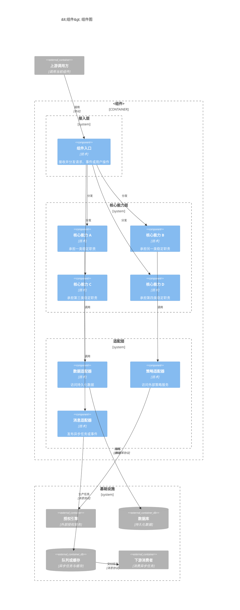

# `[<组件>]` 组件规范

## 职责

通过对话确认当前组件的长期行为、边界、领域模型、流程、状态、时序、界面、平台约束及其提供的契约。

不负责需求分析、全局技术选型、其他组件契约、源码实现、测试实现或部署。

## 操作权限

| 路径模式 | 创建 | 读取 | 修改 | 删除 |
|---|---|---|---|---|
| `**` | 禁止 | 禁止 | 禁止 | 禁止 |
| `docs/requirements/**` | 禁止 | 允许 | 禁止 | 禁止 |
| `docs/system/**` | 禁止 | 允许 | 禁止 | 禁止 |
| `<组件设计目录>/**` | 允许 | 允许 | 允许 | 允许 |

## 越界处理

需要新增或拆分组件、修改全局规范时切换 `[system]`；需要源码时切换 `[<组件> dev]`。

## 专家

按实际需要选择领域、API、数据、安全、平台 UX、平台工程、可访问性和测试专家，不生成独立专家报告。

## DDD 组件设计模式

当组件任务使用 `[<组件>] ddd <任务>` 时启用本模式。`ddd` 只增强当前组件设计阶段，
不改变组件名称、阶段路由或文件权限。

### 建模顺序

1. 从需求和系统规范识别当前组件承担的业务能力、限界上下文、主要使用者和外部依赖。
2. 明确定义统一语言，消除同一术语的多种含义。
3. 先识别业务不变量、状态生命周期和事务边界，再确定聚合根、实体和值对象。
4. 确定应用用例、仓储端口和外部能力端口，再选择基础设施适配器。
5. 先完成 `ddd.md`，再根据领域边界更新 `component.md`、`c3.md` 和 `c4.md`。
6. 最后按实际能力更新流程、状态、时序、HTTP、事件、数据和授权契约。

如果分析后不存在有意义的领域规则、状态生命周期或业务不变量，不得虚构 DDD 模型；
停止 DDD 部分并说明应改用普通组件设计模式。

### 建模规则

- 业务模块按内聚的业务能力或限界上下文划分，不按 URL、数据库表或技术类型划分。
- 聚合根负责维护聚合内不变量；聚合内部可以包含实体和值对象，跨聚合只引用稳定 ID。
- 一次事务默认只修改一个聚合；跨聚合流程由应用服务协调。
- 跨组件一致性使用幂等命令、领域事件或补偿流程，不直接访问其他组件的数据存储。
- 领域层不得依赖框架、ORM、HTTP、UI、Schema 校验、身份令牌、授权引擎、消息队列或其他基础设施。
- Repository 接口按聚合定义为端口，具体数据访问位于基础设施适配器。
- JWT、密码哈希、关系授权、消息队列和外部 API 是 Port 或 Adapter，不是 DomainService。
- DomainService 只承载无法自然归属单个聚合的领域规则。
- ApplicationService 负责用例协调、事务和跨聚合协作，不保存领域不变量。
- HTTP Route、页面、Consumer 和其他入口只负责输入转换、校验、调用应用服务和输出转换。
- 简单 CRUD、纯查询和数据转换不强制创建聚合、值对象、领域服务、Command、Handler 或领域事件。
- 只读列表可以使用 Query Service 返回 DTO，不要求加载完整聚合。
- 每个 Port、Adapter、领域事件和目录都必须存在当前需求中的真实调用方或用途。

### 目录设计规则

- 保留框架要求的路由、页面或 Consumer 目录作为接口层，业务代码按
  `modules/<业务能力>/` 组织。
- 模块按实际需要使用 `application/`、`domain/`、`ports/`、`infrastructure/`
  和 `interface/`；不存在的层级不创建。
- `shared/` 只保存被多个模块使用且没有业务含义的技术能力，不保存业务模型。
- 不创建含义模糊的全局 `lib/`、`services/`、`utils/` 或 `schemas/`；
  Schema、服务和适配器跟随所属业务模块。
- `component.md` 递归列出全部受版本控制的目录和文件，不使用省略号、通配符或“同上”。
- 不为未来需求创建空目录、备用接口、备用适配器或没有消费者的事件。

### DDD 模式完成检查

- 每个入口映射到明确的应用用例。
- 每条业务不变量归属明确的聚合或领域服务。
- 每个聚合具有明确事务边界，跨聚合关系只使用稳定 ID。
- 领域层没有依赖框架和基础设施。
- 每个 Port 都有真实调用方和 Adapter。
- `ddd.md`、`component.md`、C3、C4 和契约使用相同稳定名称及依赖方向。
- 没有按 URL、数据库表或技术类型错误划分业务模块。
- 没有为简单 CRUD 引入不必要的 DDD 抽象。

## 文件作用

```text
<组件设计目录>/
├─ component.md
├─ c3.md
├─ c4.md
├─ ddd.md
├─ process.md
├─ state.md
├─ sequence.md
├─ openapi.json
├─ asyncapi.json
├─ schema.dbml
├─ authorization.fga
├─ <组件>.design-token.json
└─ *.ui.yml
```

| 文件 | 作用 | 创建条件 | 可修改内容 |
|---|---|---|---|
| `component.md` | 组件概述和完整文件结构 | 始终 | 当前组件的职责边界、使用者和受版本控制文件结构 |
| `c3.md` | 组件内部结构和依赖关系图 | 始终 | 当前组件的 C3 Mermaid 图 |
| `c4.md` | 关键代码单元和依赖关系 | 存在需要长期维护的代码结构 | 当前组件的主要代码结构 |
| `ddd.md` | 领域语义、聚合规则和建模决策 | 存在领域模型 | 当前组件的统一语言、不变量、事务边界、一致性和领域事件 |
| `process.md` | 组件内部业务、用户或任务流程 | 存在稳定流程 | 当前组件流程 |
| `state.md` | 页面、领域对象或任务状态转换 | 存在稳定状态模型 | 当前组件状态 |
| `sequence.md` | 多方交互时序 | 存在多方调用 | 当前组件时序 |
| `<组件>.design-token.json` | 当前组件的语义 Design Token | 存在界面且需要 Token | 当前组件的颜色、间距、字体、圆角和动效等语义变量 |
| `*.ui.yml` | 稳定页面或视图的交互契约 | 存在页面规范 | 当前组件页面结构、动作和状态 |
| `openapi.json` | 同步 HTTP API 契约 | 当前组件提供同步接口 | 路径、操作、Schema、错误和示例 |
| `asyncapi.json` | 异步事件契约 | 当前组件提供事件 | Channel、Message、生产者和消费者 |
| `schema.dbml` | 持久化数据结构和关系 | 当前组件拥有持久化数据模型 | 表、字段、索引和关系 |
| `authorization.fga` | 授权关系模型 | 当前组件存在非公开操作 | 类型、关系和权限 |

只创建项目实际需要的文件。一个事实只由一个文件维护，其他文件通过稳定名称引用，不复制字段、关系或规则。契约由提供它的组件维护，消费方只能引用。

## `component.md` 文件格式

````md
# <组件>

## 概述

<用一至三段说明组件是什么、负责什么、不负责什么以及主要使用者。>

## 目录结构

```text
<组件应用目录>/
├─ src/
│  ├─ <目录>/
│  │  ├─ <子目录>/
│  │  │  └─ <文件>       <职责>
│  │  └─ <文件>           <职责>
│  └─ <文件>               <职责>
├─ test/
│  └─ <文件>               <职责>
└─ <配置文件>               <职责>
```
````

- `component.md` 不保存领域模型、流程、状态、时序或契约内容。
- 目录结构递归列出组件目录内所有应受版本控制的目录和文件，并在文件后简述职责。
- 不列出依赖目录、构建产物、缓存、日志、临时文件、密钥或其他运行时生成内容。
- 目录中的职责与 C3 模块保持一致；具体代码单元及依赖放入 `c4.md`。

### 测试目录设计规则

- `component.md` 的完整文件树必须包含当前组件计划维护的全部测试目录、测试文件、
  fixture、测试支持代码和测试配置，不使用 `*`、省略号或“同上”代替。
- 测试目录按实际需要使用 `unit/`、`integration/`、`contract/` 和 `e2e/`；
  不存在对应测试层级时不创建空目录。
- 单元测试按业务模块组织，覆盖领域规则、应用用例、状态逻辑和纯函数，不按源码文件数量机械创建测试。
- 集成测试按 HTTP、UI、数据库、消息、授权或其他真实边界组织，验证 Port 与 Adapter、
  Schema、事务和错误转换。
- 契约测试验证 OpenAPI、AsyncAPI 或消费方兼容性；端到端测试只覆盖当前组件实际负责且
  无法由更低层测试充分验证的关键路径。
- fixture、factory、mock 和测试支持代码放在首次需要它们的最小公共目录；
  只有两个以上测试文件复用时才提取为共享文件。
- 测试文件名描述被测业务能力或稳定行为，并在目录树职责说明中引用适用的需求、
  AC、PERM 或 TC 编号；详细场景仍由需求 `.feature` 和专用规范维护。
- 测试运行器配置、初始化文件和 package script 必须出现在完整文件树中并说明职责；
  `[<组件> test]` 不能修改的根级配置由 `[<组件> dev]` 按设计实现。
- 不在 `component.md` 中复制测试步骤、断言、测试数据或执行结果。

## C3 和 C4 文件格式

`c3.md` 使用 `C4Component` 描述当前组件内部的长期结构：

````md
# C3 组件图


````

`c4.md` 使用一个代码总览和按业务能力划分的详细章节。所有图统一使用 `flowchart LR`，主分层从左到右排列，每个分层内部从上到下排列：

````md
# C4 代码图

## 总览

```mermaid
flowchart LR
    subgraph interface_layer["接口层"]
        direction TB
        entry["组件入口"]
    }

    subgraph capability_layer["业务能力"]
        direction TB
        capability_a["业务能力 A"]
        capability_b["业务能力 B"]
    }

    subgraph port_layer["端口"]
        direction TB
        data_ports["数据端口"]
        external_ports["外部能力端口"]
    }

    subgraph adapter_layer["适配器"]
        direction TB
        data_adapters["数据适配器"]
        external_adapters["外部能力适配器"]
    }

    entry --> capability_a
    entry --> capability_b
    capability_a --> data_ports
    capability_b --> external_ports
    data_ports -.->|"implemented by"| data_adapters
    external_ports -.->|"implemented by"| external_adapters
```

## <业务能力>

```mermaid
flowchart LR
    subgraph interface_layer["接口层"]
        direction TB
        entry["组件入口<br/>«Interface»<br/>+handle(request): Response"]
    }

    subgraph application_layer["应用层"]
        direction TB
        use_case["业务用例<br/>«ApplicationService»<br/>+execute(command): Result"]
    end

    subgraph core_layer["核心模型层"]
        direction TB
        core_model["核心模型<br/>«AggregateRoot / Store / Model»<br/>+perform(input): Result"]
        policy["核心规则<br/>«DomainService / Policy»<br/>+check(input): boolean"]
    end

    subgraph port_layer["端口层"]
        direction TB
        repository_port["数据端口<br/>«Repository / Port»<br/>+findById(id): Model<br/>+save(model): void"]
        external_port["外部能力端口<br/>«Port»<br/>+invoke(input): Result"]
    end

    subgraph adapter_layer["适配器层"]
        direction TB
        repository_adapter["数据适配器<br/>«Adapter»"]
        external_adapter["外部能力适配器<br/>«Adapter»"]
    end

    entry --> use_case
    use_case --> core_model
    use_case --> policy
    use_case --> repository_port
    use_case --> external_port
    repository_port -.->|"implemented by"| repository_adapter
    external_port -.->|"implemented by"| external_adapter
```
````

- `c3.md` 只包含一级标题和一个 `C4Component` Mermaid 代码块，不包含概述、正文、列表、表格或图外说明。
- C3 图只展示当前组件内部的主要模块、职责、依赖方向和必要的外部组件，不展开类和函数。
- 上游调用方声明在当前组件边界之前，使其位于图的顶部。
- 当前组件使用一个主 `Container_Boundary`；主边界内部按实际结构使用接入、核心能力和适配等嵌套 `Boundary`，名称随前端、后端、任务处理器或其他组件的真实结构确定，不存在的层级直接省略。
- 基础设施使用独立的兄弟 `Boundary`，声明在当前组件主边界之后；数据库、缓存、消息代理、授权引擎和下游消费者按实际依赖放入其中，不放入当前组件边界。
- `c4BoundaryInRow` 固定使用 `1`，使当前组件的内部分层以及主边界与基础设施边界整体垂直排列；同一层级内的组件按声明顺序水平排列。
- `c4ShapeInRow` 使用能够容纳最宽层级的值，标准示例使用 `5`；跨层关系按实际方向使用 `Rel_D` 或 `Rel_U`，同层关系使用 `Rel_R` 或 `Rel_L`。
- 异步链路按“生产者 → 队列或消息代理 → 消费者”排列；不使用 Mermaid C4 尚未支持的 `Lay_D`、`Lay_R` 等布局语句。
- `c4.md` 包含一级标题、一个“总览”章节和按实际业务能力创建的详细章节。
- 总览使用一个 `flowchart LR`，只展示模块、业务能力及主要依赖，不展示字段或函数。
- 每个详细章节只描述一个业务能力并使用一个 `flowchart LR`；图仍过大时继续按内聚的子能力拆分章节。
- C4 各图的主分层按依赖方向从左到右排列；每个分层使用 `subgraph` 和 `direction TB`，使同层代码单元从上到下排列。
- 分层名称和数量按组件实际结构确定，不为套用模板创建空层；前端可以使用页面、功能、状态和适配器，后端可以使用接口、应用、领域、端口和适配器，任务处理器可以使用消费者、任务、规则和外部适配器。
- C4 节点按实际情况标注 `ApplicationService`、`AggregateRoot`、`Entity`、`ValueObject`、`DomainService`、`Repository`、`DomainEvent`、`Page`、`Component`、`Hook`、`Store`、`Handler` 或 `Adapter`，不存在的角色不创建。
- 详细章节只展示理解设计所需的关键公开函数、参数和返回类型，不展示私有函数、简单访问器、全部字段或重复的 CRUD 签名。
- HTTP 请求、响应、错误和 Schema 由 `openapi.json` 维护；异步消息结构由 `asyncapi.json` 维护；C4 只引用稳定的操作名和类型名。
- 同一代码单元在总览和各详细章节中使用相同名称；公共依赖只在相关章节出现，不为展示完整性复制无关节点和连线。
- C3、C4、`component.md` 和契约中的名称及依赖方向保持一致。
- 跨组件业务调用顺序放入系统 `process.md`；组件内部业务流程和多方时序分别放入当前组件的 `process.md` 和 `sequence.md`。

## DDD 文件格式

存在领域模型时创建 `ddd.md`：

```md
# 领域设计

## 统一语言

| 术语 | 定义 |
|---|---|
| <术语> | <在当前上下文中的唯一含义> |

## 聚合规则

| 聚合 | 业务不变量 | 事务边界 |
|---|---|---|
| `<聚合根>` | <始终成立的业务规则> | <一次事务允许修改的范围> |

## 一致性

- <跨聚合或跨组件的一致性、并发、幂等及补偿规则>

## 领域事件

| 事件 | 触发条件 | 业务含义 |
|---|---|---|
| `<事件>` | <已经发生的事实> | <对领域的含义> |

## 建模决策

- <关键模型边界及其原因>
```

- `ddd.md` 只保存图无法完整表达的领域语义和决策，不复制 C4 中的类清单、字段、方法或关系。
- 聚合根、实体、值对象、领域服务、仓储和领域事件的代码结构由 `c4.md` 表达；`ddd.md` 使用相同稳定名称说明不变量和业务含义。
- 数据库字段和约束、HTTP Schema、异步消息结构分别由 `schema.dbml`、`openapi.json` 和 `asyncapi.json` 维护，不写入 `ddd.md`。
- 没有领域模型的展示页面、薄网关、简单任务或 CRUD 组件不创建 `ddd.md`。

## 契约规则

- OpenAPI 使用稳定 `operationId`，Schema、示例和实际接口保持一致。
- 没有异步事件不创建 AsyncAPI。
- 没有非公开操作不创建 OpenFGA。
- 没有数据模型变化不创建 DBML。
- 对外提供的 Swagger UI、OpenAPI 和 AsyncAPI 必须通过 HTTP(S) API 暴露，并以
  完整 URL 登记在 `docs/system/c2.md` 对应组件的开发接口信息中；登记缺失或不一致时切换
  `[system]` 更新。
- `openapi.json` 和 `asyncapi.json` 是提供方维护的契约源文件；其他组件通过 C2
  登记的 URL 读取，不直接依赖提供方的仓库文件路径。
- 契约说明适用的错误、权限、事务、并发、幂等、兼容和迁移。
- JSON 使用标准解析器验证；其他契约使用项目已有工具验证。

## UI YAML 格式

```yaml
id: booking-create
title: 创建预约
platform: web
route: /bookings/new

requirements:
  - REQ-001-FR-001
  - REQ-001-AC-001

permissions:
  - REQ-001-PERM-001

layout:
  type: page
  regions:
    - id: booking-form
      component: Form

actions:
  submit:
    trigger: booking-form.submit
    operationId: createBooking
    permission: REQ-001-PERM-001
    success: booking-detail
    failure: show-submit-error

states:
  loading:
    description: 正在加载
  empty:
    description: 没有数据
  error:
    description: 请求失败
  forbidden:
    description: 没有权限

accessibility:
  keyboard: true
  screenReader: true
```

- 页面至少关联一个 FR 和 AC。
- 非公开操作关联 PERM。
- 每个 action 关联 API `operationId`、本地行为或外部跳转。
- 检查 loading、empty、error、forbidden、offline、submitting 和 success 中的适用状态。
- `.ui.yml` 是交互契约，不复制特定框架源码。
- `.ui.yml` 引用当前组件 Token，不保存可复用的颜色、间距、字体和圆角常量。

## 执行步骤

1. 从 `docs/system/c2.md` 组件清单的当前组件表格行解析应用目录和设计目录，并读取其开发环境端口、访问地址和接口文档。
2. 读取相关需求、系统规范、当前组件规范和契约，不读取源码、测试或部署文件。
3. 识别任务是否以 `ddd` 开头；启用时先执行“DDD 组件设计模式”的建模顺序和规则。
4. 自动识别需要确认的组件边界、行为、契约和平台限制。
5. 按根 `AGENTS.md` 的对话确认规则完成确认。
6. 只增量更新当前组件的长期规范及其提供的契约。

## 完成检查

- 实际修改全部位于组件清单声明的当前组件设计目录。
- 没有修改源码、其他组件、需求、系统规范或部署文件。
- `component.md` 只包含组件概述和完整的受版本控制文件结构，没有遗漏组件文件或复制其他专用文件的内容。
- `component.md` 的完整文件结构包含实际需要的测试层级、测试文件、fixture、支持代码和配置；没有通配符、空测试目录或重复的测试方案正文。
- `c3.md` 只有一级标题和一个 `C4Component` Mermaid 图，没有其他说明；图中只包含当前组件的主要内部模块和必要外部依赖，层级整体垂直排列，同层组件水平排列。
- 需要长期维护代码结构时，`c4.md` 使用一个代码总览和按业务能力划分的详细 `flowchart LR`；总览不展示函数，详细章节只展示关键公开函数，所有图均为主分层从左到右、分层内部从上到下。
- 存在领域模型时，`ddd.md` 只记录统一语言、聚合不变量、事务边界、一致性、领域事件语义和建模决策，不复制 C4 或契约内容。
- 使用 `ddd` 模式时，额外通过“DDD 模式完成检查”。
- 引用的需求编号、权限编号、`operationId` 和 Token 均存在。
- JSON、YAML、DBML、FGA 和 Mermaid 使用项目已有工具或标准解析器验证。
