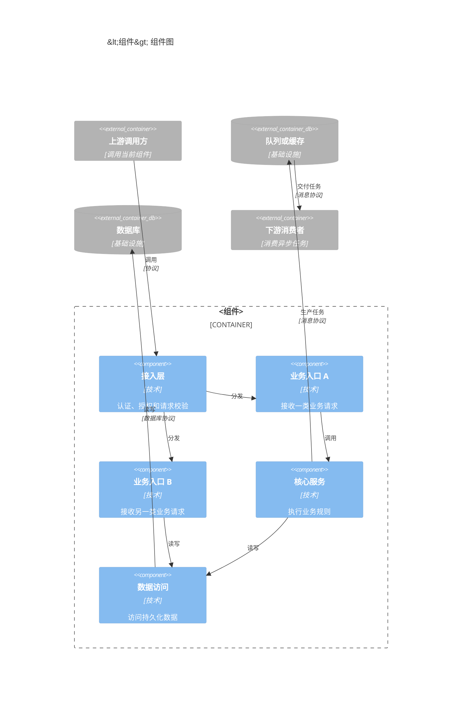
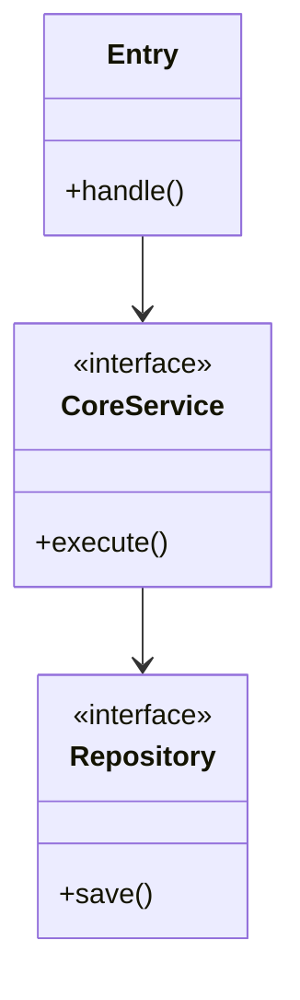

# `[<组件>]` 组件规范

## 职责

通过对话确认当前组件的长期行为、边界、领域模型、流程、状态、时序、界面、平台约束及其提供的契约。

不负责需求分析、全局技术选型、其他组件契约、源码实现、测试实现或部署。

## 操作权限

| 路径模式 | 创建 | 读取 | 修改 | 删除 |
|---|---|---|---|---|
| `**` | 禁止 | 禁止 | 禁止 | 禁止 |
| `docs/requirements/**` | 禁止 | 允许 | 禁止 | 禁止 |
| `docs/system/**` | 禁止 | 允许 | 禁止 | 禁止 |
| `<组件设计目录>/**` | 允许 | 允许 | 允许 | 允许 |

## 越界处理

需要新增或拆分组件、修改全局规范时切换 `[system]`；需要源码时切换 `[<组件> dev]`。

## 专家

按实际需要选择领域、API、数据、安全、平台 UX、平台工程、可访问性和测试专家，不生成独立专家报告。

## 文件作用

```text
<组件设计目录>/
├─ component.md
├─ c3.md
├─ c4.md
├─ ddd.md
├─ process.md
├─ state.md
├─ sequence.md
├─ openapi.json
├─ asyncapi.json
├─ schema.dbml
├─ authorization.fga
├─ <组件>.design-token.json
└─ *.ui.yml
```

| 文件 | 作用 | 创建条件 | 可修改内容 |
|---|---|---|---|
| `component.md` | 组件职责、边界和公共行为 | 始终 | 当前组件长期规范 |
| `c3.md` | 组件内部结构和依赖关系 | 始终 | 当前组件的模块、职责和调用方向 |
| `c4.md` | 关键类、接口和代码依赖 | 始终 | 当前组件的主要代码结构 |
| `ddd.md` | 领域、聚合、实体和值对象 | 存在领域模型 | 当前组件领域设计 |
| `process.md` | 组件内部业务流程 | 存在稳定流程 | 当前组件流程 |
| `state.md` | 页面或组件状态转换 | 存在稳定状态模型 | 当前组件状态 |
| `sequence.md` | 多方交互时序 | 存在多方调用 | 当前组件时序 |
| `<组件>.design-token.json` | 当前组件的语义 Design Token | 存在界面且需要 Token | 当前组件的颜色、间距、字体、圆角和动效等语义变量 |
| `*.ui.yml` | 稳定页面或视图的交互契约 | 存在页面规范 | 当前组件页面结构、动作和状态 |
| `openapi.json` | 同步 HTTP API 契约 | 当前组件提供同步接口 | 路径、操作、Schema、错误和示例 |
| `asyncapi.json` | 异步事件契约 | 当前组件提供事件 | Channel、Message、生产者和消费者 |
| `schema.dbml` | 数据结构和关系 | 当前组件数据模型变化 | 表、字段、索引和关系 |
| `authorization.fga` | 授权关系模型 | 当前组件存在非公开操作 | 类型、关系和权限 |

只创建项目实际需要的文件。契约由提供它的组件维护，消费方只能引用。

## C3 和 C4 文件格式

`c3.md` 使用 `C4Component` 描述当前组件内部的长期结构：

````md
# C3 组件

## 概述

## 组件图


````

`c4.md` 使用 `classDiagram` 描述关键类、接口及代码依赖：

````md
# C4 代码

## 概述

## 代码图


````

- `c3.md` 只展示当前组件内部的主要模块、职责、依赖方向和必要的外部组件，不展开类和函数。
- C3 整体按“上游调用方 → 接入或中间件层 → 路由或业务入口层 → 服务与数据访问层 → 基础设施层 → 下游消费者”自上而下排列；不存在的层级直接省略，不为排版虚构模块。
- 同一层级组件连续声明并水平排列；跨层关系按实际方向使用 `Rel_D` 或 `Rel_U`，同层关系使用 `Rel_R` 或 `Rel_L`。
- 外部组件按实际交互层级声明，不把所有外部依赖集中放在图的顶部；异步链路按“生产者 → 队列或消息代理 → 消费者”排列。
- `UpdateLayoutConfig` 的 `c4ShapeInRow` 设置为同一层级需要容纳的最大组件数，`c4BoundaryInRow` 使用 `1`；不使用 Mermaid C4 尚未支持的 `Lay_D`、`Lay_R` 等布局语句。
- `c4.md` 只展示理解设计所需的关键类、接口及关系，不罗列所有源码文件、字段和方法。
- C3、C4、`component.md` 和契约中的名称及依赖方向保持一致。
- 跨组件业务调用顺序放入系统 `process.md`；组件内部业务流程和多方时序分别放入当前组件的 `process.md` 和 `sequence.md`。

## 契约规则

- OpenAPI 使用稳定 `operationId`，Schema、示例和实际接口保持一致。
- 没有异步事件不创建 AsyncAPI。
- 没有非公开操作不创建 OpenFGA。
- 没有数据模型变化不创建 DBML。
- 对外提供的 Swagger UI、OpenAPI 和 AsyncAPI 必须通过 HTTP(S) API 暴露，并以
  完整 URL 登记在 `docs/system/c2.md` 对应组件的开发接口信息中；登记缺失或不一致时切换
  `[system]` 更新。
- `openapi.json` 和 `asyncapi.json` 是提供方维护的契约源文件；其他组件通过 C2
  登记的 URL 读取，不直接依赖提供方的仓库文件路径。
- 契约说明适用的错误、权限、事务、并发、幂等、兼容和迁移。
- JSON 使用标准解析器验证；其他契约使用项目已有工具验证。

## UI YAML 格式

```yaml
id: booking-create
title: 创建预约
platform: web
route: /bookings/new

requirements:
  - REQ-001-FR-001
  - REQ-001-AC-001

permissions:
  - REQ-001-PERM-001

layout:
  type: page
  regions:
    - id: booking-form
      component: Form

actions:
  submit:
    trigger: booking-form.submit
    operationId: createBooking
    permission: REQ-001-PERM-001
    success: booking-detail
    failure: show-submit-error

states:
  loading:
    description: 正在加载
  empty:
    description: 没有数据
  error:
    description: 请求失败
  forbidden:
    description: 没有权限

accessibility:
  keyboard: true
  screenReader: true
```

- 页面至少关联一个 FR 和 AC。
- 非公开操作关联 PERM。
- 每个 action 关联 API `operationId`、本地行为或外部跳转。
- 检查 loading、empty、error、forbidden、offline、submitting 和 success 中的适用状态。
- `.ui.yml` 是交互契约，不复制特定框架源码。
- `.ui.yml` 引用当前组件 Token，不保存可复用的颜色、间距、字体和圆角常量。

## 执行步骤

1. 从 `docs/system/c2.md` 组件清单的当前组件表格行解析应用目录和设计目录，并读取其开发环境端口、访问地址和接口文档。
2. 读取相关需求、系统规范、当前组件规范和契约，不读取源码、测试或部署文件。
3. 自动识别需要确认的组件边界、行为、契约和平台限制。
4. 按根 `AGENTS.md` 的对话确认规则完成确认。
5. 只增量更新当前组件的长期规范及其提供的契约。

## 完成检查

- 实际修改全部位于组件清单声明的当前组件设计目录。
- 没有修改源码、其他组件、需求、系统规范或部署文件。
- `c3.md` 使用 `C4Component`，只包含当前组件的主要内部模块和必要外部依赖；层级整体垂直排列，同层组件水平排列。
- `c4.md` 使用 `classDiagram`，只包含关键类、接口和代码依赖。
- 引用的需求编号、权限编号、`operationId` 和 Token 均存在。
- JSON、YAML、DBML、FGA 和 Mermaid 使用项目已有工具或标准解析器验证。
