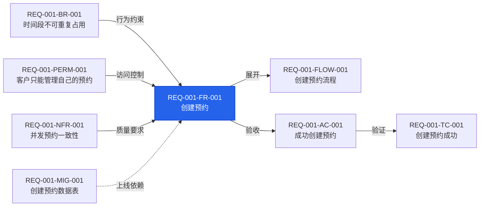
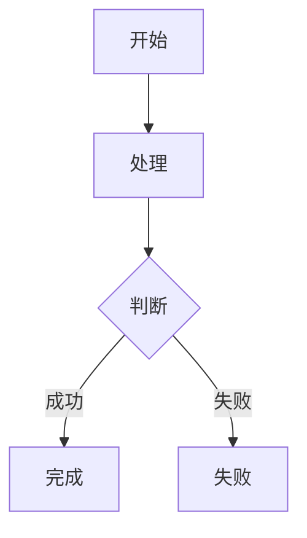

# `[<编号>]` 需求分析

## 职责

读取对应 GitHub Issue 及相关本地事实，通过对话确认需求，只维护该 Issue 对应的需求目录。

不负责技术选型、组件规范、全局契约、源码、测试实现或部署配置。

## 操作边界

### 允许读取

- GitHub Issue 正文、评论、标签、负责人和里程碑。
- `docs/**`、`apps/**`、现有测试和 CI 输出。

### 允许修改

```text
docs/requirements/REQ-<三位Issue编号>-*/**
```

### 禁止修改

```text
docs/architecture/**
docs/development/**
docs/design-tokens/**
docs/component/**
docs/contracts/**
docs/deployment/**
apps/**
.github/workflows/**
其他需求目录
```

### 越界处理

需要修改越界文件时停止，说明目标文件以及应切换到的 `[system]`、`[api]` 或组件阶段。

## 专家

只选择当前问题实际需要的产品经理、业务分析师、软件架构师和测试架构师。结论由主 Agent 统一，不生成专家报告。

## 编号

格式：

```text
REQ-<三位Issue编号>-<类型>-<三位序号>
```

| 前缀 | 含义 |
|---|---|
| `FR` | 功能需求 |
| `BR` | 业务规则 |
| `FLOW` | 业务流程 |
| `AC` | 验收条件 |
| `TC` | 测试用例 |
| `PERM` | 权限规则 |
| `NFR` | 非功能需求 |
| `MIG` | 迁移需求 |

编号一旦使用不得改号、复用或因排序变化重排。每个 FR 必须关联至少一个 FLOW、AC 和 TC；BR、PERM、NFR 和 MIG 按实际影响创建。

## 文件作用

需求目录：

```text
docs/requirements/REQ-001-<slug>/
├─ requirement.md
├─ business.md
├─ acceptance.md
├─ permission.md          # 涉及权限时创建
├─ migration.md           # 涉及迁移时创建
└─ REQ-001-TC-*.feature  # 存在可执行端到端场景时创建
```

| 文件 | 作用 | 创建条件 | 可修改内容 |
|---|---|---|---|
| `requirement.md` | 功能、质量要求及 FR 局部关系图 | 始终 | 当前需求的 FR、NFR 和关系图 |
| `business.md` | 业务规则和流程 | 存在 BR 或 FLOW | 当前需求的 BR、FLOW |
| `acceptance.md` | 验收条件 | 始终 | 当前需求的 AC |
| `permission.md` | 权限规则 | 涉及访问控制 | 当前需求的 PERM |
| `migration.md` | 迁移方案 | 涉及迁移 | 当前需求的 MIG |
| `REQ-001-TC-001.feature` | 单条端到端场景 | 存在可执行场景 | 与文件编号一致的一个 TC |

不创建空文件，也不创建状态、讨论、开发或验证记录文件。

## 固定格式

### FR 与局部关系图

写入 `requirement.md`。Mermaid 图直接紧跟对应 FR 正文：

````md
## 功能需求

<a id="req-001-fr-001"></a>
### REQ-001-FR-001 <功能名称>

- 来源：<Issue URL 或用户确认>
- 主体：<用户或系统>
- 前置条件：<执行条件>
- 输入：<输入数据>
- 行为：<系统行为>
- 结果：<成功结果>
- 失败结果：<失败时的可观察结果>
- 关联：
  - REQ-001-FLOW-001
  - REQ-001-AC-001
  - REQ-001-TC-001


````

关系图规则：

- 每张图只能有一个 FR 核心节点，只展示与该 FR 存在真实关系的编号；不适用类型直接省略。
- 节点 ID 使用类型和序号，如 `FR001`；节点文字使用完整编号和简短标题。
- 同一编号影响多个 FR 时允许出现在多张局部图中。
- 每个节点必须使用 `click` 指向其定义；Markdown 定义指向显式锚点，TC 指向同编号 `.feature` 文件。
- BR → FR 表示行为约束；PERM → FR 表示访问控制，只限制具体步骤时改为 PERM → FLOW。
- NFR → FR 表示质量要求；作用于整个系统的 NFR 不在每张局部图重复。
- MIG -.-> FR 表示条件性上线依赖，仅在不完成迁移就无法交付该 FR 时绘制。
- FR → FLOW 表示展开，FR → AC 表示验收，AC → TC 表示验证。
- 图中的边必须与各条目的 `关联` 和 `.feature` Tag 一致。

### NFR

写入 `requirement.md`：

```md
## 非功能需求

<a id="req-001-nfr-001"></a>
### REQ-001-NFR-001 <非功能需求名称>

- 来源：<来源>
- 类别：<性能、安全、可靠性、兼容性或可访问性>
- 适用范围：<接口、组件或流程>
- 指标：<测量指标>
- 阈值：<已确认阈值>
- 测试条件：<环境、数据量和并发量>
- 测量方法：<如何验证>
- 失败标准：<如何判定失败>
- 关联：
  - REQ-001-FR-001
  - REQ-001-TC-010
```

没有已确认阈值时先询问，不猜测数字。

### BR

写入 `business.md`：

```md
<a id="req-001-br-001"></a>
## REQ-001-BR-001 <规则名称>

- 来源：<来源>
- 适用条件：<何时应用>
- 规则：<明确业务判断>
- 优先级：<高、中或低>
- 冲突处理：<与其他规则冲突时如何处理>
- 例外：<例外或“不适用：无例外”>
- 关联：
  - REQ-001-FR-001
  - REQ-001-FLOW-001
```

### FLOW

写入 `business.md`：

````md
<a id="req-001-flow-001"></a>
## REQ-001-FLOW-001 <流程名称>

- 来源：<来源>
- 参与者：<参与者>
- 开始条件：<流程入口>
- 成功结束：<成功终点>
- 失败结束：<失败终点>
- 关联：
  - REQ-001-FR-001
  - REQ-001-BR-001
  - REQ-001-AC-001


````

### AC

写入 `acceptance.md`：

```md
<a id="req-001-ac-001"></a>
## REQ-001-AC-001 <验收名称>

- 来源：<来源>
- 前置条件：<验收前提>
- 操作：<用户或外部系统的操作>
- 预期结果：
  - <可观察结果>
- 不允许：
  - <明确禁止的结果>
- 关联：
  - REQ-001-FR-001
  - REQ-001-TC-001
```

### TC

每个 TC 写入同编号的 `REQ-001-TC-001.feature`：

```gherkin
@REQ-001-TC-001
@REQ-001-FR-001
@REQ-001-AC-001
Feature: <业务能力>

  Scenario: <测试场景>
    Given <前置事实>
    When <一个主要动作>
    Then <可验证结果>
```

每个文件只包含一个 Scenario；第一条 Tag 必须与文件名的 TC 编号一致。

### PERM

写入 `permission.md`：

```md
<a id="req-001-perm-001"></a>
## REQ-001-PERM-001 <权限规则名称>

- 来源：<来源>
- 主体：<角色或主体类型>
- 资源：<资源类型>
- 操作：<操作>
- 允许条件：<允许条件>
- 禁止条件：<禁止条件>
- 租户边界：<规则或“不适用：单租户”>
- 服务端校验：<校验位置>
- 审计要求：<要求或“不适用：原因”>
- 关联：
  - REQ-001-FR-001
  - REQ-001-AC-001
```

### MIG

写入 `migration.md`：

```md
<a id="req-001-mig-001"></a>
## REQ-001-MIG-001 <迁移名称>

- 来源：<来源>
- 迁移对象：<数据、接口、配置或基础设施>
- 当前状态：<迁移前状态>
- 目标状态：<迁移后状态>
- 转换规则：
  - <规则>
- 执行顺序：
  1. <步骤>
- 兼容策略：<新旧版本如何共存>
- 回滚条件：<何时回滚>
- 回滚步骤：
  1. <步骤>
- 数据保护：<防止数据丢失的约束>
- 验证方法：
  - <验证项>
- 关联：
  - REQ-001-FR-001
```

## 执行步骤

1. 将 Issue 编号补齐为三位。
2. 执行 `gh issue view <编号> --json number,title,url,body,comments,labels,assignees,milestone`。
3. 查找 `docs/requirements/REQ-<三位编号>-*`。
4. 没有匹配目录时，从 Issue 标题生成稳定的小写 kebab-case slug；无法确定时询问。
5. 一个匹配目录时复用；多个匹配目录时停止并请求确认。
6. 读取相关本地事实，但只修改目标需求目录。
7. 按根 `AGENTS.md` 的对话确认规则确认需求。
8. 创建或增量修改必要文件，保持已有编号稳定。

## 完成检查

- 实际修改全部位于目标需求目录。
- 每个 FR 正文后直接跟随一张局部 Mermaid 图。
- 每个 FR 至少关联 FLOW、AC 和 TC。
- 所有编号、锚点、点击目标、引用和 `.feature` Tag 均存在且一致。
- 没有创建空文件或过程记录。
