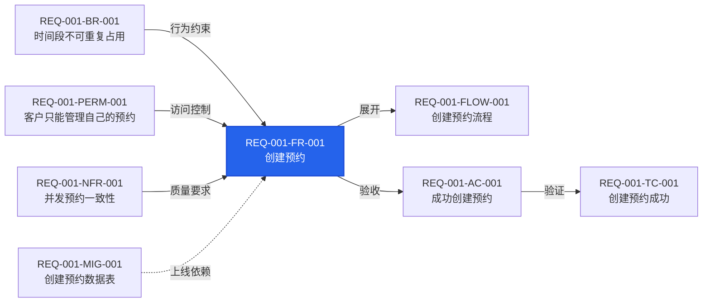
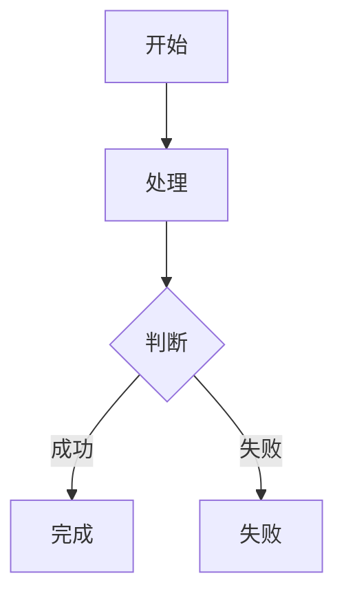

# `[<编号>]` 需求分析

## 职责

读取对应 GitHub Issue 及相关本地事实，通过对话确认需求，只维护该 Issue 对应的需求目录。

不负责技术选型、组件规范、组件契约、源码、测试实现或部署配置。

## 操作权限

| 路径模式 | 创建 | 读取 | 修改 | 删除 |
|---|---|---|---|---|
| `**` | 禁止 | 禁止 | 禁止 | 禁止 |
| `docs/requirements/**` | 禁止 | 允许 | 禁止 | 禁止 |
| `docs/requirements/REQ-<三位Issue编号>-*/**` | 允许 | 允许 | 允许 | 允许 |

允许读取 GitHub Issue 正文、评论、标签、负责人和里程碑。

## 越界处理

需要修改越界文件时停止，说明目标文件以及应切换到的 `[system]` 或对应组件阶段。

## 专家

只选择当前问题实际需要的产品经理、业务分析师、软件架构师和测试架构师。结论由主 Agent 统一，不生成专家报告。

## 编号

格式：

```text
REQ-<三位Issue编号>-<类型>-<三位序号>
```

| 前缀 | 含义 |
|---|---|
| `FR` | 功能需求 |
| `BR` | 业务规则 |
| `FLOW` | 业务流程 |
| `AC` | 验收条件 |
| `TC` | 测试用例 |
| `PERM` | 权限规则 |
| `NFR` | 非功能需求 |
| `MIG` | 迁移需求 |

编号一旦使用不得改号、复用或因排序变化重排。每个 FR 必须关联至少一个 FLOW、AC 和 TC；BR、PERM、NFR 和 MIG 按实际影响创建。

## 文件作用

需求目录：

```text
docs/requirements/REQ-001-<slug>/
├─ requirement.md
├─ items/
│  ├─ REQ-001-BR-001.md
│  ├─ REQ-001-FLOW-001.md
│  ├─ REQ-001-AC-001.md
│  ├─ REQ-001-PERM-001.md
│  └─ REQ-001-MIG-001.md
└─ features/
   └─ REQ-001-AC-001.feature
```

| 文件 | 作用 | 创建条件 | 可修改内容 |
|---|---|---|---|
| `requirement.md` | 角色索引、功能、质量要求及 FR 局部关系图 | 始终 | 当前需求的角色、FR、NFR 和关系图 |
| `items/REQ-001-BR-001.md` | 单条业务规则 | 存在该 BR | 与文件编号一致的一个 BR |
| `items/REQ-001-FLOW-001.md` | 单条业务流程 | 存在该 FLOW | 与文件编号一致的一个 FLOW |
| `items/REQ-001-AC-001.md` | 单条验收条件 | 存在该 AC | 与文件编号一致的一个 AC |
| `items/REQ-001-PERM-001.md` | 单条权限规则 | 存在该 PERM | 与文件编号一致的一个 PERM |
| `items/REQ-001-MIG-001.md` | 单条迁移需求 | 存在该 MIG | 与文件编号一致的一个 MIG |
| `features/REQ-001-AC-001.feature` | 一个 AC 的端到端验收场景 | AC 存在 TC | 该 AC 关联的全部 TC |

`items/` 中每个文件只定义一个与文件名相同的编号，不在文件名追加标题或 slug。
`features/` 中每个文件只定义文件名对应 AC 的 TC，不混入其他 AC 的场景。
不创建空文件、空目录，也不创建状态、讨论、开发或验证记录文件。

## 固定格式

### 角色、FR 与局部关系图

写入 `requirement.md`。Mermaid 图直接紧跟对应 FR 正文：

````md
## 角色索引

| 角色 | 职责 |
|---|---|
| 客户 | 创建和管理自己的预约 |
| 工作人员 | 处理预约和安排 |

## 功能需求

### 客户

<a id="req-001-fr-001"></a>
#### REQ-001-FR-001 <功能名称>

- 来源：<Issue URL 或用户确认>
- 主体：客户
- 协作角色：<角色或“不适用：无协作角色”>
- 影响角色：<角色或“不适用：无其他影响角色”>
- 前置条件：<执行条件>
- 输入：<输入数据>
- 行为：<系统行为>
- 结果：<成功结果>
- 失败结果：<失败时的可观察结果>
- 关联：
  - REQ-001-FLOW-001
  - REQ-001-AC-001
  - REQ-001-TC-001


```mermaid
flowchart LR
    BR001["REQ-001-BR-001<br/>时间段不可重复占用"]
    PERM001["REQ-001-PERM-001<br/>客户只能管理自己的预约"]
    NFR001["REQ-001-NFR-001<br/>并发预约一致性"]
    MIG001["REQ-001-MIG-001<br/>创建预约数据表"]
    FR001["REQ-001-FR-001<br/>创建预约"]
    FLOW001["REQ-001-FLOW-001<br/>创建预约流程"]
    AC001["REQ-001-AC-001<br/>成功创建预约"]
    TC001["REQ-001-TC-001<br/>创建预约成功"]

    BR001 -->|"行为约束"| FR001
    PERM001 -->|"访问控制"| FR001
    NFR001 -->|"质量要求"| FR001
    MIG001 -.->|"上线依赖"| FR001
    FR001 -->|"展开"| FLOW001
    FR001 -->|"验收"| AC001
    AC001 -->|"验证"| TC001

    classDef focus fill:#2563eb,color:#fff,stroke:#1d4ed8,stroke-width:2px
    class FR001 focus

    click BR001 "./items/REQ-001-BR-001.md" "查看 REQ-001-BR-001"
    click PERM001 "./items/REQ-001-PERM-001.md" "查看 REQ-001-PERM-001"
    click NFR001 "./requirement.md#req-001-nfr-001" "查看 REQ-001-NFR-001"
    click MIG001 "./items/REQ-001-MIG-001.md" "查看 REQ-001-MIG-001"
    click FR001 "./requirement.md#req-001-fr-001" "查看 REQ-001-FR-001"
    click FLOW001 "./items/REQ-001-FLOW-001.md" "查看 REQ-001-FLOW-001"
    click AC001 "./items/REQ-001-AC-001.md" "查看 REQ-001-AC-001"
    click TC001 "./features/REQ-001-AC-001.feature" "查看 REQ-001-TC-001"
```
````

关系图规则：

- 角色索引只包含“角色”和“职责”，不添加功能编号或权限列。
- 所有主体、协作角色和影响角色都必须出现在角色索引中，名称保持一致。
- FR 按主要执行者分组；系统自动执行的功能归入“系统”。
- 一个 FR 只归入一个主体分组；多角色参与时使用“协作角色”和“影响角色”，不复制 FR。
- 角色分类不替代 `items/REQ-*-PERM-*.md` 中的权限规则。
- 每张图只能有一个 FR 核心节点，只展示与该 FR 存在真实关系的编号；不适用类型直接省略。
- 节点 ID 使用类型和序号，如 `FR001`；节点文字使用完整编号和简短标题。
- 同一编号影响多个 FR 时允许出现在多张局部图中。
- 每个节点必须使用 `click` 指向其定义；FR 和 NFR 指向 `requirement.md` 中的显式锚点，
  TC 指向其所属 AC 的 `features/REQ-001-AC-001.feature`，其他类型指向 `items/` 中的同编号文件。
- BR → FR 表示行为约束；PERM → FR 表示访问控制，只限制具体步骤时改为 PERM → FLOW。
- NFR → FR 表示质量要求；作用于整个系统的 NFR 不在每张局部图重复。
- MIG -.-> FR 表示条件性上线依赖，仅在不完成迁移就无法交付该 FR 时绘制。
- FR → FLOW 表示展开，FR → AC 表示验收，AC → TC 表示验证。
- 图中的边必须与各条目的 `关联` 和 `.feature` Tag 一致。

### NFR

写入 `requirement.md`：

```md
## 非功能需求

<a id="req-001-nfr-001"></a>
### REQ-001-NFR-001 <非功能需求名称>

- 来源：<来源>
- 类别：<性能、安全、可靠性、兼容性或可访问性>
- 适用范围：<接口、组件或流程>
- 指标：<测量指标>
- 阈值：<已确认阈值>
- 测试条件：<环境、数据量和并发量>
- 测量方法：<如何验证>
- 失败标准：<如何判定失败>
- 关联：
  - REQ-001-FR-001
  - REQ-001-TC-010
```

没有已确认阈值时先询问，不猜测数字。

### BR

每个 BR 写入 `items/` 中的同编号 `.md` 文件：

```md
# REQ-001-BR-001 <规则名称>

- 来源：<来源>
- 适用条件：<何时应用>
- 规则：<明确业务判断>
- 优先级：<高、中或低>
- 冲突处理：<与其他规则冲突时如何处理>
- 例外：<例外或“不适用：无例外”>
- 关联：
  - REQ-001-FR-001
  - REQ-001-FLOW-001
```

### FLOW

每个 FLOW 写入 `items/` 中的同编号 `.md` 文件：

````md
# REQ-001-FLOW-001 <流程名称>

- 来源：<来源>
- 参与者：<参与者>
- 开始条件：<流程入口>
- 成功结束：<成功终点>
- 失败结束：<失败终点>
- 关联：
  - REQ-001-FR-001
  - REQ-001-BR-001
  - REQ-001-AC-001


```mermaid
flowchart TD
    A["开始"] --> B["处理"]
    B --> C{"判断"}
    C -- "成功" --> D["完成"]
    C -- "失败" --> E["失败"]
```
````

### AC

每个 AC 写入 `items/` 中的同编号 `.md` 文件：

```md
# REQ-001-AC-001 <验收名称>

- 来源：<来源>
- 前置条件：<验收前提>
- 操作：<用户或外部系统的操作>
- 预期结果：
  - <可观察结果>
- 不允许：
  - <明确禁止的结果>
- 关联：
  - REQ-001-FR-001
  - REQ-001-TC-001
```

### TC

每个 AC 的全部 TC 写入 `features/` 中以 AC 编号命名的 `.feature` 文件：

```gherkin
@REQ-001-AC-001
@REQ-001-FR-001
Feature: <验收目标>

  @REQ-001-TC-001
  Scenario: <成功、失败、权限或独立边界场景>
    Given <前置事实>
    When <一个主要动作>
    Then <可验证结果>

  @REQ-001-TC-002
  Scenario Outline: <仅输入数据和期望值变化的场景>
    Given <包含参数的前置事实>
    When <同一个主要动作>
    Then <包含参数的可验证结果>

    Examples:
      | <输入> | <期望值> |
      | <值一> | <结果一> |
      | <值二> | <结果二> |
```

- 一个 `.feature` 文件对应一个 AC，Feature 的第一条 Tag 必须与文件名的 AC 编号一致，并使用
  后续 Tag 关联该 AC 实际所属的 FR。
- 一个 TC 对应一个 `Scenario` 或 `Scenario Outline`；场景的第一条 Tag 必须是该 TC 编号。
  同一个 TC 不得跨文件重复定义，每个 TC 只归属一个 AC。
- 成功、失败、权限或具有独立业务意义的边界情况使用不同 TC，不合并到同一个 Scenario。
- 只有 Given、When、Then 结构相同且仅输入数据和期望值变化时才使用 `Scenario Outline`；
  每个 Examples 行只是该 TC 的数据变体，不创建新的 TC 编号。

### PERM

每个 PERM 写入 `items/` 中的同编号 `.md` 文件：

```md
# REQ-001-PERM-001 <权限规则名称>

- 来源：<来源>
- 主体：<角色或主体类型>
- 资源：<资源类型>
- 操作：<操作>
- 允许条件：<允许条件>
- 禁止条件：<禁止条件>
- 租户边界：<规则或“不适用：单租户”>
- 服务端校验：<校验位置>
- 审计要求：<要求或“不适用：原因”>
- 关联：
  - REQ-001-FR-001
  - REQ-001-AC-001
```

### MIG

每个 MIG 写入 `items/` 中的同编号 `.md` 文件：

```md
# REQ-001-MIG-001 <迁移名称>

- 来源：<来源>
- 迁移对象：<数据、接口、配置或基础设施>
- 当前状态：<迁移前状态>
- 目标状态：<迁移后状态>
- 转换规则：
  - <规则>
- 执行顺序：
  1. <步骤>
- 兼容策略：<新旧版本如何共存>
- 回滚条件：<何时回滚>
- 回滚步骤：
  1. <步骤>
- 数据保护：<防止数据丢失的约束>
- 验证方法：
  - <验证项>
- 关联：
  - REQ-001-FR-001
```

## 执行步骤

1. 将 Issue 编号补齐为三位。
2. 执行 `gh issue view <编号> --json number,title,url,body,comments,labels,assignees,milestone`。
3. 查找 `docs/requirements/REQ-<三位编号>-*`。
4. 没有匹配目录时，从 Issue 标题生成稳定的小写 kebab-case slug；无法确定时询问。
5. 一个匹配目录时复用；多个匹配目录时停止并请求确认。
6. 只读取 `docs/requirements/**` 中的相关本地事实，只修改目标需求目录。
7. 按根 `AGENTS.md` 的对话确认规则确认需求。
8. 创建或增量修改必要文件，保持已有编号稳定。

## 完成检查

- 实际修改全部位于目标需求目录。
- `requirement.md` 的角色索引只有“角色”和“职责”，所有 FR 均按主体归类。
- 主体、协作角色和影响角色与角色索引、权限规则中的名称一致。
- 每个 FR 正文后直接跟随一张局部 Mermaid 图。
- 每个 FR 至少关联 FLOW、AC 和 TC。
- `items/` 中每个文件只定义一个编号，文件名、标题和内容编号一致。
- 每个 `features/REQ-001-AC-001.feature` 只包含该 AC 的 TC，每个 TC 只归属一个 AC、只定义一次且场景 Tag 正确。
- 所有编号、锚点、点击目标、引用和 `.feature` Tag 均存在且一致。
- 没有创建空文件或过程记录。
