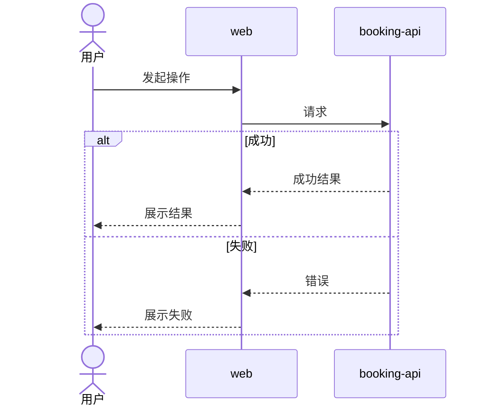
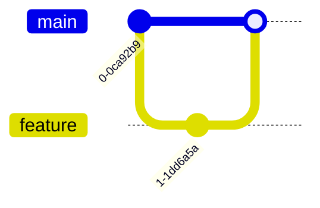

# `[system]` 全局规范

## 职责

确认并维护系统架构、组件清单、技术栈、跨组件业务与工程流程、安全、可观测性和 Git 工作流。

不负责具体需求、设计规范、组件规范、组件契约、源码、测试实现或部署。

## 操作边界

### 允许读取

- `docs/**`
- `apps/**`
- 测试、构建和 CI 输出

### 允许修改

```text
docs/system/architecture.md
docs/system/technology.md
docs/system/process.md
docs/system/security.md
docs/system/observability.md
docs/system/gitflow.md
```

### 禁止修改

```text
docs/requirements/**
docs/component/**
docs/deploy/**
apps/**
.github/workflows/**
```

### 越界处理

整体风格和全局 Token 切换 `[design]`；组件规范及其契约切换 `[<组件>]`；实现切换 `[<组件> dev]`；部署切换 `[deploy]`。

## 专家

按实际需要选择软件架构、技术、安全和可观测性专家，不生成独立专家报告。

## 文件作用

| 文件 | 作用 | 创建条件 | 可修改内容 |
|---|---|---|---|
| `architecture.md` | 系统结构、组件清单、组件边界和依赖方向 | 始终 | 全局架构决策和组件设立 |
| `technology.md` | 语言、框架、数据库和版本策略 | 始终 | 全局技术选型 |
| `process.md` | 分类维护跨组件业务与工程流程 | 存在跨组件流程 | 全局流程、组件协作关系和时序图 |
| `security.md` | 身份、信任边界和安全原则 | 存在安全要求 | 全局安全规则 |
| `observability.md` | 日志、指标、追踪和告警 | 存在运行要求 | 全局可观测性 |
| `gitflow.md` | 分支、提交、评审和发布流程 | 始终 | Git 开发约定 |

只创建项目实际需要的文件。

## 组件清单

`architecture.md` 使用稳定的组件名称和目录登记系统实际需要的前端、后端、任务处理器和其他部署单元：

```md
## 组件清单

| 组件 | 组件应用目录 | 组件设计目录 |
|---|---|---|
| `booking-api` | `apps/booking-api/` | `docs/component/booking-api/` |
| `billing-api` | `apps/billing-api/` | `docs/component/billing-api/` |
| `web` | `apps/web/` | `docs/component/web/` |
```

“组件”对应 `[<组件>]` 指令。组件应用目录必须位于 `apps/`，组件设计目录必须位于
`docs/component/`；路径使用仓库相对路径，不包含 `..`，各组件之间不得重复。
一次 `[system]` 可以设立多个组件，但只登记架构中真实需要的组件。

## 架构文件格式

`architecture.md` 使用以下结构，只保存长期有效的全局结构、组件边界和依赖方向：

```md
# 系统架构

## 概述

## 组件清单

| 组件 | 组件应用目录 | 组件设计目录 |
|---|---|---|

## 架构图

## 组件边界

## 依赖方向
```

- “组件清单”始终存在且只有规定的三列；其他章节没有实际内容时不创建空章节。
- 架构图存在复杂关系时使用 `C4Container` 或 `architecture-beta`，同一通信或依赖关系不再用文本图重复表达。
- 语言、框架、数据库和版本放入 `technology.md`。
- 跨组件业务或工程步骤放入 `process.md`。
- 认证原则和信任边界放入 `security.md`。
- 路由、中间件、源码目录、数据表和接口契约放入对应组件设计目录。
- 环境、端口、构建、发布和部署方式切换 `[deploy]`，写入 `docs/deploy/`。

## 流程分类

`process.md` 按流程性质使用二级标题分类，每个流程使用 `sequenceDiagram`：

````md
# 跨组件流程

## 业务流程

### <跨组件业务流程>

- 目标：<结果>
- 触发条件：<入口>
- 参与组件：<组件>
- 成功结果：<可观察结果>
- 失败结果：<失败处理>



## 构建流程

### 手动构建

### CI/CD
````

其他稳定的跨组件流程可以增加同级分类。这里只记录目标、参与组件、触发条件、顺序、
产物和失败处理；具体命令、脚本、流水线配置和部署步骤仍由源码或 `[deploy]` 维护。
分支使用 `alt`，可选步骤使用 `opt`，循环使用 `loop`，并行步骤使用 `par`。

## Git 工作流格式

`gitflow.md` 使用以下固定模板，不额外创建模板文件：

````md
# Git 工作流

## 分支

| 分支 | 来源 | 合并目标 | 用途 | 保护规则 |
|---|---|---|---|---|

## 生命周期



## 提交约定

| 类型 | 用途 |
|---|---|

## Pull Request 与评审

## 发布

## Hotfix
````

只保留项目实际采用的分支和流程，不为未使用的 Git Flow 变体预留内容。

## 技术规范格式

`technology.md` 使用：

```md
# 技术规范

## 技术选型

| 范围 | 技术 | 版本策略 | 用途 | 约束 |
|---|---|---|---|---|

## 兼容性

| 对象 | 支持范围 | 验证方式 |
|---|---|---|

## 升级策略
```

只记录全局选型和版本策略；组件专用依赖留在组件设计目录。

## 安全规范格式

`security.md` 使用：

```md
# 安全规范

## 安全原则
## 信任边界
## 身份认证
## 授权规则
## 数据保护
## 密钥管理
## 审计要求

## 风险与控制

| 风险 | 适用范围 | 控制措施 | 验证方式 |
|---|---|---|---|
```

登录等跨组件调用时序放入 `process.md`；这里只保存长期安全原则和约束。

## 可观测性格式

`observability.md` 使用：

```md
# 可观测性规范

## 信号规范

| 信号 | 来源组件 | 必要字段 | 保存策略 |
|---|---|---|---|

## SLI 与 SLO

| 服务 | SLI | 目标 | 时间窗口 | 验证方式 |
|---|---|---|---|---|

## 告警

| 条件 | 级别 | 通知对象 | Runbook |
|---|---|---|---|

## 日志关联
## 指标命名
## 链路追踪
```

未确认的版本、阈值、保存时间和 SLO 不猜测数字，先按对话确认规则确认。

## 执行步骤

1. 读取相关需求、现有规范、契约、源码和测试。
2. 自动识别组件划分、架构、技术、安全和跨组件边界中的不确定项。
3. 按根 `AGENTS.md` 的对话确认规则完成确认。
4. 只增量更新长期有效的全局规范。

## 完成检查

- 实际修改只位于明确列出的全局文件。
- 没有修改需求、组件规范、契约、源码或部署。
- 组件清单只包含“组件”“组件应用目录”“组件设计目录”，路径合法且不重复。
- `architecture.md` 没有组件内部实现、技术版本、部署内容或重复关系图。
- `process.md` 的每个流程都有 `sequenceDiagram`，参与者名称与组件清单一致。
- `gitflow.md`、`technology.md`、`security.md` 和 `observability.md` 符合固定格式且没有空章节。
- 架构、技术栈、流程分类和安全规则相互一致。
- JSON 和 Mermaid 已验证。
