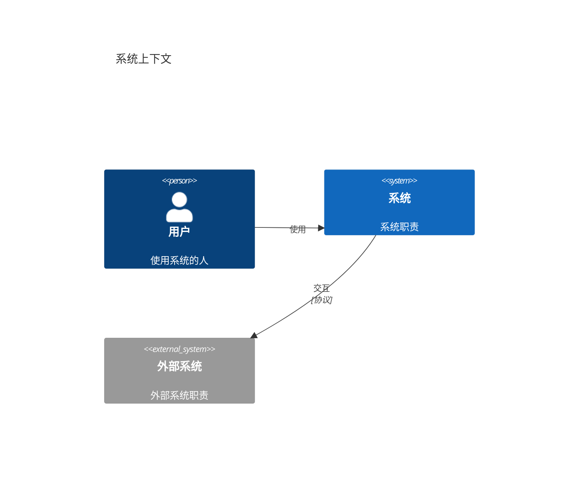
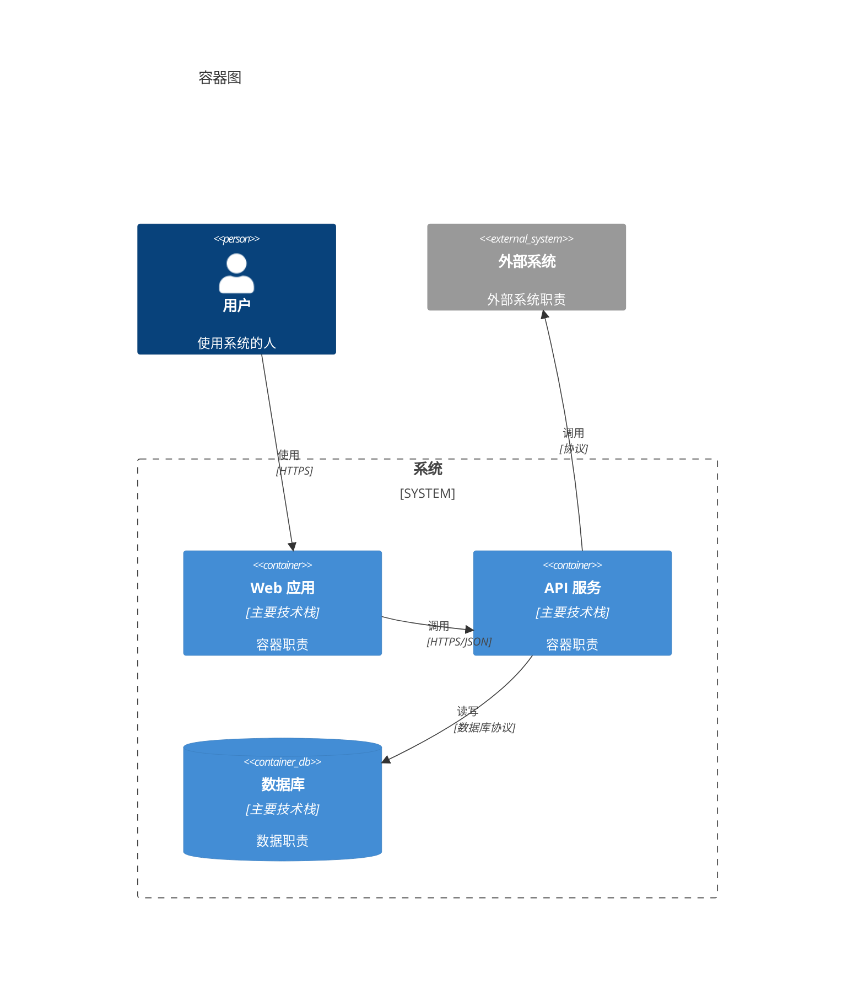
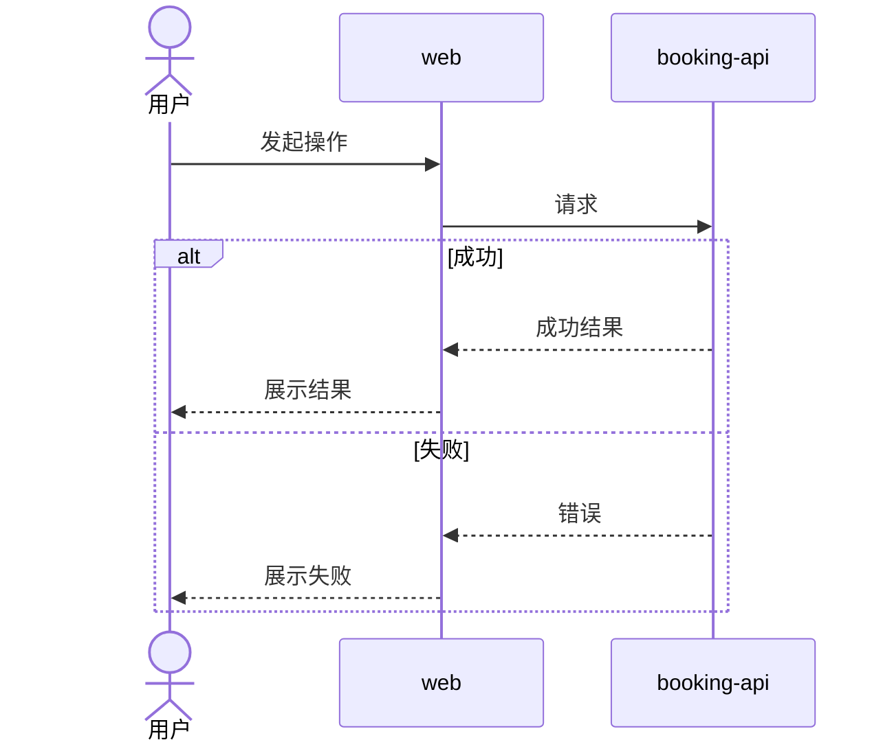
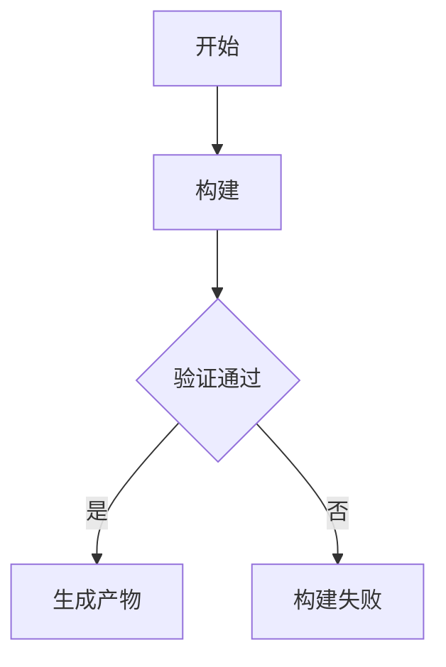
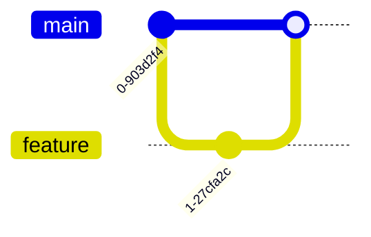

# `[system]` 全局规范

## 职责

确认并维护系统架构、组件清单、技术栈、跨组件业务与工程流程、安全、可观测性和 Git 工作流。

不负责具体需求、设计规范、组件规范、组件契约、源码、测试实现或部署。

## 操作权限

| 路径模式 | 创建 | 读取 | 修改 | 删除 |
|---|---|---|---|---|
| `docs/**` | 禁止 | 允许 | 禁止 | 禁止 |
| `apps/**` | 禁止 | 允许 | 禁止 | 禁止 |
| `docs/system/c4.md` | 允许 | 允许 | 允许 | 允许 |
| `docs/system/technology.md` | 允许 | 允许 | 允许 | 允许 |
| `docs/system/process.md` | 允许 | 允许 | 允许 | 允许 |
| `docs/system/security.md` | 允许 | 允许 | 允许 | 允许 |
| `docs/system/observability.md` | 允许 | 允许 | 允许 | 允许 |
| `docs/system/gitflow.md` | 允许 | 允许 | 允许 | 允许 |
| `.github/workflows/**` | 禁止 | 禁止 | 禁止 | 禁止 |

允许读取测试、构建和 CI 输出。

## 越界处理

组件界面、Token、规范及其契约切换 `[<组件>]`；实现切换 `[<组件> dev]`；部署切换 `[deploy]`。

## 专家

按实际需要选择软件架构、技术、安全和可观测性专家，不生成独立专家报告。

## 文件作用

| 文件 | 作用 | 创建条件 | 可修改内容 |
|---|---|---|---|
| `c4.md` | 系统上下文、容器、组件清单和通信关系 | 始终 | 用户、外部系统、组件设立、主要技术栈和容器通信 |
| `technology.md` | 语言、框架、数据库和版本策略 | 始终 | 全局技术选型 |
| `process.md` | 分类维护跨组件业务与工程流程 | 存在跨组件流程 | 业务时序和构建流程图 |
| `security.md` | 身份、信任边界和安全原则 | 存在安全要求 | 全局安全规则 |
| `observability.md` | 日志、指标、追踪和告警 | 存在运行要求 | 全局可观测性 |
| `gitflow.md` | 分支、提交、评审和发布流程 | 始终 | Git 开发约定 |

只创建项目实际需要的文件。

## 组件清单

`c4.md` 使用稳定的组件名称和目录登记系统实际需要的前端、后端、任务处理器和其他部署单元：

```md
## 组件清单

| 组件 | 组件应用目录 | 组件设计目录 |
|---|---|---|
| `booking-api` | `apps/booking-api/` | `docs/component/booking-api/` |
| `billing-api` | `apps/billing-api/` | `docs/component/billing-api/` |
| `web` | `apps/web/` | `docs/component/web/` |
```

“组件”对应 `[<组件>]` 指令。组件应用目录必须位于 `apps/`，组件设计目录必须位于
`docs/component/`；路径使用仓库相对路径，不包含 `..`，各组件之间不得重复。
一次 `[system]` 可以设立多个组件，但只登记架构中真实需要的组件。

## C4 文件格式

`c4.md` 使用以下结构，只保存长期有效的系统上下文、容器、组件边界和依赖方向：

````md
# C4 架构

## 概述

## 组件清单

| 组件 | 组件应用目录 | 组件设计目录 |
|---|---|---|

## 系统上下文图



## 容器图



## 组件边界

## 依赖方向
````

- “组件清单”始终存在且只有规定的三列。
- “系统上下文图”始终使用 `C4Context`，展示系统边界、用户或角色、交互的外部系统及其关系，不展示内部容器。
- “容器图”始终使用 `C4Container`，展示系统内的容器、各容器的主要技术栈，以及容器之间和容器与外部系统之间的通信方式。
- 组件清单、容器图和正文中的组件名称保持一致；同一关系不再用文本图重复表达。
- 容器图可以标注主要语言、框架和数据库；具体选型约束和版本策略放入 `technology.md`。
- 跨组件业务或工程步骤放入 `process.md`。
- 认证原则和信任边界放入 `security.md`。
- 路由、中间件、源码目录、数据表和接口契约放入对应组件设计目录。
- 环境、端口、构建、发布和部署方式切换 `[deploy]`，写入 `docs/deploy/`。

## 流程分类

`process.md` 按流程性质使用二级标题分类。业务流程按实际用户角色分组并使用
`sequenceDiagram`；构建流程使用 `flowchart`：

````md
# 跨组件流程

## 业务流程

### <用户角色>

#### <跨组件业务流程>

- 目标：<结果>
- 触发条件：<入口>
- 参与者：<用户角色和系统>
- 参与组件：<组件>
- 成功结果：<可观察结果>
- 失败结果：<失败处理>



### 通用

#### <多个角色通用的操作>

### 系统

#### <系统自动执行的流程>

## 构建流程

### <构建流程>

- 目标：<产物或结果>
- 触发条件：<手动操作或自动事件>
- 参与组件：<组件>
- 成功结果：<可观察结果>
- 失败结果：<失败处理>


````

- 用户角色章节根据相关需求和系统上下文中的实际角色创建，不预设固定角色。
- 多角色业务流程只归入主要发起角色，其他角色写入“参与者”，不重复流程。
- 多个角色都能独立发起且行为一致的操作可以归入“通用”；没有通用操作时不创建该章节。
- 没有用户发起的自动流程归入“系统”；没有自动流程时不创建该章节。
- 构建流程按实际情况使用“手动构建”“CI/CD”或其他名称，不创建空章节。
- 其他稳定的跨组件流程可以增加同级分类。这里只记录目标、参与组件、触发条件、顺序、
  产物和失败处理；具体命令、脚本、流水线配置和部署步骤仍由源码或 `[deploy]` 维护。
- `sequenceDiagram` 的分支使用 `alt`，可选步骤使用 `opt`，循环使用 `loop`，并行步骤使用 `par`。
- `flowchart` 使用节点、条件分支和并行路径表达构建顺序，不复制具体脚本命令。

## Git 工作流格式

`gitflow.md` 使用以下固定模板，不额外创建模板文件：

````md
# Git 工作流

## 分支

| 分支 | 来源 | 合并目标 | 用途 | 保护规则 |
|---|---|---|---|---|

## 生命周期



## 提交约定

| 类型 | 用途 |
|---|---|

## Pull Request 与评审

## 发布

## Hotfix
````

只保留项目实际采用的分支和流程，不为未使用的 Git Flow 变体预留内容。

## 技术规范格式

`technology.md` 使用：

```md
# 技术规范

## 技术选型

### 运行组件

| 组件 | 来源 | 技术或框架 | 版本 | 容器镜像 Tag | 说明 |
|---|---|---|---|---|---|
| `<组件>` | 自研 | `<技术或框架>` | `<具体版本>` | `<repo>:<组件>-v<version>` | `<职责>` |
| `<组件>` | 第三方 | `<技术或框架>` | `<具体版本>` | `<image>:<具体版本Tag>` | `<职责>` |

### 开发组件

| 组件 | 范围 | 技术 | 版本策略 | 用途 | 约束 |
|---|---|---|---|---|---|
| `<组件>` | `<使用范围>` | `<开发依赖>` | `<主版本>.x` | `<用途>` | `<约束>` |

## 兼容性

| 对象 | 支持范围 | 验证方式 |
|---|---|---|

## 升级策略
```

- 运行组件名称必须存在于 `c4.md` 的组件清单，每个运行组件一行。
- “来源”只使用“自研”或“第三方”。
- 运行组件的技术或框架填写具体版本，不使用 `latest`、`*`、`x` 或版本范围。
- 自研组件的容器镜像 Tag 记录命名模板 `<repo>:<组件>-v<version>`，组件名称与 `c4.md` 一致。
- 第三方组件使用包含具体版本的镜像 Tag；需要运维管理时优先选择带管理界面的方案，
  满足此前提后优先选择 Alpine 变体。
- 开发环境允许非容器运行；测试、生产及其他环境的运行组件必须全部容器化。
- 开发组件记录关键开发依赖，允许 `<主版本>.x`，不使用 `latest`、`*` 或完全不限定版本。
- 实际依赖声明仍以组件源码中的包管理文件为准，并与本表保持一致。

## 安全规范格式

`security.md` 使用：

```md
# 安全规范

## 安全原则
## 信任边界
## 身份认证
## 授权规则
## 数据保护
## 密钥管理
## 审计要求

## 风险与控制

| 风险 | 适用范围 | 控制措施 | 验证方式 |
|---|---|---|---|
```

登录等跨组件调用时序放入 `process.md`；这里只保存长期安全原则和约束。

## 可观测性格式

`observability.md` 使用：

```md
# 可观测性规范

## 信号规范

| 信号 | 来源组件 | 必要字段 | 保存策略 |
|---|---|---|---|

## SLI 与 SLO

| 服务 | SLI | 目标 | 时间窗口 | 验证方式 |
|---|---|---|---|---|

## 告警

| 条件 | 级别 | 通知对象 | Runbook |
|---|---|---|---|

## 日志关联
## 指标命名
## 链路追踪
```

未确认的版本、阈值、保存时间和 SLO 不猜测数字，先按对话确认规则确认。

## 执行步骤

1. 读取相关需求、现有规范、契约、源码和测试。
2. 自动识别组件划分、架构、技术、安全和跨组件边界中的不确定项。
3. 按根 `AGENTS.md` 的对话确认规则完成确认。
4. 只增量更新长期有效的全局规范。

## 完成检查

- 实际修改只位于明确列出的全局文件。
- 没有修改需求、组件规范、契约、源码或部署。
- 组件清单只包含“组件”“组件应用目录”“组件设计目录”，路径合法且不重复。
- `c4.md` 包含 `C4Context` 系统上下文图和 `C4Container` 容器图，没有组件内部实现、技术版本、部署内容或重复关系图。
- `process.md` 的业务流程按实际用户角色、“通用”或“系统”分组并使用 `sequenceDiagram`；
  构建流程使用 `flowchart`，参与组件名称与组件清单一致。
- `technology.md` 的运行组件使用具体版本，组件名称与 `c4.md` 一致；非开发环境全部容器化，
  第三方镜像使用具体版本 Tag。
- `gitflow.md`、`technology.md`、`security.md` 和 `observability.md` 符合固定格式且没有空章节。
- 架构、技术栈、流程分类和安全规则相互一致。
- JSON 和 Mermaid 已验证。
