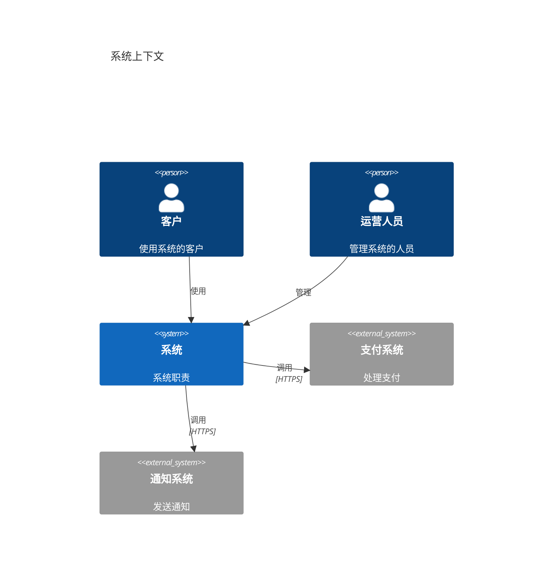
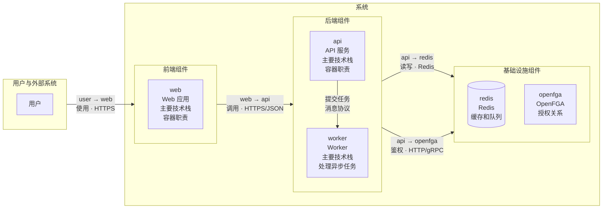
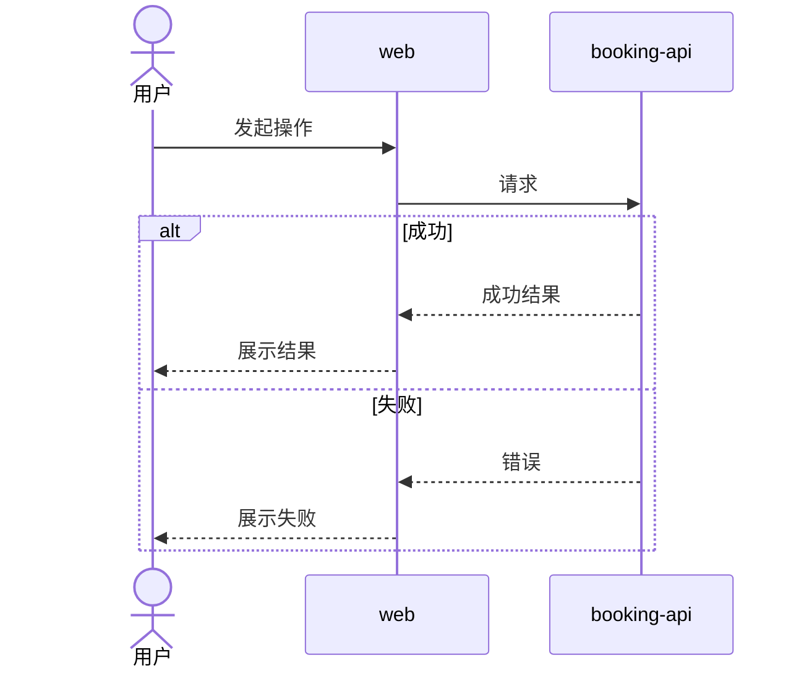
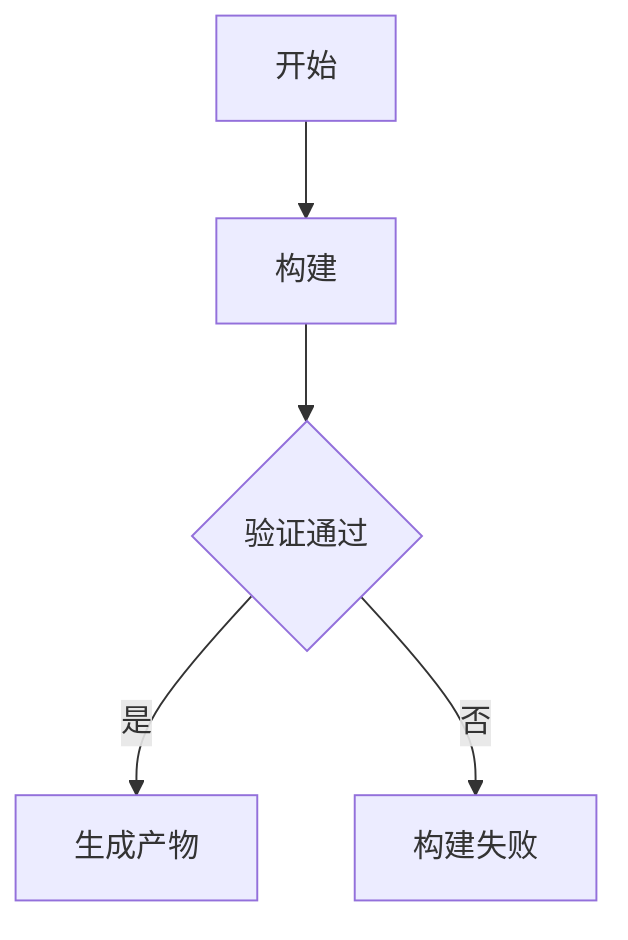
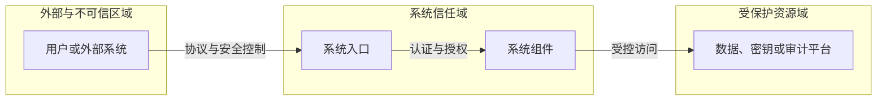
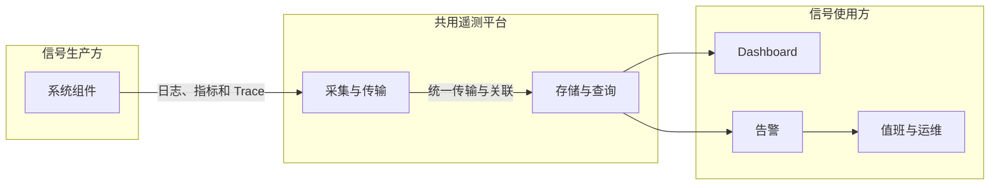

# `[system]` 全局规范

## AI-SYSTEM-001

- **Who**：处理 `[system]` 指令的系统设计 Agent。
- **When**：成功识别 `[system]` 并需要确定本阶段目标与不包含范围时。
- **Where**：`docs/system/**` 与允许读取的需求事实。
- **What**：提供“职责”功能；具体规则、格式和约束如下。
- **Why**：确保跨组件规范统一、自洽并可供下游组件设计使用。

确认并维护系统架构、组件清单、技术栈、跨组件业务与工程流程、安全、可观测性和 Git 工作流。

不负责具体需求、设计规范、组件规范、组件契约、源码、测试实现或部署。

## AI-SYSTEM-002

- **Who**：处理 `[system]` 指令的系统设计 Agent。
- **When**：进入系统阶段后，在任何项目文件操作前。
- **Where**：`docs/system/**` 与允许读取的需求事实。
- **What**：提供“操作权限”功能；具体规则、格式和约束如下。
- **Why**：确保跨组件规范统一、自洽并可供下游组件设计使用。

| 路径模式 | 创建 | 读取 | 修改 | 删除 |
|---|---|---|---|---|
| `**` | 禁止 | 禁止 | 禁止 | 禁止 |
| `docs/requirements/**` | 禁止 | 允许 | 禁止 | 禁止 |
| `docs/system/**` | 允许 | 允许 | 允许 | 允许 |

## AI-SYSTEM-003

- **Who**：处理 `[system]` 指令的系统设计 Agent。
- **When**：任务所需文件、事实、决策或操作超出系统阶段职责或权限时。
- **Where**：`docs/system/**` 与允许读取的需求事实。
- **What**：提供“越界处理”功能；具体规则、格式和约束如下。
- **Why**：确保跨组件规范统一、自洽并可供下游组件设计使用。

组件界面、Token、规范及其契约切换 `[<组件>]`；实现切换 `[<组件> dev]`；部署切换 `[deploy]`。

## AI-SYSTEM-004

- **Who**：处理 `[system]` 指令的系统设计 Agent。
- **When**：任务范围明确后，在形成方案或结束任务前检查适用的专业风险时。
- **Where**：`docs/system/**` 与允许读取的需求事实。
- **What**：提供“评审视角”功能；具体规则、格式和约束如下。
- **Why**：确保跨组件规范统一、自洽并可供下游组件设计使用。

按当前系统设计逐项检查适用视角：

- 架构边界：组件职责、所有权、依赖方向和跨组件流程是否一致。
- 技术可行性：关键技术选择、运行约束、故障模式和迁移路径是否可落地。
- 安全：信任边界、身份、授权、数据保护和审计要求是否覆盖风险。
- 可观测性：关键业务结果、故障定位、指标、日志、Trace 和告警责任是否明确。

不适用的视角可跳过；发现必须落实到对应系统规范或在最终回复中列为阻塞，不生成独立评审报告。

## AI-SYSTEM-005

- **Who**：处理 `[system]` 指令的系统设计 Agent。
- **When**：需要选择、创建、修改、删除或定位系统阶段产物时。
- **Where**：`docs/system/**` 与允许读取的需求事实。
- **What**：提供“文件作用”功能；具体规则、格式和约束如下。
- **Why**：确保跨组件规范统一、自洽并可供下游组件设计使用。

| 文件 | 作用 | 创建条件 | 可修改内容 |
|---|---|---|---|
| `c1.md` | 系统上下文 | 始终 | 用户、外部系统、系统职责和外部关系 |
| `c2.md` | 组件清单和容器图 | 始终 | 组件目录、对外文档、主要技术栈和容器通信 |
| `technology.md` | 语言、框架、数据库和版本策略 | 始终 | 全局技术选型 |
| `process.md` | 分类维护跨组件业务与工程流程 | 存在跨组件流程 | 业务时序和构建流程图 |
| `security.md` | 系统安全基线 | 存在安全要求 | 跨组件安全原则、信任边界和统一控制基线 |
| `observability.md` | 系统可观测性基线 | 存在运行要求 | 跨组件遥测约定、平台和系统级运行目标 |
| `gitflow.md` | 分支、提交、评审和发布流程 | 始终 | Git 开发约定 |

只创建项目实际需要的文件。

## AI-SYSTEM-006

- **Who**：处理 `[system]` 指令的系统设计 Agent。
- **When**：新增、删除、拆分、合并或修改系统组件及其目录、地址或连接信息时。
- **Where**：`docs/system/**` 与允许读取的需求事实。
- **What**：提供“组件清单”功能；具体规则、格式和约束如下。
- **Why**：确保跨组件规范统一、自洽并可供下游组件设计使用。

`c2.md` 按组件类型分组，使用稳定名称登记容器图中的前端、后端、任务处理器和其他部署单元：

- 三级标题按实际职责使用“前端组件”“后端组件”“任务处理器”“基础设施组件”或其他稳定分类，不创建空分类。
- 自研组件分类先使用且只使用“组件”“应用”“设计”三列表格；表格后的开发连接信息按组件使用一级列表项和缩进属性列表。基础设施组件不使用表格，直接使用相同的列表格式。
- 每个组件只出现一次且名称不得重复；容器图中每个需要组件设计的自研容器都必须在组件清单中登记，组件名称保持一致。
- 自研组件名称对应 `[<组件>]` 指令；应用目录必须位于 `apps/`，设计目录必须位于 `docs/component/`，路径不包含 `..` 且不得重复。
- 基础设施不登记应用和设计目录，其版本和镜像仍由 `technology.md` 维护。
- 只为实际向开发环境暴露端口或地址的组件登记连接信息；没有暴露时直接省略，不写“无”。
- HTTP(S) 和支持 URI 的服务使用包含协议、主机、端口和完整路径的 URL；gRPC 等服务可使用约定的 `主机:端口` 地址。
- Swagger UI、OpenAPI、AsyncAPI 和其他对外接口文档按实际情况登记在对应组件的缩进属性列表中，并使用完整 HTTP(S) URL。
- `openapi.json` 和 `asyncapi.json` 源文件仍由当前组件设计目录维护，其他组件只通过登记的 URL 读取或使用。
- 多个基础设施逐个使用一级列表项登记；更新 C2 时，根据 `technology.md` 中的具体版本查阅对应版本官方文档，确认是否提供并启用管理界面，不使用博客、搜索摘要或非官方教程作结论。
- 已启用管理界面的中间件登记完整管理 URL、认证状态、凭据来源、本地初始化方式及对应版本官方文档链接；没有管理界面或未启用时不添加这些字段。
- 管理界面未启用认证时明确写“开发环境无认证”，不虚构账号、密码或初始化步骤。
- 需要认证时，凭据来源只记录环境变量名、密钥引用、初始化脚本或 Runbook 位置；本地初始化方式引用可执行的开发环境准备步骤。
- C2、示例和其他版本控制文件不得记录账号、密码、令牌、证书、密钥值或官方默认凭据值，也不得用看似真实的占位值代替。
- 测试和生产凭据必须由 `[deploy]` 通过独立环境配置或密钥系统注入，不得复用开发凭据来源。
- C2 只记录开发环境端口和地址；测试、生产及其他环境由 `[deploy]` 维护。
一次 `[system]` 可以设立多个组件，但只登记架构中真实需要的组件。

## AI-SYSTEM-007

- **Who**：处理 `[system]` 指令的系统设计 Agent。
- **When**：创建或更新系统上下文、容器图或组件清单时。
- **Where**：`docs/system/**` 与允许读取的需求事实。
- **What**：提供“C1 和 C2 文件格式”功能；具体规则、格式和约束如下。
- **Why**：确保跨组件规范统一、自洽并可供下游组件设计使用。

`c1.md` 只保存长期有效的系统上下文：

> - 根据实际情况修改

````md
# C1 系统上下文

## 系统上下文图


````

`c2.md` 先保存容器图，再保存组件清单和开发接口信息：

> - 根据实际情况修改

````md
# C2 容器

## 容器图



## 组件清单

### 前端组件

| 组件 | 应用 | 设计 |
|---|---|---|
| `web` | `apps/web/` | `docs/component/web/` |

- `web`
  - 暴露端口：`3000`
  - 访问地址：`http://localhost:3000/`

### 后端组件

| 组件 | 应用 | 设计 |
|---|---|---|
| `api` | `apps/api/` | `docs/component/api/` |
| `worker` | `apps/worker/` | `docs/component/worker/` |

- `api`
  - 暴露端口：`3001`
  - 访问地址：`http://localhost:3001/`
  - Swagger UI：`http://localhost:3001/api/v1/doc`
  - OpenAPI 契约：`http://localhost:3001/api/v1/openapi.json`
  - AsyncAPI 契约：`http://localhost:3001/api/v1/asyncapi.json`

### 基础设施组件

- `redis`
  - 暴露端口：`6379`
  - 访问地址：`redis://localhost:6379`
- `openfga`
  - 暴露端口：`8080`、`8081`、`3000`
  - HTTP API 地址：`http://localhost:8080`
  - gRPC 地址：`localhost:8081`
  - Playground：`http://localhost:3000`
  - Playground 认证：需要认证
  - 凭据来源：`deploy/dev.env` 中的 `<USERNAME_ENV>` 和 `<PASSWORD_ENV>`
  - 本地初始化方式：`deploy/runbook.md#<组件或基础设施开发配置>`
  - 官方文档：[Docker Setup Guide](https://openfga.dev/docs/getting-started/setup-openfga/docker)
````

- “组件清单”始终存在；自研组件分类使用规定格式的三列表格，表格下方的连接信息与基础设施组件统一使用一级组件列表及缩进属性列表。
- `c1.md` 的“系统上下文图”始终使用 `C4Context`，展示系统边界、用户或角色、交互的外部系统及其关系，不展示内部容器。
- C1 按“用户或角色 → 目标系统 → 外部系统”自上而下排列；同一层级元素连续声明并水平排列。
- 跨层级关系按实际方向使用 `Rel_D` 或 `Rel_U`，`UpdateLayoutConfig` 的 `c4ShapeInRow`
  设置为同一层级需要容纳的最大元素数，`c4BoundaryInRow` 使用 `1`。
- 不使用 Mermaid C4 尚未支持的 `Lay_D`、`Lay_R` 等布局语句。
- `c2.md` 的“容器图”始终使用 `flowchart LR`，展示系统内的容器、各容器的主要技术栈，以及容器之间和容器与外部系统之间的通信方式。
- C2 先按“用户与外部系统 → 前端组件 → 后端组件 → 基础设施组件”从左到右分层；不存在的层级直接省略。
- 系统使用一个主 `subgraph`，组件类型分别使用嵌套 `subgraph`；主分层使用 `direction LR`，
  每个组件类型内部使用 `direction TB`，使同类组件从上到下排列。
- Mermaid 会在子图内部节点直接连接外部时忽略子图方向，因此跨层关系连接层级 `subgraph`，
  并在标签中明确写出“源组件 → 目标组件”、用途和协议；同层关系直接连接实际组件节点。
- 组件清单和容器图中的组件名称保持一致；同一关系不再用文本图重复表达。
- 容器图可以标注主要语言、框架和数据库；具体选型约束和版本策略放入 `technology.md`。
- 跨组件业务或工程步骤放入 `process.md`。
- 认证原则和信任边界放入 `security.md`。
- 路由、中间件、源码目录、数据表和接口契约放入对应组件设计目录。
- C2 只记录实际暴露的开发环境端口和地址；测试、生产等环境以及构建、发布和部署方式切换 `[deploy]`，写入项目根目录的 `deploy/`。

## AI-SYSTEM-008

- **Who**：处理 `[system]` 指令的系统设计 Agent。
- **When**：存在跨组件业务流程、构建流程或其他需要长期维护的系统流程时。
- **Where**：`docs/system/**` 与允许读取的需求事实。
- **What**：提供“流程分类”功能；具体规则、格式和约束如下。
- **Why**：确保跨组件规范统一、自洽并可供下游组件设计使用。

`process.md` 按流程性质使用二级标题分类。业务流程按实际用户角色分组并使用
`sequenceDiagram`；构建流程使用 `flowchart`：

> - 根据实际情况修改

````md
# 跨组件流程

## 业务流程

### <用户角色>

#### BP-001 <跨组件业务流程>

- 目标：<结果>
- 触发条件：<入口>
- 参与者：<用户角色和系统>
- 参与组件：<组件>
- 关联需求：<FR、BR、AC 或 PERM 编号>
- 成功结果：<可观察结果>
- 失败结果：<失败处理>



### 通用

#### <多个角色通用的操作>

### 系统

#### <系统自动执行的流程>

## 构建流程

### <构建流程>

- 目标：<产物或结果>
- 触发条件：<手动操作或自动事件>
- 参与组件：<组件>
- 成功结果：<可观察结果>
- 失败结果：<失败处理>


````

- 用户角色章节根据相关需求和系统上下文中的实际角色创建，不预设固定角色。
- 跨组件业务流程标题使用“`BP-<三位序号> <流程名称>`”；BP 编号在整个 `process.md`
  中唯一且保持稳定，新流程按最大编号递增，删除后不复用，重命名或调整流程时不改变编号。
- BP 只描述参与者、组件、调用顺序和可观察结果，并通过“关联需求”引用实际存在的 FR、BR、
  AC 或 PERM；阈值、计算、领域不变量和判断条件仍以需求项为准，不在流程中重新定义。
- 多角色业务流程只归入主要发起角色，其他角色写入“参与者”，不重复流程。
- 多个角色都能独立发起且行为一致的操作可以归入“通用”；没有通用操作时不创建该章节。
- 没有用户发起的自动流程归入“系统”；没有自动流程时不创建该章节。
- 构建流程按实际情况使用“手动构建”“CI/CD”或其他名称，不创建空章节。
- 其他稳定的跨组件流程可以增加同级分类。这里只记录目标、参与组件、触发条件、顺序、
  产物和失败处理；具体命令、脚本、流水线配置和部署步骤仍由源码或 `[deploy]` 维护。
- `sequenceDiagram` 的分支使用 `alt`，可选步骤使用 `opt`，循环使用 `loop`，并行步骤使用 `par`。
- `flowchart` 使用节点、条件分支和并行路径表达构建顺序，不复制具体脚本命令。

## AI-SYSTEM-009

- **Who**：处理 `[system]` 指令的系统设计 Agent。
- **When**：项目需要建立或修改分支、提交、评审、发布或 Hotfix 约定时。
- **Where**：`docs/system/**` 与允许读取的需求事实。
- **What**：提供“Git 工作流格式”功能；具体规则、格式和约束如下。
- **Why**：确保跨组件规范统一、自洽并可供下游组件设计使用。

`gitflow.md` 使用以下固定模板，不额外创建模板文件：

> - 根据实际情况修改

````md
# Git 工作流

## 分支

| 分支 | 来源 | 合并目标 | 用途 | 保护规则 |
|---|---|---|---|---|

## 生命周期


## 提交约定

| 类型 | 用途 |
|---|---|

## Pull Request 与评审

## 发布

## Hotfix
````

只保留项目实际采用的分支和流程，不为未使用的 Git Flow 变体预留内容。

## AI-SYSTEM-010

- **Who**：处理 `[system]` 指令的系统设计 Agent。
- **When**：项目需要选择、升级或约束语言、框架、数据库、工具或兼容性时。
- **Where**：`docs/system/**` 与允许读取的需求事实。
- **What**：提供“技术规范格式”功能；具体规则、格式和约束如下。
- **Why**：确保跨组件规范统一、自洽并可供下游组件设计使用。

`technology.md` 使用：

> - 根据实际情况修改

```md
# 技术规范

## 技术选型

### 运行组件

| 组件 | 来源 | 技术或框架 | 版本 | 容器镜像 Tag | 文档链接 | 说明 |
|---|---|---|---|---|---|---|
| `<组件>` | 自研 | `<技术或框架>` | `<具体版本>` | `<repo>:<组件>-v<version>` | `[官方文档](<对应版本URL>)` | `<职责>` |
| `<组件>` | 第三方 | `<技术或框架>` | `<具体版本>` | `<image>:<具体版本Tag>` | `[官方文档](<对应版本URL>)` | `<职责>` |

### 开发组件

| 组件 | 范围 | 技术 | 版本策略 | 文档链接 | 用途 | 约束 |
|---|---|---|---|---|---|---|
| `<组件>` | `<使用范围>` | `<开发依赖>` | `<主版本>.x` | `[官方文档](<对应版本URL>)` | `<用途>` | `<约束>` |

## 兼容性

| 对象 | 支持范围 | 验证方式 |
|---|---|---|

## 升级策略
```

- 运行组件名称必须存在于 `c2.md` 的组件清单，每个运行组件一行。
- “来源”只使用“自研”或“第三方”。
- 运行组件的技术或框架填写具体版本，不使用 `latest`、`*`、`x` 或版本范围。
- 自研组件的容器镜像 Tag 记录命名模板 `<repo>:<组件>-v<version>`，组件名称与 `c2.md` 一致。
- 第三方组件使用包含具体版本的镜像 Tag；需要运维管理时优先选择带管理界面的方案，
  满足此前提后优先选择 Alpine 变体。
- 开发环境允许非容器运行；测试、生产及其他环境的运行组件必须全部容器化。
- 开发组件记录关键开发依赖，允许 `<主版本>.x`，不使用 `latest`、`*` 或完全不限定版本。
- 两张表的“文档链接”都指向对应版本的官方文档，不使用博客、搜索结果或非官方教程。
- 实际依赖声明仍以组件源码中的包管理文件为准，并与本表保持一致。

## AI-SYSTEM-011

- **Who**：处理 `[system]` 指令的系统设计 Agent。
- **When**：存在跨组件信任边界、安全目标、统一控制或系统级风险例外时。
- **Where**：`docs/system/**` 与允许读取的需求事实。
- **What**：提供“安全规范格式”功能；具体规则、格式和约束如下。
- **Why**：确保跨组件规范统一、自洽并可供下游组件设计使用。

`security.md` 使用：

> - 根据实际情况修改

````md
# 安全规范

## 安全目标

| 目标 | 适用范围 | 验证方式 |
|---|---|---|
| <系统级安全目标> | <系统、用户、数据或连接范围> | <可执行验证方式> |

## 信任边界



## 全局控制基线

| 领域 | 全局规则 | 适用范围 | 验证方式 |
|---|---|---|---|
| 身份认证 | <身份来源、凭据和认证原则> | <组件范围> | <验证方式> |
| 权限控制 | <默认拒绝、最小权限和数据范围原则> | <组件范围> | <验证方式> |
| 通信安全 | <传输保护和服务身份原则> | <连接范围> | <验证方式> |
| 数据保护 | <分级、加密、脱敏、保留和删除原则> | <数据范围> | <验证方式> |
| 密钥管理 | <存储、注入、轮换和撤销原则> | <密钥范围> | <验证方式> |
| 安全审计 | <必须审计的操作类别和完整性原则> | <操作范围> | <验证方式> |
| 事件响应 | <分级、上报、处置和取证原则> | <系统范围> | <验证方式> |

## 风险与例外

| 风险 | 适用范围 | 控制措施 | 验证方式 |
|---|---|---|---|

### 例外

| 例外 | 原因 | 补偿控制 | 责任方 | 到期条件 |
|---|---|---|---|---|
````

这里只维护所有组件共同遵守的长期安全原则、信任边界和控制基线，不写具体组件的
Token 或 Session 流程、权限关系、执行点、密钥清单、审计事件名或实现配置。
这些内容分别由组件的 `authentication.md`、`authorization.md`、`secrets.md` 和
`observability.md` 维护；登录等跨组件调用时序放入系统 `process.md`。

- `security.md` 只使用“安全目标”“信任边界”“全局控制基线”和“风险与例外”四个二级章节。
- 信任边界图的节点使用 `c1.md` 和 `c2.md` 中的实际用户、外部系统及组件名称，主关系从左到右，
  同一信任域内部从上到下；跨边界关系标注实际协议和安全控制。
- 全局控制基线按表格集中维护身份、授权、通信、数据、密钥、审计和事件响应，不为每个控制领域
  创建独立章节。
- 没有实际安全例外时删除“例外”三级章节和表格；风险、控制和验证方式必须具体且可执行。

## AI-SYSTEM-012

- **Who**：处理 `[system]` 指令的系统设计 Agent。
- **When**：存在跨组件遥测约定、共用平台、系统运行目标或数据治理要求时。
- **Where**：`docs/system/**` 与允许读取的需求事实。
- **What**：提供“可观测性格式”功能；具体规则、格式和约束如下。
- **Why**：确保跨组件规范统一、自洽并可供下游组件设计使用。

`observability.md` 使用：

> - 根据实际情况修改

````md
# 可观测性规范

## 全局信号基线

| 信号 | 全局要求 | 必要标识 | 组件负责 |
|---|---|---|---|
| 日志 | <结构化格式、级别语义和稳定事件命名> | <时间、组件、环境、版本、级别、事件名、结果和关联 ID> | <实际事件、触发条件和业务字段> |
| 指标 | <命名、单位、类型和标签约束> | <组件、环境和版本> | <实际指标、标签和值域> |
| Trace | <上下文传播、采样和错误状态规则> | <Trace ID、Span ID、父 Span 和组件> | <实际 Span、属性和边界> |
| 健康信号 | <存活、就绪和依赖状态语义> | <组件、实例和状态> | <实际检查项和失败条件> |

## 遥测链路



## 系统运行目标

### SLI 与 SLO

| 对外服务或跨组件能力 | SLI | 目标 | 时间窗口 | 验证方式 |
|---|---|---|---|---|

### 告警分级与路由

| 级别 | 全局判定原则 | 通知对象 | Runbook |
|---|---|---|---|

## 数据治理

| 信号 | 保留要求 | 采样要求 | 敏感信息与脱敏 | 访问控制 |
|---|---|---|---|---|
| 日志 | <已确认要求> | <已确认要求> | <禁止内容和脱敏规则> | <访问范围> |
| 指标 | <已确认要求> | <已确认要求> | <高基数和敏感标签限制> | <访问范围> |
| Trace | <已确认要求> | <已确认要求> | <敏感属性限制> | <访问范围> |
````

这里只维护跨组件遥测约定、共用平台、关联传播、保留脱敏和系统级运行目标，不枚举
某个组件实际产生的日志事件、指标名、Span、健康检查或告警条件。组件信号由该组件的
`observability.md` 维护，Collector、Exporter、Dashboard 和告警规则由 `[deploy]`
维护。未确认的平台版本、阈值、保存时间和 SLO 不猜测数字，先按对话确认规则确认。

- `observability.md` 只使用“全局信号基线”“遥测链路”“系统运行目标”和“数据治理”
  四个二级章节。
- 全局信号基线规定所有组件共同遵守的格式、标识和关联要求；日志必须统一结构、级别语义及
  Trace ID、Span ID、Request ID 或 Correlation ID 的适用规则，但不列出组件事件名和业务字段。
- 遥测链路图使用 `c2.md` 中的实际组件和 `technology.md` 中已确认的共用平台，主链路从左到右，
  同一层内部从上到下；只表达信号流向和关联，不写 Collector、Exporter 或存储的部署配置。
- 系统运行目标只记录对外服务或跨组件能力的 SLI、SLO 和统一告警路由，不保存单组件健康阈值
  或告警条件。
- 数据治理统一规定保留、采样、脱敏和访问控制；没有确认的数值必须先提问，不使用猜测值。

## AI-SYSTEM-013

- **Who**：处理 `[system]` 指令的系统设计 Agent。
- **When**：前置条件满足并准备执行系统阶段任务时。
- **Where**：`docs/system/**` 与允许读取的需求事实。
- **What**：提供“执行步骤”功能；具体规则、格式和约束如下。
- **Why**：确保跨组件规范统一、自洽并可供下游组件设计使用。

1. 读取相关需求和现有系统规范，不读取组件设计、源码、测试或部署文件。
2. 更新 C2 时，逐个检查 `technology.md` 中的中间件，并查阅对应版本官方文档确认管理界面、端口和启用条件。
3. 自动识别组件划分、架构、技术、安全和跨组件边界中的不确定项。
4. 按根 `AGENTS.md` 的对话确认规则完成确认。
5. 只增量更新长期有效的全局规范。

## AI-SYSTEM-014

- **Who**：处理 `[system]` 指令的系统设计 Agent。
- **When**：系统阶段任务准备结束并回复用户前。
- **Where**：`docs/system/**` 与允许读取的需求事实。
- **What**：提供“完成检查”功能；具体规则、格式和约束如下。
- **Why**：确保跨组件规范统一、自洽并可供下游组件设计使用。

- 实际修改只位于明确列出的全局文件。
- 没有修改需求、组件规范、契约、源码或部署。
- 组件清单按类型使用三级章节；自研组件分类只有“组件”“应用”“设计”三列表格，表格后的连接信息与基础设施组件统一使用一级组件列表及缩进属性列表；组件和路径合法且不重复。
- 只登记实际暴露的开发环境端口和完整访问地址；没有暴露时省略，测试和生产地址不写入 C2。
- 对外文档只包含实际暴露的 Swagger UI、OpenAPI、AsyncAPI 或其他文档，每项位于对应组件的缩进属性列表并使用完整且有效的 HTTP(S) URL。
- 已逐个依据对应版本官方文档检查中间件管理界面；已启用的管理界面包含完整 URL、认证状态、凭据来源、本地初始化方式及官方文档链接。
- C2 没有账号、密码、令牌、证书、密钥值或官方默认凭据值；凭据来源只包含环境变量名、密钥引用、初始化脚本或 Runbook 位置。
- 测试和生产使用独立凭据来源，没有复用开发凭据来源。
- `c1.md` 包含 `C4Context` 系统上下文图，不包含内部容器；同级元素水平排列，整体按层级垂直排列。
- `c2.md` 包含组件清单和 `flowchart LR` 容器图；用户与外部系统、前端、后端和基础设施
  从左到右分层，同类组件从上到下排列，没有组件内部实现、技术版本、部署内容或重复关系图。
- `process.md` 的业务流程按实际用户角色、“通用”或“系统”分组并使用 `sequenceDiagram`；
  每个业务流程具有唯一且稳定的 BP 编号并引用实际存在的需求项；构建流程使用 `flowchart`，
  参与组件名称与组件清单一致。
- `technology.md` 的运行组件使用具体版本，组件名称与 `c2.md` 一致；非开发环境全部容器化，
  第三方镜像使用具体版本 Tag；运行组件和开发组件均链接对应版本的官方文档。
- `gitflow.md`、`technology.md`、`security.md` 和 `observability.md` 符合固定格式且没有空章节。
- `security.md` 和 `observability.md` 只包含跨组件基线，没有复制具体组件设计或部署配置。
- 架构、技术栈、流程分类和安全规则相互一致。
- JSON 和 Mermaid 已验证。
