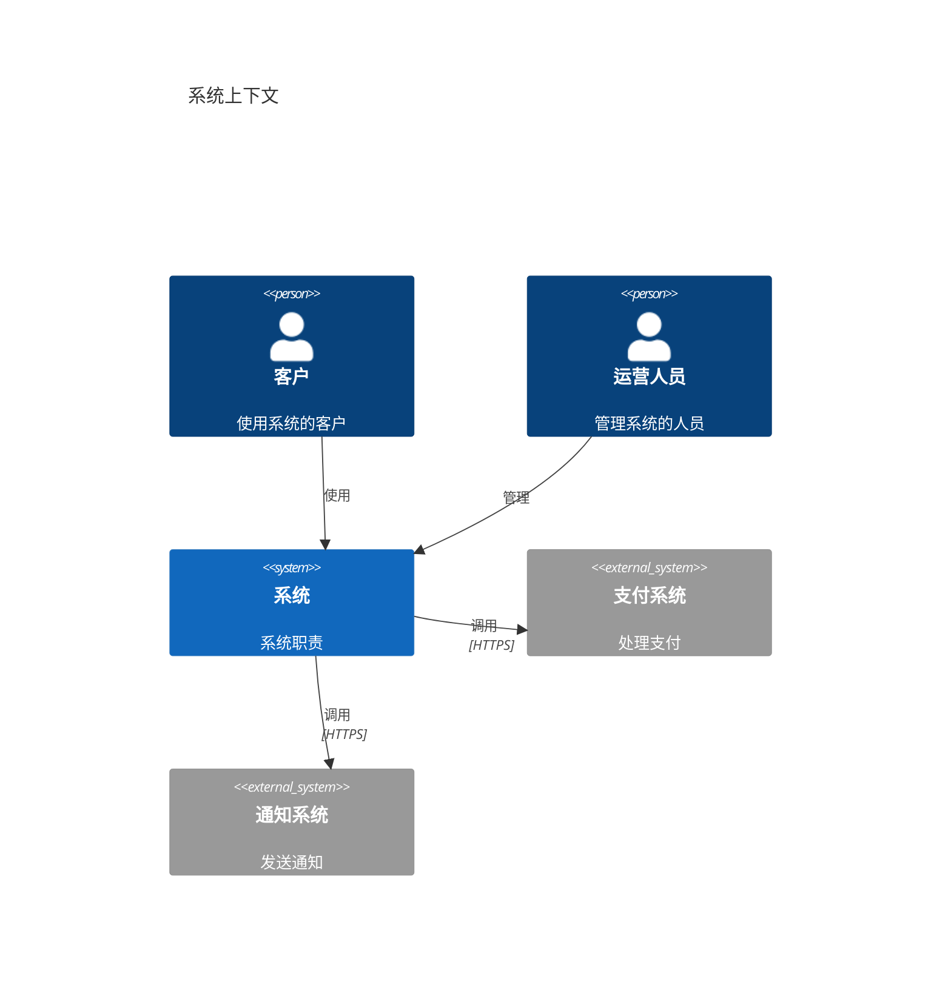
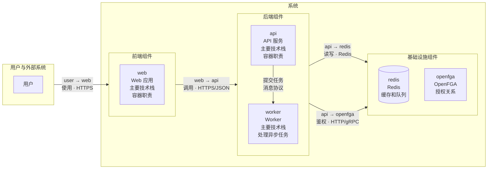
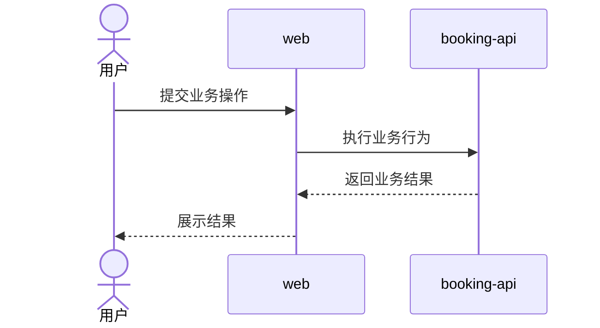
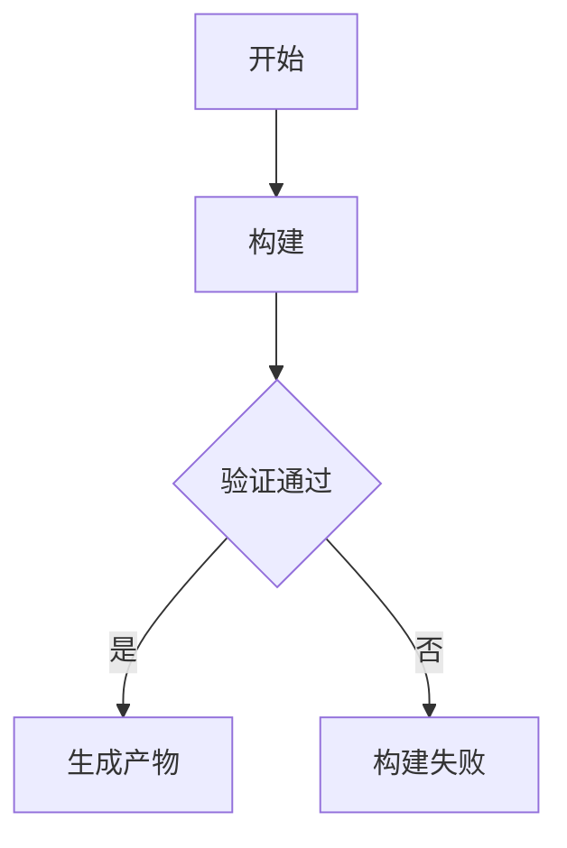
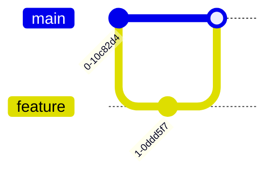
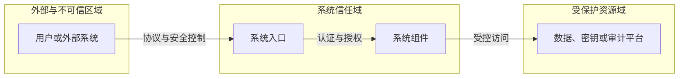
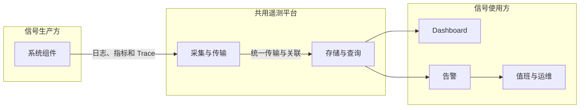

# `<system>` 全局规范

## AI-SYSTEM-001

- **Who**：处理 `<system>` 指令的系统设计 Agent。
- **When**：成功识别 `<system>` 并需要确定本阶段目标与不包含范围时。
- **Where**：`docs/system/**` 与允许读取的需求事实。
- **What**：提供“职责”功能；具体规则、格式和约束如下。
- **Why**：确保跨组件规范统一、自洽并可供下游组件设计使用。

确认并维护系统架构、组件清单、技术栈、跨组件业务与工程流程、安全、可观测性和 Git 工作流。

不负责具体需求、设计规范、组件规范、组件契约、源码、测试实现或部署。

## AI-SYSTEM-002

- **Who**：处理 `<system>` 指令的系统设计 Agent。
- **When**：进入系统阶段后，在任何项目文件操作前。
- **Where**：`docs/system/**` 与允许读取的需求事实。
- **What**：提供“操作权限”功能；具体规则、格式和约束如下。
- **Why**：确保跨组件规范统一、自洽并可供下游组件设计使用。

| 路径模式 | 创建 | 读取 | 修改 | 删除 |
|---|---|---|---|---|
| `**` | 禁止 | 禁止 | 禁止 | 禁止 |
| `docs/requirements/**` | 禁止 | 允许 | 禁止 | 禁止 |
| `docs/system/**` | 允许 | 允许 | 允许 | 允许 |

## AI-SYSTEM-003

- **Who**：处理 `<system>` 指令的系统设计 Agent。
- **When**：任务所需文件、事实、决策或操作超出系统阶段职责或权限时。
- **Where**：`docs/system/**` 与允许读取的需求事实。
- **What**：提供“越界处理”功能；具体规则、格式和约束如下。
- **Why**：确保跨组件规范统一、自洽并可供下游组件设计使用。

组件界面、Token、规范及其契约切换 `<组件>`；实现切换 `<组件 dev>`；部署切换 `<deploy>`。

## AI-SYSTEM-004

- **Who**：处理 `<system>` 指令的系统设计 Agent。
- **When**：任务范围明确后，在形成方案或结束任务前检查适用的专业风险时。
- **Where**：`docs/system/**` 与允许读取的需求事实。
- **What**：提供“评审视角”功能；具体规则、格式和约束如下。
- **Why**：确保跨组件规范统一、自洽并可供下游组件设计使用。

按当前系统设计逐项检查适用视角：

- 架构边界：组件职责、所有权、依赖方向和跨组件流程是否一致。
- 技术可行性：关键技术选择、运行约束、故障模式和迁移路径是否可落地。
- 安全：信任边界、身份、授权、数据保护和审计要求是否覆盖风险。
- 可观测性：关键业务结果、故障定位、指标、日志、Trace 和告警责任是否明确。

不适用的视角可跳过；发现必须落实到对应系统规范或在最终回复中列为阻塞，不生成独立评审报告。

## AI-SYSTEM-005

- **Who**：处理 `<system>` 指令的系统设计 Agent。
- **When**：需要选择、创建、修改、删除或定位系统阶段产物时。
- **Where**：`docs/system/**` 与允许读取的需求事实。
- **What**：提供“文件作用”功能；具体规则、格式和约束如下。
- **Why**：确保跨组件规范统一、自洽并可供下游组件设计使用。

| 文件 | 作用 | 创建条件 | 可修改内容 |
|---|---|---|---|
| `c1.md` | 系统上下文 | 始终 | 用户、外部系统、系统职责和外部关系 |
| `c2.md` | 组件清单和容器图 | 始终 | 组件目录、对外文档、主要技术栈和容器通信 |
| `technology.md` | 语言、框架、数据库和版本策略 | 始终 | 全局技术选型 |
| `process.md` | 分类维护跨组件业务与工程流程 | 存在跨组件流程 | 业务时序和构建流程图 |
| `security.md` | 系统安全基线与开发凭证 | 存在安全要求或开发凭证 | 跨组件安全原则、信任边界、统一控制基线和开发凭证 |
| `observability.md` | 系统可观测性基线 | 存在运行要求 | 跨组件遥测约定、平台和系统级运行目标 |
| `gitflow.md` | 分支、提交、评审和发布流程 | 始终 | Git 开发约定 |

只创建项目实际需要的文件。

## AI-SYSTEM-006

- **Who**：处理 `<system>` 指令的系统设计 Agent。
- **When**：新增、删除、拆分、合并或修改系统组件及其目录、地址或连接信息时。
- **Where**：`docs/system/**` 与允许读取的需求事实。
- **What**：提供“组件清单”功能；具体规则、格式和约束如下。
- **Why**：确保跨组件规范统一、自洽并可供下游组件设计使用。

`c2.md` 按组件类型分组，使用稳定名称登记容器图中的前端、后端、任务处理器和其他部署单元：

- 三级标题按实际职责使用“前端组件”“后端组件”“任务处理器”“基础设施组件”或其他稳定分类，不创建空分类。
- 前端、后端、任务处理器和基础设施分类统一且只使用“组件名称”“暴露端口”“访问路径”“协议”“说明”五列表格，不在表格后追加连接信息列表。
- 每个“暴露端口 + 访问路径 + 协议”组合单独占一行；同一组件存在多个组合时使用连续多行，
  即使端口相同但访问路径不同也必须拆行。每行重复组件名称和完整说明，不留空、不合并单元格，五列表格内不使用 `<br>`。
- 自研组件名称对应 `<组件>` 指令；“说明”固定使用“职责：<职责>；应用：`apps/<路径>/`；设计：`docs/component/<路径>/`”，
  应用和设计路径不包含 `..` 且不得重复。基础设施的“说明”只写“用途：<实际用途>”；存在凭证时追加
  “账密：`<变量名>` `<变量名>`”，不登记应用目录、设计目录、凭证值或官方默认凭据。
- 只登记开发环境实际暴露的端口、访问路径和协议；确认不暴露时三个字段统一写“`不暴露`”，状态未知时先询问，不填猜测值。
- “访问路径”只记录协议端点中的路径部分；HTTP(S)、gRPC、Redis、PostgreSQL、OTLP 或其他协议名称单独写入“协议”。
- Swagger UI、OpenAPI、AsyncAPI 和其他对外接口文档按实际情况作为同一组件的附加端口、路径和协议组合逐行登记。
- `openapi.json` 和 `asyncapi.json` 源文件仍由当前组件设计目录维护，其他组件只通过登记的端口、路径和协议组合读取或使用。
- 更新基础设施表格前，必须根据 `technology.md` 的具体版本查阅对应版本官方文档，逐项确认服务端口、访问路径、协议、管理界面及启用条件；
  不使用记忆、镜像默认值、博客、搜索摘要或非官方教程作结论，官方文档无法确认时停止并向用户说明缺少依据。
- 官方文档声明的默认或监听端口不等于项目实际暴露端口；表格只填写用户或项目系统事实已确认的开发环境映射。
- 已确认启用的管理界面作为同一基础设施的附加端口、路径和协议组合单独一行登记；“说明”仍只写用途和可选账密变量名，
  凭证详情写入 `security.md`，本地初始化方式写入 Runbook。
  未启用或官方文档未提供管理界面时不虚构对应端点。
- 管理界面未启用认证时不虚构账号、密码或初始化步骤；需要认证时，C2 的“账密”只引用
  `security.md`“凭证”表中已登记的变量名。
- C2 和除 `security.md`“凭证”表之外的版本控制文件不得记录凭证值；任何文件都不得记录测试、生产凭证、
  官方默认凭据、令牌、证书或私钥，也不得用看似真实的占位值代替。
- 测试和生产凭据必须由 `<deploy>` 通过独立环境配置或密钥系统注入，不得复用开发凭据来源。
- C2 只记录开发环境端口、路径和协议；测试、生产及其他环境由 `<deploy>` 维护。
一次 `<system>` 可以设立多个组件，但只登记架构中真实需要的组件。

## AI-SYSTEM-007

- **Who**：处理 `<system>` 指令的系统设计 Agent。
- **When**：创建或更新系统上下文、容器图或组件清单时。
- **Where**：`docs/system/**` 与允许读取的需求事实。
- **What**：提供“C1 和 C2 文件格式”功能；具体规则、格式和约束如下。
- **Why**：确保跨组件规范统一、自洽并可供下游组件设计使用。

`c1.md` 只保存长期有效的系统上下文：

> - 根据实际情况修改

````md
# C1 系统上下文

## 系统上下文图


````

`c2.md` 先保存容器图，再保存组件清单和开发接口信息：

> - 根据实际情况修改

````md
# C2 容器

## 容器图



## 组件清单

### 前端组件

| 组件名称 | 暴露端口 | 访问路径 | 协议 | 说明 |
|---|---|---|---|---|
| `web` | `3000` | `/` | HTTP | 职责：Web 前端；应用：`apps/web/`；设计：`docs/component/web/` |

### 后端组件

| 组件名称 | 暴露端口 | 访问路径 | 协议 | 说明 |
|---|---|---|---|---|
| `api` | `3001` | `/api/v1` | HTTPS/JSON | 职责：业务 API、Swagger UI 和 OpenAPI 契约；应用：`apps/api/`；设计：`docs/component/api/` |
| `api` | `3001` | `/api/v1/doc` | HTTPS | 职责：业务 API、Swagger UI 和 OpenAPI 契约；应用：`apps/api/`；设计：`docs/component/api/` |
| `api` | `3001` | `/api/v1/openapi.json` | HTTPS | 职责：业务 API、Swagger UI 和 OpenAPI 契约；应用：`apps/api/`；设计：`docs/component/api/` |
| `worker` | `不暴露` | `不暴露` | `不暴露` | 职责：处理异步任务；应用：`apps/worker/`；设计：`docs/component/worker/` |

### 基础设施组件

| 组件名称 | 暴露端口 | 访问路径 | 协议 | 说明 |
|---|---|---|---|---|
| `<基础设施名称>` | `<项目确认的暴露端口>` | `<官方文档确认的访问路径>` | `<官方文档确认的协议>` | 用途：<实际用途>；账密：`<用户名变量>` `<密码变量>` |
````

- “组件清单”始终存在；所有组件分类统一使用规定的五列表格，组件目录、职责、基础设施用途和凭证变量按固定格式写入“说明”。
- `c1.md` 的“系统上下文图”始终使用 `C4Context`，展示系统边界、用户或角色、交互的外部系统及其关系，不展示内部容器。
- C1 按“用户或角色 → 目标系统 → 外部系统”自上而下排列；同一层级元素连续声明并水平排列。
- 跨层级关系按实际方向使用 `Rel_D` 或 `Rel_U`，`UpdateLayoutConfig` 的 `c4ShapeInRow`
  设置为同一层级需要容纳的最大元素数，`c4BoundaryInRow` 使用 `1`。
- 不使用 Mermaid C4 尚未支持的 `Lay_D`、`Lay_R` 等布局语句。
- `c2.md` 的“容器图”始终使用 `flowchart LR`，展示系统内的容器、各容器的主要技术栈，以及容器之间和容器与外部系统之间的通信方式。
- C2 先按“用户与外部系统 → 前端组件 → 后端组件 → 基础设施组件”从左到右分层；不存在的层级直接省略。
- 系统使用一个主 `subgraph`，组件类型分别使用嵌套 `subgraph`；主分层使用 `direction LR`，
  每个组件类型内部使用 `direction TB`，使同类组件从上到下排列。
- Mermaid 会在子图内部节点直接连接外部时忽略子图方向，因此跨层关系连接层级 `subgraph`，
  并在标签中明确写出“源组件 → 目标组件”、用途和协议；同层关系直接连接实际组件节点。
- 组件清单和容器图中的组件名称保持一致；同一关系不再用文本图重复表达。
- 容器图可以标注主要语言、框架和数据库；具体选型约束和版本策略放入 `technology.md`。
- 跨组件业务或工程步骤放入 `process.md`。
- 认证原则和信任边界放入 `security.md`。
- 路由、中间件、源码目录、数据表和接口契约放入对应组件设计目录。
- C2 只记录实际暴露的开发环境端口、路径和协议；测试、生产等环境以及构建、发布和部署方式切换 `<deploy>`，写入项目根目录的 `deploy/`。

## AI-SYSTEM-008

- **Who**：处理 `<system>` 指令的系统设计 Agent。
- **When**：存在跨组件业务流程、构建流程或其他需要长期维护的系统流程时。
- **Where**：`docs/system/**` 与允许读取的需求事实。
- **What**：提供“流程分类”功能；具体规则、格式和约束如下。
- **Why**：确保跨组件规范统一、自洽并可供下游组件设计使用。

`process.md` 按流程性质使用二级标题分类。业务流程按实际用户角色分组并使用
`sequenceDiagram`；构建流程使用 `flowchart`：

> - 根据实际情况修改

````md
# 跨组件流程

## 业务流程

### <用户角色>

#### BP-001 <跨组件业务流程>

- 关联需求：<FR、BR、AC 或 PERM 编号>



### 通用

#### <多个角色通用的操作>

### 系统

#### <系统自动执行的流程>

## 构建流程

### <构建流程>

- 目标：<产物或结果>
- 触发条件：<手动操作或自动事件>
- 参与组件：<组件>
- 成功结果：<可观察结果>
- 失败结果：<失败处理>


````

- 用户角色章节根据相关需求和系统上下文中的实际角色创建，不预设固定角色。
- 跨组件业务流程标题使用“`BP-<三位序号> <流程名称>`”；BP 编号在整个 `process.md`
  中唯一且保持稳定，新流程按最大编号递增，删除后不复用，重命名或调整流程时不改变编号。
- BP 标题表达业务目标，正文只保留“关联需求”和时序图；参与者、参与组件、调用顺序和可观察结果直接由图表达，
  不再重复填写目标、触发条件、参与者、参与组件、成功结果或失败结果。
- 时序图只展示用户、外部系统和 C2 中真实存在的组件，每条消息只表达一次跨组件业务交接；
  同一组件内部的连续步骤合并，不展示方法、类、内部模块、协议细节或普通技术异常。
- 默认只画主成功路径。只有失败会改变跨组件协作、触发补偿或产生独立业务结果时才使用 `alt`；
  普通校验失败、接口错误和组件内部异常交给需求、接口或组件设计。
- BP 通过“关联需求”引用实际存在的 FR、BR、AC 或 PERM；阈值、计算、领域不变量和判断条件
  仍以需求项为准，不在流程中重新定义。图过长时按独立业务目标拆分为多个 BP。
- 多角色业务流程只归入主要发起角色，其他角色直接作为时序图中的 `actor`，不重复流程。
- 多个角色都能独立发起且行为一致的操作可以归入“通用”；没有通用操作时不创建该章节。
- 没有用户发起的自动流程归入“系统”；没有自动流程时不创建该章节。
- 构建流程按实际情况使用“手动构建”“CI/CD”或其他名称，不创建空章节。
- 其他稳定的跨组件流程可以增加同级分类。这里只记录目标、参与组件、触发条件、顺序、
  产物和失败处理；具体命令、脚本、流水线配置和部署步骤仍由源码或 `<deploy>` 维护。
- `sequenceDiagram` 的分支使用 `alt`，可选步骤使用 `opt`，循环使用 `loop`，并行步骤使用 `par`。
- `flowchart` 使用节点、条件分支和并行路径表达构建顺序，不复制具体脚本命令。

## AI-SYSTEM-009

- **Who**：处理 `<system>` 指令的系统设计 Agent。
- **When**：项目需要建立或修改分支、提交、评审、发布或 Hotfix 约定时。
- **Where**：`docs/system/**` 与允许读取的需求事实。
- **What**：提供“Git 工作流格式”功能；具体规则、格式和约束如下。
- **Why**：确保跨组件规范统一、自洽并可供下游组件设计使用。

`gitflow.md` 使用以下固定模板，不额外创建模板文件：

> - 根据实际情况修改

````md
# Git 工作流

## 分支

| 分支 | 来源 | 合并目标 | 用途 | 保护规则 |
|---|---|---|---|---|

## 生命周期



## 提交约定

| 类型 | 用途 |
|---|---|

## Pull Request 与评审

## 发布

## Hotfix
````

只保留项目实际采用的分支和流程，不为未使用的 Git Flow 变体预留内容。

## AI-SYSTEM-010

- **Who**：处理 `<system>` 指令的系统设计 Agent。
- **When**：项目需要选择、升级或约束语言、框架、数据库、工具或兼容性时。
- **Where**：`docs/system/**` 与允许读取的需求事实。
- **What**：提供“技术规范格式”功能；具体规则、格式和约束如下。
- **Why**：确保跨组件规范统一、自洽并可供下游组件设计使用。

`technology.md` 使用：

> - 根据实际情况修改

```md
# 技术规范

## 技术选型

### 运行组件

| 组件名称 | 容器镜像 Tag | 说明 |
|---|---|---|
| `<组件>` | `<repo>:<组件>-v<version>` | <职责> |
| `<第三方组件>` | `<image>:<具体版本Tag>` | <用途> |

### 开发组件

| 技术名称 | 文档 | 说明 |
|---|---|---|
| `<技术名称> <具体版本或主版本>.x` | `[官方文档](<对应版本URL>)` | <用途和约束> |

## 兼容性

| 对象 | 支持范围 | 验证方式 |
|---|---|---|

## 升级策略
```

- 运行组件名称必须存在于 `c2.md` 的组件清单，每个运行组件一行。
- 运行组件只使用“组件名称”“容器镜像 Tag”“说明”三列；自研组件的 Tag 使用
  `<repo>:<组件>-v<version>`，第三方组件使用包含具体版本的镜像 Tag，均不使用 `latest`、`*`、`x` 或版本范围。
- 第三方组件需要运维管理时优先选择带管理界面的方案，
  满足此前提后优先选择 Alpine 变体。
- 开发环境允许非容器运行；测试、生产及其他环境的运行组件必须全部容器化。
- 开发组件只使用“技术名称”“文档”“说明”三列；技术名称同时写明具体版本或 `<主版本>.x`，
  不使用 `latest`、`*` 或完全不限定版本。“文档”必须链接对应版本的官方文档，不使用博客、搜索结果或非官方教程。
- 实际依赖声明仍以组件源码中的包管理文件为准，并与本表保持一致。

## AI-SYSTEM-011

- **Who**：处理 `<system>` 指令的系统设计 Agent。
- **When**：存在跨组件信任边界、安全目标、统一控制或系统级风险例外时。
- **Where**：`docs/system/**` 与允许读取的需求事实。
- **What**：提供“安全规范格式”功能；具体规则、格式和约束如下。
- **Why**：确保跨组件规范统一、自洽并可供下游组件设计使用。

`security.md` 使用：

> - 根据实际情况修改

````md
# 安全规范

## 安全目标

| 目标 | 适用范围 | 验证方式 |
|---|---|---|
| <系统级安全目标> | <系统、用户、数据或连接范围> | <可执行验证方式> |

## 信任边界



## 全局控制基线

| 领域 | 全局规则 | 适用范围 | 验证方式 |
|---|---|---|---|
| 身份认证 | <身份来源、凭据和认证原则> | <组件范围> | <验证方式> |
| 权限控制 | <默认拒绝、最小权限和数据范围原则> | <组件范围> | <验证方式> |
| 通信安全 | <传输保护和服务身份原则> | <连接范围> | <验证方式> |
| 数据保护 | <分级、加密、脱敏、保留和删除原则> | <数据范围> | <验证方式> |
| 密钥管理 | <存储、注入、轮换和撤销原则> | <密钥范围> | <验证方式> |
| 安全审计 | <必须审计的操作类别和完整性原则> | <操作范围> | <验证方式> |
| 事件响应 | <分级、上报、处置和取证原则> | <系统范围> | <验证方式> |

## 凭证

| 变量 | 值 | 说明 |
|---|---|---|
| `<开发环境变量名>` | `<已确认的开发环境值>` | <用途、适用组件和初始化方式> |

## 风险与例外

| 风险 | 适用范围 | 控制措施 | 验证方式 |
|---|---|---|---|

### 例外

| 例外 | 原因 | 补偿控制 | 责任方 | 到期条件 |
|---|---|---|---|---|
````

这里只维护所有组件共同遵守的长期安全原则、信任边界、控制基线和开发凭证，不写具体组件的
Token 或 Session 流程、权限关系、执行点、审计事件名或实现配置。
这些内容分别由组件的 `authentication.md`、`authorization.md`、`secrets.md` 和
`observability.md` 维护；登录等跨组件调用时序放入系统 `process.md`。

- `security.md` 使用“安全目标”“信任边界”“全局控制基线”“凭证”和“风险与例外”五个二级章节。
- “凭证”集中登记项目已确认的开发环境变量、值和说明；C2 只引用变量名。不得猜测值，不登记测试、生产凭证，
  不登记令牌、证书、私钥或其他不应进入版本库的秘密；这些值由 `<deploy>` 通过环境配置或密钥系统注入。
- 信任边界图的节点使用 `c1.md` 和 `c2.md` 中的实际用户、外部系统及组件名称，主关系从左到右，
  同一信任域内部从上到下；跨边界关系标注实际协议和安全控制。
- 全局控制基线按表格集中维护身份、授权、通信、数据、密钥、审计和事件响应，不为每个控制领域
  创建独立章节。
- 没有实际安全例外时删除“例外”三级章节和表格；风险、控制和验证方式必须具体且可执行。

## AI-SYSTEM-012

- **Who**：处理 `<system>` 指令的系统设计 Agent。
- **When**：存在跨组件遥测约定、共用平台、系统运行目标或数据治理要求时。
- **Where**：`docs/system/**` 与允许读取的需求事实。
- **What**：提供“可观测性格式”功能；具体规则、格式和约束如下。
- **Why**：确保跨组件规范统一、自洽并可供下游组件设计使用。

`observability.md` 使用：

> - 根据实际情况修改

````md
# 可观测性规范

## 全局信号基线

| 信号 | 全局要求 | 必要标识 | 组件负责 |
|---|---|---|---|
| 日志 | <结构化格式、级别语义和稳定事件命名> | <时间、组件、环境、版本、级别、事件名、结果和关联 ID> | <实际事件、触发条件和业务字段> |
| 指标 | <命名、单位、类型和标签约束> | <组件、环境和版本> | <实际指标、标签和值域> |
| Trace | <上下文传播、采样和错误状态规则> | <Trace ID、Span ID、父 Span 和组件> | <实际 Span、属性和边界> |
| 健康信号 | <存活、就绪和依赖状态语义> | <组件、实例和状态> | <实际检查项和失败条件> |

## 遥测链路



## 系统运行目标

### SLI 与 SLO

| 对外服务或跨组件能力 | SLI | 目标 | 时间窗口 | 验证方式 |
|---|---|---|---|---|

### 告警分级与路由

| 级别 | 全局判定原则 | 通知对象 | Runbook |
|---|---|---|---|

## 数据治理

| 信号 | 保留要求 | 采样要求 | 敏感信息与脱敏 | 访问控制 |
|---|---|---|---|---|
| 日志 | <已确认要求> | <已确认要求> | <禁止内容和脱敏规则> | <访问范围> |
| 指标 | <已确认要求> | <已确认要求> | <高基数和敏感标签限制> | <访问范围> |
| Trace | <已确认要求> | <已确认要求> | <敏感属性限制> | <访问范围> |
````

这里只维护跨组件遥测约定、共用平台、关联传播、保留脱敏和系统级运行目标，不枚举
某个组件实际产生的日志事件、指标名、Span、健康检查或告警条件。组件信号由该组件的
`observability.md` 维护，Collector、Exporter、Dashboard 和告警规则由 `<deploy>`
维护。未确认的平台版本、阈值、保存时间和 SLO 不猜测数字，先按对话确认规则确认。

- `observability.md` 只使用“全局信号基线”“遥测链路”“系统运行目标”和“数据治理”
  四个二级章节。
- 全局信号基线规定所有组件共同遵守的格式、标识和关联要求；日志必须统一结构、级别语义及
  Trace ID、Span ID、Request ID 或 Correlation ID 的适用规则，但不列出组件事件名和业务字段。
- 遥测链路图使用 `c2.md` 中的实际组件和 `technology.md` 中已确认的共用平台，主链路从左到右，
  同一层内部从上到下；只表达信号流向和关联，不写 Collector、Exporter 或存储的部署配置。
- 系统运行目标只记录对外服务或跨组件能力的 SLI、SLO 和统一告警路由，不保存单组件健康阈值
  或告警条件。
- 数据治理统一规定保留、采样、脱敏和访问控制；没有确认的数值必须先提问，不使用猜测值。

## AI-SYSTEM-013

- **Who**：处理 `<system>` 指令的系统设计 Agent。
- **When**：前置条件满足并准备执行系统阶段任务时。
- **Where**：`docs/system/**` 与允许读取的需求事实。
- **What**：提供“执行步骤”功能；具体规则、格式和约束如下。
- **Why**：确保跨组件规范统一、自洽并可供下游组件设计使用。

1. 读取相关需求和现有系统规范，不读取组件设计、源码、测试或部署文件。
2. 更新 C2 时，逐个检查 `technology.md` 中的基础设施，并查阅对应版本官方文档确认服务端口、路径、协议、管理界面和启用条件；
   再区分官方默认值与项目实际暴露值，任一信息无法确认时不得猜测。
3. 自动识别组件划分、架构、技术、安全和跨组件边界中的不确定项。
4. 按根 `AGENTS.md` 的对话确认规则完成确认。
5. 只增量更新长期有效的全局规范。

## AI-SYSTEM-014

- **Who**：处理 `<system>` 指令的系统设计 Agent。
- **When**：系统阶段任务准备结束并回复用户前。
- **Where**：`docs/system/**` 与允许读取的需求事实。
- **What**：提供“完成检查”功能；具体规则、格式和约束如下。
- **Why**：确保跨组件规范统一、自洽并可供下游组件设计使用。

- 实际修改只位于明确列出的全局文件。
- 没有修改需求、组件规范、契约、源码或部署。
- 组件清单按类型使用三级章节；所有分类只有“组件名称”“暴露端口”“访问路径”“协议”“说明”五列表格。
  每个端口、路径和协议组合独占一行；同一组件的连续多行重复组件名称与完整说明，不留空、不使用 `<br>`，相同组合不得重复。
- 自研组件的“说明”包含职责、应用目录和设计目录；基础设施的“说明”只包含用途和可选的账密变量名。
- 只登记已确认的开发环境实际暴露端口、路径和协议；确认不暴露时三个字段一致，未知信息没有使用猜测值，测试和生产地址不写入 C2。
- 对外文档只包含实际暴露的 Swagger UI、OpenAPI、AsyncAPI 或其他文档，每个端口、路径和协议组合单独一行。
- 已逐个依据对应版本官方文档检查基础设施的端口、路径、协议、管理界面和启用条件，并区分官方默认值与项目实际暴露值。
- C2 没有凭证值或官方默认凭据值；账密只引用 `security.md`“凭证”表中的开发环境变量名。
- 测试和生产使用独立凭据来源，没有复用开发凭据来源。
- `c1.md` 包含 `C4Context` 系统上下文图，不包含内部容器；同级元素水平排列，整体按层级垂直排列。
- `c2.md` 包含组件清单和 `flowchart LR` 容器图；用户与外部系统、前端、后端和基础设施
  从左到右分层，同类组件从上到下排列，没有组件内部实现、技术版本、部署内容或重复关系图。
- `process.md` 的业务流程按实际用户角色、“通用”或“系统”分组并使用 `sequenceDiagram`；
  每个业务流程只保留关联需求和跨组件业务主链路，具有唯一且稳定的 BP 编号并引用实际存在的需求项；构建流程使用 `flowchart`，
  参与组件名称与组件清单一致。
- `technology.md` 的运行组件只包含组件名称、具体版本容器镜像 Tag 和说明，组件名称与 `c2.md` 一致；
  开发组件只包含带版本的技术名称、对应版本官方文档和说明；非开发环境全部容器化。
- `gitflow.md`、`technology.md`、`security.md` 和 `observability.md` 符合固定格式且没有空章节。
- `security.md` 包含跨组件基线和统一开发凭证表，`observability.md` 只包含跨组件基线；两者没有复制具体组件设计或部署配置。
- 架构、技术栈、流程分类和安全规则相互一致。
- JSON 和 Mermaid 已验证。
