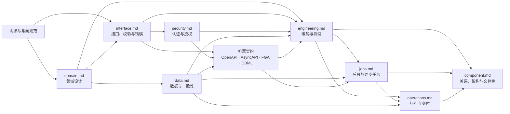
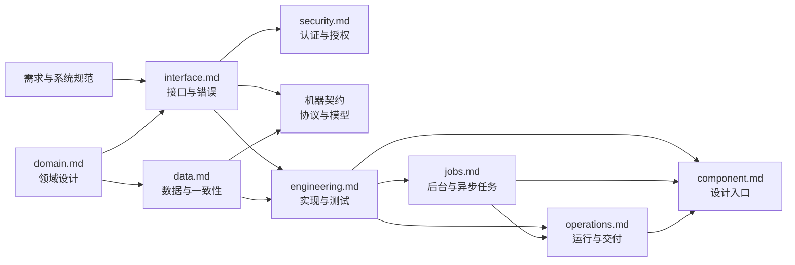
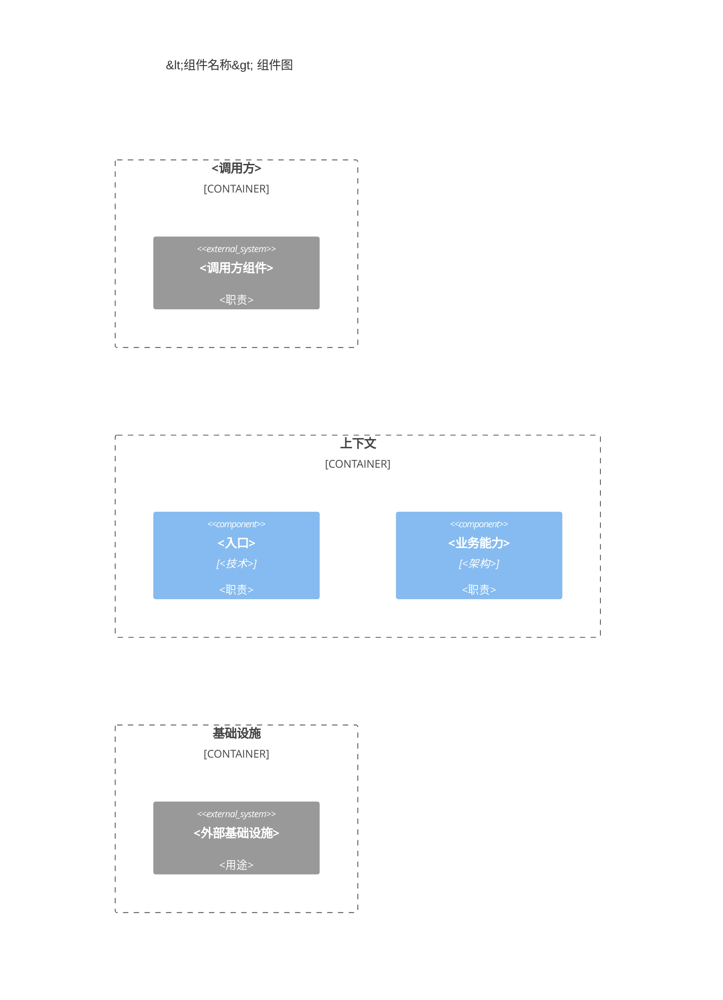
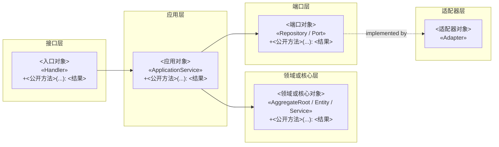
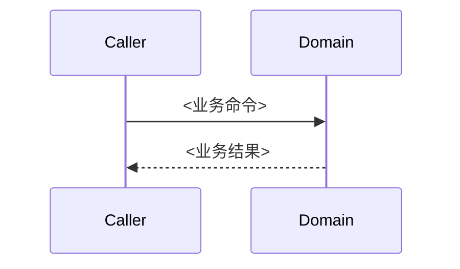
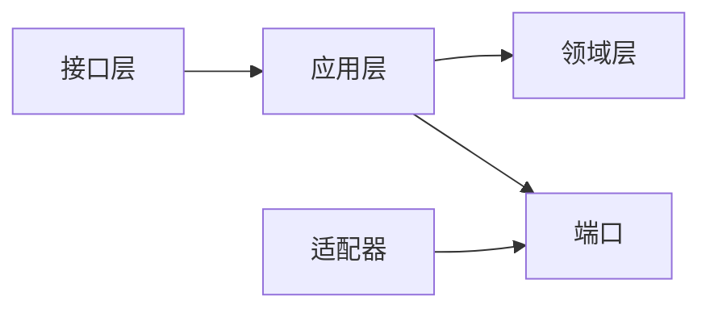
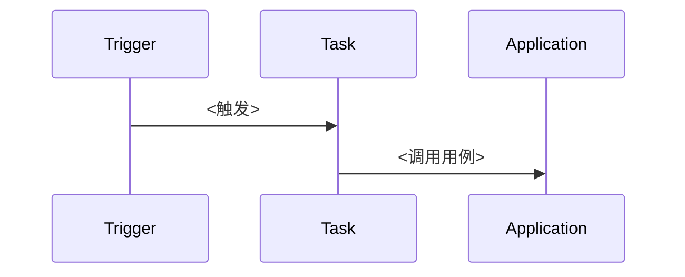
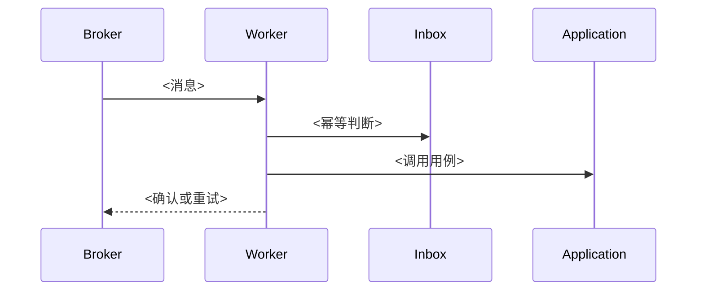

# Backend 组件设计流程与文档模板

## AI-BACKEND-001

- **Who**：处理 `<组件> backend <任务>` 的组件设计 Agent。
- **When**：解析到 `<组件> backend`，准备选择轻量或完整 DDD 模式及实际设计文件时。
- **Where**：`templates/backend-design.template.md` 与当前组件设计目录。
- **What**：定义 Backend 设计强度、文件创建条件、标题深度、引用和设计标识规则。
- **Why**：避免简单组件产生空文档，也避免复杂组件遗漏领域与一致性设计。

- 始终创建 `component.md`、`interface.md` 和 `engineering.md`。
- `domain.md` 仅在完整 DDD 模式创建；`security.md`、`data.md`、`jobs.md` 和 `operations.md` 仅在对应关注点真实存在时创建。
- `docs/system/openapi.json` 是跨组件同步 HTTP 契约唯一源；Backend 实现它但不在组件目录创建副本。`asyncapi.json`、`authorization.fga` 和 `schema.dbml` 是按需创建的组件机器可读事实源，不合并进 Markdown。
- 每个 Markdown 文件都在一级标题下用一句简短正文说明该文件的职责，再开始后续章节或图表。
- 不适用的可选文件和章节直接删除，不创建空文件，不填写“无”“不适用”或占位正文。
- 一个事实只由一个文件维护；其他文件使用稳定设计标识或机器文件引用，不复制字段、规则、流程和关系。
- 需要引用前置文件的信息时，在所属二级或三级标题后、正文前使用独立引用行 `> Ref: <文件名>:<二级标题>:<三级标题或编号>`，例如 `> Ref: process:xx:xx`；多个引用各占一行。只有 `interface.md`“操作定义”和 `security.md`“权限控制”的“关联需求”列可以列当前条目直接实现的需求编号；除此之外不创建引用列、引用表或递归展开上游引用。
- 仅当以下条件全部成立时使用轻量 Backend：任务是简单 CRUD、纯查询或数据转换，且没有领域不变量、业务状态生命周期、跨实体强一致事务、并发竞争、补偿、领域事件或多个统一语言边界。
- 上述任一复杂度信号存在时使用完整 DDD；证据不足时先确认，不得通过选择轻量模式规避设计。
- 轻量 Backend 不创建 `domain.md`，只在 `component.md` 对应上下文的代码结构中记录设计强度和判断事实，并用实际对象名称表达业务词汇与边界。
- 本文件中的图、表、目录、名称和技术全部是格式与表达示例，不是待复制的默认设计。必须根据已确认的实际需求逐项替换、增删和重组；禁止因示例中出现认证、资源、预约、Outbox、Redis、Prisma 或 BullMQ 就创建对应内容。
- 每个具体范例都必须就近包含单行提示 `> - 范例适配声明：<具体调整范围>`；尖括号占位符和具体示例名称不得原样进入最终文档。
- Backend Markdown 最多使用三级标题，不得出现四级及更深标题。设计标识按“文件名 → 二级标题 → 三级标题 → 可选编号”生成；表格“编号”列或 `- **001**：` 编号项追加三位编号，找不到三级标题或编号时停在已经识别到的二级或三级标题。
- 生产代码以 `@design <设计标识>` 标记唯一主实现，协作代码使用 `@design-ref <设计标识>`；测试代码使用 `@verifies <设计标识>`。

## AI-BACKEND-002

- **Who**：处理 `<组件> backend <任务>` 的组件设计 Agent。
- **When**：创建或更新 Backend 的实现映射、代码组织、运行单元或技术约定时。
- **Where**：`<组件设计目录>/component.md`、`engineering.md`、`jobs.md` 与 `operations.md`。
- **What**：定义领域边界、分层依赖、代码角色、运行单元和条件性 TypeScript 约定。
- **Why**：避免合并文档后业务边界、代码依赖与运行职责混在一起。

- 工作流组件按业务和所有权边界划分，不按进程划分。一个 Backend 可以包含 API、内嵌后台任务和独立 Worker 入口。
- 一个组件默认对应一个限界上下文；只有存在不同统一语言和模型边界时才建立多个上下文。
- 领域层不得依赖框架、ORM、HTTP、JWT、授权引擎或消息队列；跨上下文通过稳定应用接口或 Port 协作，不导入另一上下文的领域对象。
- 简单 CRUD、查询和数据转换不机械创建 Command、Handler、Factory、Domain Service 或 Domain Event。
- 数据库事务不得跨越远程调用。可靠消息发布使用同一 Unit of Work 原子写入业务数据和 Outbox，再由现有 API 或 Worker 进程托管 Relay 投递。
- Relay 不是独立进程；独立 Worker 使用 Inbox 或等价机制保证幂等，并区分可重试与不可重试错误。
- `shared/` 只保存多个上下文真实复用且没有业务语义的技术能力，不创建含义模糊的全局 `lib/`、`services/`、`utils/` 或 `schemas/`。
- 技术约定只在实际技术栈采用对应工具时启用。TypeScript 普通职责文件使用 `<subject>.<role>.ts`，技术 Adapter 使用 `<subject>.<technology>.<role>.ts`。
- Command、Handler、Query、Aggregate、Entity、Value Object、Domain Event、Port、Repository 和 Adapter 仅在有真实职责和调用方时创建。
- 框架固定文件名优先；Prisma 迁移使用 `prisma/migrations/<timestamp_name>/migration.sql`；独立 Worker 入口按项目约定启动，不为 Outbox Relay 创建独立入口。
- 精确生产与测试文件树只由 `component.md` 维护；`engineering.md` 只维护实现映射、共享执行管线、长期有效的工程约束和测试规划。

## AI-BACKEND-003

- **Who**：处理 `<组件> backend <任务>` 的组件设计 Agent。
- **When**：创建、删除或调整 Backend 设计文件，或需要确定生成顺序时。
- **Where**：`<组件设计目录>/component.md` 的“文件关系”章节与实际 Backend 设计文件。
- **What**：定义 Backend 设计文件的事实所有权、单向依赖和生成顺序。
- **Why**：避免同一事实多处维护、下游反向定义上游或形成循环引用。

> - 范例适配声明：以下关系图只保留当前组件实际存在的可选文件和机器契约；依赖方向不得反转。



1. 先读取 `docs/system/openapi.json` 中由当前组件 `x-provider` 标记的操作，再从需求与系统规范判断轻量或完整 DDD；完整 DDD 先完成 `domain.md`。
2. 完成 `interface.md`，逐项引用并映射稳定 `operationId`、错误和实现边界，再按需完成 `security.md` 和 `data.md`。
3. 从 Markdown 设计生成或更新适用的组件私有机器契约，并以机器契约作为字段和关系的唯一事实源；不得生成或修改 `openapi.json`。
4. 用 `engineering.md` 落实实现映射、工程约束和测试规划。
5. 按需用 `jobs.md` 设计后台与异步任务，再用 `operations.md` 汇总运行和部署交付要求。
6. 最后更新 `component.md` 开头的文件关系、架构图、按上下文组织的代码结构和完整文件树。

## AI-BACKEND-004

- **Who**：处理 `<组件> backend <任务>` 的组件设计 Agent。
- **When**：创建或更新 Backend 组件的最终设计入口时。
- **Where**：`<组件设计目录>/component.md`。
- **What**：定义文件关系、架构图、按上下文组织的代码结构和完整文件树。
- **Why**：让读者从一个入口定位全部设计与实现路径，而不重复各文件正文。

> - 范例适配声明：以下文件关系、架构元素、上下文代码结构和目录必须替换为当前组件的实际内容。

````md
# <组件名称>

汇总当前 Backend 的文件关系、架构、代码结构和完整文件结构。

## 文件关系



## 架构图



## 代码结构

### <上下文>

> Mode: <轻量 Backend 或完整 DDD>
> Why: <判断事实>



## 目录结构

```text
<组件应用目录>/
├─ <目录>/
│  └─ <文件>  <简短职责>
└─ <配置文件>  <简短职责>
```
````

- `文件关系` 必须是一级标题后的第一个二级章节，只展示实际存在的文件和机器契约；每个文件节点同时写明唯一职责，`jobs.md` 存在时必须直接指向 `component.md`。
- `架构图` 使用一个无关系连线的 `C4Component` 图展示稳定模块、运行单元与必要外部对象，不展开代码分层。
- `代码结构` 的每个三级标题表示一个实际上下文；上下文名称与 `domain.md` 保持一致，轻量 Backend 使用实际业务边界名称且记录 `Mode` 和 `Why`。
- 每个上下文只使用一个 `flowchart LR` 展示内部对象、必要的关键公开方法及对象之间的调用或实现关系；不展示私有方法、简单访问器、全部字段或重复 CRUD 签名，不复制业务规则或契约字段。
- `component.md` 不保留“概述”或“设计索引”章节；`目录结构` 递归列出全部应受版本控制的生产、测试和配置文件。
- 文件树不得使用通配符、省略号或“同上”，不得列出依赖目录、构建产物、缓存、日志、密钥和运行时生成内容。

## AI-BACKEND-005

- **Who**：处理 `<组件> backend <任务>` 的组件设计 Agent。
- **When**：Backend 存在需要长期维护的领域模型、业务规则、状态或一致性边界，因而创建或更新领域设计时。
- **Where**：`<组件设计目录>/domain.md`。
- **What**：定义限界上下文内的领域模型、统一语言、业务规则、事件、状态和业务一致性。
- **Why**：避免业务语义散落在接口、存储或代码映射中，并保持领域规则唯一。

> - 范例适配声明：以下上下文、命令、术语、规则、事件和图必须按当前业务事实调整；可选章节无内容时删除。

````md
# 领域设计

定义当前 Backend 的领域语言、业务规则、状态变化和一致性边界。

## <限界上下文>

### 领域模型

| 类型 | 名称 | 所属聚合 | 职责 | 领域命令 |
|---|---|---|---|---|
| <模型类型> | `<DomainModel>` | <聚合根名称、上下文共享或上下文级> | <简短业务职责> | `<Command>` 或 `—` |

### 统一语言

| 对象 | 术语 | 定义 |
|---|---|---|
| <对象> | <术语> | <业务定义> |

### 业务规则

| 编号 | 类型 | 对象或范围 | 规则 | 违反结果 |
|---|---|---|---|---|
| 001 | <规则类型> | <对象或业务范围> | <业务规则> | <业务结果> |

### 领域事件

| 事件 | 触发条件 | 字段 |
|---|---|---|
| `<EventPastTense>` | <成功发生的业务事实> | <最小字段> |

### 状态图

```mermaid
stateDiagram-v2
    [*] --> <状态>
```



### 业务一致性

| 编号 | 必须同时成立的业务事实 |
|---|---|
| 001 | <必须同时成功或失败的业务状态和事件> |

### 时序图

- **<流程>**

> Ref: process:<角色>:BP-001


````

- 每个二级标题表示一个限界上下文；领域模型、统一语言、业务规则和业务一致性必须保留，事件和图按需保留。
- 领域模型的“类型”只使用中文：`聚合根`、`实体`、`值对象`、`领域服务` 或 `领域策略`；只创建当前业务确实需要的类型。
- “所属聚合”中，聚合根填写自身名称；实体只能填写一个聚合根；聚合内部值对象填写其聚合根；通用值对象填写 `上下文共享`，领域服务和领域策略填写 `上下文级`，不使用 `—` 表示归属。跨聚合关系只持有对方聚合根的稳定 ID，不直接持有其内部实体。
- “领域命令”表示该模型直接承担的业务意图，不是调用方、方法清单或 Application Handler；领域命令通常由聚合根承担，只有确实协调多个领域对象的领域服务才直接承担命令。多个命令使用顿号分隔，没有直接承担命令时填写 `—`。调用方由 `interface.md` 记录，Handler 映射由 `engineering.md` 记录。
- 领域模型表不增加不变量列；不变量和其他业务规则只在“业务规则”表维护，职责只简短说明模型的业务责任。
- 业务规则的“类型”只使用：`不变量`（事务提交后必须成立）、`前置条件`（执行命令前必须满足）、`资格规则`（判断主体或对象是否符合条件）、
  `计算规则`（产生业务数值或结果）、`业务策略`（在多个合法方案中作出业务选择）或 `跨聚合规则`（约束多个聚合间的业务关系）。
- 领域事件使用过去时表示成功发生的业务事实，不等同于命令、集成事件或队列运行状态。
- 状态图和时序图放在对应上下文，不创建独立 `state.md`、`sequence.md` 或组件级 `process.md`；每个时序图先使用 `- **<流程>**` 简短说明引用对象，再使用 `> Ref: process:<角色>:<BP 编号>` 引用实际系统流程，最后绘制 Mermaid，不复制跨组件调用顺序。存在多个流程时按相同结构依次记录。
- 数据字段由机器契约维护；代码映射由 `engineering.md` 和 `component.md` 维护。

## AI-BACKEND-006

- **Who**：处理 `<组件> backend <任务>` 的组件设计 Agent。
- **When**：Backend 提供同步接口、异步消息、RPC、任务入口或其他稳定操作边界，因而创建或更新接口设计时。
- **Where**：`<组件设计目录>/interface.md`。
- **What**：定义入口、操作、输入处理、错误、幂等、兼容策略和机器契约索引。
- **Why**：避免协议入口各自定义校验与错误语义，并保持外部边界稳定。

> - 范例适配声明：以下入口、操作、校验、错误和契约引用必须按当前组件真实协议调整。

````md
# 接口设计

定义当前 Backend 的操作边界、输入处理、错误语义、幂等、兼容和契约索引。

## 入口清单

| 入口 | 协议 | 调用方 | 契约 |
|---|---|---|---|
| <入口> | <协议> | <调用方> | <机器契约引用> |

## 协议与版本

## 操作定义

### <业务能力>

| 编号 | HTTP | 路径 | operationId | 权限 | 关联需求 |
|---|---|---|---|---|---|
| 001 | POST | `/api/v1/<resource>` | `<operationId>` | <未认证或权限编号> | <直接关联的需求编号> |
| 002 | GET | `/api/v1/<resource>/{id}` | `<operationId>` | <未认证或权限编号> | <直接关联的需求编号> |

## 输入处理

### `<operationId>`

| 编号 | 字段 | 正则 | 错误码 | 说明 |
|---|---|---|---|---|
| 001 | `<field>` | `<regex>` | `<ERROR_CODE>` | <格式要求> |
| 002 | `<field>` | `<regex>` | `<ERROR_CODE>` | <格式要求> |

## JSON 响应

所有 HTTP 操作使用固定 JSON 外层结构：

```json
{
  "code": "SUCCESS",
  "message": "操作成功",
  "data": {}
}
```

## 错误处理

### 错误分类
### 错误码

| 编号 | 错误码 | Code | 含义 | 产生位置 | 是否可重试 |
|---|---|---|---|---|---|
| 001 | `<ERROR_CODE>` | `4xx` | <稳定含义> | <业务或边界位置> | <是或否> |
| 002 | `<ERROR_CODE>` | `5xx` | <稳定含义> | <业务或边界位置> | <是或否> |

### 重试与脱敏

## 幂等策略
## 兼容策略
## 契约索引
````

- “操作定义”按业务能力使用三级标题分组，每个实际 HTTP 操作占一行，同一分组允许多行；非 HTTP 协议使用符合该协议的列，不强行保留 `HTTP` 和“路径”列，也不增加四级标题。
- 操作编号在“操作定义”的全部业务能力分组内使用唯一且稳定的三位编号并从 `001` 开始；新增操作不重排已有编号。HTTP 列只填写标准 Method，`operationId` 与 OpenAPI 完全一致并在组件内唯一。
- “权限”填写 `未认证` 或实际权限编号；“关联需求”只列当前操作直接实现的 FR、AC、BR 或 PERM 完整编号，多个编号使用顿号分隔，不递归展开需求关系。
- “输入处理”的每个三级标题使用“操作定义”中真实存在的 `operationId`；表格只列该操作实际需要正则校验的字段，没有时不创建对应三级标题。编号在每个 `operationId` 分组内唯一、稳定并从 `001` 开始。
- “字段”只填写机器契约中的字段名，不增加来源、jq、JSONPath 或其他路径语法；“正则”使用不带语言分隔符的表达式并与 OpenAPI `pattern` 一致；“错误码”必须存在于本文件“错误码”表；“说明”用简短业务语言解释限制，不复述正则。
- “输入处理”只维护格式校验；字段来源、必填、类型、长度及其他 Schema 由机器契约维护，业务前置条件和不变量由 `domain.md` 维护。
- “JSON 响应”的外层固定为 `code`、`message`、`data`：成功时 `code` 为 `SUCCESS`，失败时为本文件稳定错误码；`message` 是不泄漏内部信息的简短说明；`data` 保存成功数据，没有数据或失败时为 `null`。HTTP 状态码由“错误码”表的 `Code` 决定，具体 `data` Schema 由 OpenAPI 维护。
- 错误编号在“错误码”表内使用唯一且稳定的三位编号并从 `001` 开始；新增错误不重排已有编号。错误码使用稳定的大写蛇形命名，不泄漏框架异常、SQL、堆栈、密钥或内部拓扑。
- `Code` 直接填写当前协议的对外 Code，例如 HTTP `401`、gRPC `UNAUTHENTICATED`；同一错误需要多个协议映射时在同一单元格使用 `HTTP: 401、gRPC: UNAUTHENTICATED`，不再创建独立“协议映射”章节。
- “产生位置”填写稳定的业务上下文或输入、领域、授权、数据、外部依赖等边界，不填写易变的类名或文件路径；“是否可重试”只填写 `是` 或 `否`。
- HTTP 请求、响应和消息 Schema 由机器契约维护，Markdown 不复制 Schema 字段，只维护输入正则、固定响应外层、稳定语义和引用。

## AI-BACKEND-007

- **Who**：处理 `<组件> backend <任务>` 的组件设计 Agent。
- **When**：Backend 负责身份认证、凭据、会话或非公开操作授权，因而创建或更新组件安全设计时。
- **Where**：`<组件设计目录>/security.md`。
- **What**：定义系统安全基线在当前组件的认证、授权、执行点、数据范围和失败处理。
- **Why**：避免复制系统安全原则，同时明确 Backend 作为最终安全边界的落实责任。

> - 范例适配声明：以下身份、凭据、主体、资源和权限必须按当前组件真实安全边界调整。

```md
# 安全设计

定义当前 Backend 的身份认证、权限控制和安全失败处理。

## 身份认证

> Ref: security:身份认证:<实际章节>

| 对象 | 规则 |
|---|---|
| 身份来源 | <可信身份提供方或当前组件> |
| 信任边界 | <验证身份的实际入口和要求> |
| 密码 | <实际哈希算法、参数、保存限制和升级策略> |
| Access Token | <实际类型、有效期、标准 Claims、最小业务 Claims 和敏感信息限制> |
| Refresh Token | <高熵生成、摘要保存、轮换、重复使用检测和状态> |
| Session | <设备绑定、有效期、撤销范围和状态> |

## 权限控制

> Ref: security:权限控制:<实际章节>

| 编号 | 角色 | 资源 | 范围 | 条件 | 执行点 | 关联需求 |
|---|---|---|---|---|---|---|
| 001 | <角色> | <资源> | <范围> | <条件> | <Middleware、Policy 或 Handler> | <直接关联的需求编号> |

授权关系模型由 `authorization.fga` 维护，本节只定义当前组件的权限语义和执行方式。

## 失败处理

| 场景 | 处理 | 审计 |
|---|---|---|
| 认证失败 | <拒绝方式和信息边界> | <审计事件> |
| 权限不足 | <默认拒绝和数据保护> | <审计事件> |
| 策略服务不可用 | <拒绝或已确认的降级策略> | <审计事件> |
| 数据范围越界 | <拒绝访问> | <审计事件> |
```

- `security.md` 只记录当前组件如何落实 `docs/system/security.md`，不重新定义全局身份体系、授权原则或密钥平台。
- 身份认证和权限控制分别在章节开头用 `> Ref` 引用系统安全基线，不保留独立“系统基线引用”或“授权模型引用”章节；组件不负责的章节和表格行直接删除。
- 只有当前组件实际接收、签发、保存或撤销对应凭据时才保留密码、Access Token、Refresh Token 或 Session 行；所有算法、参数和有效期必须来自已确认的项目方案及对应版本官方安全资料，不照抄示例或猜测默认值。
- 密码只保存不可逆的自适应哈希，不保存明文或可逆密文；使用 bcrypt 时记录实际 cost 和输入长度限制。Access Token 记录实际有效期、必要标准 Claims 和最小业务 Claims，不包含手机号等非必要敏感信息。
- Refresh Token 使用高熵随机值并只保存摘要或等价不可逆表示；采用轮换时，Token 状态使用 `active → used`，登出、重复使用或安全事件使其变为 `revoked`。Session 状态只使用 `active → revoked` 或 `active → expired`，不使用 `used`；设备级登出的撤销范围必须明确。
- 权限控制编号在本表内唯一、稳定并从 `001` 开始；新增权限不重排已有编号。“关联需求”只列当前权限直接实现的 PERM、FR、AC 或 BR 完整编号，多个编号使用顿号分隔，不递归展开需求关系。
- “角色”使用需求和系统安全基线中的实际业务角色；“范围”描述该角色可访问的资源集合或数据边界，“条件”只记录范围之外仍须成立的授权条件，两者不得重复。
- “权限控制”不重复 `interface.md` 中操作到权限的映射；关系授权模型由 `authorization.fga` 维护，本文件只定义角色、资源、范围、条件和执行点。
- 默认拒绝；认证失败、权限不足、策略服务不可用和数据范围越界必须有明确且不泄漏敏感信息的处理和审计。稳定错误码及协议 Code 只由 `interface.md` 维护，不在本文件重复。
- 密钥变量、注入和运行时轮换由 `operations.md` 维护；任何设计文件都不得记录密码、Token、密钥、证书私钥或其他真实凭据值。

## AI-BACKEND-008

- **Who**：处理 `<组件> backend <任务>` 的组件设计 Agent。
- **When**：Backend 拥有持久化数据、查询、事务、并发或迁移责任，因而创建或更新数据设计时。
- **Where**：`<组件设计目录>/data.md`。
- **What**：定义数据访问、Unit of Work、消息一致性、并发、数据演进和保留策略。
- **Why**：避免领域一致性与数据库事务脱节，并明确数据访问和并发边界。

> - 范例适配声明：以下存储、事务、消息一致性、并发和迁移策略必须按实际数据责任调整。

```md
# 数据设计

定义当前 Backend 的数据访问、持久化边界和一致性策略。

## 数据访问

| 编号 | 类型 | 对象 | 操作 | 说明 |
|---|---|---|---|---|
| 001 | 仓储 | `UserRepository` | `findByPhone`、`save` | 维护 User 聚合的持久化边界 |

## 事务与一致性

### Unit of Work

| 编号 | 入口 | 原子写入 | 失败结果 |
|---|---|---|---|
| 001 | <入口> | <写入对象> | <结果> |

### Outbox

| 编号 | Unit of Work | 集成事件 | 投递语义 |
|---|---|---|---|
| 001 | <编号> | <事件> | 至少一次 |

### Inbox

| 编号 | 消费入口 | 幂等键 | 原子写入 | 重复消息结果 | 保留策略 |
|---|---|---|---|---|---|
| 001 | <入口> | <键> | <业务写入与 Inbox> | <结果> | <策略> |

## 并发控制

| 编号 | 竞争场景 | 控制策略 | 冲突结果 |
|---|---|---|---|
| 001 | <场景> | <策略> | <结果> |

## 数据演进

| 编号 | 变更场景 | 兼容策略 | 回填与回滚 |
|---|---|---|---|
| 001 | <场景> | <策略> | <方案> |

## 数据保留

| 编号 | 数据 | 保留要求 | 清理或归档 |
|---|---|---|---|
| 001 | <数据> | <要求> | <策略> |
```

- “数据访问”的类型只使用：`仓储`（按聚合边界读写领域对象）、`查询模型`（面向列表、详情、统计或报表的只读查询）、`缓存`（键值缓存、Session 或幂等键）、`对象存储`（文件、图片或附件）、`搜索索引`（全文或复杂搜索）或 `事件存储`（事件溯源的事件流）；只保留实际存在的类型。
- “对象”填写稳定的数据访问接口或对象名称；“操作”只列关键稳定方法名，不写完整签名；“说明”简述业务职责及所属聚合。DAO、Mapper、ORM、Prisma、Redis 等实现名称由 `engineering.md` 维护，不作为类型或对象。
- 业务写入与 Outbox 记录必须由同一 Unit of Work 原子提交；Inbox 记录与消费副作用必须原子提交。
- 同一一致性事项在 `domain.md` 的“业务一致性”和 `data.md` 的 Unit of Work 中使用相同三位编号并从 `001` 开始，不增加跨文件引用列。
- 数据库事务不得等待远程服务、Relay 或 Worker；重试和并发策略必须说明边界与失败结果。
- Outbox 和 Inbox 只记录事务语义；Writer 等代码映射由 `engineering.md` 维护，Relay、Processor 和 Worker 由 `jobs.md` 维护。
- 表、字段、索引和关系由 `schema.dbml` 维护，本文件只维护访问边界和策略；迁移部署步骤由 `operations.md` 维护。
- Outbox、Inbox、并发控制、数据演进和数据保留不存在时直接删除对应章节。

## AI-BACKEND-009

- **Who**：处理 `<组件> backend <任务>` 的组件设计 Agent。
- **When**：Backend 需要识别 HTTP、异步消息、授权关系或数据结构契约时。
- **Where**：`docs/system/openapi.json`、`<组件设计目录>/asyncapi.json`、`authorization.fga` 与 `schema.dbml`。
- **What**：引用系统同步 HTTP 契约，并定义组件私有机器可验证的消息 Channel、授权关系和持久化结构。
- **Why**：避免 Markdown 与实现各自维护字段、关系和协议，确保契约只有一个事实源。

### `openapi.json`

- 由需求与系统边界驱动并由 `<system>` 在 Backend 设计前维护；`interface.md` 只引用并映射稳定 `operationId`、错误和实现边界，Backend 只实现和验证。
- 不在组件目录创建或复制该文件。当前组件缺少所需操作、Schema 或示例时停止并切换 `<system>`；通过 HTTP(S) 暴露的 Swagger UI 和 OpenAPI 地址只登记在 `system.md`。

### `asyncapi.json`

- 由 `interface.md` 驱动；维护 Channel、Message、Header、生产者、消费者和版本。
- 只有当前组件提供或消费异步消息时创建。

### `authorization.fga`

- 由 `security.md` 驱动；维护类型、关系和权限。
- 只有当前组件存在关系授权模型时创建。

### `schema.dbml`

- 由 `data.md` 驱动；维护表、字段、索引和关系。
- 只有当前组件拥有持久化数据模型时创建。

所有 JSON 使用标准解析器验证；其他模型使用项目现有工具验证。消费方引用提供方契约，不复制源文件。

## AI-BACKEND-010

- **Who**：处理 `<组件> backend <任务>` 的组件设计 Agent。
- **When**：Backend 需要创建或更新代码结构、工程规则或组件测试规划时。
- **Where**：`<组件设计目录>/engineering.md`。
- **What**：定义设计到代码的实现映射、执行管线、工程约束和测试规划。
- **Why**：避免领域与接口设计无法落到具体代码和测试路径，并统一工程约束。

> - 范例适配声明：以下实现映射、依赖图、工程约束、执行管线、测试层级和示例必须按实际技术栈调整。

````md
# 工程设计

定义当前 Backend 的实现映射、执行管线、工程约束和测试规划。



## 实现映射

| 编号 | 类型 | 设计对象 | 实现对象 | 技术 |
|---|---|---|---|---|
| 001 | 数据访问 | `UserRepository` | `PrismaUserRepository` | Prisma |

## 执行管线

| 编号 | 入口 | 执行顺序 | 事务边界 | 说明 |
|---|---|---|---|---|
| 001 | `registerUser` | Validator → Handler → Unit of Work | 001 | 注册用户 |

## 工程约束

### 目录约定

### 文件命名

| 角色 | 文件命名 |
|---|---|
| Command | `<action>.command.ts` |
| Handler | `<action>.handler.ts` |
| Query | `<action>.query.ts` |
| Aggregate | `<subject>.aggregate.ts` |
| Entity | `entity.ts` 或 `<subject>.entity.ts` |
| Value Object | `value-object.ts` 或 `<subject>.value-object.ts` |
| Domain Event | `<event>.event.ts` |
| Repository Adapter | `<subject>.<technology>.repository.ts` |

### 编码规范

## Fixture 与测试支持

本组件使用 <语言和版本>，沿用 <构建或包管理工具>、<测试框架> 及项目现有测试工具链。

## 单元测试

### AUTH-DOM-USER-001

> Design：`domain:Auth认证:业务规则:001`
> Src：`test/unit/domain/user.test.ts`

Desc：校验手机号唯一规则
Given：已存在同一手机号的用户。
When：创建新用户。
Then：返回手机号已注册的稳定错误。

## 集成测试
## 契约测试
## 并发测试
## 端到端测试
````

- “实现映射”只记录设计对象到实现对象的稳定映射和实际技术，不记录文件路径；精确生产与测试文件树只由 `component.md` 维护。
- “执行管线”只记录多个入口共享或影响行为边界的执行顺序；简单直接调用不创建该章节。Command Bus 只在多个用例需要统一分派或共享 Middleware 时采用。
- 目录约定、文件命名和编码规范统一放在“工程约束”下，但继续使用各自的三级标题和现有表达格式；依赖方向只由一级标题说明后的 Mermaid 图维护。
- 同一聚合或能力内只有字段、类型和简单校验的 Entity、Value Object 可以合并；出现独立行为、生命周期、复杂不变量或复用时再拆分。
- Fixture 与测试支持保留独立二级标题；测试按单元、集成、契约、并发和端到端使用二级标题分组，不适用的测试分组直接删除。
- 每个稳定测试用例直接使用 `### <限界上下文>-<测试层级>-<对象或能力>-<三位序号>` 三级标题，例如 `### AUTH-DOM-USER-001`。`Src` 必须是精确测试文件路径并由 `component.md` 文件树收录。
- 不创建语言映射表或测试用例总表；Requirement TC 或验收跨组件 BP 的场景归全局 `<test>`，不在组件测试中重复规划。
- `Design` 必须是可解析设计标识；测试实现对每个标识使用 `@verifies`。组件测试不引用 Requirement TC，不声称验证跨组件 BP。
- `Design` 和 `Src` 使用连续的 Markdown 引用行；`Desc`、`Given`、`When`、`Then` 使用英文名称和全角冒号连续书写，彼此之间不留空行且各描述一个主要行为。消息行为由集成测试验证，Schema 兼容性由契约测试验证。
- 测试工具链沿用项目现状；没有既有 JavaScript/TypeScript 测试工具链时默认使用 `pnpm` 和 Vitest。测试命令不在 `engineering.md` 维护。
- 测试报告和覆盖率报告按需由用户手动导出，不作为默认提交文件。

## AI-BACKEND-011

- **Who**：处理 `<组件> backend <任务>` 的组件设计 Agent。
- **When**：Backend 存在由现有进程托管的后台任务或独立 Worker，因而创建或更新任务设计时。
- **Where**：`<组件设计目录>/jobs.md`。
- **What**：定义后台任务与异步 Worker 的入口、功能点、运行时序、投递和幂等要求。
- **Why**：避免把进程内任务与独立运行单元混为一谈，同时统一异步任务表达。

> - 范例适配声明：以下任务类型、元信息、功能点、时序、投递和幂等要求必须按实际任务调整。

````md
# 任务设计

定义当前 Backend 的后台任务与独立 Worker 异步任务。

## 后台任务

### <任务名称>

> Src：`<精确生产文件路径>`
> Host：`<现有 API 或 Worker 进程>`
> 触发方式：<定时、启动或内部事件>
> Test：`engineering.md#<测试用例>`

- **001**：<动词 + 业务对象>

<简短描述>

运行方式：



## 异步任务

### <任务名称>

> Src：`<精确生产文件路径>`
> Runtime：`<Worker 运行单元>`
> AsyncAPI：`asyncapi.json#/channels/<channel>`
> Topic：`<topic>`
> 投递语义：至少一次
> 幂等键：`<key>`
> Test：`engineering.md#<测试用例>`

- **001**：<动词 + 业务对象>

<简短描述>

运行方式：


````

- 后台任务随宿主进程启动和停止，不拥有独立启动命令、健康检查、部署或扩缩容单元。
- 异步任务必须引用实际 AsyncAPI Channel，声明独立 Runtime、投递语义、幂等键、确认、重试和终止失败策略。
- 每个三级标题表示一个任务，每个 `- **001**：` 编号项表示一个“动词 + 业务对象”的功能点。
- `jobs.md` 只维护任务功能、消费约束和运行时序；事务语义引用 `data.md`，进程生命周期引用 `operations.md`。

## AI-BACKEND-012

- **Who**：处理 `<组件> backend <任务>` 的组件设计 Agent。
- **When**：Backend 存在配置、密钥、可观测性、运行进程或交付要求，因而创建或更新运行设计时。
- **Where**：`<组件设计目录>/operations.md`。
- **What**：定义配置、密钥引用、运行信号、运行单元和带时间戳的交付快照。
- **Why**：避免运行与交付事实拆散在多份文档中，并保持组件设计与部署职责分离。

> - 范例适配声明：以下配置、密钥、信号、进程和交付内容必须按实际运行环境和部署边界调整。

````md
# 运行与交付

定义当前 Backend 的配置、密钥、运行信号、运行单元和交付快照。

## 配置

| 编号 | 配置项 | 用途 | 必需 | 默认值 | 启动校验 |
|---|---|---|---|---|---|
| 001 | `<配置项>` | <用途> | <是或否> | <默认值> | <校验规则> |

## 密钥

| 编号 | 密钥 | 用途 | 必需 | 轮换与失效要求 |
|---|---|---|---|---|
| 001 | `<密钥名称>` | <用途> | <是或否> | <要求> |

## 运行信号

### 日志与审计

| 编号 | 名称 | 产生条件 | 说明 |
|---|---|---|---|
| 001 | `<信号名称>` | <条件> | <说明> |

### 指标与追踪

| 编号 | 类型 | 名称 | 产生条件 | 说明 |
|---|---|---|---|---|
| 001 | <指标或追踪> | `<信号名称>` | <条件> | <说明> |

### 健康检查

| 编号 | 名称 | 检查内容 | 失败条件 |
|---|---|---|---|
| 001 | `<检查名称或路径>` | <内容> | <条件> |

## 运行单元

| 编号 | 运行单元 | 入口 | 依赖 | 健康检查 | 资源要求 | 关闭与恢复 |
|---|---|---|---|---|---|---|
| 001 | <名称> | `<入口>` | <依赖> | <检查编号> | <要求> | <方式> |

## 交付要求

### 20260804045512

```bash
# 构建交付物。
<构建命令>

# 执行初始化或迁移；没有对应操作时删除本段。
<初始化或迁移命令>

# 按确认的顺序发布。
<发布命令>

# 发布失败时执行；不可逆迁移只写真实恢复方式。
<回滚或恢复命令>
```
````

- `operations.md` 只记录当前组件如何落实 `docs/system/security.md` 和 `docs/system/observability.md`，不复制系统基线。
- “配置”只记录非敏感配置的用途、默认值和启动校验；来源、覆盖顺序、环境值及注入方式由 `<组件 deploy>` 维护。密钥只记录稳定名称和轮换、失效要求，不保存密钥值。
- “运行信号”只保留日志与审计、指标与追踪、健康检查三个三级标题；记录当前组件实际产生的信号，不创建“告警与脱敏”章节，不重复系统级字段、命名、保留、告警或脱敏规则。
- 后台任务记录在宿主进程中；`jobs.md` 声明的每个 Worker Runtime 必须在“运行单元”中有对应项。运行单元统一记录入口、依赖、健康检查、资源、关闭和故障恢复。
- “交付要求”的每个三级标题使用创建快照时的 14 位本地时间 `YYYYMMDDHHmmss`，例如 `20260804045512`；标题唯一并按时间升序排列，最新快照表示当前有效交付要求，已有快照不得修改。
- 每个交付快照只使用一个与实际 Shell 匹配的代码块，按构建、初始化或迁移、发布、回滚或恢复的真实顺序记录操作；使用 Shell 注释就近说明条件，没有的操作直接删除，不保留占位命令。
- 交付快照不得包含密钥值、环境值、Compose、部署脚本正文或具体平台配置；实际部署资源仍由 `<组件 deploy>` 维护。健康检查、资源、故障恢复、迁移、发布和回滚必须可由部署阶段直接落实和验证。
