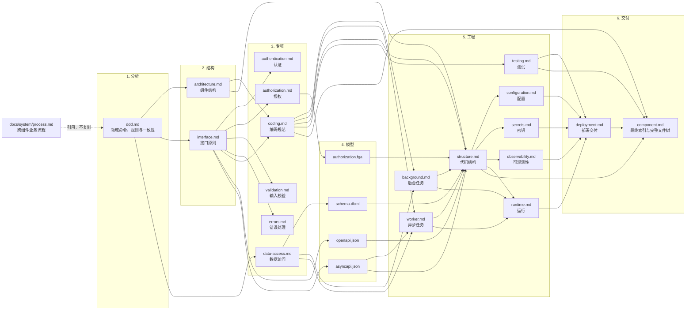
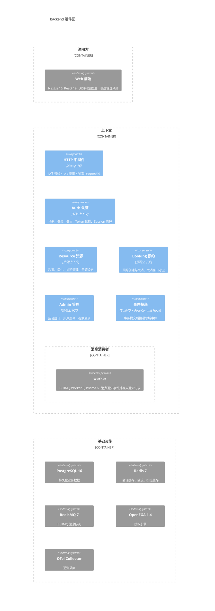
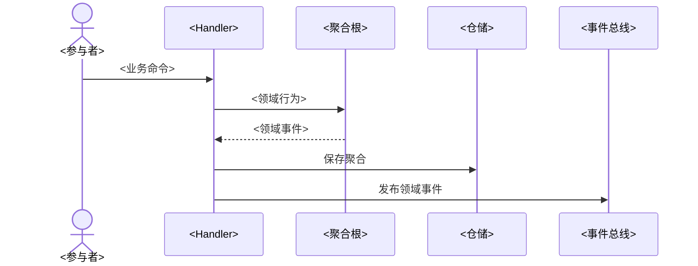
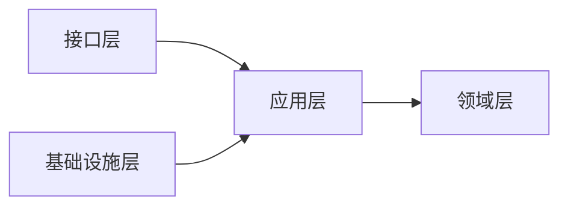
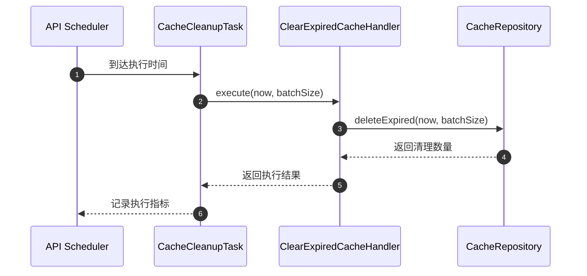
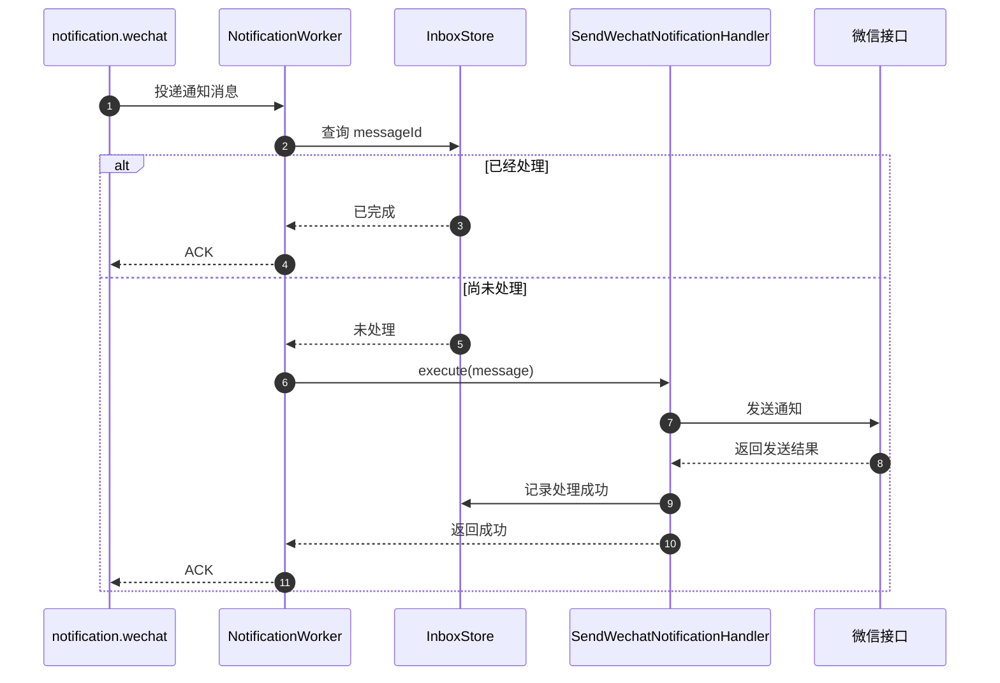

# Backend 组件设计流程与文档模板

## AI-BACKEND-001

- **Who**：处理 `<组件> backend <任务>` 的组件设计 Agent。
- **When**：Backend 模式被启用并准备选择适用文件、固定结构和设计强度时。
- **Where**：当前 Backend 组件设计目录与本模式模板。
- **What**：提供“使用规则”功能；具体规则、格式和约束如下。
- **Why**：确保 Backend 设计由实际业务边界驱动且不会机械照抄范例。

- 使用 `<组件> backend <任务>` 启用 Backend 组件设计模式，并按复杂度选择轻量设计或完整 DDD。
- 执行前必须先读取 `docs/workflows/stages/component.md`；本文件只补充 Backend 的设计顺序和
  固定文档结构，文件权限、创建条件、通用 C3/C4 格式及跨阶段边界仍以该阶段文件为准。
- `component.md`、`architecture.md`、`coding.md` 和 `testing.md` 始终创建；`ddd.md` 仅在完整 DDD 模式创建，其他文件仅在满足创建条件时创建。
- 先在 `component.md` 概述中记录 `设计强度：轻量 Backend` 或 `设计强度：完整 DDD`，并列出触发判断的实际事实。
- 仅当以下条件全部成立时使用轻量 Backend：任务只是简单 CRUD、纯查询或数据转换；没有独立领域不变量或
  有业务含义的状态生命周期；没有跨实体强一致事务、并发竞争、补偿流程或领域事件；没有多个统一语言边界。
- 上述任一复杂度信号存在时使用完整 DDD；证据不足以判定时先向用户确认，不得自行选择较轻模式规避设计。
- 已创建文件使用本模板规定的固定标题名称和顺序；完整 DDD 下每个限界上下文完整保留 DDD 章节，
  其他不适用的可选章节直接删除。
- 一个事实只由一个文件维护，其他文件使用稳定名称引用，不复制字段、关系、流程或规则。
- `openapi.json`、`asyncapi.json`、`authorization.fga` 和 `schema.dbml` 是机器可读源文件，Markdown 只引用它们。
- 系统安全与可观测性基线只从 `docs/system/security.md` 和 `docs/system/observability.md` 引用。
- 本文件的 Mermaid、表格、目录、文件名、上下文名、技术名、运行单元和依赖全部是格式与表达示例，
  不是待复制的默认设计。生成组件文档时必须根据已确认的实际需求逐项替换、增删和重组；禁止因示例中出现
  认证、资源、预约、Outbox、Redis、Prisma 或 BullMQ 就在实际组件中创建对应内容。
- 每个具体范例都必须就近包含单行提示 `> - 范例适配声明：<具体调整范围>`；执行时保留明确标记为固定的标题与顺序，
  其余示例内容必须替换、增删或删除，不得把范例声明当作可以照抄范例的豁免。
- 只保留“固定标题和顺序”等明确声明为固定的结构规则；尖括号占位符和具体示例名称不得原样进入最终文档。

## AI-BACKEND-002

- **Who**：处理 `<组件> backend <任务>` 的组件设计 Agent。
- **When**：Backend 需要确定业务边界、上下文、代码组织、运行单元或条件性技术约定时。
- **Where**：当前 Backend 组件设计目录与本模式模板。
- **What**：提供“架构、代码与运行约定”功能；具体规则、格式和约束如下。
- **Why**：确保 Backend 设计由实际业务边界驱动且不会机械照抄范例。

### 组件、上下文与运行单元

- 工作流组件按业务和所有权边界划分，不按进程划分。一个 Backend 组件可以按实际需求包含 API 和
  消息 Worker 等独立入口，并由同一代码库或构建产物使用不同命令启动；Outbox Relay 托管在现有 API
  或 Worker 进程内，不作为独立进程或独立运行入口。
- 只有存在不同统一语言和模型边界时才建立多个限界上下文。认证、授权、资源、预约等名称不是必须拆分的清单；
  单纯调用外部授权引擎的权限检查保持为应用能力或 Port，只有策略本身具有业务生命周期时才建立授权上下文。
- 每个上下文拥有对应的应用用例和领域模型。跨上下文通过稳定的应用接口或 Port 协作，不导入另一上下文的领域对象；
  强一致协作由应用层在明确的 Unit of Work 中编排，不用隐式领域事件链代替事务设计。
- `shared/` 只保存无业务语义、确实被多个上下文使用的技术能力。Outbox/Inbox 的通用实现可以复用，
  但业务数据、事件映射、Outbox 表和事务归生产者组件所有，不建立共享网络 Outbox 服务。

### 按需建模

- Command Bus、Unit of Work、AsyncLocalStorage、Outbox、Inbox、Saga、内嵌 Relay 和 Worker 都按实际需求引入，
  不作为每个 Backend 的固定样板。数据库事务不得跨越远程 HTTP 或消息调用。
- 领域事件使用过去时表示状态成功改变后的内部业务事实，仅在存在真实消费方或业务反应时创建；
  它不是命令，不自动等于集成事件或事件溯源记录。对外发布时映射为独立、可版本化的集成事件，不暴露领域对象。
- 同库强一致更新在一个事务中完成；需要可靠异步对外发布时，业务数据与已定稿的集成事件信封在同一事务写入 Outbox。
  Writer 是生产者事务内的代码，不是独立进程；Relay 只读取已提交记录、投递并更新投递状态，不虚构领域层或 Command Bus。
- Relay 是托管在现有 API 或 Worker 进程内的内部后台任务，不提供独立启动命令、健康检查或扩缩容单元。
  Relay 仍必须具备原子领取或租约、至少一次投递、退避重试、终止失败、保留清理、积压和延迟观测；
  Worker 可以是独立进程入口，使用 Inbox 或等价机制保证幂等，并区分可重试与不可重试错误。
- 队列的等待、执行、重试和失败是运行状态，不自动写入聚合。`AppointmentCreated` 等事件描述已经发生的事实；
  Worker 完成或失败仅在业务确实关心该结果时产生新的业务状态和事件。
- 涉及异步后续处理的时序图必须标出边界：认证与授权、输入校验、加载聚合、执行领域行为、
  在同一事务持久化业务数据与 Outbox、提交事务、Relay 投递、Worker 幂等消费。具体步骤按实际用例删减，
  不在数据库事务中等待 Relay、Worker 或远程服务完成。

### TypeScript 与技术栈条件规则

- 以下约定只在实际技术栈包含对应工具时启用；未确认 Next.js、Prisma、PostgreSQL 或 BullMQ 时不得生成其目录和文件。
- TypeScript 普通职责文件可使用 `<subject>.<role>.ts`；技术 Adapter 统一使用
  `<subject>.<technology>.<role>.ts`，且技术名必须准确，例如 `department.prisma.repository.ts`、
  `outbox.pgsql.store.ts`、`inbox.pgsql.store.ts`、`message.bullmq.publisher.ts`、`appointment.bullmq.worker.ts`。
  使用 Prisma 时不命名为 `.pgsql.`；只有直接 PostgreSQL/SQL 实现才使用 `.pgsql.`。
- TypeScript 文件名的 `<action>`、`<subject>` 和 `<event>` 使用英文 `kebab-case`，导出的类型使用 `PascalCase`。
  仅为当前设计实际存在的角色采用以下后缀，不为凑齐表格创建 Command、Handler、Query、Result、领域对象、Port 或 Adapter：

  | 角色 | 文件命名 | 创建条件 |
  |---|---|---|
  | Command | `<action>.command.ts` | 存在改变业务状态的应用用例 |
  | Handler | `<action>.handler.ts` | Command 或 Query 需要独立编排 |
  | Query | `<action>.query.ts` | 存在独立查询用例 |
  | Result | `<action>.result.ts` | 输出需要跨入口或调用方稳定复用 |
  | Aggregate | `<subject>.aggregate.ts` | 对象负责维护事务边界与不变量 |
  | Entity | `entity.ts` 或 `<subject>.entity.ts` | 简单相关实体可合并；具有独立行为或生命周期时拆分 |
  | Value Object | `value-object.ts` 或 `<subject>.value-object.ts` | 简单相关值对象可合并；具有独立不变量或复用价值时拆分 |
  | Domain Policy | `<subject>.policy.ts` | 纯领域规则不自然属于单个实体或值对象 |
  | Domain Service | `<subject>.domain-service.ts` | 领域行为必须协调多个领域对象且无自然归属 |
  | Domain Event | `<event>.event.ts` | 聚合成功改变后存在真实业务反应 |
  | Repository | `<subject>.repository.ts` | 应用或领域需要持久化 Port |
  | Port | `<subject>.port.ts` | 应用层依赖真实外部或跨上下文能力 |
  | Adapter | `<subject>.<technology>.adapter.ts` | 存在 Port 的技术实现 |
  | Repository Adapter | `<subject>.<technology>.repository.ts` | 存在 Repository 的技术实现 |
  | Processor | `<event>.processor.ts` | 消息入口需要独立完成校验、幂等和错误分类 |
- 同一聚合或业务能力内只有字段、类型和简单校验的 Entity 可以合并到 `entity.ts`，Value Object 可以合并到
  `value-object.ts`；出现独立行为、独立生命周期、复杂不变量、跨聚合复用或文件明显难以阅读时，再拆为
  `<subject>.entity.ts` 或 `<subject>.value-object.ts`。
- 已位于领域 `events/` 目录的事件文件使用 `<event>.event.ts`，不重复写成 `.domain-event.ts`。
  使用 Prisma 的共享技术代码按需放入 `shared/infrastructure/prisma/`；Outbox、Inbox 和消息 Adapter
  分别放入职责明确的 `shared/infrastructure/outbox/`、`inbox/` 和 `messaging/`，不存在真实复用时留在所属上下文。
- Next.js 规定的 `route.ts`、`page.tsx`、`layout.tsx`、`middleware.ts` 或当前版本的其他固定文件名保持不变；
  Backend 组件只在需要时包含 `app/api/**/route.ts`，不为通常属于其他组件的前端页面创建 `frontend/`。
- Prisma 迁移位于 `prisma/migrations/<timestamp_name>/migration.sql`，Schema 位于 `prisma/schema.prisma`，
  需要拆分时使用 `prisma/models/*.prisma`；使用 Prisma 时不另建通用根 `migrations/`。
- 独立 Worker 进程源码按需放入 `src/processes/worker.ts`，编译输出与命令对应为
  `dist/processes/worker.js`、`node dist/processes/worker.js`，不使用 `dist-processes/`；Relay 代码保留在
  Outbox 基础设施目录并由 API 或 Worker 启动，不创建 `src/processes/outbox.ts`。
- `.processor.ts` 是消息入口 Adapter，负责反序列化、校验、追踪、Inbox 幂等、调用应用处理器和错误分类；
  单一简单消息可由 Worker 直接调用处理器，不必单独创建 Processor。
- `.result.ts` 只表示需要稳定复用的应用用例输出，不表示 HTTP 响应、领域对象、ORM 记录或事件；简单返回类型就地定义。
- `.port.ts` 只表示应用层拥有的外部或跨上下文依赖抽象；Repository 已经是 Port，保留 `.repository.ts`，
  不追加 `.port.ts`，也不为没有真实边界的单一内部实现创建接口。
- 聚合 ID 和简单状态可以保留在 `.aggregate.ts`；只有复用或存在独立不变量时才拆分类型。对象主键默认使用原生 UUIDv4，
  不自创 ID 算法。只有明确的人机展示或输入需求才增加独立短业务编号；UUIDv7 仍是 UUID，不作为短展示码，
  仅在明确需要时间有序性或索引局部性时选用。
- 短业务编号不得替代内部主键或安全令牌；确需 `APT-7K3M9Q2D` 一类编号时，设计必须说明前缀、字符集、
  随机或序列来源、唯一约束、碰撞重试和是否区分大小写，而不是只给出示例字符串。
- `test/` 的实际目录和文件由当前组件 `testing.md` 按测试策略确定，最终由 `component.md` 完整列出，
  不套用与需求无关的固定测试目录示例。

## AI-BACKEND-003

- **Who**：处理 `<组件> backend <任务>` 的组件设计 Agent。
- **When**：Backend 模式有两个或以上适用设计文件，需要确定依赖和编写顺序时。
- **Where**：当前 Backend 组件设计目录与本模式模板。
- **What**：提供“文件关系与设计顺序”功能；具体规则、格式和约束如下。
- **Why**：确保 Backend 设计由实际业务边界驱动且不会机械照抄范例。

> - 范例适配声明：下图必须根据当前组件实际存在的设计文件和依赖关系调整；六阶段顺序除外。



## AI-BACKEND-004

- **Who**：处理 `<组件> backend <任务>` 的组件设计 Agent。
- **When**：Backend 模式完成复杂度判断并准备创建或更新设计文件时。
- **Where**：当前 Backend 组件设计目录与本模式模板。
- **What**：提供“执行流程”功能；具体规则、格式和约束如下。
- **Why**：确保 Backend 设计由实际业务边界驱动且不会机械照抄范例。

1. **分析**：根据 C2 组件清单确定应用目录、设计目录和外部连接，读取相关需求、系统规范、现有组件规范及当前组件契约；
   再根据 AI-BACKEND-001 的客观条件选择设计强度，并在 `component.md` 概述记录结论与触发事实。完整 DDD 模式在
   `ddd.md` 中按限界上下文分章，记录领域命令、统一语言、业务规则、
   一致性要求，以及实际存在的领域事件、状态图和时序图；时序图引用系统 `process.md` 的稳定 BP 编号，
   不复制跨组件业务流程或接口调用细节。
   轻量 Backend 不创建 `ddd.md`，业务词汇、边界和“不采用完整 DDD”的事实依据只记录在 `component.md` 概述。
2. **结构**：以已确认的领域设计为共同输入，同级创建或更新 `architecture.md` 和 `interface.md`：前者表达组件边界、
   主要内部模块、上游调用方和必要外部依赖，后者表达稳定操作边界；两者位于同一组件设计目录，
   不互相作为设计前置。轻量 Backend 直接从已确认的需求、系统规范和组件概述生成这两个同级文件。
3. **专项**：按实际边界设计认证、授权、输入校验、错误处理和数据访问，并始终根据 DDD、C3、
   接口、组件概述和实际技术栈完成 `coding.md`；不得从框架、数据库表或现有源码反推业务模型。
4. **模型**：由提供方分别维护机器可读模型：`interface.md` 对应 `openapi.json` 或 `asyncapi.json`，
   `authorization.md` 对应 `authorization.fga`，`data-access.md` 对应 `schema.dbml`。
5. **工程**：机器可读模型稳定后，按需用 `background.md` 设计由现有进程托管的后台任务，用 `worker.md` 设计由独立
   Worker 运行单元执行的异步任务；再用 `structure.md` 落实应用用例、领域对象、Task、Processor、Port、Adapter 及依赖方向，
   并遵循 `coding.md` 的目录、命名和依赖规则。随后完成配置、密钥、可观测性和测试设计，最后以 `structure.md`、
   `background.md` 和 `worker.md` 为直接输入汇总 `runtime.md`；不存在的任务文件不作为输入。
6. **交付**：用 `deployment.md` 汇总交给 `<deploy>` 阶段的交付要求；最后读取 `coding.md`、`testing.md`、按需存在的
   `background.md`、`worker.md` 和 `structure.md` 并更新 `component.md`，使设计架构索引覆盖设计目录内全部实际文件，
   并使完整文件树落实 C3、C4、编码规范、测试策略和运行要求。

每个阶段发现上游设计不成立时先回到对应文件修正；不得通过下游文档复制或覆盖上游事实。

## AI-BACKEND-005

- **Who**：处理 `<组件> backend <任务>` 的组件设计 Agent。
- **When**：Backend 组件需要创建或更新组件内部模块、入口、运行单元和必要外部依赖图时。
- **Where**：当前 Backend 组件设计目录与本模式模板。
- **What**：提供“`architecture.md`”功能；具体规则、格式和约束如下。
- **Why**：确保 Backend 设计由实际业务边界驱动且不会机械照抄范例。

只允许一级标题和一个 Mermaid `C4Component` 图；完整元素和边界规则以
`docs/workflows/stages/component.md` 为准。
下图仅演示 `C4Component` 的写法和抽象层级。认证、资源、预约、事件投递、Worker、Redis 等元素
都必须按当前组件的真实上下文、运行单元和外部对象替换或删除，不构成推荐的固定组件清单。

> - 范例适配声明：以下 C3 内容必须根据当前组件的实际边界、上下文、入口和依赖调整。

````md
# 组件架构


````

每个真实限界上下文和入口使用一个 `Component`；独立消息消费者按范例放入嵌套边界并使用 `System_Ext`。
公共日志、追踪、数据库会话或消息基础代码只有实际复用时才作为公共技术组件。C3 不展开应用层、领域层、Port 或 Adapter；这些分层及上下文内部代码关系
由 `ddd.md` 和 `structure.md` 展示。组件信息、对象、技术版本、架构、框架和职责必须根据实际情况调整；
不存在的展示层、上下文、运行入口或基础设施直接删除，不保留空边界或示例空字符串。
C3 图不绘制关系连线，不使用 `Rel`、`BiRel` 或带方向的关系语法。

## AI-BACKEND-006

- **Who**：处理 `<组件> backend <任务>` 的组件设计 Agent。
- **When**：Backend 复杂度判断确认存在需要长期维护的领域语言、规则、状态或事务边界时。
- **Where**：当前 Backend 组件设计目录与本模式模板。
- **What**：提供“`ddd.md`”功能；具体规则、格式和约束如下。
- **Why**：确保 Backend 设计由实际业务边界驱动且不会机械照抄范例。

> - 范例适配声明：以下 DDD 内容必须根据当前组件实际存在的限界上下文、统一语言和业务规则调整；固定章节除外。

````md
# DDD 设计文档

## <ContextName> <中文名称>

### 领域命令

| 命令 | 说明 |
|---|---|
| `<Command>` | <命令表达的业务意图> |

### 统一语言

| 对象 | 术语 | 定义 |
|---|---|---|
| `<Object>` | <业务术语> | <当前上下文中的唯一含义> |

### 业务规则

| 对象 | 规则 | 违反结果 |
|---|---|---|
| `<Object>` | <必须始终满足的业务规则> | <明确的业务失败结果> |

### 领域事件

| 事件 | 触发条件 | 字段 |
|---|---|---|
| `<Event>` | <已经发生的领域事实> | `<field>` |

### 状态图

```mermaid
stateDiagram-v2
    [*] --> <初始状态>
    <当前状态> --> <下一状态>: <命令或领域事件>
    <终止状态> --> [*]
```



### 一致性

| 事务边界 | 要求 |
|---|---|
| `<Handler>` | <必须在同一事务中成立的状态与事件要求> |

### 时序图



````

- 一个组件默认对应一个限界上下文；只有确实存在不同统一语言和模型边界时才增加上下文章节。
- 每个上下文必须包含领域命令、统一语言、业务规则和一致性；领域事件、状态图和时序图仅在实际存在时保留，
  不创建空章节或占位内容。各上下文独立维护自己的术语、规则、生命周期、协作和事件。
- 领域命令仅记录命令及其业务意图；Handler、领域对象和 Result 的代码映射由 `coding.md` 和 `structure.md` 维护。
- 一致性只描述事务边界及必须原子成立的业务状态和事件要求；Command Bus、Outbox、事务中间件、
  重试和锁等技术实现由 `architecture.md`、`coding.md`、`data-access.md` 或配置文件维护。
- 状态图和时序图归属对应限界上下文，不创建独立的 `state.md` 或 `sequence.md`。
- 时序图只表达领域行为，引用系统 `process.md` 中的稳定 BP 编号，不重复跨组件业务流程，
  也不展开接口参数、消息载荷、超时、重试等技术细节。
- 不在 `ddd.md` 中罗列全部字段、私有方法、ORM 模型或简单数据载体；代码结构、数据库结构和
  接口结构分别由 `structure.md`、`schema.dbml` 和 OpenAPI/AsyncAPI 维护。

## AI-BACKEND-007

- **Who**：处理 `<组件> backend <任务>` 的组件设计 Agent。
- **When**：Backend 提供同步接口、异步消息、RPC、任务入口或其他稳定操作边界时。
- **Where**：当前 Backend 组件设计目录与本模式模板。
- **What**：提供“`interface.md`”功能；具体规则、格式和约束如下。
- **Why**：确保 Backend 设计由实际业务边界驱动且不会机械照抄范例。

> - 范例适配声明：以下接口结构必须根据当前组件实际提供的协议、操作和契约调整；固定标题除外。

```md
# 接口设计

## 入口清单

| 入口 | 协议 | 操作 | 调用方 | 契约 |
|---|---|---|---|---|
| <入口> | <协议> | <稳定操作名> | <调用方> | <契约引用> |

## 协议与版本

## 操作定义

## 幂等策略

## 兼容策略

## 契约索引
```

## AI-BACKEND-008

- **Who**：处理 `<组件> backend <任务>` 的组件设计 Agent。
- **When**：当前 Backend 负责身份验证、凭据或会话生命周期中的一个或多个环节时。
- **Where**：当前 Backend 组件设计目录与本模式模板。
- **What**：提供“`authentication.md`”功能；具体规则、格式和约束如下。
- **Why**：确保 Backend 设计由实际业务边界驱动且不会机械照抄范例。

> - 范例适配声明：以下认证结构必须根据当前组件实际承担的身份边界调整；固定标题除外。

```md
# 身份认证

## 系统基线引用

## 身份来源

## 信任边界

## 凭据与会话

## Token 生命周期

## 轮换、撤销与防重放

## 失败处理
```

## AI-BACKEND-009

- **Who**：处理 `<组件> backend <任务>` 的组件设计 Agent。
- **When**：当前 Backend 执行主体、资源、操作或数据范围授权判断时。
- **Where**：当前 Backend 组件设计目录与本模式模板。
- **What**：提供“`authorization.md`”功能；具体规则、格式和约束如下。
- **Why**：确保 Backend 设计由实际业务边界驱动且不会机械照抄范例。

> - 范例适配声明：以下授权结构必须根据当前组件实际主体、资源和权限模型调整；固定标题除外。

```md
# 权限控制

## 系统基线引用

## 主体与资源

## 权限模型

## 权限矩阵

| 主体或角色 | 资源 | 操作 | 条件 | 数据范围 |
|---|---|---|---|---|
| <主体或角色> | <资源> | <操作> | <条件> | <范围> |

## 权限执行点

## 数据范围

## 默认拒绝与失败处理

## 授权模型引用
```

## AI-BACKEND-010

- **Who**：处理 `<组件> backend <任务>` 的组件设计 Agent。
- **When**：当前 Backend 接收不可信输入且需要定义标准化、格式或领域校验边界时。
- **Where**：当前 Backend 组件设计目录与本模式模板。
- **What**：提供“`validation.md`”功能；具体规则、格式和约束如下。
- **Why**：确保 Backend 设计由实际业务边界驱动且不会机械照抄范例。

> - 范例适配声明：以下校验结构必须根据当前组件实际输入边界和业务规则调整；固定标题除外。

```md
# 输入校验

## 输入边界

## 标准化

## 格式校验

## 领域校验

## 校验顺序与职责

## 错误映射
```

## AI-BACKEND-011

- **Who**：处理 `<组件> backend <任务>` 的组件设计 Agent。
- **When**：当前 Backend 存在需要稳定分类、映射、重试或脱敏的可观察错误时。
- **Where**：当前 Backend 组件设计目录与本模式模板。
- **What**：提供“`errors.md`”功能；具体规则、格式和约束如下。
- **Why**：确保 Backend 设计由实际业务边界驱动且不会机械照抄范例。

> - 范例适配声明：以下错误结构必须根据当前组件实际错误分类、协议和恢复策略调整；固定标题除外。

```md
# 错误处理

## 错误分类

## 稳定错误码

| 错误码 | 含义 | 产生位置 | 是否可重试 |
|---|---|---|---|
| `<错误码>` | <稳定含义> | <产生位置> | <是或否> |

## 协议映射

| 错误码 | 协议 | Code | 对外含义 |
|---|---|---|---|
| `AUTH_FORBIDDEN` | HTTP | `403` | 当前身份无权执行该操作 |

## 重试策略

## 敏感信息保护
```

- “错误码”是组件内稳定的业务或应用错误标识；`Code` 是该错误映射到当前协议后的状态码，例如 HTTP `403`。
- 每个对外可观察错误按实际协议填写一行；HTTP、gRPC 或消息错误分别使用对应协议的 Code，不把 HTTP 状态码当作稳定错误码。
- HTTP 错误响应的 Schema 和操作级响应仍由 `openapi.json` 维护，`errors.md` 只维护分类和映射规则。

## AI-BACKEND-012

- **Who**：处理 `<组件> backend <任务>` 的组件设计 Agent。
- **When**：当前 Backend 拥有持久化数据、事务、并发控制、索引或迁移责任时。
- **Where**：当前 Backend 组件设计目录与本模式模板。
- **What**：提供“`data-access.md`”功能；具体规则、格式和约束如下。
- **Why**：确保 Backend 设计由实际业务边界驱动且不会机械照抄范例。

> - 范例适配声明：以下数据访问结构必须根据当前组件实际数据所有权、存储和一致性要求调整；固定标题除外。

```md
# 数据访问

## 数据所有权

## Repository

## 查询模型

## 事务边界

| Unit of Work | 入口 | 参与写入 | 原子要求 | 回滚条件 |
|---|---|---|---|---|
| `<用例或 Handler>` | `<事务开始位置>` | <聚合、Repository、Outbox 或 Inbox> | <必须同时提交的状态与事件> | <触发完整回滚的失败> |

## 消息一致性

### Outbox

| 生产用例 | 事务内 Writer | 集成事件 | Relay 或 Publisher | 投递语义 |
|---|---|---|---|---|
| `<Handler>` | `<代码单元>` | `<AsyncAPI 事件或稳定事件名>` | `<由 API 或 Worker 托管的代码单元>` | <至少一次、重试及终止失败> |

### Inbox

| 消费入口 | 幂等键 | 原子写入 | 重复消息结果 | 保留策略 |
|---|---|---|---|---|
| `<Processor 或 Worker>` | `<messageId 或业务键>` | <Inbox 与业务副作用> | <返回成功、跳过或重放结果> | <保留及清理要求> |

## 并发控制

## 索引策略

## 迁移策略

## 数据保留

## Schema 引用
```

- Unit of Work 以一个应用用例为边界，负责事务开始、提交和回滚；数据库事务不得跨越远程 HTTP、消息发布或 Worker 执行。
- 需要可靠异步发布时，业务写入与 Outbox 记录必须由同一 Unit of Work 原子提交；Outbox Writer 只写记录，
  Relay 或 Publisher 只处理已提交记录，不在事务内等待消息基础设施，也不作为独立进程。
- 领域事件映射为版本化集成事件后再写入 Outbox；消息字段由 `asyncapi.json` 维护，本文件只引用稳定事件名。
- 至少一次投递要求消费者幂等；需要 Inbox 时，去重记录与业务副作用必须原子提交。
- Command Bus、Unit of Work、Outbox、Inbox、Relay 或 Worker 没有真实一致性或复用需求时删除对应内容，不创建空机制。

## AI-BACKEND-013

- **Who**：处理 `<组件> backend <任务>` 的组件设计 Agent。
- **When**：当前 Backend 实际需要 OpenAPI、AsyncAPI、授权模型或数据 Schema 中的至少一种时。
- **Where**：当前 Backend 组件设计目录与本模式模板。
- **What**：提供“机器可读文件”功能；具体规则、格式和约束如下。
- **Why**：确保 Backend 设计由实际业务边界驱动且不会机械照抄范例。

> - 范例适配声明：以下文件清单和字段要求必须根据当前组件实际采用的契约与数据模型调整；未采用的文件不创建。

### `openapi.json`

至少维护以下顶层结构：

- `openapi`
- `info`
- `servers`
- `tags`
- `paths`
- `components.schemas`
- `components.securitySchemes`
- 错误响应和示例

### `asyncapi.json`

至少维护以下顶层结构：

- `asyncapi`
- `info`
- `servers`
- `channels`
- `operations`
- `components.messages`
- 消息 Schema 和示例

### `authorization.fga`

至少维护以下结构：

- Schema 版本
- `type`
- `relations`
- `permissions`

### `schema.dbml`

按实际模型维护：

- `Enum`
- `Table`
- 字段与约束
- `indexes`
- `Ref`
- 必要的 `Note`

## AI-BACKEND-014

- **Who**：处理 `<组件> backend <任务>` 的组件设计 Agent。
- **When**：当前 Backend 存在需要长期维护的应用、领域、Port、Adapter 或进程代码结构时。
- **Where**：当前 Backend 组件设计目录与本模式模板。
- **What**：提供“`structure.md`”功能；具体规则、格式和约束如下。
- **Why**：确保 Backend 设计由实际业务边界驱动且不会机械照抄范例。

> - 范例适配声明：以下 C4 内容必须根据当前组件实际代码分层、业务能力和依赖方向调整。

````md
# 代码结构

## 总览

```mermaid
flowchart LR
    <模块、业务能力与主要依赖>
```

## <业务能力>

```mermaid
flowchart LR
    subgraph interface_layer["接口层"]
        direction TB
        <接口节点>
    end

    subgraph application_layer["应用层"]
        direction TB
        <应用用例>
    end

    subgraph domain_layer["领域层"]
        direction TB
        <聚合、实体、值对象和领域服务>
    end

    subgraph port_layer["端口层"]
        direction TB
        <Port>
    end

    subgraph adapter_layer["适配器层"]
        direction TB
        <Adapter>
    end
```
````

- `structure.md` 在实际采用时展示 Command Bus、Handler、Unit of Work、Outbox Writer、Inbox、Task、Relay、Processor 和 Worker
  等稳定代码单元及其依赖；不存在的机制不创建节点。
- 事务与消息语义引用 `data-access.md`，命令、事件和契约引用 DDD、接口及机器可读模型，C4 不重复规则或字段。

## AI-BACKEND-015

- **Who**：处理 `<组件> backend <任务>` 的组件设计 Agent。
- **When**：Backend 需要固定生产代码的架构映射、目录职责、文件命名、编码规则或依赖方向时。
- **Where**：当前 Backend 组件设计目录与本模式模板。
- **What**：提供“`coding.md`”功能；具体规则、格式和约束如下。
- **Why**：确保 Backend 设计由实际业务边界驱动且不会机械照抄范例。

> - 范例适配声明：以下工程结构和规则必须根据当前组件的实际语言、框架、代码分层及工具链调整；固定标题与顺序除外。

````md
# 编码规范

## 架构映射

| 设计对象 | 代码位置 | 命名方式 |
|---|---|---|
| <应用用例、领域对象、Port 或 Adapter> | `<实际目录>` | `<实际命名模式>` |

## 应用执行管线

### Command Bus

| Command | Handler | Middleware 顺序 | Unit of Work | Result |
|---|---|---|---|---|
| `<Command>` | `<Handler>` | <认证、授权、校验、事务、日志等实际顺序> | <使用的事务边界或无> | `<Result 或返回类型>` |

### 事务与消息代码

| 机制 | 代码单元 | 调用位置 | 职责 | 禁止职责 |
|---|---|---|---|---|
| Unit of Work | `<实现或 Middleware>` | <Handler 外层或显式调用点> | 开始、提交、回滚事务 | 远程调用或业务规则 |
| Outbox Writer | `<代码单元>` | <业务事务内> | 写入已定稿集成事件 | 直接发布消息 |
| Inbox | `<代码单元>` | <Consumer 事务内> | 去重并原子记录消费结果 | 代替业务幂等规则 |

## Prisma 与 BullMQ 参考实现

> - 范例适配声明：以下 TypeScript 范例只在实际采用 Prisma、Redis 和 BullMQ，且需要统一 Command 分派、事务与可靠异步发布时保留；必须按当前组件的模型、目录、错误类型、事件契约和运行要求调整。

```ts
import { randomUUID } from "node:crypto";
import { Prisma, PrismaClient } from "@prisma/client";
import { Queue } from "bullmq";
import IORedis from "ioredis";

type Transaction = Prisma.TransactionClient;
type Command = { type: string };
type IntegrationEvent = {
  id: string;
  type: string;
  payload: Prisma.InputJsonValue;
};

interface CommandHandler<C extends Command, R> {
  execute(command: C, tx: Transaction): Promise<R>;
}

class UnitOfWork {
  constructor(private readonly prisma: PrismaClient) {}

  execute<R>(work: (tx: Transaction) => Promise<R>): Promise<R> {
    return this.prisma.$transaction(work);
  }
}

class OutboxWriter {
  append(tx: Transaction, event: IntegrationEvent) {
    return tx.outboxMessage.create({
      data: {
        id: event.id,
        type: event.type,
        payload: event.payload,
      },
    });
  }
}

type CreateOrder = {
  type: "CreateOrder";
  customerId: string;
  total: number;
};

class CreateOrderHandler
  implements CommandHandler<CreateOrder, { id: string }>
{
  constructor(private readonly outbox: OutboxWriter) {}

  async execute(command: CreateOrder, tx: Transaction) {
    const order = await tx.order.create({
      data: {
        customerId: command.customerId,
        total: command.total,
      },
      select: { id: true },
    });

    await this.outbox.append(tx, {
      id: randomUUID(),
      type: "order.created.v1",
      payload: { orderId: order.id },
    });

    return order;
  }
}

class CommandBus {
  private readonly handlers = new Map<
    string,
    CommandHandler<Command, unknown>
  >();

  constructor(private readonly unitOfWork: UnitOfWork) {}

  register<C extends Command, R>(
    type: C["type"],
    handler: CommandHandler<C, R>,
  ) {
    this.handlers.set(
      type,
      handler as CommandHandler<Command, unknown>,
    );
  }

  dispatch<R>(command: Command): Promise<R> {
    const handler = this.handlers.get(command.type);
    if (!handler) throw new Error(`Handler not found: ${command.type}`);

    // Handler 与 Outbox Writer 共用同一个 Prisma TransactionClient。
    return this.unitOfWork.execute((tx) =>
      handler.execute(command, tx),
    ) as Promise<R>;
  }
}

const prisma = new PrismaClient();
const commandBus = new CommandBus(new UnitOfWork(prisma));
commandBus.register(
  "CreateOrder",
  new CreateOrderHandler(new OutboxWriter()),
);
```

Outbox Relay 必须在上述业务事务提交后运行。下面使用 PostgreSQL 的 `FOR UPDATE SKIP LOCKED` 原子领取记录，并通过 Redis 上的 BullMQ 至少一次投递；消费者仍须使用 `event.id` 或业务键实现幂等。

```ts
type ClaimedOutbox = {
  id: string;
  type: string;
  payload: Prisma.JsonValue;
};

const redis = new IORedis(process.env.REDIS_URL!, {
  maxRetriesPerRequest: null,
});
const eventQueue = new Queue("integration-events", {
  connection: redis,
});

async function relayOutboxBatch() {
  const messages = await prisma.$transaction(async (tx) => {
    const rows = await tx.$queryRaw<ClaimedOutbox[]>`
      SELECT "id", "type", "payload"
      FROM "OutboxMessage"
      WHERE "publishedAt" IS NULL
        AND (
          "claimedAt" IS NULL OR
          "claimedAt" < NOW() - INTERVAL '5 minutes'
        )
      ORDER BY "createdAt"
      FOR UPDATE SKIP LOCKED
      LIMIT 50
    `;

    await tx.outboxMessage.updateMany({
      where: { id: { in: rows.map((row) => row.id) } },
      data: { claimedAt: new Date() },
    });

    return rows;
  });

  for (const message of messages) {
    await eventQueue.add(
      message.type,
      { eventId: message.id, payload: message.payload },
      {
        jobId: message.id,
        attempts: 5,
        backoff: { type: "exponential", delay: 1_000 },
      },
    );

    await prisma.outboxMessage.update({
      where: { id: message.id },
      data: { publishedAt: new Date() },
    });
  }
}
```

范例中的 `Order`、`OutboxMessage`、字段和事件名称仅用于说明协作方式；实际 Schema 由当前组件的数据模型维护。生产设计还必须补齐租约所有者、终止失败、保留清理、积压指标和优雅关闭。

## 目录约定

| 目录 | 职责 | 允许依赖 | 禁止内容 |
|---|---|---|---|
| `<实际目录>` | <唯一职责> | <允许依赖> | <禁止内容> |

## 文件命名

| 文件类别 | 命名模式 | 示例或固定文件名 |
|---|---|---|
| Command | `<action>.command.ts` | `register-user.command.ts` |
| Handler | `<action>.handler.ts` | `register-user.handler.ts` |
| Query | `<action>.query.ts` | `get-user.query.ts` |
| Result | `<action>.result.ts` | `register-user.result.ts` |
| Aggregate | `<subject>.aggregate.ts` | `user.aggregate.ts` |
| Entity | `entity.ts` 或 `<subject>.entity.ts` | `entity.ts`；拆分时 `session.entity.ts` |
| Value Object | `value-object.ts` 或 `<subject>.value-object.ts` | `value-object.ts`；拆分时 `email.value-object.ts` |
| Domain Policy | `<subject>.policy.ts` | `registration.policy.ts` |
| Domain Service | `<subject>.domain-service.ts` | `pricing.domain-service.ts` |
| Domain Event | `<event>.event.ts` | `user-registered.event.ts` |
| Repository | `<subject>.repository.ts` | `user.repository.ts` |
| Port | `<subject>.port.ts` | `password-hasher.port.ts` |
| Adapter | `<subject>.<technology>.adapter.ts` | `mailer.smtp.adapter.ts` |
| Repository Adapter | `<subject>.<technology>.repository.ts` | `user.prisma.repository.ts` |
| Processor | `<event>.processor.ts` | `user-registered.processor.ts` |

## 编码规范

| 范围 | 规则 | 验证方式 |
|---|---|---|
| <语言、分层、错误、事务或注释范围> | <可执行规则> | <Lint、类型检查、构建或评审方式> |

## 依赖方向



## 例外

| 规则 | 例外原因 | 适用范围 | 验证方式 |
|---|---|---|---|
````

- `coding.md` 记录长期有效的工程规则，不逐个复制生产文件；精确且完整的文件树仍只由 `component.md` 维护。
- 架构映射使用 DDD、C3 和接口中的稳定名称，不重新定义领域规则、组件边界或契约；后续 `structure.md` 遵循本文件的目录、命名和依赖规则。
- Command Bus 只在多个用例需要统一分派或共享 Middleware 时采用；少量用例可由入口直接调用 Handler。
- 应用执行管线必须写明实际 Middleware 顺序和事务包围范围；认证、授权、校验、日志、追踪和事务不按示例机械启用。
- Unit of Work、Outbox Writer 和 Inbox 的代码职责遵循 `data-access.md` 的一致性设计；后台任务功能与时序遵循
  `background.md`，异步任务功能与时序遵循 `worker.md`，宿主进程和 Worker 独立入口遵循 `runtime.md`。
- 目录与文件命名必须符合当前实际语言、框架和工具链；框架规定的固定文件名优先。
- TypeScript 组件的“文件命名”表从 AI-BACKEND-002 的角色后缀中选择实际使用的行，不适用的角色直接删除；
  同一简单用例允许合并类型或就地定义返回值，不机械拆分文件。
- 编码规则必须能够通过现有 Lint、Formatter、类型检查、构建或明确评审规则验证，不写无法执行的偏好。
- 没有真实例外时保留“例外”标题并删除表格；存在例外时必须说明范围和验证方式。

## AI-BACKEND-016

- **Who**：处理 `<组件> backend <任务>` 的组件设计 Agent。
- **When**：当前 Backend 存在运行时或构建时配置、默认值、覆盖优先级或启动校验时。
- **Where**：当前 Backend 组件设计目录与本模式模板。
- **What**：提供“`configuration.md`”功能；具体规则、格式和约束如下。
- **Why**：确保 Backend 设计由实际业务边界驱动且不会机械照抄范例。

> - 范例适配声明：以下配置结构必须根据当前组件实际配置项、来源和更新方式调整；固定标题除外。

```md
# 配置设计

## 配置清单

| 配置项 | 用途 | 来源 | 默认值 | 是否必需 | 敏感性 |
|---|---|---|---|---|---|
| `<配置项>` | <用途> | <来源> | <默认值> | <是或否> | <级别> |

## 配置来源

## 默认值与覆盖优先级

## 启动校验

## 动态更新
```

## AI-BACKEND-017

- **Who**：处理 `<组件> backend <任务>` 的组件设计 Agent。
- **When**：当前 Backend 需要密钥、令牌、证书、密码或其他敏感值时。
- **Where**：当前 Backend 组件设计目录与本模式模板。
- **What**：提供“`secrets.md`”功能；具体规则、格式和约束如下。
- **Why**：确保 Backend 设计由实际业务边界驱动且不会机械照抄范例。

> - 范例适配声明：以下密钥结构必须根据当前组件实际密钥需求和平台边界调整；固定标题除外。

```md
# 密钥要求

## 系统基线引用

## 密钥清单

| 密钥 | 用途 | 来源 | 注入方式 | 轮换触发条件 |
|---|---|---|---|---|
| `<密钥标识>` | <用途> | <来源> | <方式> | <条件> |

## 敏感级别

## 轮换与撤销

## 泄漏处理

## 部署交付要求
```

## AI-BACKEND-018

- **Who**：处理 `<组件> backend <任务>` 的组件设计 Agent。
- **When**：当前 Backend 产生需要长期维护的日志、审计、指标、Trace、健康或告警信号时。
- **Where**：当前 Backend 组件设计目录与本模式模板。
- **What**：提供“`observability.md`”功能；具体规则、格式和约束如下。
- **Why**：确保 Backend 设计由实际业务边界驱动且不会机械照抄范例。

> - 范例适配声明：以下可观测性结构必须根据当前组件实际产生的信号和系统基线调整；固定标题除外。

```md
# 可观测性

## 系统基线引用

## 业务日志

## 审计事件

## 指标

## Trace 与 Span

## 健康检查

## 告警信号

## 脱敏要求
```

## AI-BACKEND-019

- **Who**：处理 `<组件> backend <任务>` 的组件设计 Agent。
- **When**：Backend 设计需要规划测试层级、稳定用例、Fixture、支持代码或执行命令时。
- **Where**：当前 Backend 组件设计目录与本模式模板。
- **What**：提供“`testing.md`”功能；具体规则、格式和约束如下。
- **Why**：确保 Backend 设计由实际业务边界驱动且不会机械照抄范例。

> - 范例适配声明：以下测试用例、编号、路径、工具和命令必须根据当前组件实际技术栈与测试策略调整。

```md
# 测试策略

本组件使用 <语言和版本>，沿用 <构建或包管理工具>、<测试框架> 及项目现有测试工具链。

## Fixture 与测试支持

### Fixture

路径：`<Fixture 目录>`

| 文件 | 数据对象 | 使用方 | 测试事项 |
|---|---|---|---|
| `<文件>` | <对象或数据集> | <用例编号> | <正常、失败及边界数据> |

### 测试支持

路径：`<测试支持目录>`

| 文件 | 类型 | 使用方 | 作用 |
|---|---|---|---|
| `<文件>` | <Fake、Stub、Mock、Builder 或数据库支持> | <用例编号> | <固定外部边界、初始化或清理> |

## 单元测试

### BOOKING-DOM-APPOINTMENT-001

> Design：`ddd.md#预约#状态图#Appointment`
> Src：`test/unit/domain/appointment.test.ts`
> BR：`REQ-001-BR-002`
> AC：`REQ-001-AC-008`

Desc：取消待就诊预约
Given：预约处于 `pending`。
When：调用 `cancel()`。
Then：预约状态变为 `cancelled`，并产生可观察的取消结果。

### AUTH-APP-LOGIN-001

> Design：`ddd.md#认证#时序图#登录`
> Src：`test/unit/application/login.test.ts`
> BP：`BP-001`
> FR：`REQ-001-FR-001`

Desc：<简短中文描述>
Given：<聚合、Port 返回值和当前用户等前置条件>
When：<执行一个应用用例>
Then：<可观察的输出、状态、错误或必要副作用>

### SHARED-INF-CONFIGURATION-001

> Design：`configuration.md#启动校验`
> Src：`test/unit/infrastructure/configuration.test.ts`

Desc：<简短中文描述>
Given：<纯输入和配置前置条件>
When：<执行一个纯逻辑公开操作>
Then：<可观察的返回值或稳定错误>

## 集成测试

### AUTH-INT-SESSION-001

> Design：`data-access.md#Repository#SessionRepository`
> Src：`test/integration/session-repository.test.ts`
> BR：`REQ-001-BR-002`

Desc：<简短中文描述>
Given：<真实数据库状态和迁移前置条件>
When：<执行一个 Repository 操作>
Then：<可观察的映射、约束、事务或并发结果>

### AUTH-INT-ADAPTER-001

> Design：`interface.md#<章节>`
> Src：`test/integration/adapter.test.ts`

Desc：<简短中文描述>
Given：<真实或受控外部边界状态>
When：<执行一个 Adapter 公开操作>
Then：<可观察的协议、序列化、超时、重试或错误转换结果>

### AUTH-API-LOGIN-001

> Design：`interface.md#操作定义#登录`
> Src：`test/integration/api/http/login.test.ts`
> BP：`BP-001`
> FR：`REQ-001-FR-001`

Desc：<简短中文描述>
Given：<入口调用前状态和输入>
When：<通过真实 HTTP、异步消息或 RPC 入口调用组件>
Then：<可观察的响应、状态码、错误码、消息或必要副作用>

### AUTH-INT-MODULE-001

> Design：`ddd.md#认证#时序图#<流程>`
> Src：`test/integration/module-login.test.ts`
> BP：`BP-001`

Desc：<简短中文描述>
Given：<模块协作前状态>
When：<从一个真实模块入口执行行为>
Then：<可观察的模块契约、事务或事件传递结果>

## 契约测试

### AUTH-CON-EVENT-001

> Design：`interface.md#契约索引`
> Src：`test/contract/auth-event.test.ts`
> FR：`REQ-001-FR-001`

Desc：<简短中文描述>
Given：<契约版本和输入>
When：<使用机器可读契约校验>
Then：<可观察的字段、类型、错误结构、版本或兼容性结果>

## 并发测试

### AUTH-CONC-TOKEN-001

> Design：`data-access.md#并发控制`
> Src：`test/concurrency/token.test.ts`
> BR：`REQ-001-BR-003`

Desc：<简短中文描述>
Given：<并发操作前状态>
When：<并发执行同一公开操作>
Then：<唯一可接受的最终状态、幂等、冲突或事务隔离结果>

## 端到端测试

### AUTH-E2E-LOGIN-001

> Design：`interface.md#操作定义#登录`
> Src：`test/e2e/login.test.ts`

Desc：<简短中文描述>
Given：<当前组件及其受控外部依赖已就绪，业务前置状态明确>
When：<通过当前组件真实公开入口执行完整组件内业务链路>
Then：<当前组件边界内可观察的最终结果、状态和必要副作用>

## 测试配置

| 配置文件 | 作用 | 关键设置 |
|---|---|---|
| `<实际配置文件>` | <测试框架配置> | <目录、超时、隔离、并发及覆盖率> |
| `<实际初始化文件>` | <测试初始化与清理> | <全局 Hook、环境初始化及资源释放> |

## 测试命令

| 测试层级 | 命令 | 前置条件 | 执行范围 |
|---|---|---|---|
| 单元测试 | `<实际命令>` | 无外部依赖 | Domain 和 Application 测试 |
| 接口测试 | `<实际命令>` | 组件入口及测试基础设施可用 | HTTP、异步消息和 RPC 接口 |
| 集成测试 | `<实际命令>` | 测试基础设施已启动 | Repository、Adapter、事务和模块协作 |
| 契约测试 | `<实际命令>` | 机器可读契约可用 | 接口和消息兼容性 |
| 并发测试 | `<实际命令>` | 所需基础设施已启动 | 幂等、事务隔离和资源竞争 |
| 端到端测试 | `<实际命令>` | 当前组件及其受控外部依赖可用 | 当前组件边界内的完整公开业务链路 |
| 全部测试 | `<实际命令>` | 所需测试依赖已启动 | 全部适用测试 |
| 覆盖率 | `<实际命令>` | 覆盖率能力已配置 | 按需手动导出覆盖率报告 |

### 局部执行

| 目标 | 命令 |
|---|---|
| 单个文件 | `<实际命令>` |
| 单个用例 | `<按“用例编号 + 描述”筛选的实际命令>` |
```

- 开头只用一句话说明当前语言、运行时、构建或包管理工具和测试框架，不创建语言映射表或
  测试用例总表；沿用项目现有有效工具链，JavaScript 和 TypeScript 没有现有工具链时默认
  使用 `pnpm` 和 Vitest。
- 测试大类只使用“单元测试、集成测试、契约测试、并发测试、端到端测试”二级标题；
  每个测试用例直接使用只含用例编号且不带反引号的三级标题，不增加测试层级、文件或对象标题。
- 编号格式为“`<限界上下文>-<测试层级>-<对象或能力>-<三位序号>`”，
  编号在组件内唯一且稳定，删除后不复用。限界上下文和对象或能力使用大写英文 `KEBAB-CASE`，
  序号在相同“限界上下文 + 测试层级 + 对象或能力”前缀内从 `001` 递增：

  | 类型 | 缩写 | 对象或能力 |
  |---|---|---|
  | Domain 单元测试 | `DOM` | 聚合、实体、值对象或领域规则 |
  | Application 单元测试 | `APP` | Command、Query 或应用用例 |
  | Infrastructure 纯逻辑测试 | `INF` | 纯逻辑技术能力 |
  | 接口集成测试 | `API` | 接口操作或公开能力 |
  | 其他集成测试 | `INT` | Repository、Adapter 或协作边界 |
  | 契约测试 | `CON` | 契约对象 |
  | 并发测试 | `CONC` | 并发行为或竞争资源 |
  | 端到端测试 | `E2E` | 组件内完整业务链路 |
- 对象或能力不重复限界上下文，也不使用 `SERVICE`、`HANDLER`、`CONTROLLER` 等实现类型填充。
  Application 测试按应用用例命名，例如使用 `BOOKING-APP-CANCEL-001`，不使用
  `BOOKING-APP-BOOKING-SERVICE-001`；具体类名和文件位置由 `Design`、`Src` 表达。
- 每个用例先在连续的 Markdown 引用行中写必需的 `Design` 和 `Src`，再按需写可选的 `BP`、`BR`、`FR`、`AC`，
  然后依次写必需的
  `Desc`、`Given`、`When`、`Then`，字段名统一使用英文和全角冒号。`Desc` 是不含编号的
  简短中文描述；四个字段连续书写，彼此之间不留空行。测试代码中的用例描述使用
  “`<用例编号> <Desc>`”。
- `Design` 使用“`<文件>#<章节>#<子章节>`”引用实际设计位置。`Src` 使用组件应用目录下的
  测试文件精确相对路径，同一文件包含多个用例时在每个用例中重复记录。`BP` 只引用系统 `process.md`
  中实际存在的跨组件业务流程，`BR`、`FR`、`AC` 分别引用对应类型的实际需求项；多个编号使用
  顿号分隔，不适用的可选引用行直接省略。
- `Src` 不得写目录、通配符、占位符或候选路径；`component.md` 的完整文件树必须逐个包含所有
  `Src`。测试文件名沿用项目当前语言、测试框架和已有后缀约定；没有现有约定时使用小写英文
  `kebab-case` 主题名和该工具链的原生测试后缀，不创建语言映射表。
- 文件名描述一个稳定对象或内聚业务能力，不包含用例编号、三位序号或目录已经表达的测试层级，
  也不使用无具体主题的 `service`、`handler`、`controller`、`test`、`misc` 或 `common`。
  例如使用 `appointment.test.ts`、`cancel-booking.test.ts`，不使用
  `booking-service.test.ts` 或 `BOOKING-APP-CANCEL-001.test.ts`。
- 同一稳定对象或能力的多个用例可以共享一个 `Src`；公开入口、fixture 生命周期或外部依赖不同
  时拆分文件，不按生产源码文件数量机械创建测试文件。文件移动或重命名时，同步更新完整文件树
  和引用该文件的全部 `Src`，不得留下两套路经。
- 只引用当前测试直接验证的 BP、BR、FR 或 AC，不因 BP、FR 和 AC 的上游关系自动展开全部关联。
  组件测试不引用 TC；Requirement TC 只由全局 `<test>` 实现。
- `Given` 只描述执行前状态、输入和依赖，`When` 只描述一个公开行为、应用用例或协议入口，
  `Then` 只描述可观察结果；多个结果使用项目符号列表。
- Domain 测试使用真实领域对象且不访问外部资源；Application 测试只替换 Repository、外部
  服务、消息、时钟、ID 和当前用户等 Port，不 Mock 聚合、实体、值对象或领域规则。
- 一个用例只描述一个主要行为；不同公开操作、成功与失败分支或具有独立业务意义的边界场景
  使用不同用例，不在同一个 `When` 中使用“或”“依次”合并多个操作。
- 真实数据库、消息、认证、授权和外部服务边界放入集成测试；模块协作、契约和端到端章节
  仅在存在实际场景时创建，不创建空章节。
- 接口测试归入集成测试，通过真实 HTTP、异步消息或 RPC 入口验证组件，并以 OpenAPI、
  AsyncAPI 或 RPC IDL 为依据，不复制契约 Schema。
- BP 只在当前测试直接验证该跨组件流程中由当前组件承担的片段时引用；组件 E2E 不得声称验证
  整个跨组件 BP。低层测试没有直接验证 BP 片段时省略 BP。消息发布或消费行为由集成测试验证，
  Schema 结构与版本兼容性由契约测试验证，
  不在两个层级重复相同断言。
- 本文件的 E2E 只验证当前组件边界内的完整公开入口；需要启动或断言多个组件、直接实现
  Requirement TC 或验收跨组件 BP 的场景归全局 `<test>`，不在组件 `testing.md` 中重复规划。
- `testing.md` 只索引项目真实存在的命令，不记录无法执行的占位命令；每条命令写明前置条件
  和执行范围。测试报告和覆盖率报告按需由用户手动导出，不作为默认生成或提交的项目文件。

## AI-BACKEND-020

- **Who**：处理 `<组件> backend <任务>` 的组件设计 Agent。
- **When**：`structure.md` 及按需存在的 `background.md`、`worker.md` 已完成，Backend 需要汇总进程入口、依赖、启动关闭、健康或恢复要求时。
- **Where**：当前 Backend 组件设计目录与本模式模板。
- **What**：提供“`runtime.md`”功能；具体规则、格式和约束如下。
- **Why**：确保 Backend 设计由实际业务边界驱动且不会机械照抄范例。

> - 范例适配声明：以下运行结构必须根据当前组件实际进程、依赖和故障恢复要求调整；固定标题除外。

```md
# 运行要求

## 进程模型

## 运行依赖

## 启动流程

## 关闭流程

## 健康检查

## 资源要求

## 故障恢复
```

`runtime.md` 只以 `structure.md`、`background.md` 和 `worker.md` 为直接设计输入：`structure.md` 提供稳定代码单元、入口和依赖，
`background.md` 提供宿主进程及后台任务生命周期，`worker.md` 提供独立 Worker 运行单元及其异步任务。
`进程模型` 汇总这些输入，按运行单元记录职责、源码入口、构建输出、启动命令、依赖、独立扩缩容和关闭方式；
不得在 `runtime.md` 中新增上游设计未声明的任务、入口或代码单元。
API 与 Worker 可以属于同一逻辑组件但独立启动；Outbox Relay 必须托管在其中一个现有进程内，
其功能与运行时序记录在 `background.md`，`进程模型` 只记录宿主、启动和停止时机，不为 Relay 创建独立进程、命令、健康检查或扩缩容单元。
`worker.md` 中每个异步任务声明的 `Runtime` 必须在 `进程模型` 中形成对应 Worker 运行单元；需要独立启动、健康检查或扩缩容的执行单元不得伪装成后台任务。
使用 BullMQ 时，Redis 是基础设施中间件，BullMQ 是运行在 Redis 之上的消息任务库；
一个任务由一个 Worker 处理时可以使用任务队列，需要多个独立订阅方各自消费同一事件时应按实际需求选择
Redis Streams 或其他发布订阅型消息代理，不把 BullMQ 工作队列误当广播总线。

## AI-BACKEND-021

- **Who**：处理 `<组件> backend <任务>` 的组件设计 Agent。
- **When**：Backend 需要向部署阶段交付构建、镜像、初始化、迁移、发布或回滚要求时。
- **Where**：当前 Backend 组件设计目录与本模式模板。
- **What**：提供“`deployment.md`”功能；具体规则、格式和约束如下。
- **Why**：确保 Backend 设计由实际业务边界驱动且不会机械照抄范例。

> - 范例适配声明：以下部署交付结构必须根据当前组件实际交付物、迁移和发布方式调整；固定标题除外。

```md
# 部署交付要求

## 交付物

## 镜像要求

## 初始化

## 数据迁移

## 发布顺序

## 回滚要求

## 向部署阶段交付的输入
```

`deployment.md` 只维护组件交付要求，不保存 Compose、环境值或具体部署命令。

## AI-BACKEND-022

- **Who**：处理 `<组件> backend <任务>` 的组件设计 Agent。
- **When**：Backend 其他适用设计文件完成，需要汇总设计索引和完整文件树时。
- **Where**：当前 Backend 组件设计目录与本模式模板。
- **What**：提供“`component.md`”功能；具体规则、格式和约束如下。
- **Why**：确保 Backend 设计由实际业务边界驱动且不会机械照抄范例。

> - 范例适配声明：以下组件汇总和目录必须根据当前组件实际文件完整调整，不得保留示例文件或省略实际文件。

最后读取 `coding.md`、`testing.md` 和实际存在的 `background.md`、`worker.md`、`structure.md` 并更新 `component.md`，使其索引覆盖所有实际文件，并记录符合编码规范、代码设计和测试策略的完整受版本控制文件树。

````md
# <组件>

## 概述

<用一至三段说明组件是什么、负责什么、不负责什么以及主要使用者。>

## 设计架构

| 文件 | 作用 |
|---|---|
| `component.md` | 组件概述、设计文件索引和完整文件结构 |
| `architecture.md` | <当前组件的实际作用> |
| `coding.md` | 架构映射、目录、文件命名、编码和依赖规则 |
| `testing.md` | 测试层级、测试文件、Fixture、支持代码、配置和命令 |
| `<实际设计文件>` | <该文件维护的唯一设计关注点> |

## 目录结构

目录与文件命名遵循 `coding.md`；存在 `structure.md` 时，代码单元、分层和依赖方向与其保持一致；测试结构遵循 `testing.md`。

```text
<组件应用目录>/
├─ src/
│  └─ <完整生产文件结构>
├─ test/
│  └─ <完整测试文件结构>
└─ <配置文件>
```
````

`component.md` 只维护概述、设计架构索引和完整文件树，不复制其他文件的设计正文。目录树必须符合
`coding.md` 的架构映射、目录职责和文件命名规则；存在 `structure.md` 时还必须覆盖其中实际代码单元，并保持稳定名称、
分层和依赖方向一致；必须覆盖 `testing.md` 中实际测试文件、Fixture、支持代码、配置和精确 `Src`。
发现冲突时先修正对应设计，不在 `component.md` 中另建一套规则。

## AI-BACKEND-023

- **Who**：处理 `<组件> backend <任务>` 的组件设计 Agent。
- **When**：当前 Backend 存在由 API 或 Worker 等现有进程托管、没有独立运行入口的后台任务时。
- **Where**：当前 Backend 组件设计目录与本模式模板。
- **What**：提供“`background.md`”功能；具体规则、格式和约束如下。
- **Why**：确保进程内后台任务的功能、生命周期和执行约束可以独立验证且不与进程设计混合。

> - 范例适配声明：以下任务、路径、宿主、触发方式、功能点和时序必须根据当前组件实际后台任务调整；固定标题层级和表达格式除外。

````md
# 后台任务

## 缓存清理

> Src：`src/cache/infrastructure/background/cache-cleanup.task.ts`
> Host：`api`
> 触发方式：每小时定时执行
> 配置：`CACHE_CLEANUP_INTERVAL`
> 并发：同一时刻只允许一个实例执行
> Test：`testing.md#CACHE-INT-CLEANUP-001`

### 清除过期 Cache

扫描已经超过有效期的缓存记录，并按批次完成清理。

运行方式：



约束：

- 重复执行不得影响有效缓存。
- 单批处理数量受配置限制。
- 宿主进程关闭时停止启动新批次。
````

- `background.md` 只使用“后台任务”一级标题；每个二级标题表示一个后台任务，不创建“通用规则”“运行方式”或其他非任务二级标题。
- 任务元信息必须紧跟二级标题并使用连续 Markdown 引用行；`Src`、`Host` 和 `触发方式` 必填，其他仅记录当前任务实际需要的配置、
  并发、锁或租约、超时、失败恢复、观测和测试引用，不保留空字段。
- `Src` 是当前组件应用目录下精确的生产文件相对路径，不得写目录、通配符、候选路径或尚未规划的文件，并必须由
  `component.md` 完整文件树收录；`Host` 声明预期宿主，并作为后续 `runtime.md` 进程模型的输入。
- 每个三级标题表示一个“动词 + 业务对象”的功能点。每个功能点依次包含简短描述、`运行方式：` 和一个 Mermaid
  `sequenceDiagram`，再按需记录约束与验证依据；不使用“运行方式”“错误处理”等通用三级标题。
- 时序图只描述当前功能点，必须展示真实触发方、Task、应用入口和必要依赖，不把多个独立功能合并到一张图中，
  也不复制接口字段、领域规则或跨组件业务流程。
- 后台任务随宿主进程启动和停止，不拥有独立启动命令、健康检查、部署或扩缩容单元；一旦需要这些能力，改用
  `worker.md` 和 `runtime.md` 建模为独立 Worker 运行单元。Scheduler、Poller、Outbox Relay、缓存刷新和数据清理仅在真实存在时记录。

## AI-BACKEND-024

- **Who**：处理 `<组件> backend <任务>` 的组件设计 Agent。
- **When**：当前 Backend 存在通过队列、消息或事件触发并由独立 Worker 运行单元执行的异步任务时。
- **Where**：当前 Backend 组件设计目录与本模式模板。
- **What**：提供“`worker.md`”功能；具体规则、格式和约束如下。
- **Why**：确保异步任务的消费功能、投递语义和运行过程由正式契约驱动并可以独立验证。

> - 范例适配声明：以下任务、路径、运行单元、消息契约、Topic、功能点和时序必须根据当前组件实际异步任务调整；固定标题层级和表达格式除外。

````md
# 异步任务

## 微信通知

> Src：`src/notification/infrastructure/messaging/wechat-notification.processor.ts`
> Runtime：`notification-worker`
> AsyncAPI：`asyncapi.json#/channels/notification.wechat`
> Topic：`notification.wechat`
> Consumer：`wechat-notification-worker`
> 投递语义：至少一次
> 幂等键：`messageId`
> 重试：指数退避，最多 5 次
> DLQ：`notification.wechat.dlq`
> Test：`testing.md#NOTIFICATION-INT-WECHAT-001`

### 发送微信通知

消费微信通知消息，并通过应用入口向目标用户发送通知。

运行方式：



约束：

- 消息必须通过 AsyncAPI 契约校验。
- 外部接口失败时不得提前确认消息。
- 重复消息不得重复产生业务副作用。
````

- `worker.md` 只使用“异步任务”一级标题；每个二级标题表示一个异步任务，不按 Worker 进程、Topic 或错误类型创建非任务二级标题。
- 任务元信息必须紧跟二级标题并使用连续 Markdown 引用行；`Src`、`Runtime`、`AsyncAPI` 和 `Topic` 必填，其他仅记录
  当前任务实际需要的 Consumer、投递语义、幂等键、顺序、超时、重试、DLQ、并发、观测和测试引用，不保留空字段。
- `Src` 是当前组件应用目录下精确的生产文件相对路径，必须由 `component.md` 完整文件树收录；`Runtime` 必须引用
  当前任务需要的独立 Worker 运行单元名称，并作为后续 `runtime.md` 进程模型的输入。
- `AsyncAPI` 必须使用文件内引用指向 `asyncapi.json` 中实际存在的 Channel；`Topic` 必须与该 Channel 的实际名称一致。
  `worker.md` 不复制消息字段、Schema、Header 或版本规则，也不自行定义契约之外的 Topic。
- 每个三级标题表示一个“动词 + 业务对象”的功能点。每个功能点依次包含简短描述、`运行方式：` 和一个 Mermaid
  `sequenceDiagram`，再按需记录约束与验证依据；时序图必须展示消息投递、契约校验、幂等判断、应用入口、必要外部依赖和确认时机，
  不适用的参与者和步骤直接删除。
- 投递语义、Inbox/Outbox、事务和幂等存储引用 `data-access.md`，消息格式引用 `asyncapi.json`，进程启动、关闭、健康检查、
  资源和扩缩容引用 `runtime.md`；`worker.md` 只维护异步任务功能、消费约束和运行时序。
