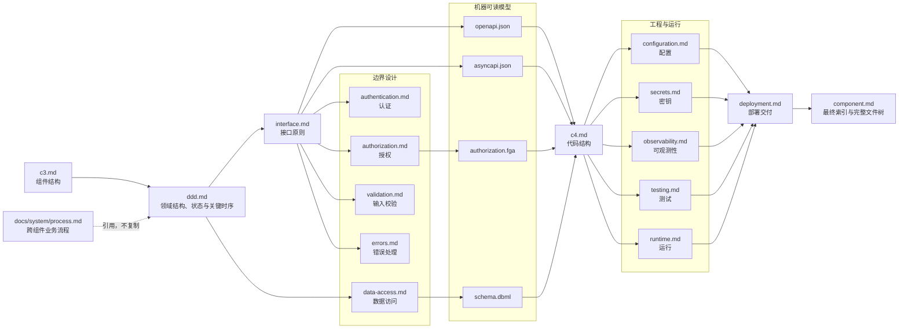
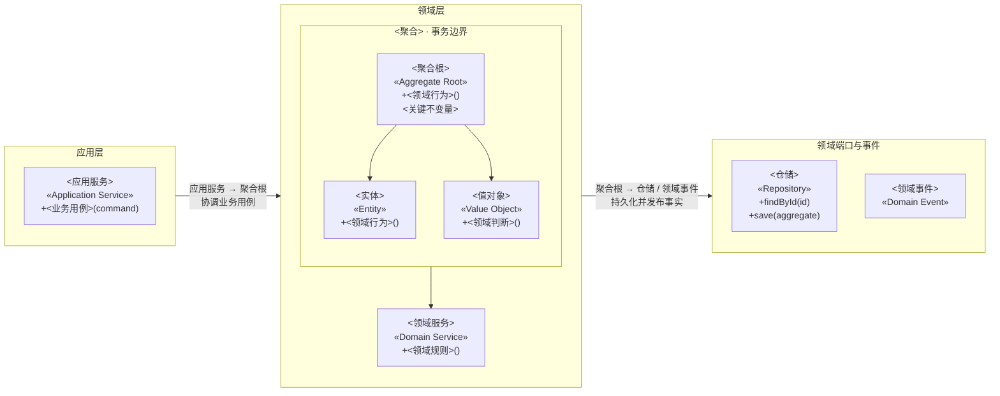

# Backend 组件设计流程与文档模板

## 使用规则

- 使用 `[<组件>] backend <任务>` 启用 Backend 完整组件设计模式。
- 执行前必须先读取 `docs/workflows/stages/component.md`；本文件只补充 Backend 的设计顺序和
  固定文档结构，文件权限、创建条件、通用 C3/C4 格式及跨阶段边界仍以该阶段文件为准。
- `component.md`、`c3.md`、`ddd.md` 和 `testing.md` 始终创建；其他文件仅在满足创建条件时创建。
- 固定标题名称和顺序；每个限界上下文完整保留 DDD 章节，其他不适用的可选章节直接删除。
- 一个事实只由一个文件维护，其他文件使用稳定名称引用，不复制字段、关系、流程或规则。
- `openapi.json`、`asyncapi.json`、`authorization.fga` 和 `schema.dbml` 是机器可读源文件，Markdown 只引用它们。
- 系统安全与可观测性基线只从 `docs/system/security.md` 和 `docs/system/observability.md` 引用。

## 文件关系与设计顺序



## 执行流程

1. 根据 C2 组件清单确定当前组件的应用目录、设计目录和外部连接，读取相关需求、系统规范、
   现有组件规范及当前组件提供的契约。
2. 用 `c3.md` 确认组件边界、主要内部模块、上游调用方和必要外部依赖。
3. 在 `ddd.md` 中按限界上下文分章，用领域结构图结合展示应用服务、领域服务、聚合根、
   必要实体和值对象、领域端口及事件，并维护领域事件列表。
4. 为每个限界上下文维护状态图和关键时序图；时序图引用系统 `process.md` 的稳定流程名，
   不复制跨组件业务流程或接口调用细节。
5. 从已确认的业务行为设计 `interface.md`，再按实际边界设计认证、授权、输入校验、错误处理
   和数据访问；不得从框架、数据库表或现有源码反推业务模型。
6. 由提供方分别维护机器可读模型：`interface.md` 对应 `openapi.json` 或 `asyncapi.json`，
   `authorization.md` 对应 `authorization.fga`，`data-access.md` 对应 `schema.dbml`。
7. 在业务行为、接口和机器可读模型稳定后，用 `c4.md` 设计应用用例、领域对象、Port、
   Adapter 及依赖方向。
8. 根据前述设计完成配置、密钥、可观测性、测试和运行要求，再用 `deployment.md`
   汇总交给 `[deploy]` 阶段的交付要求。
9. 最后更新 `component.md`，使设计架构索引覆盖设计目录内全部实际文件，并使完整文件树落实
   C3、C4、测试策略和运行要求。
10. 每一步发现上游设计不成立时先回到对应文件修正；不得通过下游文档复制或覆盖上游事实。

## `c3.md`

只允许一级标题和一个 Mermaid `flowchart LR` 图；完整分层、关系和布局规则以
`docs/workflows/stages/component.md` 为准。

````md
# C3 组件图

```mermaid
flowchart LR
    <上游调用方、当前组件分层、必要外部依赖及关系>
```
````

## `ddd.md`

````md
# 领域设计

## <限界上下文名称>

### 边界

- 负责：<业务能力>
- 不负责：<明确排除项>
- 外部上下文：<交互上下文>

### 统一语言

| 术语 | 定义 |
|---|---|
| <术语> | <当前上下文中的唯一含义> |

### 领域结构



### 状态图

```mermaid
stateDiagram-v2
    [*] --> <初始状态>
    <当前状态> --> <下一状态>: <命令或领域事件>
    <终止状态> --> [*]
```



### 关键时序


### 领域事件

| 领域事件 | 产生聚合 | 触发条件 | 消费方 | 业务含义 |
|---|---|---|---|---|
| `<事件>` | <聚合> | <已经发生的事实> | <消费方> | <对领域的含义> |
````

- 一个组件默认对应一个限界上下文；只有确实存在不同统一语言和模型边界时才增加上下文章节。
- 每个上下文必须完整包含边界、统一语言、领域结构图、状态图、关键时序和领域事件列表，
  各上下文独立维护自己的术语、模型、生命周期、协作和事件。
- 领域结构图使用 `flowchart LR` 模拟类图，不使用 `classDiagram`；应用层、领域层、
  领域端口与事件从左到右排列，每层使用 `subgraph` 和 `direction TB` 使类型从上到下排列。
- 领域结构图结合展示应用服务、领域服务、聚合根、必要实体和值对象、仓储及领域事件；
  每个聚合使用嵌套 `subgraph` 表达事务边界，只显示类型、DDD 构造型和关键公开业务行为。
- 跨层关系连接分层 `subgraph` 并在标签中写明实际的源类型、目标类型和业务用途，
  跨聚合关系只引用稳定 ID 并标明一致性方式。
- 状态图和关键时序图归属对应限界上下文，不创建独立的 `state.md` 或 `sequence.md`。
- 关键时序只表达领域行为，引用系统 `process.md` 中的稳定流程名，不重复跨组件业务流程，
  也不展开接口参数、消息载荷、超时、重试等技术细节。
- 不在 `ddd.md` 中罗列全部字段、私有方法、ORM 模型或简单数据载体；代码结构、数据库结构和
  接口结构分别由 `c4.md`、`schema.dbml` 和 OpenAPI/AsyncAPI 维护。

## `interface.md`

```md
# 接口设计

## 入口清单

| 入口 | 协议 | 操作 | 调用方 | 契约 |
|---|---|---|---|---|
| <入口> | <协议> | <稳定操作名> | <调用方> | <契约引用> |

## 协议与版本

## 操作定义

## 幂等策略

## 兼容策略

## 契约索引
```

## `authentication.md`

```md
# 身份认证

## 系统基线引用

## 身份来源

## 信任边界

## 凭据与会话

## Token 生命周期

## 轮换、撤销与防重放

## 失败处理
```

## `authorization.md`

```md
# 权限控制

## 系统基线引用

## 主体与资源

## 权限模型

## 权限矩阵

| 主体或角色 | 资源 | 操作 | 条件 | 数据范围 |
|---|---|---|---|---|
| <主体或角色> | <资源> | <操作> | <条件> | <范围> |

## 权限执行点

## 数据范围

## 默认拒绝与失败处理

## 授权模型引用
```

## `validation.md`

```md
# 输入校验

## 输入边界

## 标准化

## 格式校验

## 领域校验

## 校验顺序与职责

## 错误映射
```

## `errors.md`

```md
# 错误处理

## 错误分类

## 稳定错误码

| 错误码 | 含义 | 产生位置 | 是否可重试 |
|---|---|---|---|
| `<错误码>` | <稳定含义> | <产生位置> | <是或否> |

## 协议映射

## 重试策略

## 敏感信息保护
```

## `data-access.md`

```md
# 数据访问

## 数据所有权

## Repository

## 查询模型

## 事务边界

## 并发控制

## 索引策略

## 迁移策略

## 数据保留

## Schema 引用
```

## 机器可读文件

### `openapi.json`

至少维护以下顶层结构：

- `openapi`
- `info`
- `servers`
- `tags`
- `paths`
- `components.schemas`
- `components.securitySchemes`
- 错误响应和示例

### `asyncapi.json`

至少维护以下顶层结构：

- `asyncapi`
- `info`
- `servers`
- `channels`
- `operations`
- `components.messages`
- 消息 Schema 和示例

### `authorization.fga`

至少维护以下结构：

- Schema 版本
- `type`
- `relations`
- `permissions`

### `schema.dbml`

按实际模型维护：

- `Enum`
- `Table`
- 字段与约束
- `indexes`
- `Ref`
- 必要的 `Note`

## `c4.md`

````md
# C4 代码图

## 总览

```mermaid
flowchart LR
    <模块、业务能力与主要依赖>
```

## <业务能力>

```mermaid
flowchart LR
    subgraph interface_layer["接口层"]
        direction TB
        <接口节点>
    end

    subgraph application_layer["应用层"]
        direction TB
        <应用用例>
    end

    subgraph domain_layer["领域层"]
        direction TB
        <聚合、实体、值对象和领域服务>
    end

    subgraph port_layer["端口层"]
        direction TB
        <Port>
    end

    subgraph adapter_layer["适配器层"]
        direction TB
        <Adapter>
    end
```
````

## `configuration.md`

```md
# 配置设计

## 配置清单

| 配置项 | 用途 | 来源 | 默认值 | 是否必需 | 敏感性 |
|---|---|---|---|---|---|
| `<配置项>` | <用途> | <来源> | <默认值> | <是或否> | <级别> |

## 配置来源

## 默认值与覆盖优先级

## 启动校验

## 动态更新
```

## `secrets.md`

```md
# 密钥要求

## 系统基线引用

## 密钥清单

| 密钥 | 用途 | 来源 | 注入方式 | 轮换触发条件 |
|---|---|---|---|---|
| `<密钥标识>` | <用途> | <来源> | <方式> | <条件> |

## 敏感级别

## 轮换与撤销

## 泄漏处理

## 部署交付要求
```

## `observability.md`

```md
# 可观测性

## 系统基线引用

## 业务日志

## 审计事件

## 指标

## Trace 与 Span

## 健康检查

## 告警信号

## 脱敏要求
```

## `testing.md`

```md
# 测试策略

## 测试范围与验证映射

| 需求或设计 | 测试层级 | 测试文件 | 验证目标 |
|---|---|---|---|
| <稳定编号或设计名称> | <层级> | `<测试文件>` | <可观察结果> |

## Fixture 与测试支持

### Mock 数据

路径：`test/fixtures/mock/`

| 文件 | 数据对象 | 使用方 | 测试事项 |
|---|---|---|---|
| `<文件>` | <对象> | <测试范围> | <正常、异常及边界数据> |

### 测试数据库

路径：`test/support/database/`

| 文件 | 作用 | 使用方 | 测试事项 |
|---|---|---|---|
| `<文件>` | <初始化、清理或 Seed> | <测试范围> | <隔离、事务及清理要求> |

### 测试数据

路径：`test/fixtures/data/`

| 文件 | 数据集 | 使用方 | 测试事项 |
|---|---|---|---|
| `<文件>` | <数据集> | <测试范围> | <正常、失败及边界组合> |

## 单元测试

### 领域

路径：`test/unit/domain/`

| 测试文件 | 测试对象 | 函数或操作 | 测试用例 | 测试事项 |
|---|---|---|---|---|
| `<文件>.test.ts` | <聚合、实体、值对象或领域服务> | `<行为>()` | <行为场景> | <不变量、状态或领域事件> |

### 应用

路径：`test/unit/application/`

| 测试文件 | 测试对象 | 函数或操作 | 测试用例 | 测试事项 |
|---|---|---|---|---|
| `<文件>.test.ts` | <应用服务> | `<用例>()` | <用例场景> | <编排、Port 调用、错误及副作用> |

### 基础设施

路径：`test/unit/infrastructure/`

| 测试文件 | 测试对象 | 函数或操作 | 测试用例 | 测试事项 |
|---|---|---|---|---|
| `<文件>.test.ts` | <纯逻辑对象> | `<函数>()` | <转换场景> | <格式、序列化及边界> |

### 数据访问

路径：`test/unit/data/`

| 测试文件 | 测试对象 | 函数或操作 | 测试用例 | 测试事项 |
|---|---|---|---|---|
| `<文件>.test.ts` | <查询或 Mapper> | `<函数>()` | <纯逻辑场景> | <条件构造、分页及数据映射> |

### Adapter

路径：`test/unit/adapters/`

| 测试文件 | 测试对象 | 函数或操作 | 测试用例 | 测试事项 |
|---|---|---|---|---|
| `<文件>.test.ts` | <Adapter> | `<函数>()` | <参数转换场景> | <请求映射、响应映射及错误转换> |

### 授权

路径：`test/unit/authorization/`

| 测试文件 | 测试对象 | 函数或操作 | 测试用例 | 测试事项 |
|---|---|---|---|---|
| `<文件>.test.ts` | <授权策略> | `<函数>()` | <权限场景> | <角色、关系、数据范围及默认拒绝> |

### 认证

路径：`test/unit/authentication/`

| 测试文件 | 测试对象 | 函数或操作 | 测试用例 | 测试事项 |
|---|---|---|---|---|
| `<文件>.test.ts` | <认证对象> | `<函数>()` | <身份场景> | <凭据、有效期、撤销及失败> |

## 集成测试

### 接口契约

路径：`test/integration/api/`

| 测试文件 | 接口或契约 | 函数或操作 | 测试用例 | 测试事项 |
|---|---|---|---|---|
| `<文件>.test.ts` | <OpenAPI operationId 或 AsyncAPI operation> | `<操作>` | <接口场景> | <请求、响应、状态码、错误码及消息结构> |

### 数据访问

路径：`test/integration/data/`

| 测试文件 | 测试对象 | 函数或操作 | 测试用例 | 测试事项 |
|---|---|---|---|---|
| `user-repository.test.ts` | `UserRepository` | `findByPhone()` | 按手机号查询用户 | 查询条件、数据映射及未找到结果 |
| `user-repository.test.ts` | `UserRepository` | `save()` | 保存重复手机号 | 唯一约束、错误转换及事务回滚 |

### Adapter

路径：`test/integration/adapters/`

| 测试文件 | 测试对象 | 函数或操作 | 测试用例 | 测试事项 |
|---|---|---|---|---|
| `<文件>.test.ts` | <Adapter> | `<函数>()` | <真实边界场景> | <协议、超时、失败及错误转换> |

### 认证与授权

路径：`test/integration/security/`

| 测试文件 | 测试对象 | 函数或操作 | 测试用例 | 测试事项 |
|---|---|---|---|---|
| `<文件>.test.ts` | <认证入口或权限执行点> | `<操作>` | <安全场景> | <身份、权限、数据范围及默认拒绝> |

## 并发测试

路径：`test/concurrency/`

| 测试文件 | 测试对象 | 并发操作 | 测试用例 | 测试事项 |
|---|---|---|---|---|
| `<文件>.test.ts` | <聚合或应用服务> | `<操作>()` | <并发场景> | <幂等、事务隔离、冲突及容量限制> |

## 测试配置

| 配置文件 | 作用 | 关键设置 |
|---|---|---|
| `vitest.config.ts` | Vitest 公共配置 | <目录、超时、隔离及覆盖率> |
| `test/setup.ts` | 测试初始化 | <全局 Hook 及清理> |

## 测试命令

| 测试层级 | 命令 | 前置条件 | 执行范围 |
|---|---|---|---|
| 单元测试 | `pnpm test:unit` | 无外部依赖 | 领域规则、应用服务和纯函数 |
| 集成测试 | `pnpm test:integration` | 测试基础设施已启动 | Repository、Adapter、事务和外部边界 |
| 并发测试 | `pnpm test:concurrency` | 测试数据库已启动 | 幂等、事务隔离和资源竞争 |
| 全部测试 | `pnpm test` | 所需测试依赖已启动 | 全部适用测试 |
| 监听模式 | `pnpm test:watch` | 本地开发环境 | 受影响测试 |
| 覆盖率 | `pnpm test:coverage` | Vitest 覆盖率 Provider 可用 | 覆盖率报告 |

### 局部执行

| 目标 | 命令 |
|---|---|
| 单个文件 | `pnpm vitest run <测试文件>` |
| 单个用例 | `pnpm vitest run -t "<用例名称>"` |
| 更新快照 | `pnpm vitest run -u` |
```

- JavaScript 和 TypeScript 组件没有既有测试工具链时，默认使用 `pnpm` 和 Vitest；
  项目已有有效工具链时沿用现状，不为统一格式强制迁移。
- `package.json` scripts 是分层测试命令的唯一来源；`testing.md` 只索引真实存在的脚本，
  按实际适用层级增删表格行，不记录无法执行的占位命令。
- 默认使用 `test`、`test:watch`、`test:unit`、`test:integration`、`test:concurrency`
  和 `test:coverage` 作为适用层级的 script 名称。
- 每条命令必须写明前置条件和执行范围；CI 与本地开发调用相同的 package scripts。
- 单个文件、单个用例和快照更新使用 Vitest CLI；复杂参数不复制到多个文档或 CI 配置中。
- 每个测试分类先写相对组件应用目录的路径，再用表格记录测试文件、测试对象、函数或操作、
  单个测试用例和测试事项；表格中的文件名相对于该分类路径。
- 一行只描述一个稳定测试用例；“测试用例”写行为场景，“测试事项”写需要验证的规则、
  边界、错误和副作用，不使用 `find*` 等模糊函数名合并多个场景。
- 单元测试中的基础设施、数据访问和 Adapter 只覆盖不访问真实外部资源的纯逻辑；
  真实数据库、消息、认证、授权和外部服务边界放入集成测试。
- 集成测试以 OpenAPI、AsyncAPI 等机器可读接口契约为依据，不在测试设计中复制 Schema。

## `runtime.md`

```md
# 运行要求

## 进程模型

## 运行依赖

## 启动流程

## 关闭流程

## 健康检查

## 资源要求

## 故障恢复
```

## `deployment.md`

```md
# 部署交付要求

## 交付物

## 镜像要求

## 初始化

## 数据迁移

## 发布顺序

## 回滚要求

## 向部署阶段交付的输入
```

`deployment.md` 只维护组件交付要求，不保存 Compose、环境值或具体部署命令。

## `component.md`

最后更新 `component.md`，使其索引覆盖所有实际文件，并记录完整的受版本控制文件树。

````md
# <组件>

## 概述

<用一至三段说明组件是什么、负责什么、不负责什么以及主要使用者。>

## 设计架构

| 文件 | 作用 |
|---|---|
| `component.md` | 组件概述、设计文件索引和完整文件结构 |
| `c3.md` | <当前组件的实际作用> |
| `<实际设计文件>` | <该文件维护的唯一设计关注点> |

## 目录结构

```text
<组件应用目录>/
├─ src/
│  └─ <完整生产文件结构>
├─ test/
│  └─ <完整测试文件结构>
└─ <配置文件>
```
````

`component.md` 只维护概述、设计架构索引和完整文件树，不复制其他文件的设计正文。
