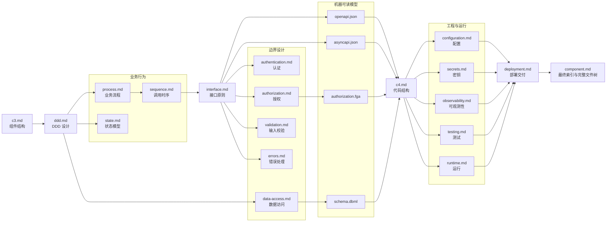

# Backend 组件设计流程与文档模板

## 使用规则

- 使用 `[<组件>] backend <任务>` 启用 Backend 完整组件设计模式。
- 执行前必须先读取 `docs/workflows/stages/component.md`；本文件只补充 Backend 的设计顺序和
  固定文档结构，文件权限、创建条件、通用 C3/C4 格式及跨阶段边界仍以该阶段文件为准。
- `component.md`、`c3.md`、`ddd.md` 和 `testing.md` 始终创建；其他文件仅在满足创建条件时创建。
- 固定标题名称和顺序；不适用的可选章节直接删除，不保留空标题或“无”。
- 一个事实只由一个文件维护，其他文件使用稳定名称引用，不复制字段、关系、流程或规则。
- `openapi.json`、`asyncapi.json`、`authorization.fga` 和 `schema.dbml` 是机器可读源文件，Markdown 只引用它们。
- 系统安全与可观测性基线只从 `docs/system/security.md` 和 `docs/system/observability.md` 引用。

## 文件关系与设计顺序



## 执行流程

1. 根据 C2 组件清单确定当前组件的应用目录、设计目录和外部连接，读取相关需求、系统规范、
   现有组件规范及当前组件提供的契约。
2. 用 `c3.md` 确认组件边界、主要内部模块、上游调用方和必要外部依赖。
3. 用 `ddd.md` 先确定业务能力、统一语言、不变量、事务边界和必要的领域事件。
4. 按实际需要用 `process.md`、`state.md` 和 `sequence.md` 落实业务流程、状态转换及关键调用时序。
5. 从已确认的业务行为设计 `interface.md`，再按实际边界设计认证、授权、输入校验、错误处理
   和数据访问；不得从框架、数据库表或现有源码反推业务模型。
6. 由提供方分别维护机器可读模型：`interface.md` 对应 `openapi.json` 或 `asyncapi.json`，
   `authorization.md` 对应 `authorization.fga`，`data-access.md` 对应 `schema.dbml`。
7. 在业务行为、接口和机器可读模型稳定后，用 `c4.md` 设计应用用例、领域对象、Port、
   Adapter 及依赖方向。
8. 根据前述设计完成配置、密钥、可观测性、测试和运行要求，再用 `deployment.md`
   汇总交给 `[deploy]` 阶段的交付要求。
9. 最后更新 `component.md`，使设计架构索引覆盖设计目录内全部实际文件，并使完整文件树落实
   C3、C4、测试策略和运行要求。
10. 每一步发现上游设计不成立时先回到对应文件修正；不得通过下游文档复制或覆盖上游事实。

## `c3.md`

只允许一级标题和一个 Mermaid `C4Component` 图。

````md
# C3 组件图

```mermaid
C4Component
    title <组件> 组件图

    <当前组件、内部模块、必要外部依赖及关系>
```
````

## `ddd.md`

```md
# 领域设计

## 统一语言

| 术语 | 定义 |
|---|---|
| <术语> | <当前上下文中的唯一含义> |

## 聚合规则

| 聚合 | 业务不变量 | 事务边界 |
|---|---|---|
| `<聚合根>` | <始终成立的业务规则> | <一次事务允许修改的范围> |

## 一致性

- <跨聚合或跨组件的一致性、并发、幂等及补偿规则>

## 领域事件

| 事件 | 触发条件 | 业务含义 |
|---|---|---|
| `<事件>` | <已经发生的事实> | <对领域的含义> |

## 建模决策

- <关键模型边界及其原因>
```

## `process.md`

````md
# 组件内部流程

## 流程清单

| 流程 | 目标 | 参与方 | 触发条件 |
|---|---|---|---|
| <流程> | <业务目标> | <参与方> | <触发条件> |

## <流程名称>

### 参与方与前置条件

### 业务流程

```mermaid
flowchart TD
    <流程节点与关系>
```

### 分支与失败路径

### 一致性、幂等与补偿
````

## `state.md`

````md
# 状态模型

## 状态对象

| 对象 | 状态字段 | 初始状态 | 终止状态 |
|---|---|---|---|
| <聚合、实体或任务> | <字段> | <初始状态> | <终止状态> |

## <状态对象>

### 状态图


### 状态转换

| 当前状态 | 事件或命令 | 守卫条件 | 下一状态 | 副作用 |
|---|---|---|---|---|
| <状态> | <事件或命令> | <条件> | <状态> | <副作用> |

### 非法转换与恢复
````

## `sequence.md`

````md
# 关键时序

## 场景清单

| 场景 | 入口 | 参与方 | 结果 |
|---|---|---|---|
| <场景> | <入口> | <参与方> | <结果> |

## <场景名称>

### 正常时序

```mermaid
sequenceDiagram
    <参与方与调用>
```

### 超时、重试与幂等

### 失败时序
````

## `interface.md`

```md
# 接口设计

## 入口清单

| 入口 | 协议 | 操作 | 调用方 | 契约 |
|---|---|---|---|---|
| <入口> | <协议> | <稳定操作名> | <调用方> | <契约引用> |

## 协议与版本

## 操作定义

## 幂等策略

## 兼容策略

## 契约索引
```

## `authentication.md`

```md
# 身份认证

## 系统基线引用

## 身份来源

## 信任边界

## 凭据与会话

## Token 生命周期

## 轮换、撤销与防重放

## 失败处理
```

## `authorization.md`

```md
# 权限控制

## 系统基线引用

## 主体与资源

## 权限模型

## 权限矩阵

| 主体或角色 | 资源 | 操作 | 条件 | 数据范围 |
|---|---|---|---|---|
| <主体或角色> | <资源> | <操作> | <条件> | <范围> |

## 权限执行点

## 数据范围

## 默认拒绝与失败处理

## 授权模型引用
```

## `validation.md`

```md
# 输入校验

## 输入边界

## 标准化

## 格式校验

## 领域校验

## 校验顺序与职责

## 错误映射
```

## `errors.md`

```md
# 错误处理

## 错误分类

## 稳定错误码

| 错误码 | 含义 | 产生位置 | 是否可重试 |
|---|---|---|---|
| `<错误码>` | <稳定含义> | <产生位置> | <是或否> |

## 协议映射

## 重试策略

## 敏感信息保护
```

## `data-access.md`

```md
# 数据访问

## 数据所有权

## Repository

## 查询模型

## 事务边界

## 并发控制

## 索引策略

## 迁移策略

## 数据保留

## Schema 引用
```

## 机器可读文件

### `openapi.json`

至少维护以下顶层结构：

- `openapi`
- `info`
- `servers`
- `tags`
- `paths`
- `components.schemas`
- `components.securitySchemes`
- 错误响应和示例

### `asyncapi.json`

至少维护以下顶层结构：

- `asyncapi`
- `info`
- `servers`
- `channels`
- `operations`
- `components.messages`
- 消息 Schema 和示例

### `authorization.fga`

至少维护以下结构：

- Schema 版本
- `type`
- `relations`
- `permissions`

### `schema.dbml`

按实际模型维护：

- `Enum`
- `Table`
- 字段与约束
- `indexes`
- `Ref`
- 必要的 `Note`

## `c4.md`

````md
# C4 代码图

## 总览

```mermaid
flowchart LR
    <模块、业务能力与主要依赖>
```

## <业务能力>

```mermaid
flowchart LR
    subgraph interface_layer["接口层"]
        direction TB
        <接口节点>
    end

    subgraph application_layer["应用层"]
        direction TB
        <应用用例>
    end

    subgraph domain_layer["领域层"]
        direction TB
        <聚合、实体、值对象和领域服务>
    end

    subgraph port_layer["端口层"]
        direction TB
        <Port>
    end

    subgraph adapter_layer["适配器层"]
        direction TB
        <Adapter>
    end
```
````

## `configuration.md`

```md
# 配置设计

## 配置清单

| 配置项 | 用途 | 来源 | 默认值 | 是否必需 | 敏感性 |
|---|---|---|---|---|---|
| `<配置项>` | <用途> | <来源> | <默认值> | <是或否> | <级别> |

## 配置来源

## 默认值与覆盖优先级

## 启动校验

## 动态更新
```

## `secrets.md`

```md
# 密钥要求

## 系统基线引用

## 密钥清单

| 密钥 | 用途 | 来源 | 注入方式 | 轮换触发条件 |
|---|---|---|---|---|
| `<密钥标识>` | <用途> | <来源> | <方式> | <条件> |

## 敏感级别

## 轮换与撤销

## 泄漏处理

## 部署交付要求
```

## `observability.md`

```md
# 可观测性

## 系统基线引用

## 业务日志

## 审计事件

## 指标

## Trace 与 Span

## 健康检查

## 告警信号

## 脱敏要求
```

## `testing.md`

```md
# 测试策略

## 测试范围与验证映射

## 单元测试

## 集成测试

## 契约测试

## 安全测试

## 并发测试

## 端到端测试

## Fixture 与测试支持

## 测试运行配置
```

## `runtime.md`

```md
# 运行要求

## 进程模型

## 运行依赖

## 启动流程

## 关闭流程

## 健康检查

## 资源要求

## 故障恢复
```

## `deployment.md`

```md
# 部署交付要求

## 交付物

## 镜像要求

## 初始化

## 数据迁移

## 发布顺序

## 回滚要求

## 向部署阶段交付的输入
```

`deployment.md` 只维护组件交付要求，不保存 Compose、环境值或具体部署命令。

## `component.md`

最后更新 `component.md`，使其索引覆盖所有实际文件，并记录完整的受版本控制文件树。

````md
# <组件>

## 概述

<用一至三段说明组件是什么、负责什么、不负责什么以及主要使用者。>

## 设计架构

| 文件 | 作用 |
|---|---|
| `component.md` | 组件概述、设计文件索引和完整文件结构 |
| `c3.md` | <当前组件的实际作用> |
| `<实际设计文件>` | <该文件维护的唯一设计关注点> |

## 目录结构

```text
<组件应用目录>/
├─ src/
│  └─ <完整生产文件结构>
├─ test/
│  └─ <完整测试文件结构>
└─ <配置文件>
```
````

`component.md` 只维护概述、设计架构索引和完整文件树，不复制其他文件的设计正文。
