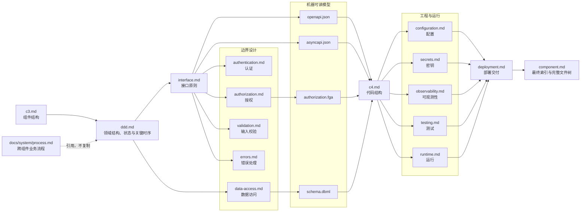
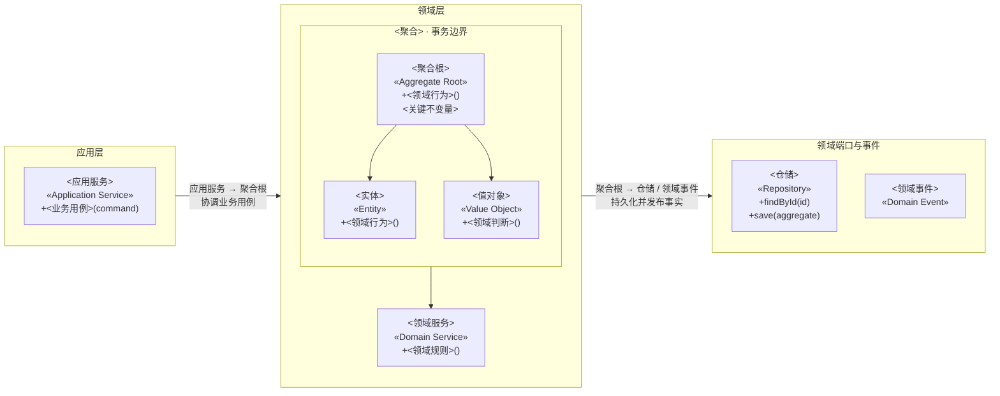

# Backend 组件设计流程与文档模板

## 使用规则

- 使用 `[<组件>] backend <任务>` 启用 Backend 完整组件设计模式。
- 执行前必须先读取 `docs/workflows/stages/component.md`；本文件只补充 Backend 的设计顺序和
  固定文档结构，文件权限、创建条件、通用 C3/C4 格式及跨阶段边界仍以该阶段文件为准。
- `component.md`、`c3.md`、`ddd.md` 和 `testing.md` 始终创建；其他文件仅在满足创建条件时创建。
- 固定标题名称和顺序；每个限界上下文完整保留 DDD 章节，其他不适用的可选章节直接删除。
- 一个事实只由一个文件维护，其他文件使用稳定名称引用，不复制字段、关系、流程或规则。
- `openapi.json`、`asyncapi.json`、`authorization.fga` 和 `schema.dbml` 是机器可读源文件，Markdown 只引用它们。
- 系统安全与可观测性基线只从 `docs/system/security.md` 和 `docs/system/observability.md` 引用。

## 文件关系与设计顺序



## 执行流程

1. 根据 C2 组件清单确定当前组件的应用目录、设计目录和外部连接，读取相关需求、系统规范、
   现有组件规范及当前组件提供的契约。
2. 用 `c3.md` 确认组件边界、主要内部模块、上游调用方和必要外部依赖。
3. 在 `ddd.md` 中按限界上下文分章，用领域结构图结合展示应用服务、领域服务、聚合根、
   必要实体和值对象、领域端口及事件，并维护领域事件列表。
4. 为每个限界上下文维护状态图和关键时序图；时序图引用系统 `process.md` 的稳定 BP 编号，
   不复制跨组件业务流程或接口调用细节。
5. 从已确认的业务行为设计 `interface.md`，再按实际边界设计认证、授权、输入校验、错误处理
   和数据访问；不得从框架、数据库表或现有源码反推业务模型。
6. 由提供方分别维护机器可读模型：`interface.md` 对应 `openapi.json` 或 `asyncapi.json`，
   `authorization.md` 对应 `authorization.fga`，`data-access.md` 对应 `schema.dbml`。
7. 在业务行为、接口和机器可读模型稳定后，用 `c4.md` 设计应用用例、领域对象、Port、
   Adapter 及依赖方向。
8. 根据前述设计完成配置、密钥、可观测性、测试和运行要求，再用 `deployment.md`
   汇总交给 `[deploy]` 阶段的交付要求。
9. 最后更新 `component.md`，使设计架构索引覆盖设计目录内全部实际文件，并使完整文件树落实
   C3、C4、测试策略和运行要求。
10. 每一步发现上游设计不成立时先回到对应文件修正；不得通过下游文档复制或覆盖上游事实。

## `c3.md`

只允许一级标题和一个 Mermaid `flowchart LR` 图；完整分层、关系和布局规则以
`docs/workflows/stages/component.md` 为准。

````md
# C3 组件图

```mermaid
flowchart LR
    <上游调用方、当前组件分层、必要外部依赖及关系>
```
````

## `ddd.md`

````md
# 领域设计

## <限界上下文名称>

### 边界

- 负责：<业务能力>
- 不负责：<明确排除项>
- 外部上下文：<交互上下文>

### 统一语言

| 术语 | 定义 |
|---|---|
| <术语> | <当前上下文中的唯一含义> |

### 领域结构



### 状态图

```mermaid
stateDiagram-v2
    [*] --> <初始状态>
    <当前状态> --> <下一状态>: <命令或领域事件>
    <终止状态> --> [*]
```



### 关键时序


### 领域事件

| 领域事件 | 产生聚合 | 触发条件 | 消费方 | 业务含义 |
|---|---|---|---|---|
| `<事件>` | <聚合> | <已经发生的事实> | <消费方> | <对领域的含义> |
````

- 一个组件默认对应一个限界上下文；只有确实存在不同统一语言和模型边界时才增加上下文章节。
- 每个上下文必须完整包含边界、统一语言、领域结构图、状态图、关键时序和领域事件列表，
  各上下文独立维护自己的术语、模型、生命周期、协作和事件。
- 领域结构图使用 `flowchart LR` 模拟类图，不使用 `classDiagram`；应用层、领域层、
  领域端口与事件从左到右排列，每层使用 `subgraph` 和 `direction TB` 使类型从上到下排列。
- 领域结构图结合展示应用服务、领域服务、聚合根、必要实体和值对象、仓储及领域事件；
  每个聚合使用嵌套 `subgraph` 表达事务边界，只显示类型、DDD 构造型和关键公开业务行为。
- 跨层关系连接分层 `subgraph` 并在标签中写明实际的源类型、目标类型和业务用途，
  跨聚合关系只引用稳定 ID 并标明一致性方式。
- 状态图和关键时序图归属对应限界上下文，不创建独立的 `state.md` 或 `sequence.md`。
- 关键时序只表达领域行为，引用系统 `process.md` 中的稳定 BP 编号，不重复跨组件业务流程，
  也不展开接口参数、消息载荷、超时、重试等技术细节。
- 不在 `ddd.md` 中罗列全部字段、私有方法、ORM 模型或简单数据载体；代码结构、数据库结构和
  接口结构分别由 `c4.md`、`schema.dbml` 和 OpenAPI/AsyncAPI 维护。

## `interface.md`

```md
# 接口设计

## 入口清单

| 入口 | 协议 | 操作 | 调用方 | 契约 |
|---|---|---|---|---|
| <入口> | <协议> | <稳定操作名> | <调用方> | <契约引用> |

## 协议与版本

## 操作定义

## 幂等策略

## 兼容策略

## 契约索引
```

## `authentication.md`

```md
# 身份认证

## 系统基线引用

## 身份来源

## 信任边界

## 凭据与会话

## Token 生命周期

## 轮换、撤销与防重放

## 失败处理
```

## `authorization.md`

```md
# 权限控制

## 系统基线引用

## 主体与资源

## 权限模型

## 权限矩阵

| 主体或角色 | 资源 | 操作 | 条件 | 数据范围 |
|---|---|---|---|---|
| <主体或角色> | <资源> | <操作> | <条件> | <范围> |

## 权限执行点

## 数据范围

## 默认拒绝与失败处理

## 授权模型引用
```

## `validation.md`

```md
# 输入校验

## 输入边界

## 标准化

## 格式校验

## 领域校验

## 校验顺序与职责

## 错误映射
```

## `errors.md`

```md
# 错误处理

## 错误分类

## 稳定错误码

| 错误码 | 含义 | 产生位置 | 是否可重试 |
|---|---|---|---|
| `<错误码>` | <稳定含义> | <产生位置> | <是或否> |

## 协议映射

## 重试策略

## 敏感信息保护
```

## `data-access.md`

```md
# 数据访问

## 数据所有权

## Repository

## 查询模型

## 事务边界

## 并发控制

## 索引策略

## 迁移策略

## 数据保留

## Schema 引用
```

## 机器可读文件

### `openapi.json`

至少维护以下顶层结构：

- `openapi`
- `info`
- `servers`
- `tags`
- `paths`
- `components.schemas`
- `components.securitySchemes`
- 错误响应和示例

### `asyncapi.json`

至少维护以下顶层结构：

- `asyncapi`
- `info`
- `servers`
- `channels`
- `operations`
- `components.messages`
- 消息 Schema 和示例

### `authorization.fga`

至少维护以下结构：

- Schema 版本
- `type`
- `relations`
- `permissions`

### `schema.dbml`

按实际模型维护：

- `Enum`
- `Table`
- 字段与约束
- `indexes`
- `Ref`
- 必要的 `Note`

## `c4.md`

````md
# C4 代码图

## 总览

```mermaid
flowchart LR
    <模块、业务能力与主要依赖>
```

## <业务能力>

```mermaid
flowchart LR
    subgraph interface_layer["接口层"]
        direction TB
        <接口节点>
    end

    subgraph application_layer["应用层"]
        direction TB
        <应用用例>
    end

    subgraph domain_layer["领域层"]
        direction TB
        <聚合、实体、值对象和领域服务>
    end

    subgraph port_layer["端口层"]
        direction TB
        <Port>
    end

    subgraph adapter_layer["适配器层"]
        direction TB
        <Adapter>
    end
```
````

## `configuration.md`

```md
# 配置设计

## 配置清单

| 配置项 | 用途 | 来源 | 默认值 | 是否必需 | 敏感性 |
|---|---|---|---|---|---|
| `<配置项>` | <用途> | <来源> | <默认值> | <是或否> | <级别> |

## 配置来源

## 默认值与覆盖优先级

## 启动校验

## 动态更新
```

## `secrets.md`

```md
# 密钥要求

## 系统基线引用

## 密钥清单

| 密钥 | 用途 | 来源 | 注入方式 | 轮换触发条件 |
|---|---|---|---|---|
| `<密钥标识>` | <用途> | <来源> | <方式> | <条件> |

## 敏感级别

## 轮换与撤销

## 泄漏处理

## 部署交付要求
```

## `observability.md`

```md
# 可观测性

## 系统基线引用

## 业务日志

## 审计事件

## 指标

## Trace 与 Span

## 健康检查

## 告警信号

## 脱敏要求
```

## `testing.md`

```md
# 测试策略

本组件使用 <语言和版本>，沿用 <构建或包管理工具>、<测试框架> 及项目现有测试工具链。

## Fixture 与测试支持

### Fixture

路径：`<Fixture 目录>`

| 文件 | 数据对象 | 使用方 | 测试事项 |
|---|---|---|---|
| `<文件>` | <对象或数据集> | <用例编号> | <正常、失败及边界数据> |

### 测试支持

路径：`<测试支持目录>`

| 文件 | 类型 | 使用方 | 作用 |
|---|---|---|---|
| `<文件>` | <Fake、Stub、Mock、Builder 或数据库支持> | <用例编号> | <固定外部边界、初始化或清理> |

## 单元测试

### Domain 测试

路径：`<领域单元测试目录>`

#### appointment.test.ts

测试对象：`Appointment` 聚合的取消和完成状态转换。

##### BOOKING-UNIT-APPOINTMENT-001

> Req：`REQ-001-BR-002`、`REQ-001-AC-008`
> Design：`ddd.md#预约#状态图#Appointment`

Desc：取消待就诊预约
Given：预约处于 `pending`。
When：调用 `cancel()`。
Then：预约状态变为 `cancelled`，并产生可观察的取消结果。

### Application 测试

路径：`<应用单元测试目录>`

#### <应用单元测试文件>

测试对象：`<应用服务、Command Handler 或 Query Handler>`

##### AUTH-UNIT-LOGIN-001

> BP：`BP-001`
> Req：`REQ-001-FR-001`
> Design：`ddd.md#认证#关键时序#登录`

Desc：<简短中文描述>
Given：<聚合、Port 返回值和当前用户等前置条件>
When：<执行一个应用用例>
Then：<可观察的输出、状态、错误或必要副作用>

### Infrastructure 纯逻辑测试

路径：`<基础设施纯逻辑单元测试目录>`

#### <基础设施纯逻辑测试文件>

测试对象：`<配置解析、查询条件构造或不访问外部资源的纯逻辑对象>`

##### SHARED-UNIT-CONFIGURATION-001

> Design：`configuration.md#启动校验`

Desc：<简短中文描述>
Given：<纯输入和配置前置条件>
When：<执行一个纯逻辑公开操作>
Then：<可观察的返回值或稳定错误>

## 集成测试

### 数据访问测试

路径：`<数据访问集成测试目录>`

#### <数据访问集成测试文件>

测试对象：`<Repository 或数据访问实现>`

##### AUTH-INTEGRATION-SESSION-001

> Req：`REQ-001-BR-002`
> Design：`data-access.md#Repository#SessionRepository`

Desc：<简短中文描述>
Given：<真实数据库状态和迁移前置条件>
When：<执行一个 Repository 操作>
Then：<可观察的映射、约束、事务或并发结果>

### Adapter 测试

路径：`<Adapter 集成测试目录>`

#### <Adapter 集成测试文件>

测试对象：`<消息、缓存或第三方服务 Adapter>`

##### AUTH-INTEGRATION-ADAPTER-001

> Design：`interface.md#<章节>`

Desc：<简短中文描述>
Given：<真实或受控外部边界状态>
When：<执行一个 Adapter 公开操作>
Then：<可观察的协议、序列化、超时、重试或错误转换结果>

### 接口测试

路径：`test/integration/api/<http、events 或 rpc>/`

契约：`<OpenAPI、AsyncAPI 或 RPC IDL>`

#### <接口集成测试文件>

测试对象：`<operationId、AsyncAPI operation 或 RPC 方法>`

##### AUTH-INTEGRATION-LOGIN-001

> BP：`BP-001`
> Req：`REQ-001-FR-001`
> Design：`interface.md#操作定义#登录`

Desc：<简短中文描述>
Given：<入口调用前状态和输入>
When：<通过真实 HTTP、异步消息或 RPC 入口调用组件>
Then：<可观察的响应、状态码、错误码、消息或必要副作用>

### 模块协作测试

路径：`<模块集成测试目录>`

#### <模块集成测试文件>

测试对象：`<参与模块或限界上下文>`

##### AUTH-INTEGRATION-MODULE-001

> BP：`BP-001`
> Design：`ddd.md#认证#关键时序#<流程>`

Desc：<简短中文描述>
Given：<模块协作前状态>
When：<从一个真实模块入口执行行为>
Then：<可观察的模块契约、事务或事件传递结果>

## 契约测试

路径：`<契约测试目录>`

契约：`<机器可读契约>`

#### <契约测试文件>

测试对象：`<提供方与消费方>`

##### AUTH-CONTRACT-EVENT-001

> Req：`REQ-001-FR-001`
> Design：`interface.md#契约索引`

Desc：<简短中文描述>
Given：<契约版本和输入>
When：<使用机器可读契约校验>
Then：<可观察的字段、类型、错误结构、版本或兼容性结果>

## 并发测试

路径：`<并发测试目录>`

#### <并发测试文件>

测试对象：`<聚合、应用服务或 Repository>`

##### AUTH-CONCURRENCY-TOKEN-001

> Req：`REQ-001-BR-003`
> Design：`data-access.md#并发控制`

Desc：<简短中文描述>
Given：<并发操作前状态>
When：<并发执行同一公开操作>
Then：<唯一可接受的最终状态、幂等、冲突或事务隔离结果>

## 端到端测试

路径：`<端到端测试目录>`

#### <端到端测试文件>

测试对象：`<跨组件核心业务链路>`

##### AUTH-E2E-LOGIN-001

> BP：`BP-001`
> Req：`REQ-001-AC-001`

Desc：<简短中文描述>
Given：<完整测试环境和业务前置状态>
When：<从用户可见入口执行核心业务链路>
Then：<跨组件可观察的最终结果>

## 测试配置

| 配置文件 | 作用 | 关键设置 |
|---|---|---|
| `<实际配置文件>` | <测试框架配置> | <目录、超时、隔离、并发及覆盖率> |
| `<实际初始化文件>` | <测试初始化与清理> | <全局 Hook、环境初始化及资源释放> |

## 测试命令

| 测试层级 | 命令 | 前置条件 | 执行范围 |
|---|---|---|---|
| 单元测试 | `<实际命令>` | 无外部依赖 | Domain 和 Application 测试 |
| 接口测试 | `<实际命令>` | 组件入口及测试基础设施可用 | HTTP、异步消息和 RPC 接口 |
| 集成测试 | `<实际命令>` | 测试基础设施已启动 | Repository、Adapter、事务和模块协作 |
| 契约测试 | `<实际命令>` | 机器可读契约可用 | 接口和消息兼容性 |
| 并发测试 | `<实际命令>` | 所需基础设施已启动 | 幂等、事务隔离和资源竞争 |
| 端到端测试 | `<实际命令>` | 完整测试环境可用 | 核心跨组件业务链路 |
| 全部测试 | `<实际命令>` | 所需测试依赖已启动 | 全部适用测试 |
| 覆盖率 | `<实际命令>` | 覆盖率能力已配置 | 按需手动导出覆盖率报告 |

### 局部执行

| 目标 | 命令 |
|---|---|
| 单个文件 | `<实际命令>` |
| 单个用例 | `<按“用例编号 + 描述”筛选的实际命令>` |
```

- 开头只用一句话说明当前语言、运行时、构建或包管理工具和测试框架，不创建语言映射表或
  测试用例总表；沿用项目现有有效工具链，JavaScript 和 TypeScript 没有现有工具链时默认
  使用 `pnpm` 和 Vitest。
- 单元测试只按 Domain、Application 和 Infrastructure 纯逻辑分类；配置解析、查询条件构造
  等不访问外部资源的技术逻辑归入 Infrastructure，不为单个文件创建“数据”等额外分类。
- 每个测试文件使用不带反引号的四级标题并记录测试对象；每个测试用例使用只含用例编号且不带
  反引号的五级标题。编号格式为“`<限界上下文>-<测试层级>-<对象或能力>-<三位序号>`”，
  测试层级使用 `UNIT`、`INTEGRATION`、`CONTRACT`、`CONCURRENCY` 或 `E2E`；编号在组件内
  唯一且稳定，删除后不复用。
- 每个用例先在连续的 Markdown 引用行中写可选的 `BP`、`Req`、`Design`，再依次写必需的
  `Desc`、`Given`、`When`、`Then`，字段名统一使用英文和全角冒号。`Desc` 是不含编号的
  简短中文描述；四个字段连续书写，彼此之间不留空行。测试代码中的用例描述使用
  “`<用例编号> <Desc>`”。
- `BP`、`Req`、`Design` 中至少存在一项。`BP` 只引用系统 `process.md` 中实际存在的跨组件
  业务流程，`Req` 引用实际需求项，`Design` 使用“`<文件>#<章节>#<子章节>`”引用实际设计位置；
  存在多个引用时使用顿号分隔，不适用时省略该引用行。
- `Given` 只描述执行前状态、输入和依赖，`When` 只描述一个公开行为、应用用例或协议入口，
  `Then` 只描述可观察结果；多个结果使用项目符号列表。
- Domain 测试使用真实领域对象且不访问外部资源；Application 测试只替换 Repository、外部
  服务、消息、时钟、ID 和当前用户等 Port，不 Mock 聚合、实体、值对象或领域规则。
- 一个用例只描述一个主要行为；不同公开操作、成功与失败分支或具有独立业务意义的边界场景
  使用不同用例，不在同一个 `When` 中使用“或”“依次”合并多个操作。
- 真实数据库、消息、认证、授权和外部服务边界放入集成测试；模块协作、契约和端到端章节
  仅在存在实际场景时创建，不创建空章节。
- 接口测试归入集成测试，通过真实 HTTP、异步消息或 RPC 入口验证组件，并以 OpenAPI、
  AsyncAPI 或 RPC IDL 为依据，不复制契约 Schema。
- BP 主要用于 Application、接口、模块协作和 E2E 测试；低层测试没有直接验证跨组件流程时
  省略 BP。消息发布或消费行为由集成测试验证，Schema 结构与版本兼容性由契约测试验证，
  不在两个层级重复相同断言。
- `testing.md` 只索引项目真实存在的命令，不记录无法执行的占位命令；每条命令写明前置条件
  和执行范围。测试报告和覆盖率报告按需由用户手动导出，不作为默认生成或提交的项目文件。

## `runtime.md`

```md
# 运行要求

## 进程模型

## 运行依赖

## 启动流程

## 关闭流程

## 健康检查

## 资源要求

## 故障恢复
```

## `deployment.md`

```md
# 部署交付要求

## 交付物

## 镜像要求

## 初始化

## 数据迁移

## 发布顺序

## 回滚要求

## 向部署阶段交付的输入
```

`deployment.md` 只维护组件交付要求，不保存 Compose、环境值或具体部署命令。

## `component.md`

最后更新 `component.md`，使其索引覆盖所有实际文件，并记录完整的受版本控制文件树。

````md
# <组件>

## 概述

<用一至三段说明组件是什么、负责什么、不负责什么以及主要使用者。>

## 设计架构

| 文件 | 作用 |
|---|---|
| `component.md` | 组件概述、设计文件索引和完整文件结构 |
| `c3.md` | <当前组件的实际作用> |
| `<实际设计文件>` | <该文件维护的唯一设计关注点> |

## 目录结构

```text
<组件应用目录>/
├─ src/
│  └─ <完整生产文件结构>
├─ test/
│  └─ <完整测试文件结构>
└─ <配置文件>
```
````

`component.md` 只维护概述、设计架构索引和完整文件树，不复制其他文件的设计正文。
