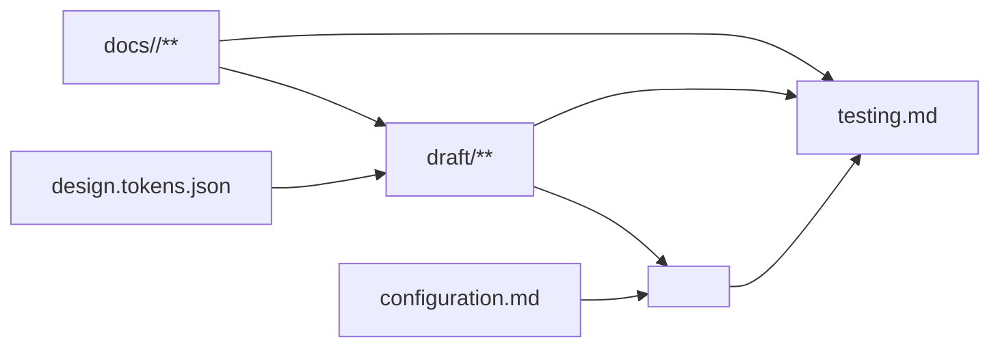

# Frontend 文档模板

用于 `<doc 组件> tmp frontend`。`frontend` 是文档阶段模板，不是目录名；产物始终位于
`docs/<组件>/`。Require 决定模块、功能、页面、业务规则、权限、流程与验收，Frontend 不重复定义或扩展这些事实。

未指定 `draft` 或 `opt` 时，按以下顺序维护：

```text
README.md
  → design.tokens.json
  → draft/**
  → configuration.md
  → testing.md
  → README.md 索引与文件关系校对
```

Draft 编码规范由 `templates/frontend-draft.template.md` 独立维护。

## 专家团

- UX 与无障碍专家：检查 Require 是否足以形成完整页面、导航、交互语义和可访问性表现。
- QML 与视觉专家：负责 Design Token、QML 组件边界、主题、布局、状态、事件、动画和浏览器预览。
- Frontend 架构与测试专家：负责 QML 到目标平台的转换边界、配置和验收策略。

专家只读分析并返回决策、风险、建议和阻塞；主 Agent 统一修改与验证。

## 阶段边界

```text
Require
  模块、功能、页面、业务规则、权限、流程、契约、验收
      ↓
Frontend
  Design Token + 完整可运行 QML Draft + 转换配置 + 转换测试
      ↓
<dev 组件>
  将 QML Draft 转换为 README 声明的目标平台生产代码
```

- 创建模块、页面或改变产品行为时必须显式使用 `req <需求组件>`，并引用其稳定标识；缺失时停止，不由 Frontend 猜测。
- 没有显式 `req` 时，只能维护当前组件已经存在的视觉、Draft、配置或测试事实，不新增模块、页面、业务规则或权限。
- QML Draft 是可运行的中间产品，不是目标平台生产源码；数据可以是明确标记的临时合成数据。
- Frontend 不创建 `ux.md`、`state.md` 或 `mapping.md`：产品事实属于 Require，可观察界面与状态属于 QML，转换规则属于本模板与 `configuration.md`。

## README 技术入口

README 第一个创建或确认，固定使用以下章节结构：

````md
# <组件名称>

> Ref: `docs/<req组件>/README.md`

应用目录：`apps/<实际路径>/`
开发模板：`frontend`

## 概述

<项目用途、目标用户和职责边界>

## 技术基线

| 类别 | 选择 | 版本 | 官方文档 |
|---|---|---|---|
| Draft | QML / Qt Quick | `<精确版本>` | `<官方文档 URL>` |
| 浏览器预览 | Qt for WebAssembly | `<精确版本>` | `<官方文档 URL>` |
| 生产平台 | `<框架>` | `<精确版本>` | `<官方文档 URL>` |
| 测试 | `<工具>` | `<精确版本>` | `<官方文档 URL>` |

## 文档索引

| 文件 | 职责 |
|---|---|
| `design.tokens.json` | 项目主题唯一事实源 |
| `draft/` | 完整可运行的 QML 中间应用 |
| `configuration.md` | QML 转换后的平台配置与接入要求 |
| `testing.md` | 目标平台转换结果的验收要求 |

## 文件关系



## 技术实现

### <关键技术>

```text
<最小实现说明>
```
````

- README 第一条引用必须指向显式 Require 组件；不复制 Require 的模块、功能或页面正文。
- 应用目录、开发模板、技术版本和官方文档必须唯一且已确认，不猜测版本或使用版本范围。
- `## 技术实现` 位于文末；只记录影响 Draft 构建或平台转换的关键采用方式，不复制教程。
- 不创建 `## 职责`；职责边界合并到 `## 概述`。

## 文件职责

| 文件 | 唯一维护内容 |
|---|---|
| `README.md` | Require 引用、应用映射、简单概述、技术基线、文档索引、文件关系和关键技术实现 |
| `design.tokens.json` | DTCG 2025.10 格式的颜色、字体、间距、尺寸、圆角、阴影和动效 Token |
| `draft/**` | 完整 QML 源码、共享组件、资产、临时数据、桌面与 WebAssembly 构建入口 |
| `configuration.md` | QML 转目标平台后的环境变量、路由、数据映射、主题接入和启动校验 |
| `testing.md` | Require 验收在目标平台上的页面、状态、设备、无障碍、视觉、性能和契约验证 |

完整 Frontend 任务固定维护上述五项产物，不创建额外文档或空占位章节。

## Design Token

`design.tokens.json` 是主题唯一事实源，遵循 DTCG Design Tokens Format Module 2025.10，使用 `$type`、`$value`
和分组类型继承：

```json
{
  "color": {
    "$type": "color",
    "primary": {
      "$value": {
        "colorSpace": "srgb",
        "components": [0.145, 0.388, 0.922],
        "alpha": 1,
        "hex": "#2563eb"
      }
    }
  },
  "space": {
    "$type": "dimension",
    "small": {
      "$value": { "value": 8, "unit": "px" }
    }
  },
  "duration": {
    "$type": "duration",
    "fast": {
      "$value": { "value": 120, "unit": "ms" }
    }
  }
}
```

- Token 名称稳定且语义化；对象含 `$value` 时是 Token，不含 `$value` 时是分组，类型必须显式声明或从最近分组继承。
- Draft 将 JSON 机械转换为 `draft/src/Theme.qml`；该文件允许提交，但禁止手工修改，启动与构建前必须校验同步。
- 目标平台主题由 `<dev 组件>` 直接从 `design.tokens.json` 转换，不以 `Theme.qml` 作为第二事实源。

## `configuration.md`

只描述 Draft 转换为目标平台代码后的接入要求：

```md
# Configuration

## Runtime

| 配置项 | 环境 | 必填 | 来源 | 启动校验 |
|---|---|---|---|---|
| `API_BASE_URL` | production | 是 | 部署环境 | 必须是 HTTPS URL |

## Data mapping

| Draft 临时数据 | Require/OpenAPI 来源 | 移除条件 |
|---|---|---|
| `MockStore.currentUser` | `<operationId>` | 真实客户端接入后移除 |

## Routing

| 页面标识 | 平台路由 |
|---|---|
| `M-001:P-001` | `/login` |

## Theme

<design.tokens.json 到目标平台主题系统的机械转换方式>
```

- 不重复 README 技术选择、Require 契约正文或 QML 代码。
- 不保存真实凭据、环境值或平台私有密钥。

## `testing.md`

使用稳定页面标识和 Given/When/Then 描述转换后的可观察结果：

```md
# Testing

## M-001:P-001

### P-001-T001 正常展示

- Given：临时或契约数据有效
- When：打开 `M-001:P-001`
- Then：页面内容、导航和主要操作与 QML Draft 一致
```

- 覆盖 Require 中适用的 AC，以及 QML 展示的 loading、empty、success、error、unauthorized 等状态。
- 覆盖页面声明的设备尺寸、键盘、焦点、语义、对比度、动效降级、视觉差异、性能预算和契约映射。
- 测试目标是 `<dev 组件>` 生成的生产代码；QML Draft 的语法、构建和浏览器冒烟检查属于 Draft 完成检查。

## 完成检查

- README 章节顺序固定为概述、技术基线、文档索引、文件关系、技术实现，应用映射与 Require 引用完整。
- 没有 `ux.md`、`state.md`、`mapping.md`、旧式 UI YAML、Web Components Draft 或第二份手工 Token。
- `design.tokens.json` 符合 DTCG 2025.10；`draft/src/Theme.qml` 是经过校验的机械生成物。
- Draft 能完整导航并展示 Require 定义的模块、页面、组件、交互、状态、动画、响应式变化和主题。
- Draft 使用临时合成数据，无真实 API、生产凭据、真实个人信息或生产业务基础设施。
- `configuration.md` 和 `testing.md` 面向 QML 转换后的目标平台，不重复其他文件事实。
- README 文档索引与实际文件一致，Draft 完成检查全部通过。
