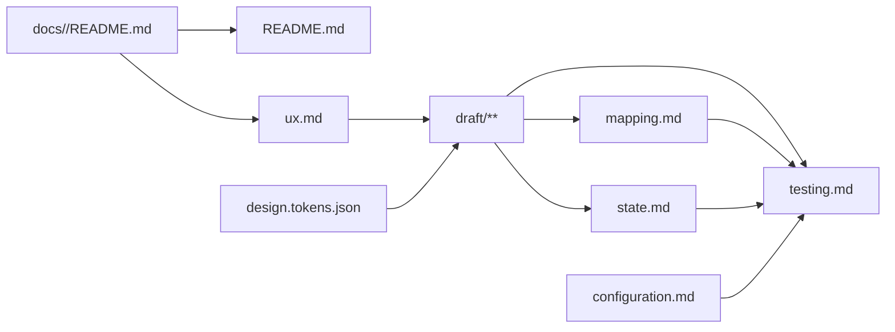

# Frontend 文档模板

用于 `<doc 组件> tmp frontend`。先创建或读取 README 技术入口，再按以下顺序维护：

```text
README.md 技术入口 + 显式 req
  → ux.md
  → design.tokens.json
  → draft 初稿（包含 layout、page、component 和复杂状态占位标签）
  → state.md（存在复杂状态时，只定义状态，不回填 Draft）
  → mapping.md
  → configuration.md
  → testing.md
  → README.md 索引与文件关系校对
```

## 专家团

- UX 与无障碍专家：负责用户、页面、导航、交互语义、响应式和可访问性边界。
- UI 与 Web Components 专家：负责 Design Token、组件边界、Shadow DOM 和完整 Draft 渲染。
- Frontend 架构与测试专家：负责复杂状态、配置、性能和测试策略。

专家只读分析并返回决策、风险、建议和阻塞；主 Agent 统一修改与验证。

## README 技术入口

README 第一个创建或确认，为后续设计提供唯一技术基线：

````md
# <组件名称>

> Ref: `docs/<req组件>/README.md`

应用目录：`apps/<实际路径>/`
开发模板：`frontend`

## 职责

<组件负责和不负责的内容>

## 技术基线

| 类别 | 选择 | 版本 | 官方文档 |
|---|---|---|---|
| 语言 | `<语言>` | `<精确版本>` | `<官方文档 URL>` |
| 框架 | `<框架>` | `<精确版本>` | `<官方文档 URL>` |
| 样式 | `<方案>` | `<精确版本>` | `<官方文档 URL>` |
| 测试 | `<工具>` | `<精确版本>` | `<官方文档 URL>` |

## 文档索引

| 文件 | 职责 |
|---|---|

## 文件关系



## 技术实现

### <关键技术>
````

- 只列当前组件实际采用的技术；版本来自项目清单、锁文件或已确认决策，不猜测或使用版本范围。
- 官方文档直接链接所用版本页面。
- README 的第一条引用必须指向显式 `req` 组件；README 是文件关系、框架、技术实现细节、官方文档和示例代码的唯一事实源。
- `## 技术实现` 位于 README 文末；初始化时可仅保留空的 `### <关键技术>`，后续按实际情况填写。
  每个已填写主题各用一个 `###` 和一个代码块，只保留能说明采用方式的最小实现，不复制教程。

## 文件职责

| 文件 | 唯一维护内容 |
|---|---|
| `README.md` | Require 引用、职责、应用目录、开发模板、技术基线、官方文档、文件关系和按主题组织的技术实现 |
| `ux.md` | 用户、模块、页面、入口、导航、布局、表单、交互和可访问性规则 |
| `design.tokens.json` | DTCG 2025.10 格式的颜色、字体、间距、尺寸、圆角、阴影和动效 Token |
| `draft/**` | 使用原生 Web Components 完整渲染当前组件的布局、页面、复用组件和复杂状态交互占位 |
| `state.md` | 供开发阶段实现的复杂数据请求、共享状态、缓存、转换、并发和错误恢复 |
| `mapping.md` | Draft 布局、页面和组件到生产框架组件及目标路径的唯一映射 |
| `configuration.md` | 配置项、环境差异和启动校验 |
| `testing.md` | 页面、状态、响应式、可访问性、视觉、性能和契约验证要求 |

没有复杂状态时不创建 `state.md`。README、UX、Token、Draft、映射、配置和测试仍按实际需要维护，
不再生成旧式 UI YAML 或手工维护第二份 Token 格式。

## `ux.md`

````md
# UX 设计

> Ref: `docs/<req组件>/README.md`

## M-001 <模块名称>

### P-001 <页面名称>

> Ref: `docs/<req组件>/M-001/FR-001.md`

#### 路由

- `/login`

| 目标页面 | 访问权限 | 无权限表现 |
|---|---|---|
| `ux:M-002:P-001` | `anon:auth:login` | 弹窗提示 |

#### LAYOUT-001 <布局名称>

- 居中卡片，无导航栏

| 顺序 | 组件引用 | 组件名称 | 显示条件 |
|---|---|---|---|
| 001 | `FORM-001` | <组件名称> | 始终 |
| 002 | `DIALOG-001` | <组件名称> | 登录失败后 |

#### FORM-001 <表单名称>

| 字段标识 | 标签 | 控件 | 必填 | 规则引用 | 错误提示 |
|---|---|---|---|---|---|
| `phone` | 手机号 | `tel` | 是 | `M-001/BR-001` | 请输入有效的手机号 |
| `password` | 密码 | `password` | 是 | `M-001/BR-002` | 请输入有效的密码 |

#### DIALOG-001 <对话框名称>

| 顺序 | 内容类型 | 内容引用 | 显示条件 |
|---|---|---|---|
| 001 | 表单 | `FORM-002` | 始终 |

#### FORM-002 <对话框表单名称>

| 字段标识 | 标签 | 控件 | 必填 | 规则引用 | 错误提示 |
|---|---|---|---|---|---|
| `departmentName` | 科室名称 | `text` | 是 | `M-001/BR-003` | 请输入科室名称 |
| `description` | 简介 | `textarea` | 否 | — | — |

#### 状态引用

- 登录请求：`state:M-001:P-001:D-001`
- Draft 标签：`state:M-001:P-001:D-001:pending`
````

- 二级标题固定为 `## M-001 <模块名称>`，三级标题是模块内页面编号 `### P-001 <页面名称>`；页面引用统一为 `ux:M-001:P-001`。
- 布局、表单和对话框分别使用 `LAYOUT-001`、`FORM-001`、`DIALOG-001`；对话框内容通过表格引用内部表单。
- 定义用户可观察的页面、导航和交互，不指定框架组件、请求缓存或生产源码结构。
- 每个模块、页面和关键交互在首次定义处引用具体 FR，不复制需求或契约内容。

## Design Token

`design.tokens.json` 是风格规范唯一事实源，遵循 DTCG Design Tokens Format Module 2025.10，使用 `$type`、`$value`
和分组类型继承：

```json
{
  "color": {
    "$type": "color",
    "primary": {
      "$value": {
        "colorSpace": "srgb",
        "components": [0.145, 0.388, 0.922],
        "alpha": 1,
        "hex": "#2563eb"
      }
    }
  },
  "space": {
    "$type": "dimension",
    "small": {
      "$value": { "value": 8, "unit": "px" }
    }
  },
  "duration": {
    "$type": "duration",
    "fast": {
      "$value": { "value": 120, "unit": "ms" }
    }
  }
}
```

- Token 名称稳定且语义化；对象含 `$value` 时是 Token，不含 `$value` 时是分组，类型必须显式声明或从最近分组继承。
- Draft 读取或机械转换该 JSON，不在页面、Layout 或 Shadow DOM 内重复硬编码同一风格事实。
- 生产平台需要 CSS Custom Properties 或框架主题时，由开发阶段从 JSON 转换，不手工维护第二份 Token。

## Draft

Draft 是零框架、无构建步骤的可运行原型，完整渲染 `ux.md` 中当前组件的所有页面：

```text
draft/
├─ index.html
├─ app.js
├─ layouts/
│  └─ LAYOUT-001-<layout>.js
├─ components/
│  ├─ app-shell.js
│  └─ draft-state.js
├─ pages/
│  └─ M-001-P-001-<page>.js
└─ assets/
   └─ draft.css
```

- `index.html` 提供完整应用外壳、页面导航、视口和状态切换入口。
- 页面、布局、可复用区域及独立状态边界使用原生 Custom Elements；名称必须包含连字符。共享页面骨架放在 `layouts/`，不复制到各页面。
- Custom Element 使用 `attachShadow({ mode: "open" })`，便于评审、自动化检查和调试。
- 只拆分页面、布局、复用区域和独立状态边界，不把一次性小元素组件化。
- 可以使用多个普通 `defer` 脚本，确保直接打开即可预览；不引入框架、包、构建工具或生产依赖。
- 不调用真实 API、不写生产业务逻辑、不复制到应用源码，也不被生产应用导入。
- 使用语义化 HTML，覆盖桌面与移动视口、键盘、焦点、对比度和动效降级。

Hover、focus、active、disabled、展开、选择和简单表单校验直接在 Draft 实现。API loading、empty、error、
unauthorized、缓存、过期、乐观更新、并发请求及跨页面共享状态先使用标签：

```html
<draft-state
  ref="state:M-001:P-001:D-001:pending"
  states="loading empty success error unauthorized">
  <p>复杂状态留待 state.md 定义</p>
</draft-state>
```

## `state.md`

Draft 初稿必须为复杂状态及其交互保留 `state:M-001:P-001:D-001:pending` 标签。存在该标签时创建 `state.md`，
分配稳定 `state:M-001:P-001:D-001` 并定义；`D-001` 在每个页面内独立编号：

```md
### state:M-001:P-001:D-001 <状态名称>

- 标识：`state:M-001:P-001:D-001`
- 来源：<OpenAPI operationId 或本地状态来源>
- 初始状态：<状态>
- 状态：<状态列表>
- 转换：<事件 → 状态>
- 缓存：<存在时填写>
- 并发：<存在时填写>
- 恢复：<重试、回滚或回退>
- Draft：`draft-state[ref="state:M-001:P-001:D-001:pending"]`
```

`state.md` 填写状态含义、转换和恢复要求，但不回填或实现 Draft 标签；以 `:pending` 结尾的状态标签是交给 `<dev 组件>` 的明确实现边界，
允许保留在完成的 Draft 中。Draft 只展示占位界面和预期交互入口，生产状态逻辑由开发阶段按 `state.md` 实现。

## `mapping.md`

```md
| Draft | UX/State 引用 | 框架组件 | 目标路径 | 职责 | 输入/输出 | 实现状态 |
|---|---|---|---|---|---|---|
| `draft/layouts/LAYOUT-001-app.js` | `ux:布局:LAYOUT-001` | `AppLayout` | `src/layouts/AppLayout.<扩展名>` | 应用外壳 | `<输入/输出>` | planned |
| `draft/pages/M-001-P-001-home.js` | `ux:M-001:P-001` | `HomePage` | `src/pages/HomePage.<扩展名>` | 首页 | `<输入/输出>` | planned |
```

- 每个 Draft layout、page 和可复用 component 必须且只能映射一个生产框架组件；纯展示辅助文件不映射。
- 框架组件名和目标路径遵循 README 已确认的框架及项目结构，不在映射文件重新选择技术。
- `mapping.md` 只定义实现去向和边界，不复制 Draft 代码；`<dev 组件>` 按映射实现并更新实现状态。

## 契约、配置与测试

- HTTP 请求引用显式需求组件中 OpenAPI 的稳定 `operationId`；契约缺失时停止，不在 Frontend 文档补造。
- 临时 Mock 必须标记 `pending`，由 OpenAPI Schema 或示例生成，并说明移除条件。
- `configuration.md` 只维护配置项、环境差异和启动校验，不重复 README 技术选择。
- `testing.md` 使用 Given/When/Then 描述页面和状态结果，并覆盖 Draft 页面、响应式、键盘、焦点、
  语义、对比度、视觉差异、性能预算和契约映射中实际适用的部分。
- 箭头表示“被引用文件 → 使用者”：Require → README、UX；UX、Design Token → Draft；Draft → Mapping、State；Draft、Mapping、State、Configuration → Testing。
  `design.tokens.json` 不引用 `ux.md`，`configuration.md` 不引用其他设计文件。

## 完成检查

- README 在其他设计前建立，第一条引用指向显式 Require，应用目录、`frontend` 模板、实际版本和官方文档完整可用。
- UX、Token、Draft、State、Mapping、配置和测试引用方向一致，没有 `*.ui.yml`、重复事实或孤立文件。
- `design.tokens.json` 符合 DTCG 2025.10 的 `$type`、`$value` 和类型值结构，没有第二份手工 Token。
- Draft 使用 Web Components 和开放 Shadow DOM，能完整导航并渲染所有已定义 layout、page、component 和状态占位。
- 每个 `state:M-001:P-001:D-001:pending` 都在 `state.md` 有唯一 `state:M-001:P-001:D-001` 定义；Draft 未实现复杂生产状态逻辑。
- `mapping.md` 覆盖全部需生产实现的 Draft layout、page 和 component，框架组件及目标路径明确。
- Draft 无框架、无构建依赖、无真实 API 和生产业务逻辑；无障碍与响应式检查已完成。
- README 最终索引、文件关系和文末技术实现结构已校对。
