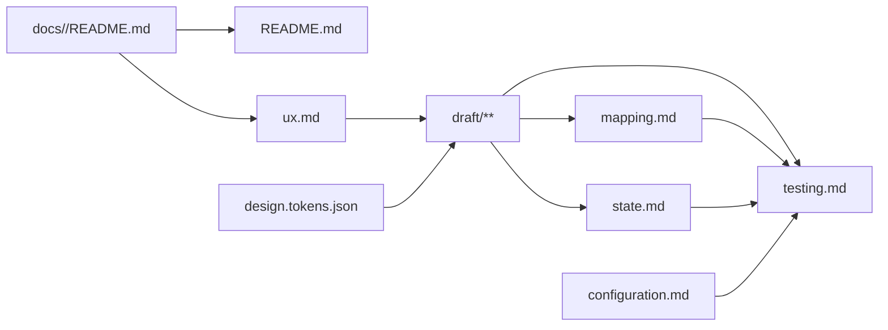

# Frontend 文档模板

用于 `<doc 组件> tmp frontend`。未指定 `ux` 或 `opt` 时，先创建或读取 README 技术入口，
再按以下顺序维护：

```text
README.md 技术入口 + 显式 req
  → ux.md
  → design.tokens.json
  → draft 初稿（包含 layout、page、component 和复杂状态占位标签）
  → state.md（存在复杂状态时，定义与 Draft 相同的稳定状态引用）
  → mapping.md
  → configuration.md
  → testing.md
  → README.md 索引与文件关系校对
```

## `ux` 页面范围

`<doc 组件> tmp frontend ux M-001:P-001 <任务>` 只从现有 `ux.md` 选择一个页面生成或更新可运行 Draft：

- 页面标识必须严格符合 `M-<三位编号>:P-<三位编号>`，并已存在于 `ux.md` 页面索引和对应页面章节；不存在时停止。
- 只读取 README、`ux.md`、`design.tokens.json` 和现有 Draft 依赖；显式给出 `req` 时，可再读取该页面引用的 Require 文件。
- 只创建或修改该页面的 `draft/src/M-001/P-001/**` 及其引用的 `draft/src/M-001/LAYOUT-*/**`，以及让该页面可预览所必需的
  `draft/index.html`、`draft/src/index.js`、
  `draft/src/app.js`、`draft/src/components/app-shell/**`、`draft/src/components/draft-dialog/**`、`draft/src/components/draft-state/**`、`draft/src/styles/**` 和
  `draft/src/utils/load-text.js`。
- 共享 Draft 文件只做注册、导航和渲染当前页所需的最小修改，保留其他页面及用户修改。
- 不修改 `ux.md` 或 `design.tokens.json`，不创建或修改 `state.md`、`mapping.md`、`configuration.md`、`testing.md`
  或 README；复杂状态只保留 `draft-state` 占位。
- `ux` 与 `opt` 互斥；两者同时出现时停止。

## 专家团

- UX 与无障碍专家：负责用户、页面、导航、交互语义、目标设备和可访问性边界。
- UI 与 Web Components 专家：负责 Design Token、组件边界、Shadow DOM 和完整 Draft 渲染。
- Frontend 架构与测试专家：负责复杂状态、配置、性能和测试策略。

专家只读分析并返回决策、风险、建议和阻塞；主 Agent 统一修改与验证。

## README 技术入口

README 第一个创建或确认，为后续设计提供唯一技术基线：

````md
# <组件名称>

> Ref: `docs/<req组件>/README.md`

应用目录：`apps/<实际路径>/`
开发模板：`frontend`

## 职责

<组件负责和不负责的内容>

## 技术基线

| 类别 | 选择 | 版本 | 官方文档 |
|---|---|---|---|
| 语言 | `<语言>` | `<精确版本>` | `<官方文档 URL>` |
| 框架 | `<框架>` | `<精确版本>` | `<官方文档 URL>` |
| 样式 | `<方案>` | `<精确版本>` | `<官方文档 URL>` |
| 测试 | `<工具>` | `<精确版本>` | `<官方文档 URL>` |

## 文档索引

| 文件 | 职责 |
|---|---|

## 文件关系



## 技术实现

### <关键技术>
````

- 只列当前组件实际采用的技术；版本来自项目清单、锁文件或已确认决策，不猜测或使用版本范围。
- 官方文档直接链接所用版本页面。
- README 的第一条引用必须指向显式 `req` 组件；README 是文件关系、框架、技术实现细节、官方文档和示例代码的唯一事实源。
- `## 技术实现` 位于 README 文末；初始化时可仅保留空的 `### <关键技术>`，后续按实际情况填写。
  每个已填写主题各用一个 `###` 和一个代码块，只保留能说明采用方式的最小实现，不复制教程。

## 文件职责

| 文件 | 唯一维护内容 |
|---|---|
| `README.md` | Require 引用、职责、应用目录、开发模板、技术基线、官方文档、文件关系和按主题组织的技术实现 |
| `ux.md` | 用户、模块、页面、入口、导航、布局、表单、交互和可访问性规则 |
| `design.tokens.json` | DTCG 2025.10 格式的颜色、字体、间距、尺寸、圆角、阴影和动效 Token |
| `draft/**` | 使用原生 Web Components 完整渲染当前组件的布局、页面、复用组件和复杂状态交互占位 |
| `state.md` | 供开发阶段实现的复杂数据请求、共享状态、缓存、转换、并发和错误恢复 |
| `mapping.md` | Draft 布局、页面和组件到生产框架组件及目标路径的唯一映射 |
| `configuration.md` | 配置项、环境差异和启动校验 |
| `testing.md` | 页面、状态、目标设备、可访问性、视觉、性能和契约验证要求 |

没有复杂状态时不创建 `state.md`。README、UX、Token、Draft、映射、配置和测试仍按实际需要维护，
不再生成旧式 UI YAML 或手工维护第二份 Token 格式。

## `ux.md`

````md
# UX 设计

> Ref: `docs/<req组件>/README.md`

| 页面 | 路由 | 布局 | 目标设备 | 说明 |
|---|---|---|---|---|
| `M-001:P-001` | `/login` | `ux:M-001:LAYOUT-001` | `desktop` | 登录页 |

## M-001 身份与认证

### LAYOUT-001 居中卡片布局

- 居中卡片，无导航栏
- 目标设备：`desktop`

| 区域 | 组件引用 | 共享内容 | 显示条件 |
|---|---|---|---|
| `main` | — | 居中卡片内容插槽 | 始终 |

### P-001 登录页

> Ref: `docs/<req组件>/M-001/FR-002.md`

- 布局：`ux:M-001:LAYOUT-001`
- 目标设备：`desktop`

| 目标页面 | 访问权限 | 无权限表现 |
|---|---|---|
| `ux:M-001:P-001` | `anon:auth:login` | 不适用 |
| `ux:M-002:P-001` | `patient:appointment:read` | 重定向至登录页 |
| `ux:M-003:P-001` | `doctor:schedule:read` | 重定向至登录页 |
| `ux:M-004:P-001` | `admin:dashboard:read` | 重定向至登录页 |

#### 页面内容

| 布局区域 | 组件引用 | 组件名称 | 显示条件 |
|---|---|---|---|
| `main` | `FORM-001` | 登录表单 | 始终 |
| `main` | — | 跳转注册链接 | 始终 |
| `main` | `DIALOG-001` | <对话框名称> | <触发条件> |

#### FORM-001 登录表单

| 字段标识 | 标签 | 控件 | 必填 | 规则引用 | 错误提示 |
|---|---|---|---|---|---|
| `phone` | 手机号 | `tel` | 是 | — | 请输入手机号 |
| `password` | 密码 | `password` | 是 | — | 请输入密码 |

#### DIALOG-001 <对话框名称>

| 顺序 | 内容类型 | 内容引用 | 显示条件 |
|---|---|---|---|
| 001 | 表单 | `FORM-002` | 始终 |

#### FORM-002 <对话框表单名称>

| 字段标识 | 标签 | 控件 | 必填 | 规则引用 | 错误提示 |
|---|---|---|---|---|---|
| `departmentName` | 科室名称 | `text` | 是 | `M-001/BR-003` | 请输入科室名称 |
| `description` | 简介 | `textarea` | 否 | — | — |

#### S-001 登录请求

| 标签 | 状态 | 说明 |
|---|---|---|
| `state:M-001:P-001:S-001` | 状态引用 | UX、Draft 和 `state.md` 共用；运行时状态与转换由 `state.md` 定义 |
````

- 文件开头的页面表是页面、路由、布局、目标设备和说明的唯一索引；二级标题固定为 `## M-001 <模块名称>`。
- Layout 与 Page 都是模块下的三级标题，分别使用 `### LAYOUT-001 <布局名称>`、`### P-001 <页面名称>`；引用使用
  `ux:M-001:LAYOUT-001`、`ux:M-001:P-001`。其他模块复用 Layout 时引用其完整所有者标识，不复制定义。
- Layout 定义可复用结构、区域和跨页面共享内容，可以直接包含导航栏、搜索框、登录/登出按钮等共享元素或组件；
  不包含页面专属表单、摘要或状态。页面通过“页面内容”表把 Form、Dialog 或普通内容绑定到 Layout 区域。
- Layout、Page 和页面级 `COMP-001` 各自只声明一个 `desktop`、`tablet` 或 `mobile` 目标设备；不要求同一组件同时自适应其他设备。
  需要另一设备时分配新的稳定 Layout、Page 或 Component 标识，不在原组件内增加未声明的自适应分支。
- 表单和对话框分别使用 `FORM-001`、`DIALOG-001`；对话框内容通过表格引用内部表单。
- `P-001` 和 `LAYOUT-001` 分别在每个模块内从 `001` 开始；`FORM-001`、`DIALOG-001`、`COMP-001`、`S-001` 分别在每个页面内
  从 `001` 独立编号。同页使用短标识，跨页引用使用 `ux:M-001:P-001:FORM-001` 等完整标识。
- 已分配编号是稳定引用，不因展示顺序或条目删除而重排、复用；页面内新增项使用同类型历史最大编号加一。
- 页面内复杂状态使用 `#### S-001 <状态名称>` 和状态标签表；UX、Draft、`state.md` 和 dev 全程使用
  `state:M-001:P-001:S-001`，不增加生命周期后缀。
- 定义用户可观察的页面、导航和交互，不指定框架组件、请求缓存或生产源码结构。
- 每个模块、页面和关键交互在首次定义处引用具体 FR，不复制需求或契约内容。

### 数据表格型 `COMP-001`

具有排序、分页、筛选、行操作或独立状态的数据表格使用页面级复合组件 `COMP-001`；简单静态表格不分配组件编号：

````md
#### COMP-001 预约列表

- 类型：数据表格
- 目标设备：`desktop`
- 状态引用：`state:M-002:P-001:S-001`
- 行标识：`appointmentId`
- 默认排序：预约时间倒序
- 分页：每页 20 条

| 列标识 | 列名称 | 数据字段 | 展示方式 | 排序 |
|---|---|---|---|---|
| `time` | 预约时间 | `appointmentTime` | 日期时间 | 是 |
| `department` | 科室 | `departmentName` | 文本 | 是 |
| `doctor` | 医生 | `doctorName` | 文本 | 否 |
| `status` | 状态 | `status` | 状态标签 | 是 |
| `actions` | 操作 | — | 操作按钮 | 否 |

##### 行操作

| 操作 | 权限引用 | 显示条件 | 目标页面 | 无权限表现 |
|---|---|---|---|---|
| 查看详情 | `patient:appointment:read` | 始终 | `ux:M-002:P-002` | 隐藏 |
| 取消预约 | `patient:appointment:cancel` | 状态为待就诊 | — | 隐藏 |

##### 页面表现

| 运行时状态 | 页面表现 |
|---|---|
| `loading` | 显示表格骨架 |
| `empty` | 显示“暂无预约”和创建入口 |
| `success` | 显示预约数据 |
| `error` | 显示错误提示和重试按钮 |
````

- `ux.md` 维护列、排序、目标设备、行操作和用户反馈；`state.md` 维护状态转换、缓存、并发和恢复。
- 权限必须引用 Require 已登记的 PERM；数据字段引用契约或已确认的页面视图字段，不在 UX 猜测数据库字段。

## Design Token

`design.tokens.json` 是风格规范唯一事实源，遵循 DTCG Design Tokens Format Module 2025.10，使用 `$type`、`$value`
和分组类型继承：

```json
{
  "color": {
    "$type": "color",
    "primary": {
      "$value": {
        "colorSpace": "srgb",
        "components": [0.145, 0.388, 0.922],
        "alpha": 1,
        "hex": "#2563eb"
      }
    }
  },
  "space": {
    "$type": "dimension",
    "small": {
      "$value": { "value": 8, "unit": "px" }
    }
  },
  "duration": {
    "$type": "duration",
    "fast": {
      "$value": { "value": 120, "unit": "ms" }
    }
  }
}
```

- Token 名称稳定且语义化；对象含 `$value` 时是 Token，不含 `$value` 时是分组，类型必须显式声明或从最近分组继承。
- Draft 读取或机械转换该 JSON，不在页面、Layout 或 Shadow DOM 内重复硬编码同一风格事实。
- 生产平台需要 CSS Custom Properties 或框架主题时，由开发阶段从 JSON 转换，不手工维护第二份 Token。

## Draft

Draft 使用正式 Web Components 项目结构和 ES Modules 组织可运行原型；未指定 `ux` 时完整渲染 `ux.md` 中当前组件的所有页面，
指定 `ux` 时只渲染目标页面及必要依赖：

> 文件封装与 Custom Element 语法参考：[Web Components 入门实例教程](https://www.ruanyifeng.com/blog/2019/08/web_components.html)

```text
draft/
├─ index.html
└─ src/
   ├─ index.js
   ├─ app.js
   ├─ components/
   │  ├─ app-shell/
   │  │  ├─ index.js
   │  │  ├─ style.css
   │  │  └─ template.html  # 按需
   │  ├─ draft-dialog/
   │  │  ├─ index.js
   │  │  ├─ style.css
   │  │  └─ template.html
   │  └─ draft-state/
   │     ├─ index.js
   │     └─ style.css
   ├─ M-001/
   │  ├─ LAYOUT-001-<layout>/
   │  │  ├─ index.js
   │  │  ├─ style.css
   │  │  └─ template.html  # 按需
   │  └─ P-001/
   │     ├─ index.js
   │     ├─ style.css
   │     ├─ template.html  # 按需
   │     └─ COMP-001-<component>/
   │        ├─ index.js
   │        ├─ style.css
   │        └─ template.html  # 按需
   ├─ styles/
   │  ├─ global.css
   │  └─ tokens.css
   └─ utils/
      └─ load-text.js
```

- `index.html` 只提供视口、全局样式和统一模块入口；`src/index.js` 导入并注册当前范围的 layout、page 和 component，
  再启动 `src/app.js`。
- 页面、布局、可复用区域及独立状态边界使用原生 Custom Elements；名称必须包含连字符。模块目录使用 `M-001/`，页面目录使用
  `M-001/P-001/`，页面专属组件使用 `M-001/P-001/COMP-001-<component>/`，布局使用
  `M-001/LAYOUT-001-<layout>/`；只有跨模块共享组件放在 `src/components/`。
- Custom Element 使用 `attachShadow({ mode: "open" })`，便于评审、自动化检查和调试。
- 只拆分页面、布局、复用区域和独立状态边界，不把一次性小元素组件化。
- 每个 layout、page 和 component 使用独立目录；`index.js` 维护类、事件和标签注册，`style.css` 维护 Shadow DOM 私有样式，
  HTML 较多时才创建 `template.html`，简短模板直接写在 `index.js` 内。不创建空 `template.html` 或空 `utils/` 文件。
- `index.html` 使用 `<script type="module" src="./src/index.js"></script>`；ES Modules 和 CSS/HTML 资源通过本地 HTTP 服务器预览，
  不再支持 `file://` 直接打开。开发服务器和构建方式使用 README 已确认的技术基线，不在 Draft 另选工具。
- 不调用真实 API、不写生产业务逻辑、不复制到应用源码，也不被生产应用导入。
- 使用语义化 HTML，在组件声明的唯一目标设备上覆盖键盘、焦点、对比度和动效降级；不额外要求跨设备自适应。

### Custom Element 文件格式

`index.html` 只加载全局样式和统一入口：

```html
<link rel="stylesheet" href="./src/styles/tokens.css">
<link rel="stylesheet" href="./src/styles/global.css">
<script type="module" src="./src/index.js"></script>
```

`src/utils/load-text.js` 对非成功响应抛错，并返回文本内容：

```js
export async function loadText(url) {
  const response = await fetch(url);
  if (!response.ok) throw new Error(`Unable to load ${url}: ${response.status}`);
  return response.text();
}
```

组件的 `index.js` 按下列格式加载同目录资源：

```js
import { loadText } from "../../utils/load-text.js";

const [style, markup] = await Promise.all([
  loadText(new URL("./style.css", import.meta.url)),
  loadText(new URL("./template.html", import.meta.url)),
]);

const template = document.createElement("template");
template.innerHTML = `<style>${style}</style>${markup}`;

class LoginPage extends HTMLElement {
  constructor() {
    super();
    const shadow = this.attachShadow({ mode: "open" });
    shadow.appendChild(template.content.cloneNode(true));
    shadow.addEventListener("click", (event) => {
      // 只处理该组件内的 Draft 交互。
    });
  }
}

window.customElements.define("m001-p001-login", LoginPage);
```

- 标签名全小写且至少包含一个连字符；文件名保留 UX 稳定标识，类名使用 PascalCase。
- 组件私有样式从同目录 `style.css` 注入 `template` 的 `<style>`，使用 `:host` 定义宿主样式；`src/styles/global.css` 只保留全局外壳样式，
  `src/styles/tokens.css` 是由 `design.tokens.json` 机械转换的 CSS Custom Properties，Shadow DOM 通过 `var(--token-name)` 继承使用。
- Draft 所有颜色，包括页面、组件、状态和弹窗颜色，必须来自 `src/styles/tokens.css`；组件 CSS 不手写 hex、`rgb()`、`hsl()` 或颜色名。
- 每次创建组件实例都使用 `template.content.cloneNode(true)`，不在多个实例间移动或共享可变 DOM 节点。
- 事件直接绑定到 Shadow DOM 内的目标元素或根节点；需要通知外部时派发语义明确的 `CustomEvent`。

### 默认演示账户

- `src/app.js` 在内存中初始化一个默认演示账户，至少包含稳定的 `id`、显示名称，以及 UX 已引用的适用角色或权限；
  不猜测或扩大生产权限。
- 账户标识、姓名和凭据必须是明确标注的合成 Draft 数据，不使用真实个人信息、生产凭据或密钥。
- 存在登录页时，在页面上显示并可预填能通过 UX 校验的演示凭据，提交后只在本地切换为已登录账户。
- `app-shell` 提供已登录、退出和匿名状态的可见切换入口，使需要身份的页面默认可交互，同时可验证无权限表现。
- 账户和会话只存在内存中，刷新后恢复默认状态；不使用 Cookie、`localStorage` 或真实认证请求。

### 弹窗与运行状态

- `app-shell` 只挂载一个共享 `<draft-dialog>`，内部使用原生 `<dialog>`、`showModal()` 和 `close()`；同一时刻只显示一条提示。
- 用户跳转到 `ux.md` 已定义但 Draft 尚未生成的页面时，弹窗显示“页面尚未生成”、目标 UX 标识和返回操作；
  保留当前可用页，该预期分支不记录为控制台 error。
- 当前页面实际适用的 loading、empty、success、error 或 unauthorized 等运行状态可由 `draft-state` 派发事件，
  统一交给 `draft-dialog` 显示；状态列表必须来自当前 UX/State，不机械生成不适用状态，不把所有状态堆叠在页面内。
- 弹窗必须有标题、可访问名称、明确关闭操作和焦点管理；打开后焦点进入弹窗，关闭后返回触发元素。
- 弹窗的背景、文字、边框、阴影、遮罩和各状态颜色只使用 Token CSS Variables。

Hover、focus、active、disabled、展开、选择和简单表单校验直接在 Draft 实现。复杂状态使用稳定标签：

```html
<draft-state
  ref="state:M-001:P-001:S-001"
  states="loading error success">
  <p>复杂状态留待 state.md 定义</p>
</draft-state>
```

## `state.md`

Draft 初稿必须为复杂状态及其交互保留稳定 `state:M-001:P-001:S-001` 标签。存在该标签时创建 `state.md` 并定义；
`S-001` 在每个页面内独立编号：

```md
### state:M-001:P-001:S-001 <状态名称>

- 标识：`state:M-001:P-001:S-001`
- 来源：<OpenAPI operationId 或本地状态来源>
- 初始状态：<状态>
- 状态：<状态列表>
- 转换：<事件 → 状态>
- 缓存：<存在时填写>
- 并发：<存在时填写>
- 恢复：<重试、回滚或回退>
- Draft：`draft-state[ref="state:M-001:P-001:S-001"]`
```

`state.md` 填写状态含义、转换和恢复要求，但不在 Draft 实现生产状态逻辑；稳定状态标签是交给 `<dev 组件>` 的明确实现边界。
Draft 只展示占位界面和预期交互入口，生产状态逻辑由开发阶段按 `state.md` 实现。

## `mapping.md`

```md
| Draft | UX/State 引用 | 框架组件 | 目标路径 | 职责 | 输入/输出 | 实现状态 |
|---|---|---|---|---|---|---|
| `draft/src/M-001/LAYOUT-001-app/index.js` | `ux:M-001:LAYOUT-001` | `AppLayout` | `src/layouts/AppLayout.<扩展名>` | 应用外壳 | `<输入/输出>` | planned |
| `draft/src/M-001/P-001/index.js` | `ux:M-001:P-001` | `HomePage` | `src/pages/HomePage.<扩展名>` | 首页 | `<输入/输出>` | planned |
| `draft/src/M-002/P-001/COMP-001-appointment-list/index.js` | `ux:M-002:P-001:COMP-001` | `AppointmentList` | `src/components/AppointmentList.<扩展名>` | 预约列表 | `<输入/输出>` | planned |
```

- 每个 Draft layout、page 和可复用 component 必须且只能映射一个生产框架组件；纯展示辅助文件不映射。
- 框架组件名和目标路径遵循 README 已确认的框架及项目结构，不在映射文件重新选择技术。
- `mapping.md` 只定义实现去向和边界，不复制 Draft 代码；`<dev 组件>` 按映射实现并更新实现状态。

## 契约、配置与测试

- HTTP 请求引用显式需求组件中 OpenAPI 的稳定 `operationId`；契约缺失时停止，不在 Frontend 文档补造。
- 临时 Mock 必须标记 `pending`，由 OpenAPI Schema 或示例生成，并说明移除条件。
- `configuration.md` 只维护配置项、环境差异和启动校验，不重复 README 技术选择。
- `testing.md` 使用 Given/When/Then 描述页面和状态结果，并覆盖 Draft 页面、目标设备、键盘、焦点、
  语义、对比度、视觉差异、性能预算和契约映射中实际适用的部分；尺寸只验证组件声明的目标设备，
  不要求未声明的跨设备自适应。
- 箭头表示“被引用文件 → 使用者”：Require → README、UX；UX、Design Token → Draft；Draft → Mapping、State；Draft、Mapping、State、Configuration → Testing。
  `design.tokens.json` 不引用 `ux.md`，`configuration.md` 不引用其他设计文件。

## 完成检查

`ux` 页面范围只检查目标页面可直接预览、默认演示账户可完成该页主要交互、未生成页面和适用运行状态能通过弹窗显示、
页面引用与 `ux.md` 一致、所有颜色均来自 Token、目标设备表现正确、控制台无未处理 error，
共享文件未破坏已有页面，并确认没有修改页面范围外的文档产物。以下全量检查仅适用于未指定 `ux` 或 `opt` 的任务：

- README 在其他设计前建立，第一条引用指向显式 Require，应用目录、`frontend` 模板、实际版本和官方文档完整可用。
- UX、Token、Draft、State、Mapping、配置和测试引用方向一致，没有 `*.ui.yml`、重复事实或孤立文件。
- `design.tokens.json` 符合 DTCG 2025.10 的 `$type`、`$value` 和类型值结构，没有第二份手工 Token。
- Draft 使用 Web Components 和开放 Shadow DOM，能完整导航并渲染所有已定义 layout、page、component 和状态占位；
  默认演示账户可完成主要交互，且可切换匿名态验证无权限表现；所有可见控件有实际结果，
  禁止 `href="#"`、空事件处理器和无可观察反馈的提交。
- UX 中的必填、类型和规则已落到表单约束，错误反馈使用 `aria-invalid` 和 `aria-describedby` 关联；控制台没有未处理 error、
  Promise rejection 或资源 404，预期的未生成页面分支已通过 Token 样式的 `draft-dialog` 验证。
- 每个 `state:M-001:P-001:S-001` 都在 `state.md` 有唯一同名定义；Draft 未实现复杂生产状态逻辑。
- `mapping.md` 覆盖全部需生产实现的 Draft layout、page 和 component，框架组件及目标路径明确。
- Draft 按正式 Web Components 项目结构组织，ES Modules 和同目录资源可通过已确认的开发服务器加载，
  无真实 API 和生产业务逻辑；无障碍与目标设备检查已完成。
- README 最终索引、文件关系和文末技术实现结构已校对。
