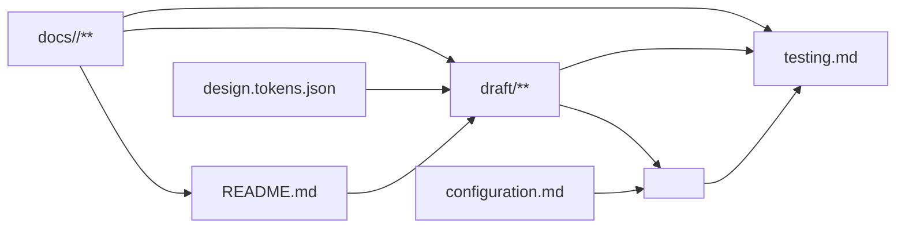

# Frontend 文件规范模板

仅用于 `<doc 组件> tmp frontend`。本模板定义 Frontend 各文件的作用、结构、用法和关系，不包含 Draft 的页面实现、
临时数据、QML 编码、构建、预览或验证功能。Draft 功能只由
`<doc 组件> tmp frontend draft M-001:P-001` 加载 `templates/frontend-draft.template.md` 执行。

`frontend` 是文档阶段模板，不是目录名；产物位于 `docs/<组件>/`：

```text
docs/<组件>/
├─ README.md
├─ design.tokens.json
├─ draft/
├─ configuration.md
└─ testing.md
```

## 专家团

- Frontend 文档专家：检查文件职责、章节结构、引用方向和事实唯一性。
- Design Token 专家：检查主题结构、类型和跨平台消费边界。
- 平台转换与测试专家：检查 Configuration、Testing 和 `<dev 组件>` 的输入是否完整。

专家只读分析并返回决策、风险、建议和阻塞；主 Agent 统一修改与验证。

## 总体关系

Require 决定模块、功能、页面、业务规则、权限、流程、契约和验收；Frontend 不重复或扩展这些事实：



- 创建模块、页面或改变产品行为必须回到显式 `req <需求组件>`，Frontend 不猜测。
- `README.md` 提供组件入口和目标平台技术基线。
- `design.tokens.json` 提供唯一主题事实。
- `draft/**` 提供可运行的 QML 中间应用，由显式 `draft M-001:P-001` 指令维护。
- `configuration.md` 约束 QML 到目标平台后的接入。
- `testing.md` 验证目标平台实现没有偏离 Require 和 QML Draft。
- 不创建 `ux.md`、`state.md` 或 `mapping.md`：产品事实属于 Require，可观察界面属于 QML，转换配置和验收分别属于现有文件。

## `README.md`

### 作用

作为 Frontend 文档组件唯一入口，维护 Require 引用、应用映射、项目概述、技术基线、文件索引、文件关系和关键技术说明。

### 结构

````md
# <组件名称>

> Ref: `docs/<req组件>/README.md`

应用目录：`apps/<实际路径>/`
开发模板：`frontend`

## 概述

<项目用途、目标用户和职责边界>

## 技术基线

| 类别 | 选择 | 版本 | 官方文档 |
|---|---|---|---|
| Draft | QML / Qt Quick | `<精确版本>` | `<官方文档 URL>` |
| 浏览器预览 | Qt for WebAssembly | `<精确版本>` | `<官方文档 URL>` |
| 生产平台 | `<框架>` | `<精确版本>` | `<官方文档 URL>` |
| 测试 | `<工具>` | `<精确版本>` | `<官方文档 URL>` |

## 文档索引

| 文件 | 职责 |
|---|---|
| `design.tokens.json` | 项目主题唯一事实源 |
| `draft/` | 完整可运行的 QML 中间应用 |
| `configuration.md` | 目标平台配置与接入要求 |
| `testing.md` | 目标平台转换结果的验收要求 |

## 文件关系

<使用“总体关系”中的 Mermaid 图>

## 技术实现

### <关键技术>

```text
<最小实现说明>
```
````

### 用法

- 第一个创建或确认，后续文件以它的 Require 引用、应用目录和技术基线为入口。
- 第一条引用必须指向显式 Require 组件；不复制模块、功能或页面正文。
- 技术版本来自项目清单、锁文件或已确认决策，不猜测或使用版本范围。
- `## 技术实现` 位于文末，只记录影响 Draft 构建或平台转换的关键采用方式。

### 关系

- 读取 Require 的职责边界。
- 被 Draft、Configuration、Testing 和 `<dev 组件>` 读取。
- 不拥有主题值、页面实现、平台配置值或测试场景正文。

## `design.tokens.json`

### 作用

`design.tokens.json` 是主题唯一事实源，维护颜色、字体、间距、尺寸、圆角、阴影和动效。

### 结构

遵循 DTCG Design Tokens Format Module 2025.10，使用 `$type`、`$value` 和分组类型继承：

```json
{
  "color": {
    "$type": "color",
    "primary": {
      "$value": {
        "colorSpace": "srgb",
        "components": [0.145, 0.388, 0.922],
        "alpha": 1,
        "hex": "#2563eb"
      }
    }
  },
  "space": {
    "$type": "dimension",
    "small": {
      "$value": { "value": 8, "unit": "px" }
    }
  },
  "duration": {
    "$type": "duration",
    "fast": {
      "$value": { "value": 120, "unit": "ms" }
    }
  }
}
```

### 用法

- Token 名称稳定且语义化；对象含 `$value` 时是 Token，不含 `$value` 时是分组。
- 类型必须显式声明或从最近分组继承。
- 不手工维护第二份主题值；具体 QML 和目标平台转换方式属于对应执行阶段。

### 关系

- 被 QML Draft 和 `<dev 组件>` 读取。
- 不引用 README、Require、Configuration 或 Testing。
- Draft 的主题适配文件是机械生成物，不成为新的事实源。

## `draft/`

### 作用

保存完整可运行的 QML 中间应用，用临时数据展示 Require 已定义页面，供评审、浏览器预览和目标平台转换。

### 结构

```text
draft/
├─ CMakeLists.txt
├─ main.cpp
├─ src/
│  ├─ App.qml
│  ├─ MockStore.qml
│  ├─ Theme.qml
│  ├─ shared/
│  │  └─ COMP-001/
│  │     └─ View.qml
│  ├─ assets/
│  └─ M-001/
│     ├─ LAYOUT-001/
│     │  └─ View.qml
│     └─ P-001/
│        ├─ View.qml
│        ├─ mock.mjs
│        └─ COMP-001/
│           └─ View.qml
└─ build/
```

### 用法

- `tmp frontend` 只说明并索引该目录，不创建或修改 Draft 代码。
- 只有显式 `draft M-001:P-001` 才创建或更新目标页面及必要依赖。
- 具体 QML 能力、目录约束、临时数据、主题转换、构建、浏览器预览和验证全部由 `frontend-draft.template.md` 定义。
- `build/` 是本地构建产物，不提交。

### 关系

- 读取 README 技术基线、Require 页面事实和 Design Token。
- 被 `<dev 组件>` 转换为 README 声明应用目录中的生产代码。
- 被 Testing 用作可观察页面与交互的验收基准。
- 不被生产应用直接导入。

## `configuration.md`

### 作用

描述 QML Draft 转换为目标平台代码后的运行环境、数据、路由、主题和启动配置。

### 结构

```md
# Configuration

## Runtime

| 配置项 | 环境 | 必填 | 来源 | 启动校验 |
|---|---|---|---|---|

## Data mapping

| Draft 临时数据 | Require/OpenAPI 来源 | 移除条件 |
|---|---|---|

## Routing

| 页面标识 | 平台路由 |
|---|---|

## Theme

<design.tokens.json 到目标平台主题系统的转换约束>
```

### 用法

- `<dev 组件>` 在替换 Mock、建立路由、接入主题和校验启动配置时读取。
- 只写配置名称、来源、差异、校验和映射，不保存真实值、凭据或密钥。
- 不重复 README 技术选择、Require 契约正文或 QML 代码。

### 关系

- 引用稳定页面标识、Require/OpenAPI 来源和 Design Token 文件，不复制其正文。
- 被 `<dev 组件>` 和 Testing 读取。
- 不反向修改 Draft 或 Require。

## `testing.md`

### 作用

定义 QML Draft 转换为目标平台代码后必须通过的验收，不保存测试实现代码。

### 结构

```md
# Testing

## M-001:P-001

### P-001-T001 正常展示

- Given：<前置条件>
- When：<用户动作>
- Then：<与 Require 和 QML Draft 一致的可观察结果>
```

### 用法

- 使用稳定页面编号和 Given/When/Then。
- 覆盖 Require 中适用的 AC，以及 Draft 展示的页面、状态、设备、键盘、焦点、语义、对比度、视觉、性能和契约结果。
- 测试目标是 `<dev 组件>` 生成的生产代码；Draft 自身验证属于 `frontend-draft.template.md`。

### 关系

- 读取 Require 验收、QML Draft 表现和 Configuration 接入要求。
- 约束 `<dev 组件>` 的完成结果，不反向拥有产品需求、页面代码或配置事实。

## 执行顺序

`tmp frontend` 只维护文件规范层产物：

```text
README.md
  → design.tokens.json
  → configuration.md
  → testing.md
  → README.md 索引与关系校对
```

Draft 代码由独立页面指令逐页维护：

```text
<doc 组件> tmp frontend req <需求组件> draft M-001:P-001 <任务>
```

## 完成检查

- README 章节顺序固定为概述、技术基线、文档索引、文件关系、技术实现。
- 五项 Frontend 产物的作用、结构、用法和关系明确，索引与实际文件一致。
- `tmp frontend` 没有创建或修改 `draft/**`，也没有包含页面实现、临时数据、构建、预览或 Draft 验证规则。
- 没有 `ux.md`、`state.md`、`mapping.md`、旧式 UI YAML、Web Components Draft 或第二份手工 Token。
- Configuration 与 Testing 面向转换后的目标平台，不重复 README、Require、Token 或 Draft 的事实。
