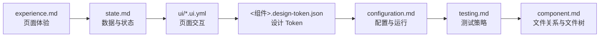

# Frontend 设计模板

## AI-FRONTEND-001

- **Who**：处理 `<组件> frontend <任务>` 的组件设计 Agent。
- **When**：Frontend 模式已启用，且已读取需求、系统规范与当前组件前置设计时。
- **Where**：当前组件设计目录与允许读取的前置规范。
- **What**：定义 Frontend 设计文件、事实所有权、依赖顺序和完成规则。
- **Why**：使页面体验、状态、交互、Token、配置和测试有唯一事实源。

仅创建实际适用的文件，按以下顺序设计：



1. `experience.md`：模块、页面、路由、页面权限表现、布局、表单、通用可访问性和页面规则。
2. `state.md`：状态资源、状态机、请求、缓存、失效、页面状态、错误、恢复和反馈。
3. `ui/*.ui.yml`：单页结构、动作和对 Experience、State、Token 的稳定引用。
4. `<组件>.design-token.json`：机器可读的颜色、间距、字体、圆角、阴影、动效和断点 Token。
5. `configuration.md`：公开配置、构建与运行约束、环境差异、Mock 开关和启动校验。
6. `testing.md`：测试基础设施、命令、用例和页面—动作—测试覆盖映射。
7. 最后更新 `component.md`：文件关系、概述和完整应用文件树。

不适用的文件直接省略，不创建空文件。`component.md` 不复制前述设计内容，只维护文件关系、概述和完整应用文件树。

## AI-FRONTEND-002

- **Who**：处理 `<组件> frontend <任务>` 的组件设计 Agent。
- **When**：需要确定 Frontend 设计文件的创建条件和可修改内容时。
- **Where**：当前组件设计目录。
- **What**：定义 Frontend 文件清单。
- **Why**：避免页面、状态和测试规则落入错误文件或重复维护。

| 文件 | 作用 | 创建条件 | 可修改内容 |
|---|---|---|---|
| `experience.md` | 页面体验设计 | 存在页面或界面 | 模块、页面、路由、权限表现、布局、表单、A11y 和页面规则 |
| `state.md` | 数据与状态设计 | 存在远程数据、客户端状态或失败场景 | 状态资源、状态机、请求、缓存、页面状态、错误、恢复和反馈 |
| `ui/*.ui.yml` | 页面交互契约 | 存在稳定页面 | 单页结构、动作和对 Experience、State、Token 的引用 |
| `<组件>.design-token.json` | 语义 Design Token | 需要组件级 Token | 颜色、间距、字体、圆角、阴影、动效和断点变量 |
| `configuration.md` | 前端配置与运行约束 | 存在构建、环境或托管要求 | 公开配置、环境差异、Mock 开关、构建、运行和启动校验 |
| `testing.md` | 前端测试策略 | 始终 | 基础设施、命令、用例和覆盖映射 |

## AI-FRONTEND-003

- **Who**：处理 `<组件> frontend <任务>` 的组件设计 Agent。
- **When**：Frontend 组件消费同步 HTTP 契约或需要开发、测试 Mock 时。
- **Where**：`docs/system/openapi.json` 与当前组件的 `state.md`、`configuration.md`、`testing.md`。
- **What**：定义同步 HTTP 契约消费和 Mock 规则。
- **Why**：确保前端、Backend 和 Mock 使用同一请求、响应与错误事实。

前端权限只控制界面表现，后端是最终安全边界。HTTP 契约唯一维护在 `docs/system/openapi.json`；每个请求引用其中稳定的 `operationId`，消费方不复制契约。

Mock 只替换开发或测试环境的网络边界，按同一 `operationId` 返回符合 Schema 与示例的响应；没有已确认契约时，临时 Mock 必须标记 `pending`，仅使用页面当前所需的最小字段，并在契约发布后迁移或删除。

能由 URL、表单或服务端缓存表达的状态不重复放入全局 Store。

## AI-FRONTEND-004

- **Who**：处理 `<组件> frontend <任务>` 的组件设计 Agent。
- **When**：Frontend 组件需要定义页面、状态、操作、权限或反馈交互契约时。
- **Where**：当前组件设计目录的 `ui/*.ui.yml`。
- **What**：定义 UI YAML 格式和引用规则。
- **Why**：使页面交互可验证，同时不复制体验、状态和 Token 事实。

> - 根据实际情况修改

```yaml
id: P-002
title: 创建预约
platform: web

experience: experience.md:P-002
state:
  - state.md:STATE-002
  - state.md:DATA-001
tokens: web.design-token.json

layout:
  ref: experience.md:LAYOUT-001
  regions:
    - id: booking-form
      component: Form

actions:
  submit:
    trigger: booking-form.submit
    operationId: createBooking
    success: P-003
    failure: state.md:STATE-002:error

states:
  loading: state.md:STATE-001:loading
  submitting: state.md:STATE-002:submitting
  error: state.md:STATE-002:error
  success: state.md:STATE-002:success
```

- `id` 使用 `experience.md` 中稳定的页面 ID；页面需求、路由、权限和通用可访问性只由 `experience.md` 维护。
- `state` 和 `states` 只引用 `state.md` 中稳定的状态与数据 ID；每个 action 关联系统 OpenAPI `operationId`、本地行为或外部跳转。
- `.ui.yml` 是交互契约，不复制特定框架源码、页面规则、错误策略或 Token 值。
- `.ui.yml` 引用当前组件 Token，不保存可复用的颜色、间距、字体和圆角常量。
