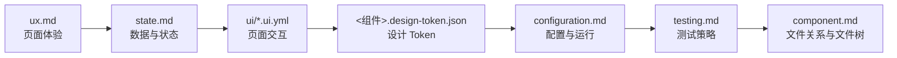
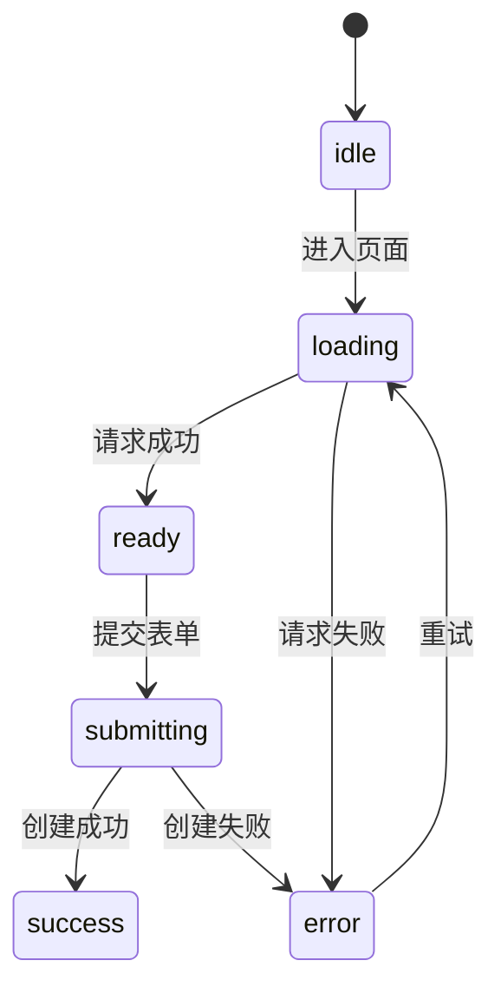
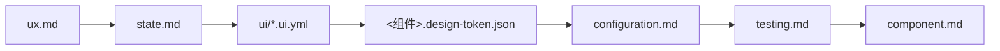

# Frontend 设计模板

## AI-FRONTEND-001

- **Who**：处理 `<组件> frontend <任务>` 的组件设计 Agent。
- **When**：Frontend 模式已启用，且已读取需求、系统规范与当前组件前置设计时。
- **Where**：当前组件设计目录与允许读取的前置规范。
- **What**：定义 Frontend 设计文件、事实所有权、依赖顺序和完成规则。
- **Why**：使页面体验、状态、交互、Token、配置和测试有唯一事实源。

仅创建实际适用的文件，按以下顺序设计：



1. `ux.md`：模块、页面、路由、页面权限表现、布局、表单、通用可访问性和页面规则。
2. `state.md`：状态资源、状态机、请求、缓存、失效、页面状态、错误、恢复和反馈。
3. `ui/*.ui.yml`：单页结构、动作和对 Experience、State、Token 的稳定引用。
4. `<组件>.design-token.json`：机器可读的颜色、间距、字体、圆角、阴影、动效和断点 Token。
5. `configuration.md`：公开配置、构建与运行约束、环境差异、Mock 开关和启动校验。
6. `testing.md`：测试基础设施、命令、用例和页面—动作—测试覆盖映射。
7. 最后更新 `component.md`：文件关系、概述和完整应用文件树。

不适用的文件直接省略，不创建空文件。`component.md` 不复制前述设计内容，只维护文件关系、概述和完整应用文件树。

## AI-FRONTEND-002

- **Who**：处理 `<组件> frontend <任务>` 的组件设计 Agent。
- **When**：需要确定 Frontend 设计文件的创建条件和可修改内容时。
- **Where**：当前组件设计目录。
- **What**：定义 Frontend 文件清单。
- **Why**：避免页面、状态和测试规则落入错误文件或重复维护。

| 文件 | 作用 | 创建条件 | 可修改内容 |
|---|---|---|---|
| `ux.md` | 页面体验设计 | 存在页面或界面 | 模块、页面、路由、权限表现、布局、表单、A11y 和页面规则 |
| `state.md` | 数据与状态设计 | 存在远程数据、客户端状态或失败场景 | 状态资源、状态机、请求、缓存、页面状态、错误、恢复和反馈 |
| `ui/*.ui.yml` | 页面交互契约 | 存在稳定页面 | 单页结构、动作和对 Experience、State、Token 的引用 |
| `<组件>.design-token.json` | 语义 Design Token | 需要组件级 Token | 颜色、间距、字体、圆角、阴影、动效和断点变量 |
| `configuration.md` | 前端配置与运行约束 | 存在构建、环境或托管要求 | 公开配置、环境差异、Mock 开关、构建、运行和启动校验 |
| `testing.md` | 前端测试策略 | 始终 | 基础设施、命令、用例和覆盖映射 |

## AI-FRONTEND-003

- **Who**：处理 `<组件> frontend <任务>` 的组件设计 Agent。
- **When**：Frontend 组件消费同步 HTTP 契约或需要开发、测试 Mock 时。
- **Where**：`docs/system/openapi.json` 与当前组件的 `state.md`、`configuration.md`、`testing.md`。
- **What**：定义同步 HTTP 契约消费和 Mock 规则。
- **Why**：确保前端、Backend 和 Mock 使用同一请求、响应与错误事实。

前端权限只控制界面表现，后端是最终安全边界。HTTP 契约唯一维护在 `docs/system/openapi.json`；每个请求引用其中稳定的 `operationId`，消费方不复制契约。

Mock 只替换开发或测试环境的网络边界，按同一 `operationId` 返回符合 Schema 与示例的响应；没有已确认契约时，临时 Mock 必须标记 `pending`，仅使用页面当前所需的最小字段，并在契约发布后迁移或删除。

能由 URL、表单或服务端缓存表达的状态不重复放入全局 Store。

## AI-FRONTEND-004

- **Who**：处理 `<组件> frontend <任务>` 的组件设计 Agent。
- **When**：Frontend 组件需要定义页面、状态、操作、权限或反馈交互契约时。
- **Where**：当前组件设计目录的 `ui/*.ui.yml`。
- **What**：定义 UI YAML 格式和引用规则。
- **Why**：使页面交互可验证，同时不复制体验、状态和 Token 事实。

> - 根据实际情况修改

```yaml
id: M-001:P-002
title: 创建预约
platform: web
route: /bookings/new
ux: ux:模块:M-001:P-002

requirements:
  - REQ-001-FR-001
  - REQ-001-AC-001

permissions:
  - booking.create

layout:
  type: page
  regions:
    - id: booking-form
      component: Form

actions:
  submit:
    trigger: booking-form.submit
    operationId: createBooking
    success: /bookings/:id
    failure: state.md:STATE-002:error

states:
  loading: state.md:STATE-001:loading
  submitting: state.md:STATE-002:submitting
  error: state.md:STATE-002:error
  success: state.md:STATE-002:success

accessibility:
  labelStrategy: explicit
  keyboardNavigation: required
  focusAfterSubmitError: first-invalid-field

tokens:
  theme: web.design-token.json
```

- `id` 使用模块内页面标识 `M-001:P-001`，`ux` 使用跨文件引用 `ux:模块:M-001:P-001`；`route`、`permissions` 是该页面的可验证投影，必须与 `ux.md` 页面表一致，不得独立修改。
- `requirements` 只列该页面直接实现的需求编号；`state` 和 `states` 只引用 `state.md` 中稳定的状态与数据 ID；每个 action 关联系统 OpenAPI `operationId`、本地行为或外部跳转。
- `accessibility` 只补充当前页面的实现策略；通用可访问性规则只由 `ux:页面规则:GLOBAL` 维护。
- `.ui.yml` 是交互契约，不复制页面规则、错误策略或 Token 值。
- `.ui.yml` 引用当前组件 Token，不保存可复用的颜色、间距、字体和圆角常量。

## AI-FRONTEND-005

- **Who**：处理 `<组件> frontend <任务>` 的组件设计 Agent。
- **When**：Frontend 组件需要创建或更新 `ux.md` 时。
- **Where**：当前组件设计目录的 `ux.md`。
- **What**：定义 Experience 的固定章节、稳定标识与事实边界。
- **Why**：使模块、页面入口、布局、表单、可访问性和错误界面表现保持简洁且可引用。

`ux.md` 使用以下固定结构；不存在页面、布局或表单时删除对应的二级或三级章节，不创建空章节：

> - 根据实际情况修改

````md
# Experience

<组件页面体验职责描述>

## 模块

### M-001

<模块描述>

| 编号 | 页面名称 | 入口 | 前置页面 | 主要目的 | 是否登录 | 页面权限 | 无权处理 |
|---|---|---|---|---|---|---|---|
| P-001 | 预约列表 | `/bookings` | 无 | 查看预约 | 否 | `booking.read` | Forbidden |
| P-002 | 创建预约 | `/bookings/new` | M-001:P-001 | 创建预约 | 是 | `booking.create` | 返回列表页 |

## 布局

### LAYOUT-001

> Ref: M-001

- 适用页面：M-001:P-001、M-001:P-002
- 结构：<页面区域、导航、内容区与响应式行为>
- Token：`<组件>.design-token.json:<Token 路径>`

## 表单

### FORM-001

| 字段 | 类型 | 必填 | 校验 | 错误展示 |
|---|---|---:|---|---|
| `customerId` | 选择器 | 是 | 必须存在 | 字段下方 |
| `startAt` | 日期时间 | 是 | 不得早于当前时间 | 字段下方 |

## 页面规则

### GLOBAL

- 所有输入控件必须有可计算 Label。
- 校验错误通过 `aria-describedby` 关联。
- Modal 打开后焦点进入标题或第一个可操作控件。
- 关闭 Modal 后焦点返回触发元素。
- 动效遵守 `prefers-reduced-motion`。

### 错误规则

| 错误类别 | 来源 | 展示方式 | 恢复方式 |
|---|---|---|---|
| 网络错误 | `state.md:STATE-001:error` | 页面 Alert | 重试 |
| 权限错误 | `403` | Forbidden 页面 | 返回首页 |
| 字段错误 | `400` | 字段错误 | 修改后重新提交 |
````

- 模块、页面、布局和表单标识分别使用 `M-001`、`P-001`、`LAYOUT-001`、`FORM-001` 格式；页面编号在每个模块内从 `P-001` 开始，新增项不重排已有编号。
- `ux.md` 内引用页面一律使用 `M-001:P-001`；其他文件引用模块或页面一律使用 `ux:模块:M-001` 或 `ux:模块:M-001:P-001`。
- “模块”中的页面表是页面名称、入口、前置页面、登录要求、权限表现和无权处理的唯一事实源；`ui/*.ui.yml` 通过 `M-001:P-001` 标识页面，不复制这些信息。
- “布局”只维护页面区域和响应式行为；颜色、尺寸、间距、圆角和动效值只引用 Token 路径，不写具体常量。
- “表单”的“字段”使用 OpenAPI Schema 中已确认的字段名；“校验”和“错误展示”只说明界面校验与呈现，不复制 Schema 类型、长度、正则或业务不变量。
- “页面规则”只维护 UI 行为、可访问性和错误展示恢复；请求状态机、缓存、重试策略和反馈状态由 `state.md` 维护，业务规则和权限定义只引用需求或系统规范。

## AI-FRONTEND-006

- **Who**：处理 `<组件> frontend <任务>` 的组件设计 Agent。
- **When**：Frontend 组件需要创建或更新 `state.md`、Token、配置、测试或组件入口文档时。
- **Where**：当前组件设计目录的 Frontend 设计文件。
- **What**：定义 State、Token、Configuration、Testing 与 Component 的固定结构和引用边界。
- **Why**：使页面状态、机器可读规范、运行配置、测试和文件索引可以顺序验证。

除 `ux.md` 和 `ui/*.ui.yml` 外，其余 Frontend 文件使用以下结构：

> - 根据实际情况修改

````md
`state.md`

# State

<状态与数据职责描述>

## 状态

### STATE-001

> Ref: ux:模块:M-001



| 编号 | 状态类型 | 来源 | 保存位置 | 生命周期 |
|---|---|---|---|---|
| 001 | 预约列表 | `listBookings` | 服务端缓存 | 页面及缓存周期 |
| 002 | 创建预约表单 | 用户输入 | 页面本地状态 | 当前页面 |
| 003 | 当前用户权限 | 身份服务 | 会话状态 | 当前会话 |

## 数据请求

### DATA-001

> Ref: ux:模块:M-001:P-001

| 编号 | operationId | 触发动作 | 缓存策略 | 失效策略 |
|---|---|---|---|---|
| 001 | `listBookings` | 进入 | 按筛选条件缓存 | 创建成功后失效 |
| 002 | `createBooking` | 提交 | 不缓存 | 成功后刷新列表 |

## 页面状态

> Ref: ux:模块:M-001

| 编号 | 状态 | 用户反馈 | 可执行操作 | 页面 |
|---|---|---|---|---|
| 001 | loading | Skeleton | 无 | ux:模块:M-001:P-001 |
| 002 | empty | 空状态说明 | 创建预约 | ux:模块:M-001:P-001 |
| 003 | error | 错误提示 | 重试 | ux:模块:M-001:P-001 |
| 004 | submitting | 禁止重复提交 | 取消 | ux:模块:M-001:P-002 |
| 005 | success | 成功提示 | 返回详情 | ux:模块:M-001:P-002 |
````

````json
`<组件>.design-token.json`

{
  "$schema": "https://design-tokens.org/schema.json",
  "color": {
    "surface": {
      "default": { "$value": "#FFFFFF", "$type": "color" },
      "danger": { "$value": "#B42318", "$type": "color" }
    }
  },
  "spacing": {
    "page": { "$value": "24px", "$type": "dimension" },
    "formGap": { "$value": "16px", "$type": "dimension" }
  },
  "radius": {
    "control": { "$value": "8px", "$type": "dimension" }
  }
}
````

````md
`configuration.md`

# Configuration

<文件职责>

## 配置项

| 配置项 | 类型 | 必填 | 默认值 | 来源 | 是否公开 |
|---|---|---:|---|---|---:|
| `PUBLIC_API_BASE_URL` | URL | 是 | 无 | 构建环境 | 是 |
| `PUBLIC_APP_NAME` | string | 否 | `Web` | 构建环境 | 是 |

## 环境差异

| 环境 | API 地址 | 调试日志 | Source Map |
|---|---|---:|---:|
| development | 开发 API | 开启 | 开启 |
| test | 测试 API | 关闭 | 开启 |
| production | 生产 API | 关闭 | 按部署策略 |

## 启动校验

- `PUBLIC_API_BASE_URL` 必须是合法 HTTP(S) URL。
- 缺少必填配置时构建失败。
- 前端不得读取服务端密钥。
````

````md
`testing.md`

# Testing

<文件职责>

## 基础设施配置

## 页面测试

### BOOKING-DOM-001

> Design: ux:表单:FORM-001
> Src: apps/web/test/booking-create.dom.test.ts

Desc: 创建预约字段校验
Given: 用户打开创建预约页面。
When: 用户提交空表单。
Then: 必填字段显示错误并将焦点移至第一个错误字段。

### BOOKING-E2E-001

> Design: ui/booking-create.ui.yml:actions:submit
> Src: apps/web/test/booking-create.e2e.test.ts

Desc: 创建预约成功
Given: 用户拥有 `booking.create` 权限。
When: 用户填写表单并提交。
Then: 请求使用 `createBooking`，成功后进入详情页。
````

````md
`component.md`

# Component

<文件职责>

## 文件关系



## 概述

## 完整文件结构
````

- `state.md` 的状态、数据请求和页面状态编号分别使用 `STATE-001`、`DATA-001` 和三位编号；每个 `operationId` 必须存在于 `docs/system/openapi.json`，请求、缓存、失效和反馈不写回 `ux.md`。
- Token JSON 使用项目确认的 DTCG 兼容格式；`ux.md` 与 `.ui.yml` 只能引用 Token 路径，Token 值不复制到 Markdown 或 YAML。
- `configuration.md` 只维护公开配置与前端运行约束；服务端密钥、部署资源和实际环境值不写入该文件。
- `testing.md` 的测试编号稳定；每个场景使用 `Design` 和 `Src` 引用，并使用 `Desc`、`Given`、`When`、`Then` 描述可验证行为。
- Frontend 的 `component.md` 只包含文件关系、概述和完整文件结构；不创建文件索引，不复制其他设计内容。
