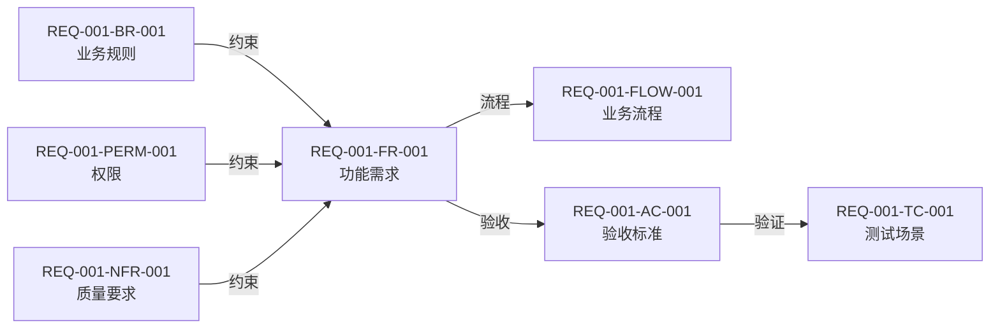
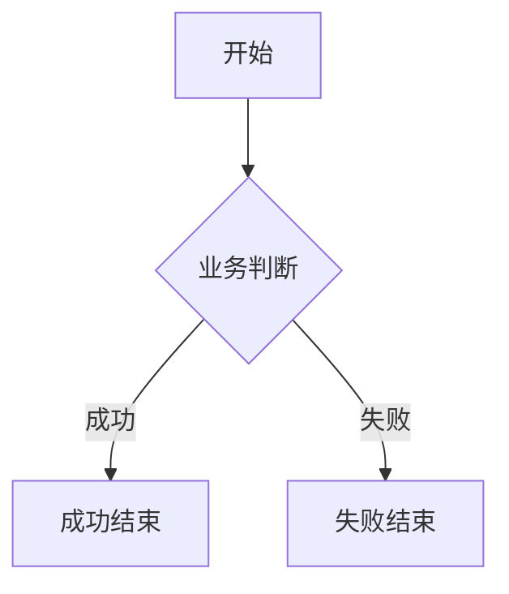

# Issue 需求模板

用于 `<doc 组件> issue <编号>`。编号不足三位左补零；目录为
`docs/<组件>/REQ-<编号>-<kebab-case主题>/`。同一编号只能有一个目录，已有目录原地更新。

## 专家团

- 产品与领域专家：确认目标、范围、角色、FR、BR 和业务语言。
- 权限与风险专家：确认 PERM、NFR、安全、隐私、边界和例外。
- 验收专家：确认 FLOW、AC、TC、Mermaid 追溯图和可执行场景。

专家只读分析并返回决策、风险、建议和阻塞；主 Agent 统一修改与验证。

## 目录

```text
REQ-001-<slug>/
├─ requirement.md
├─ items/
│  ├─ REQ-001-BR-001.md
│  ├─ REQ-001-FLOW-001.md
│  └─ REQ-001-PERM-001.md
└─ features/
   └─ REQ-001-AC-001.feature
```

- `requirement.md`：Issue 来源、目标、范围、角色、FR 和 NFR。
- `items/`：只保存需要独立引用的 BR、FLOW 和 PERM；AC 不创建 Markdown。
- `features/`：AC 的唯一事实源；一个 AC 对应一个 `.feature`，其中包含一个或多个 TC。
- 只创建实际需要的文件和目录，不创建空模板。

稳定编号为 `REQ-001-FR-001`、`NFR`、`BR`、`FLOW`、`PERM`、`AC`、`TC`；同类编号
在当前 Issue 内连续，更新时保留已有编号。Issue URL 默认只在 `requirement.md` 声明；子项来源不同时才单独声明。

## 引用方向

只维护以下方向，不在被引用文件中反向列举：

```text
FR → BR / PERM / NFR
FLOW → FR
AC Feature → FR
TC Scenario → AC Feature
```

每个 FR 后必须保留 Mermaid 追溯图，可显示该 FR 的约束、FLOW、AC 和 TC。图只是已有编号关系的
投影视图，不定义新关系；图中编号必须能在正式条目或 Feature 中找到。

## `requirement.md`

````md
# REQ-001 <需求名称>

- 来源：<Issue URL>
- 目标：<业务目标>

## 范围

### 包含

- <范围>

### 不包含

- <明确排除项>

## 角色

| 角色 | 职责 |
|---|---|
| <角色> | <职责> |

## 功能需求

### <角色>

<a id="req-001-fr-001"></a>
#### REQ-001-FR-001 <名称>

- 主体：<主要角色>
- 协作角色：<存在时填写>
- 影响角色：<存在时填写>
- 前置条件：<业务条件>
- 输入：<业务输入>
- 行为：<系统行为>
- 结果：<成功结果>
- 失败结果：<失败行为>
- 约束：
  - REQ-001-BR-001
  - REQ-001-PERM-001
  - REQ-001-NFR-001
- 验收：REQ-001-AC-001



## 非功能需求

<a id="req-001-nfr-001"></a>
### REQ-001-NFR-001 <名称>

- 类别：<性能|安全|可用性|兼容性等>
- 适用范围：<范围>
- 指标：<可测量指标>
- 阈值：<明确阈值>
- 测试条件：<环境和数据条件>
- 测量方法：<方法>
- 失败标准：<失败判定>
````

协作角色、影响角色、输入、失败结果等可选字段没有内容时直接省略，不写“不适用”或“无”。
需求只描述业务结果和可验证约束，不指定数据库表、源码结构、JWT、中间件、Token 存储、框架、ORM、
哈希库或其他实现方案。

## `BR` 业务规则

```md
# REQ-001-BR-001 <规则名称>

- 适用条件：<何时生效>
- 规则：<必须满足的业务约束>
- 冲突处理：<冲突时的业务结果>
- 例外：<存在时填写>
```

只有确实存在规则间优先顺序时才增加“优先级”。不反向列出使用该规则的 FR。

## `FLOW` 业务流程

````md
# REQ-001-FLOW-001 <流程名称>

- 参与者：<角色>
- 开始条件：<触发条件>
- 成功结束：<成功状态>
- 失败结束：<失败状态>
- 需求：
  - REQ-001-FR-001
  - REQ-001-FR-002


````

FLOW 的步骤或分支足以从文字理解时省略图；需要表达顺序、分支或回路时保留 Mermaid。

## `PERM` 权限规则

```md
# REQ-001-PERM-001 <权限名称>

- 主体：<角色>
- 资源：<业务资源>
- 操作：
  - <允许操作>
- 允许条件：<业务条件>
- 禁止条件：<越权条件>
- 租户边界：<存在时填写>
- 审计要求：<需要记录的业务操作>
```

PERM 只定义业务授权结果，不指定 JWT 字段、中间件、API 路由或授权引擎，也不反向列出 FR。

## `AC` 与 `TC`

AC 直接写入 `features/REQ-001-AC-001.feature`，不创建 `items/REQ-001-AC-001.md`：

```gherkin
@REQ-001-AC-001
@REQ-001-FR-001
Feature: <验收目标>

  @REQ-001-TC-001
  Scenario: <成功场景>
    Given <初始业务状态>
    When <用户操作>
    Then <一个主要可观察结果>
    And <其他可观察结果>

  @REQ-001-TC-002
  Scenario: <失败或边界场景>
    Given <初始业务状态>
    When <用户操作>
    Then <失败结果>
    And <不应发生的结果>
```

- 一个 `.feature` 只定义一个 AC，可以包含多个 `Scenario` 或 `Scenario Outline`。
- 每个 TC 只属于一个 AC；成功、失败、权限和独立业务边界使用不同 TC。
- `Examples` 行只是同一 TC 的数据变体，不创建新 TC 编号。
- Given/When/Then 使用业务语言并拆分多个结果，不写数据库表、字段、框架或内部实现断言。

## 完成检查

- 目录编号与 Issue 一致，来源、目标、包含和不包含范围明确。
- FR 可验证，NFR 可度量；BR、PERM 和 FLOW 只在需要独立引用时创建。
- 每个 FR 有 Mermaid 追溯图，图中所有编号存在且关系与正式条目一致。
- AC 只存在于同编号 Feature；一个 Feature 可包含多个唯一 TC，没有 AC Markdown。
- 引用遵循单向规则，没有重复来源、反向关联或“不适用”占位字段。
- 没有把设计、接口、数据库或实现选择写成需求事实。
