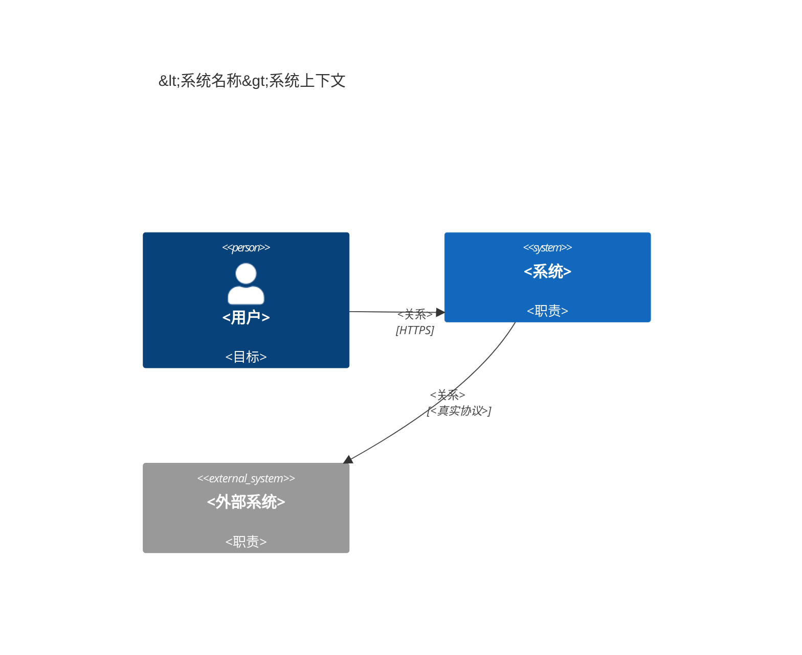
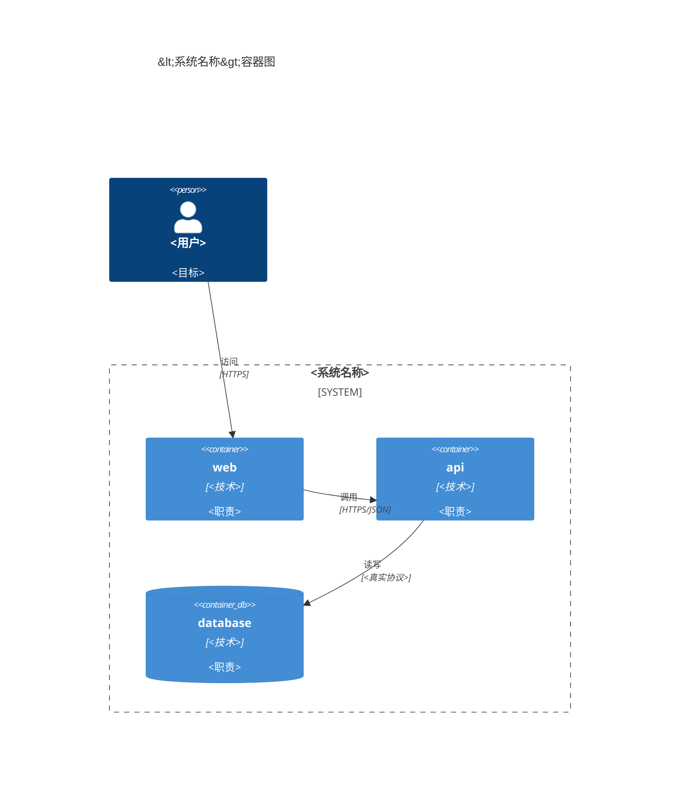

# Require 架构规则

仅由 `templates/require.template.md` 加载，维护组件根目录中跨业务组件共享的全局设计。不创建独立 system 阶段，
也不登记组件应用目录。指定 Issue 时，将已确认的 Issue 需求作为本次架构设计输入。

## 架构评审重点

- 系统与 API 架构师：负责上下文、组件边界、组件关系和同步契约。
- 安全架构师：负责信任边界、认证、授权、数据保护、风险和例外。
- 可靠性与交付架构师：负责可观测性、SLO、告警、Git 协作和发布边界。

## 文件与事实所有权

| 文件 | 唯一维护内容 |
|---|---|
| `context.md` | 系统边界、用户、外部系统和主要关系 |
| `system.md` | 运行组件、数据存储、基础设施、入口及通信关系 |
| `security.md` | 全局安全目标、信任边界、控制基线、风险与例外 |
| `observability.md` | 全局信号、遥测链路、SLI/SLO、告警与数据治理 |
| `gitflow.md` | 分支、提交、评审、发布与热修复规则 |
| `openapi.json` | 跨组件同步 HTTP 操作、Schema、错误、安全要求和提供方 |
| `README.md` | Require 组件职责、文件关系和文档索引 |

五个 Markdown 文件保留；没有适用内容时用一句话说明，不创建空表、空图或占位章节。
`openapi.json` 仅在系统存在跨组件同步 HTTP 契约时创建。

## 依赖顺序

```text
需求输入 → context.md → system.md ─┬→ security.md
                                ├→ observability.md
                                ├→ gitflow.md
                                └→ openapi.json
                                             → README.md
```

## `context.md`

只回答系统服务谁、解决什么问题、依赖哪些外部系统。固定结构：

````md
# 系统上下文

<一段系统目标、核心用户和能力说明>

## 系统上下文图


````

不出现内部组件、端口、数据库、框架或部署拓扑。

## `system.md`

固定包含容器图和运行入口。C4Container 展示实际组件、数据存储、基础设施和通信协议：

````md
# 系统组件

## 容器图



## 运行入口

| 组件 | 端口 | 路径 | 协议 | 用途 |
|---|---:|---|---|---|
| `<组件>` | `<端口或不暴露>` | `<路径或不暴露>` | `<协议>` | `<职责>` |
````

- 组件必须对应真实 `docs/<组件>/README.md`；应用目录只在该 README 声明。
- 不在本文件维护组件清单、应用路径、设计路径、凭据值或组件内部模块。
- 端口和入口只登记运行时事实；环境差异与部署值属于部署配置。

## `security.md`

固定结构：

```md
# 安全规范

## 安全目标

| 目标 | 适用范围 | 验证方式 |
|---|---|---|

## 信任边界

<必要时使用 Mermaid flowchart>

## 全局控制基线

| 领域 | 全局规则 | 适用范围 | 验证方式 |
|---|---|---|---|

## 风险与例外

| 风险 | 适用范围 | 控制措施 | 验证方式 |
|---|---|---|---|

### 例外

| 例外 | 原因 | 补偿控制 | 责任方 | 到期条件 |
|---|---|---|---|---|
```

- 维护身份、授权、通信、数据保护、密钥、审计和事件响应的全局结果与最低基线。
- 不指定组件使用的库、中间件、源码位置或数据库字段；这些属于组件 `security.md`。
- 只记录密钥类别、用途和注入要求，不维护变量值或开发凭据；变量名和环境配置属于部署文件。
- Token 刷新、会话吊销和认证握手属于 `security.md` 或认证组件设计。
- 认证跨组件时序只在“信任边界”下使用 sequenceDiagram。

## `observability.md`

固定结构：

```md
# 可观测性规范

## 全局信号基线

| 信号 | 全局要求 | 必要标识 | 组件责任 |
|---|---|---|---|

## 遥测链路

<必要时使用 Mermaid flowchart>

## 系统运行目标

### SLI 与 SLO

| 对外服务或跨组件能力 | SLI | 目标 | 时间窗口 | 验证方式 |
|---|---|---:|---|---|

### 告警分级与路由

| 级别 | 判定条件 | 通知对象 | Runbook |
|---|---|---|---|

## 数据治理

| 信号 | 保留要求 | 采样要求 | 敏感信息与脱敏 | 访问控制 |
|---|---|---|---|---|
```

全局文件定义信号语义、传播、目标、告警和治理，不指定 npm 包、SDK 初始化、Dashboard 配置或 Collector
实现；组件落实写入自己的设计，Collector、告警和 Dashboard 的可执行配置属于部署阶段。

## `gitflow.md`

固定结构：

```md
# Git 工作流

## 分支

| 分支 | 来源 | 合并目标 | 用途 | 保护规则 |
|---|---|---|---|---|

## 生命周期

<分支关系复杂时使用 Mermaid gitGraph>

## 提交约定
## Pull Request 与评审
## 发布
## Hotfix
```

只写项目实际采用的分支和规则，不复制示例分支、不写单次任务或发布状态。版本号、构建和发布规则
只在一个文件维护；若由部署 Runbook 维护，`gitflow.md` 仅引用。

## `openapi.json`

- 是跨组件同步 HTTP 契约唯一事实源，操作使用稳定 `operationId` 和 `x-provider`。
- Schema、示例、错误和安全要求必须完整且可解析；组件文档只引用，不复制。
- 仅定义跨组件契约，不登记运行 URL、框架生成路径或组件内部接口。

## 完成检查

- 当前需求输入、上下文、系统组件和真实运行关系一致；不存在中央应用目录登记表。
- 安全、可观测性和 Git 文件只维护全局基线，没有混入组件实现、部署值或单次状态。
- OpenAPI 可解析，提供方对应真实文档组件，操作、错误和 Schema 引用完整。
- README 最后更新，索引五个全局 Markdown 和实际存在的契约文件。
