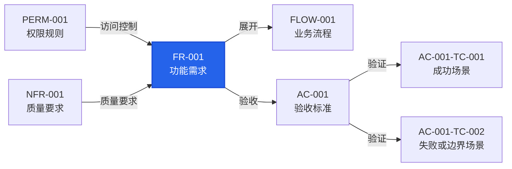
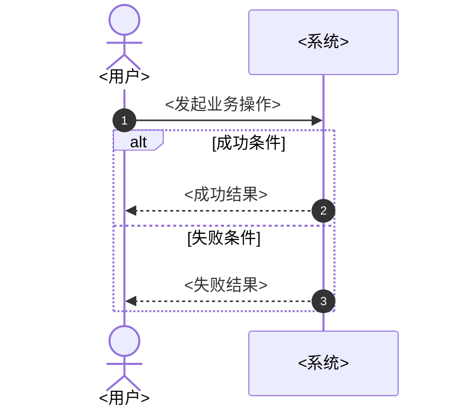

# Require 需求规则

仅由 `templates/require.template.md` 加载。Issue 是可选需求输入；其编号只标识来源，不进入目录名或文档编号。

## 需求评审重点

- 产品与领域专家：确认目标、范围、角色、FR、BR 和业务语言。
- 权限与风险专家：确认 PERM、NFR、安全、隐私、边界和例外。
- 验收专家：确认 FLOW、AC、TC、Mermaid 追溯图和可执行场景。

## 分析流程

1. 读取当前组件 `README.md`；指定 `issue <编号>` 时再读取该 Issue，否则以用户任务为需求输入。
2. 读取索引中 `active / replaced / removed` 的全部 `fr/FR-*.md`，并校验索引与文件一一对应；不得用候选筛选代替全量读取。
3. 按“模块 × 角色 × 业务对象 × 动作”建立全量 CRUD 视图，识别重复、冲突、被替代能力和可能缺口。缺少某个 CRUD 动作不自动构成需求，由专家根据业务必要性判定。
4. 再读取受当前需求输入影响 FR 的 Mermaid 直接关联 BR、FLOW、NFR、PERM、AC 和 TC；不无差别加载全部关联文件。
5. 专家团分别对比当前需求输入、全量 CRUD 视图与已有事实；主 Agent 合并结论、去重并解决专家间的分歧。
6. 每项能力在写入前必须得到唯一分类：
   - `REUSE`：已有 FR 完整覆盖，直接复用。
   - `EXTEND`：FR 行为不变，只新增或调整 BR、FLOW、NFR、PERM、AC 或 TC。
   - `UPDATE`：只澄清文字，不改变 FR 的可观察含义，原地修改。
   - `REPLACE`：五个 FR 业务字段的可观察含义改变，新建 FR 并将旧项标记为 `replaced`。
   - `ADD`：已有需求没有对应能力，新建 FR。
   - `REMOVE`：明确移除能力，将已有 FR 标记为 `removed`。
   - `CONFLICT`：当前需求输入与已有事实冲突且无法从现有信息决定。
7. `CONFLICT` 或专家分歧会改变行为、契约、安全、数据或兼容性时，在写入前询问用户；其他情况由主 Agent 选择最小一致方案。
8. 按分类增量更新事实源，最后同步 `README.md` 索引和 FR Mermaid 投影。

## 目录

```text
docs/<组件>/
├─ README.md
├─ fr/
│  └─ FR-001.md
├─ br/
│  └─ BR-001.md
├─ flow/
│  └─ FLOW-001.md
├─ nfr/
│  └─ NFR-001.md
├─ perm/
│  └─ PERM-001.md
└─ features/
   └─ AC-001.feature
```

- `README.md`：组件入口，保存组件职责、角色索引和全部 FR 的索引。
- `fr/`：每个 FR 一个 Markdown，完整行为只在该文件定义。
- `br/`、`flow/`、`nfr/`、`perm/`：分别保存需要独立引用的 BR、FLOW、NFR 和 PERM。
- `features/`：AC 的唯一事实源；一个 AC 对应一个 `.feature`，包含一个或多个 TC。
- 只创建实际需要的文件和目录，不创建空模板。

编号为 `M-001`、`FR-001`、`BR-001`、`FLOW-001`、`NFR-001`、`PERM-001` 和 `AC-001`，均在当前组件内同类连续且唯一。
TC 使用 `AC-001-TC-001`，在所属 AC 内从 `001` 独立编号。已有编号不因 Issue 或其他条目的增删而重排。

## 引用方向

```text
FR → BR / PERM / NFR
FLOW → FR
AC Feature → FR
TC Scenario → AC Feature
```

每个 FR 保留 Mermaid 追溯图。图只是已有关系的投影，不定义新关系；节点必须链接到真实文件。

## `README.md`

```md
# <组件名称>

<组件职责>

## 角色索引

| 角色 | 职责 |
|---|---|
| 患者 | 创建和管理自己的预约 |

## 功能需求索引

### M-001 账户与认证

| FR | 功能标识 | 名称 | 主体 | 业务对象 | 动作 | 状态 | 来源 |
|---|---|---|---|---|---|---|---|
| `FR-001` | **user-register** | 用户注册 | 用户 | 账户 | create | active | [#1](https://github.com/swainle/d5/issues/1) |
| `FR-002` | **user-login** | 用户登录 | 用户 | 会话 | create | active | [#1](https://github.com/swainle/d5/issues/1) |
| `FR-016` | **user-logout** | 用户登出 | 用户 | 会话 | delete | active | [#1](https://github.com/swainle/d5/issues/1) |
```

- 模块是稳定的业务能力分组，不是页面、代码目录、Frontend、Backend、API 或数据库。模块编号使用 `M-<三位编号>`，名称使用稳定业务名词。
- 每个模块使用 `### M-<三位编号> <模块名称>` 三级标题和一张独立 FR 表；模块按编号升序，表内 FR 按编号升序。
- 每个 FR 只属于一个主模块；跨模块协作由 FLOW 表达。只有业务目标、规则或生命周期明确独立时才新建模块。
- 功能标识使用唯一的粗体 `**kebab-case**`，表达稳定业务能力；FR 编号一一对应 `fr/FR-<三位编号>.md`。
- 动作优先使用 `create / read / update / delete`，非 CRUD 能力使用明确业务动词。
- 状态只使用 `active / replaced / removed`。索引不复制 FR 正文、追溯关系或验收内容。
- 指定 Issue 时，来源必须使用已读取 Issue 的真实编号和 URL，写为 `[#<编号>](<Issue URL>)`，不得猜测 URL 或输出 `[?](?)`。
- 同一 FR 有多个相关 Issue 时保留已有链接、按 Issue 编号升序去重，并在同一单元格中用 `<br>` 分隔，例如 `[#1](<URL-1>)<br>[#7](<URL-7>)`。
- 指定 Issue 且对 FR 得出 `REUSE / EXTEND / UPDATE / REPLACE / ADD / REMOVE` 结论后，将该 Issue 加入受影响 FR 的来源；`CONFLICT` 未解决时不写入。
- 新 Issue 仅增加 FLOW、AC、BR、NFR 或 PERM 时复用旧 FR；只有五个 FR 业务字段的可观察含义改变时才新建 FR 并替代旧项。

## `fr/FR-001.md`

````md
# FR-001 <名称>

- 主体：<主要角色>
- 前置条件：<业务条件>
- 输入：<业务输入，没有时写“无”>
- 成功结果：<可观察的成功结果>
- 失败结果：<失败行为>


````

每个 FR 固定保留主体、前置条件、输入、成功结果和失败结果五个字段。追溯图只放实际相关节点。

## `BR` 业务规则

````md
# BR-001 <规则名称>

```text
PRIORITY 100

REQUIRES ALL PERMISSIONS
  patient:appointment:create
  patient:schedule:read

INPUT
  当前时间
  预约时间
  排班状态

IF 排班状态 != 可用 OR 预约时间 <= 当前时间 THEN
  REJECT "排班或预约时间不可用"
ELSE IF 排班状态 = 可用 AND NOT 预约时间 <= 当前时间 THEN
  SET 预约状态 = 待确认
  ALLOW
  RETURN 预约状态
ELSE
  REJECT "无法创建预约"
END
```
````

BR 只保留一级标题和一个伪代码规则块。伪代码语法：

- `PRIORITY <整数>` 只在规则可能冲突时使用，数值越大越先判定。
- 单权限写 `REQUIRES PERMISSION <权限>`；多权限全部必需写 `REQUIRES ALL PERMISSIONS`，任一满足写 `REQUIRES ANY PERMISSION`。
- `INPUT` 后每行缩进两个空格声明一个必要业务事实。
- 分支只使用 `IF / ELSE IF / ELSE / END`，条件按优先级从高到低排列，组合只使用 `AND / OR / NOT`。
- 结果只使用 `ALLOW`、`REJECT "<原因>"`、`SET <业务事实> = <值>` 和 `RETURN <结果>`。
- 内容缩进两个空格，文本值使用双引号，注释使用 `# ` 且不得代替规则。
- 权限必须已在 PERM 表登记。只使用业务名词，禁止编程语言语法、函数、类、数据库字段、API、JWT 或框架详情。

## `FLOW` 业务流程

````md
# FLOW-001 <流程名称>

- 参与者：<角色>
- 开始条件：<触发条件>
- 成功结束：<成功状态>
- 失败结束：<失败状态>
- 需求：
  - [FR-001](../fr/FR-001.md)

```mermaid
stateDiagram-v2
    [*] --> <初始状态>
    <初始状态> --> <成功状态>: <成功事件>
    <初始状态> --> <失败状态>: <失败事件>
    <成功状态> --> [*]
    <失败状态> --> [*]
```




````

文字足以说明时省略图。多角色交互、顺序、分支或回路使用 `sequenceDiagram`；
业务对象存在多个状态和受限转换时追加 `stateDiagram-v2`。两种图都只表达业务事实，不写 API、数据库或组件内部调用。

## `NFR` 非功能需求

```md
# NFR-001 <名称>

- 类别：<性能|安全|可用性|兼容性等>
- 适用范围：<范围>
- 指标：<可测量指标>
- 阈值：<明确阈值>
- 测试条件：<环境和数据条件>
- 测量方法：<方法>
- 失败标准：<失败判定>
```

## `PERM` 权限规则

```md
# PERM-001 <权限名称>

| 权限标识 | 角色 | 资源 | 动作 | 范围 | 允许条件 | 审计 |
|---|---|---|---|---|---|---|
| `patient:appointment:create` | 患者 | 预约 | 创建 | 本人 | 患者已登录 | 记录患者、排班和时间 |
```

PERM 表是权限标识的唯一登记处。标识使用小写 `<role>:<resource>:<action>`，不指定 JWT、中间件、API 路由或授权引擎。

## `AC` 与 `TC`

AC 直接写入 `features/AC-001.feature`，不创建 AC Markdown：

```gherkin
@AC-001
@FR-001
Feature: <验收目标>

  @AC-001-TC-001
  Scenario: <成功场景>
    Given <初始业务状态>
    When <用户操作>
    Then <一个主要可观察结果>
    And <其他可观察结果>

  @AC-001-TC-002
  Scenario: <失败或边界场景>
    Given <初始业务状态>
    When <用户操作>
    Then <失败结果>
    And <不应发生的结果>
```

- 一个 `.feature` 只定义一个 AC，可以包含多个 `Scenario` 或 `Scenario Outline`。
- TC 按 `AC-<AC>-TC-<TC>` 编号，在每个 AC 内从 `001` 独立连续；已有 TC 不重排。
- `Examples` 行只是同一 TC 的数据变体，不创建新 TC 编号。
- Given/When/Then 使用业务语言，不写数据库、框架或内部实现断言。

## 完成检查

- `README.md` 包含组件职责、角色索引和按模块分组的 FR 索引，每个 FR 编号都对应唯一 `fr/FR-*.md`，所有 Issue 来源链接真实、去重且完整。
- FR 可验证，NFR 可度量；BR、FLOW、NFR 和 PERM 只在需要时创建。
- 每个 FR 的 Mermaid 节点均存在且链接正确。
- BR 只有一级标题和伪代码规则；必要权限均已在 PERM 表登记。
- AC 只存在于同编号 Feature，TC 在所属 AC 内唯一，没有 AC Markdown。
- Issue 编号只出现在来源中，不出现在目录、FR 或其他文档编号中。
- 每项输入能力已在读取相关需求并经专家团评审后归入唯一变更分类。
- 没有把设计、接口、数据库或实现选择写成需求事实。
